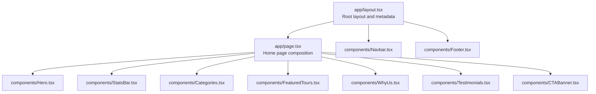
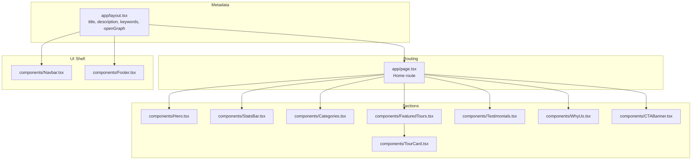
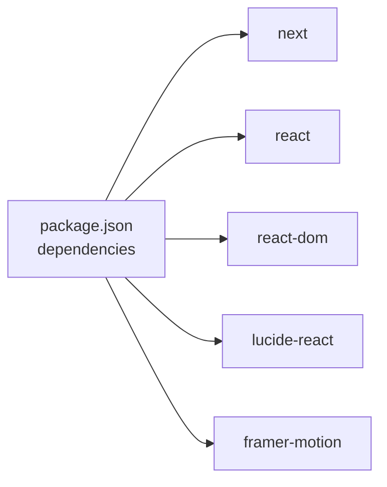

# Accessibility & SEO

<cite>
**Referenced Files in This Document**
- [README.md](file://README.md)
- [next.config.ts](file://next.config.ts)
- [package.json](file://package.json)
- [app/layout.tsx](file://app/layout.tsx)
- [app/page.tsx](file://app/page.tsx)
- [components/Navbar.tsx](file://components/Navbar.tsx)
- [components/Footer.tsx](file://components/Footer.tsx)
- [components/Hero.tsx](file://components/Hero.tsx)
- [components/Categories.tsx](file://components/Categories.tsx)
- [components/FeaturedTours.tsx](file://components/FeaturedTours.tsx)
- [components/TourCard.tsx](file://components/TourCard.tsx)
- [components/Testimonials.tsx](file://components/Testimonials.tsx)
- [components/StatsBar.tsx](file://components/StatsBar.tsx)
- [components/WhyUs.tsx](file://components/WhyUs.tsx)
- [components/CTABanner.tsx](file://components/CTABanner.tsx)
</cite>

## Table of Contents
1. [Introduction](#introduction)
2. [Project Structure](#project-structure)
3. [Core Components](#core-components)
4. [Architecture Overview](#architecture-overview)
5. [Detailed Component Analysis](#detailed-component-analysis)
6. [Dependency Analysis](#dependency-analysis)
7. [Performance Considerations](#performance-considerations)
8. [Troubleshooting Guide](#troubleshooting-guide)
9. [Conclusion](#conclusion)
10. [Appendices](#appendices)

## Introduction
This document provides comprehensive accessibility and SEO guidance tailored to the NatIndia project. It focuses on WCAG 2.1 conformance, semantic HTML, ARIA usage, keyboard navigation, screen reader optimization, focus management, and color contrast. It also covers SEO best practices such as metadata, structured data, crawlable content, image optimization strategies, and social sharing via Open Graph. Finally, it outlines internationalization considerations, multilingual SEO strategies, and accessibility testing methodologies.

## Project Structure
The project follows a Next.js App Router structure with a root layout, a homepage composed of reusable components, and shared UI elements. The layout defines global metadata and sets the html lang attribute. Components encapsulate UI sections and content blocks.

**Diagram sources**
- [app/layout.tsx:17-27](file://app/layout.tsx#L17-L27)
- [app/page.tsx:9-21](file://app/page.tsx#L9-L21)
- [components/Hero.tsx:20-99](file://components/Hero.tsx#L20-L99)
- [components/StatsBar.tsx:5-19](file://components/StatsBar.tsx#L5-L19)
- [components/Categories.tsx:7-46](file://components/Categories.tsx#L7-L46)
- [components/FeaturedTours.tsx:8-33](file://components/FeaturedTours.tsx#L8-L33)
- [components/WhyUs.tsx:44-99](file://components/WhyUs.tsx#L44-L99)
- [components/Testimonials.tsx:6-39](file://components/Testimonials.tsx#L6-L39)
- [components/CTABanner.tsx:6-31](file://components/CTABanner.tsx#L6-L31)
- [components/Navbar.tsx:18-112](file://components/Navbar.tsx#L18-L112)
- [components/Footer.tsx:25-102](file://components/Footer.tsx#L25-L102)

**Section sources**
- [app/layout.tsx:1-28](file://app/layout.tsx#L1-L28)
- [app/page.tsx:1-22](file://app/page.tsx#L1-L22)
- [README.md:1-37](file://README.md#L1-L37)

## Core Components
- Root layout and metadata: Defines site title, description, keywords, and Open Graph properties. Sets html lang to English.
- Home page composition: Assembles hero, stats, categories, featured tours, testimonials, and CTA banner.
- Navigation and footer: Provide primary site navigation, contact info, social links, and legal links.
- Content sections: Hero, categories, testimonials, stats, why-us, and CTA banner.

Key accessibility and SEO touchpoints:
- Semantic sectioning and headings.
- ARIA attributes for interactive controls.
- Alt text on images.
- Focus management for keyboard users.
- Color contrast and readable typography.
- Structured metadata and Open Graph.

**Section sources**
- [app/layout.tsx:6-15](file://app/layout.tsx#L6-L15)
- [app/layout.tsx:17-27](file://app/layout.tsx#L17-L27)
- [app/page.tsx:9-21](file://app/page.tsx#L9-L21)
- [components/Navbar.tsx:54-82](file://components/Navbar.tsx#L54-L82)
- [components/Footer.tsx:51-56](file://components/Footer.tsx#L51-L56)
- [components/Categories.tsx:28](file://components/Categories.tsx#L28)
- [components/TourCard.tsx:25](file://components/TourCard.tsx#L25)
- [components/Testimonials.tsx:27](file://components/Testimonials.tsx#L27)

## Architecture Overview
The front-end architecture centers on a single-page application built with Next.js App Router. The root layout injects metadata and wraps child pages. The homepage composes multiple feature sections. Components are self-contained and rely on shared icons and styling.

**Diagram sources**
- [app/layout.tsx:6-15](file://app/layout.tsx#L6-L15)
- [app/layout.tsx:17-27](file://app/layout.tsx#L17-L27)
- [app/page.tsx:9-21](file://app/page.tsx#L9-L21)
- [components/Hero.tsx:20-99](file://components/Hero.tsx#L20-L99)
- [components/StatsBar.tsx:5-19](file://components/StatsBar.tsx#L5-L19)
- [components/Categories.tsx:7-46](file://components/Categories.tsx#L7-L46)
- [components/FeaturedTours.tsx:8-33](file://components/FeaturedTours.tsx#L8-L33)
- [components/TourCard.tsx:21-62](file://components/TourCard.tsx#L21-L62)
- [components/Testimonials.tsx:6-39](file://components/Testimonials.tsx#L6-L39)
- [components/WhyUs.tsx:44-99](file://components/WhyUs.tsx#L44-L99)
- [components/CTABanner.tsx:6-31](file://components/CTABanner.tsx#L6-L31)
- [components/Navbar.tsx:18-112](file://components/Navbar.tsx#L18-L112)
- [components/Footer.tsx:25-102](file://components/Footer.tsx#L25-L102)

## Detailed Component Analysis

### Accessibility and WCAG 2.1 Implementation
- Semantic HTML and headings: Sections use appropriate heading hierarchy and landmarks. Ensure each page segment has a clear heading and consider adding role="region" with aria-labelledby for complex widgets.
- ARIA attributes:
  - Menus and dropdowns: Use aria-expanded on toggle buttons and aria-controls to associate toggles with their panels.
  - Landmarks: Add role="navigation" to nav elements and role="banner" to header regions.
  - Dialogs and overlays: If modals appear, use aria-modal, aria-labelledby, and aria-describedby; manage focus trapping and ESC to close.
- Keyboard navigation:
  - Ensure all interactive elements are focusable and operable via Tab, Enter, and Space.
  - Provide visible focus indicators; avoid removing outlines without replacement.
  - Manage focus after dynamic updates (e.g., closing a mobile menu moves focus back to the trigger).
- Screen reader optimization:
  - Provide descriptive aria-labels for decorative icons and buttons.
  - Use aria-live regions for dynamic content updates.
  - Avoid relying solely on color to convey meaning; pair color cues with text or icons.
- Focus management:
  - On mobile menu open, move focus inside the menu; on close, return focus to the trigger.
  - For carousels or sliders, hide offscreen items and manage focus order.
- Color contrast:
  - Ensure text meets AA/AAA thresholds against backgrounds; test with tools like axe or Lighthouse.
  - Provide sufficient luminance contrast for links, buttons, and interactive elements.

**Section sources**
- [components/Navbar.tsx:54-82](file://components/Navbar.tsx#L54-L82)
- [components/Navbar.tsx:89](file://components/Navbar.tsx#L89)
- [components/Footer.tsx:51-56](file://components/Footer.tsx#L51-L56)

### SEO Best Practices
- Meta tag management:
  - Title and description are defined at the root layout level. Keep titles concise and unique per page; descriptions should summarize content clearly.
  - Keywords are present but modern SEO prioritizes relevance and content quality over keyword stuffing.
- Structured data:
  - Implement JSON-LD for organizations, tours, and events. Include Organization, TourPolicy, and potential WebSite markup.
  - Schema.org types: Organization, Tour, Event, Review, and FAQPage for FAQs.
- Crawlable content strategies:
  - Static generation and server-side rendering are supported by Next.js; ensure dynamic routes are pre-rendered or handled with ISR/SSR.
  - Avoid blocking crawlers with robots.txt; use canonical URLs and rel="alternate" for translations.
- Image optimization:
  - Lazy-loading is used on images; ensure alt attributes are descriptive and contextually relevant.
  - Compress images and serve modern formats (AVIF/WEBP) when possible; provide fallbacks.
- Social sharing:
  - Open Graph properties are defined at the root level. Enhance with og:image, og:url, og:title, og:description, og:type, and og:locale.
  - Add Twitter Card meta tags for improved Twitter previews.

**Section sources**
- [app/layout.tsx:6-15](file://app/layout.tsx#L6-L15)

### Image Optimization for Accessibility and SEO
- Alt text strategies:
  - Informative images: Describe the content and purpose; avoid generic phrases.
  - Decorative images: Use empty alt="" to hide from assistive technologies.
  - Functional images (buttons, icons): Express the action or destination.
- Lazy loading benefits:
  - Improves performance and reduces bandwidth; ensure fallbacks for disabled JavaScript.
- Compression and formats:
  - Serve appropriately sized images; use responsive breakpoints and modern codecs.
- Accessibility:
  - Pair images with captions when necessary; ensure contrast for text overlays.

**Section sources**
- [components/Categories.tsx:28](file://components/Categories.tsx#L28)
- [components/TourCard.tsx:25](file://components/TourCard.tsx#L25)
- [components/Testimonials.tsx:27](file://components/Testimonials.tsx#L27)
- [components/WhyUs.tsx:63-77](file://components/WhyUs.tsx#L63-L77)

### Social Media Integration and Open Graph
- Current implementation:
  - Open Graph title and description are set at the root level; type is website.
- Recommendations:
  - Add og:image with secure HTTPS URL, og:image:width and og:image:height.
  - Include og:url, og:site_name, og:locale, and og:description.
  - For Twitter Cards, add twitter:card, twitter:title, twitter:description, and twitter:image.

**Section sources**
- [app/layout.tsx:10-14](file://app/layout.tsx#L10-L14)

### Internationalization and Multilingual SEO
- Planning:
  - Use Next.js i18n routing to serve localized pages under locale-prefixed paths.
  - Implement alternate hreflang links and x-default for regional targeting.
  - Localize metadata, content, and navigation; keep language switcher discoverable.
- Accessibility:
  - Ensure right-to-left languages are supported; test reading order and layout.
  - Provide language attributes on elements where content differs from the page default.

[No sources needed since this section provides general guidance]

### Accessibility Testing Methodologies
- Automated testing:
  - Use axe-core, Lighthouse, and Pa11y to scan for WCAG violations.
- Manual testing:
  - Navigate using only a keyboard; verify focus order and visible focus indicators.
  - Test screen readers (NVDA/JAWS/VoiceOver) with representative content.
- Dynamic content:
  - Verify ARIA live regions update announcements and roles remain accurate after state changes.
- Color and contrast:
  - Validate contrast ratios across themes and ensure color-independent communication.

[No sources needed since this section provides general guidance]

## Dependency Analysis
External libraries and their roles:
- next: Provides routing, metadata, static generation, and SSR/SSG.
- react and react-dom: Core UI framework.
- lucide-react: Iconography for UI elements.
- framer-motion: Animation library; ensure reduced motion preferences are respected.

**Diagram sources**
- [package.json:10-16](file://package.json#L10-L16)

**Section sources**
- [package.json:1-24](file://package.json#L1-L24)
- [next.config.ts:1-8](file://next.config.ts#L1-L8)

## Performance Considerations
- Image optimization:
  - Use next/image when possible for automatic optimization and responsive images.
  - Lazy-load non-critical images; defer offscreen content.
- Bundle size:
  - Tree-shake unused components; split large components into smaller chunks.
- Rendering:
  - Prefer static generation for content-heavy pages; use incremental static regeneration for frequently updated content.
- Fonts:
  - Leverage next/font for optimized font loading; avoid layout shift.

[No sources needed since this section provides general guidance]

## Troubleshooting Guide
- Metadata not appearing in search results:
  - Verify Open Graph tags and ensure canonical URLs are correct.
  - Confirm robots.txt allows indexing of target pages.
- ARIA or focus issues:
  - Inspect ARIA attributes and ensure they match the intended behavior.
  - Use browser developer tools to verify focus order and visible focus styles.
- Contrast and readability:
  - Re-test contrast after theme changes; adjust colors or text weights accordingly.
- Social preview problems:
  - Validate og:image URLs and sizes; ensure absolute URLs and HTTPS.

[No sources needed since this section provides general guidance]

## Conclusion
NatIndia’s current structure provides a solid foundation for accessibility and SEO. Strengthening ARIA semantics, enhancing metadata (especially Open Graph and structured data), implementing robust image alt strategies, and adopting internationalization practices will elevate the site’s inclusivity and search performance. Regular automated and manual accessibility testing ensures ongoing compliance with WCAG 2.1 guidelines.

## Appendices
- WCAG 2.1 checklist highlights:
  - Perceivable: Text alternatives, sensory alternatives, distinguishable presentation.
  - Operable: Keyboard accessibility, enough time, moving elements, seizures and physical reactions.
  - Understandable: Predictable navigation, readable content, clear error identification.
  - Robust: Compatible with assistive technologies.

[No sources needed since this section provides general guidance]