# Architecture & Project Structure

<cite>
**Referenced Files in This Document**
- [app/layout.tsx](file://app/layout.tsx)
- [app/page.tsx](file://app/page.tsx)
- [lib/data.ts](file://lib/data.ts)
- [components/Navbar.tsx](file://components/Navbar.tsx)
- [components/Hero.tsx](file://components/Hero.tsx)
- [components/Footer.tsx](file://components/Footer.tsx)
- [components/Categories.tsx](file://components/Categories.tsx)
- [components/StatsBar.tsx](file://components/StatsBar.tsx)
- [components/FeaturedTours.tsx](file://components/FeaturedTours.tsx)
- [components/TourCard.tsx](file://components/TourCard.tsx)
- [components/Testimonials.tsx](file://components/Testimonials.tsx)
- [components/WhyUs.tsx](file://components/WhyUs.tsx)
- [components/CTABanner.tsx](file://components/CTABanner.tsx)
- [app/globals.css](file://app/globals.css)
- [package.json](file://package.json)
- [next.config.ts](file://next.config.ts)
- [tsconfig.json](file://tsconfig.json)
</cite>

## Table of Contents
1. [Introduction](#introduction)
2. [Project Structure](#project-structure)
3. [Core Components](#core-components)
4. [Architecture Overview](#architecture-overview)
5. [Detailed Component Analysis](#detailed-component-analysis)
6. [Dependency Analysis](#dependency-analysis)
7. [Performance Considerations](#performance-considerations)
8. [Troubleshooting Guide](#troubleshooting-guide)
9. [Conclusion](#conclusion)

## Introduction
This document describes the architecture and project structure of the NatIndia project. It focuses on the Next.js App Router with file-based routing and server-side rendering capabilities, the component-based UI architecture with CSS Modules, the centralized data management via lib/data.ts, and the layout orchestration through root layout.tsx. It also documents the component hierarchy integrating Navbar, Hero, and content sections, design patterns such as component composition and props passing, and architectural decisions for performance, responsiveness, and accessibility.

## Project Structure
The project follows a conventional Next.js App Router layout:
- app/: Application routes and shared layout
  - layout.tsx: Root layout that wraps pages with global navigation and footer
  - page.tsx: Home page composed of multiple feature sections
  - globals.css: Global styles and theme tokens
- components/: Reusable UI components with dedicated CSS Modules
- lib/: Centralized data exports consumed by components
- next.config.ts, tsconfig.json, package.json: Build and runtime configuration

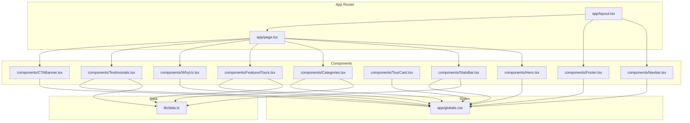

**Diagram sources**
- [app/layout.tsx:17-27](file://app/layout.tsx#L17-L27)
- [app/page.tsx:9-21](file://app/page.tsx#L9-L21)
- [lib/data.ts:1-252](file://lib/data.ts#L1-L252)
- [components/Navbar.tsx:1-113](file://components/Navbar.tsx#L1-L113)
- [components/Hero.tsx:1-100](file://components/Hero.tsx#L1-L100)
- [components/Categories.tsx:1-47](file://components/Categories.tsx#L1-L47)
- [components/StatsBar.tsx:1-21](file://components/StatsBar.tsx#L1-L21)
- [components/FeaturedTours.tsx:1-34](file://components/FeaturedTours.tsx#L1-L34)
- [components/TourCard.tsx:1-63](file://components/TourCard.tsx#L1-L63)
- [components/WhyUs.tsx:1-101](file://components/WhyUs.tsx#L1-L101)
- [components/Testimonials.tsx:1-41](file://components/Testimonials.tsx#L1-L41)
- [components/CTABanner.tsx:1-32](file://components/CTABanner.tsx#L1-L32)
- [components/Footer.tsx:1-104](file://components/Footer.tsx#L1-L104)
- [app/globals.css:1-190](file://app/globals.css#L1-L190)

**Section sources**
- [app/layout.tsx:1-28](file://app/layout.tsx#L1-L28)
- [app/page.tsx:1-22](file://app/page.tsx#L1-L22)
- [lib/data.ts:1-252](file://lib/data.ts#L1-L252)
- [app/globals.css:1-190](file://app/globals.css#L1-L190)
- [tsconfig.json:21-23](file://tsconfig.json#L21-L23)

## Core Components
- Root Layout: Orchestrates global navigation and footer around page content.
- Home Page: Composes feature sections in a fixed order.
- Data Layer: Centralized arrays for categories, tours, testimonials, and stats.
- UI Components: Reusable building blocks with CSS Modules for styling.
- Global Styles: Theme tokens, typography, spacing, and responsive breakpoints.

Key architectural characteristics:
- File-based routing with the App Router: app/page.tsx renders the homepage; components are imported and composed declaratively.
- Server-side rendering: Next.js default behavior; metadata is defined at the root layout level.
- Component composition: Home page composes multiple sections; each section composes smaller components (e.g., TourCard).
- Props-driven data: Components receive data from lib/data.ts via direct imports.
- CSS Modules: Each component has a dedicated module stylesheet for scoped styling.

**Section sources**
- [app/layout.tsx:17-27](file://app/layout.tsx#L17-L27)
- [app/page.tsx:9-21](file://app/page.tsx#L9-L21)
- [lib/data.ts:1-252](file://lib/data.ts#L1-L252)
- [components/Navbar.tsx:1-113](file://components/Navbar.tsx#L1-L113)
- [components/Hero.tsx:1-100](file://components/Hero.tsx#L1-L100)
- [components/Categories.tsx:1-47](file://components/Categories.tsx#L1-L47)
- [components/StatsBar.tsx:1-21](file://components/StatsBar.tsx#L1-L21)
- [components/FeaturedTours.tsx:1-34](file://components/FeaturedTours.tsx#L1-L34)
- [components/TourCard.tsx:1-63](file://components/TourCard.tsx#L1-L63)
- [components/WhyUs.tsx:1-101](file://components/WhyUs.tsx#L1-L101)
- [components/Testimonials.tsx:1-41](file://components/Testimonials.tsx#L1-L41)
- [components/CTABanner.tsx:1-32](file://components/CTABanner.tsx#L1-L32)
- [components/Footer.tsx:1-104](file://components/Footer.tsx#L1-L104)
- [app/globals.css:1-190](file://app/globals.css#L1-L190)

## Architecture Overview
The architecture centers on:
- App Router: Defines the root layout and page composition.
- Component Layer: Stateless functional components with client directives where interactive behavior is needed.
- Data Layer: Pure data exports consumed by components.
- Styling Layer: Global CSS for base styles and CSS Modules for component-scoped styles.

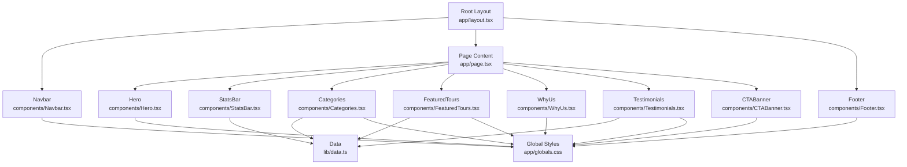

**Diagram sources**
- [app/layout.tsx:17-27](file://app/layout.tsx#L17-L27)
- [app/page.tsx:9-21](file://app/page.tsx#L9-L21)
- [lib/data.ts:1-252](file://lib/data.ts#L1-L252)
- [components/Navbar.tsx:1-113](file://components/Navbar.tsx#L1-L113)
- [components/Hero.tsx:1-100](file://components/Hero.tsx#L1-L100)
- [components/Categories.tsx:1-47](file://components/Categories.tsx#L1-L47)
- [components/StatsBar.tsx:1-21](file://components/StatsBar.tsx#L1-L21)
- [components/FeaturedTours.tsx:1-34](file://components/FeaturedTours.tsx#L1-L34)
- [components/WhyUs.tsx:1-101](file://components/WhyUs.tsx#L1-L101)
- [components/Testimonials.tsx:1-41](file://components/Testimonials.tsx#L1-L41)
- [components/CTABanner.tsx:1-32](file://components/CTABanner.tsx#L1-L32)
- [components/Footer.tsx:1-104](file://components/Footer.tsx#L1-L104)
- [app/globals.css:1-190](file://app/globals.css#L1-L190)

## Detailed Component Analysis

### Root Layout and Page Composition
- RootLayout injects Navbar and Footer around page children, establishing a consistent shell.
- HomePage composes feature sections in a fixed order, enabling a clear visual hierarchy and content progression.

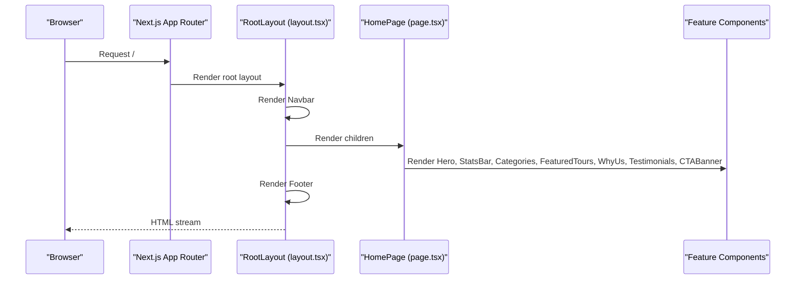

**Diagram sources**
- [app/layout.tsx:17-27](file://app/layout.tsx#L17-L27)
- [app/page.tsx:9-21](file://app/page.tsx#L9-L21)

**Section sources**
- [app/layout.tsx:17-27](file://app/layout.tsx#L17-L27)
- [app/page.tsx:9-21](file://app/page.tsx#L9-L21)

### Navigation Bar (Navbar)
- Client component with scroll-aware styling and dropdown mega-menu.
- Uses CSS Modules for scoping and Lucide icons for visual affordances.
- Integrates with global styles for button and container classes.

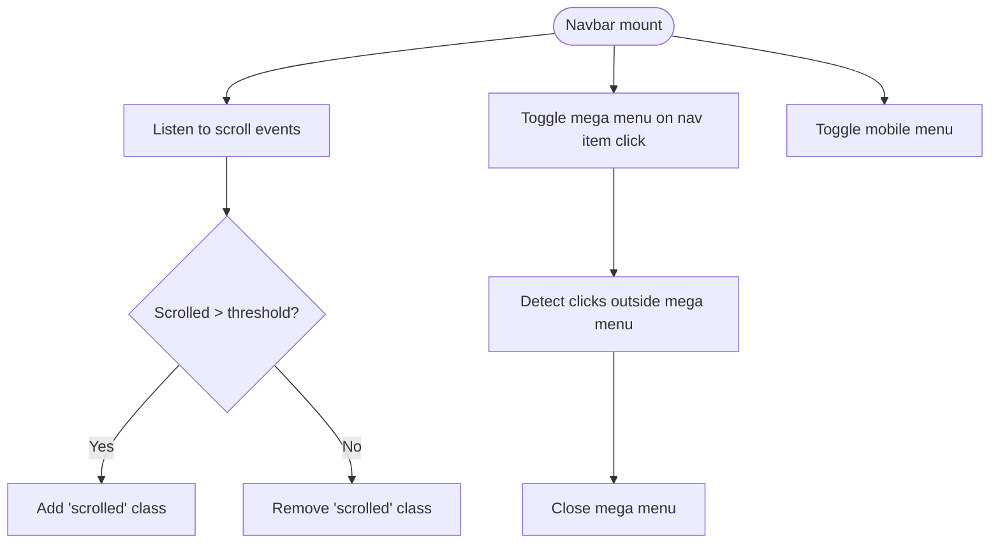

**Diagram sources**
- [components/Navbar.tsx:18-38](file://components/Navbar.tsx#L18-L38)

**Section sources**
- [components/Navbar.tsx:1-113](file://components/Navbar.tsx#L1-L113)
- [app/globals.css:99-147](file://app/globals.css#L99-L147)

### Hero Section
- Client component featuring background image stack, gradient overlays, headline copy, quick search, and slide indicators.
- Uses CSS Modules for layered composition and responsive adjustments.

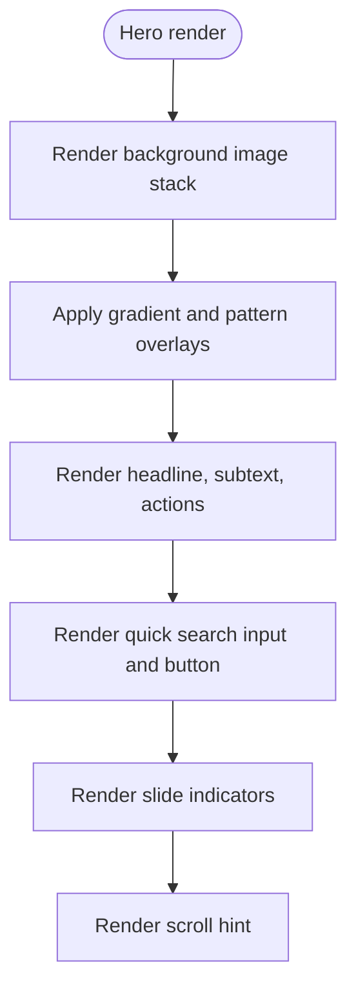

**Diagram sources**
- [components/Hero.tsx:20-97](file://components/Hero.tsx#L20-L97)

**Section sources**
- [components/Hero.tsx:1-100](file://components/Hero.tsx#L1-L100)
- [app/globals.css:185-189](file://app/globals.css#L185-L189)

### Categories Section
- Renders a grid of destination cards, each linking to a destination route.
- Consumes categories data and applies accent colors from data.

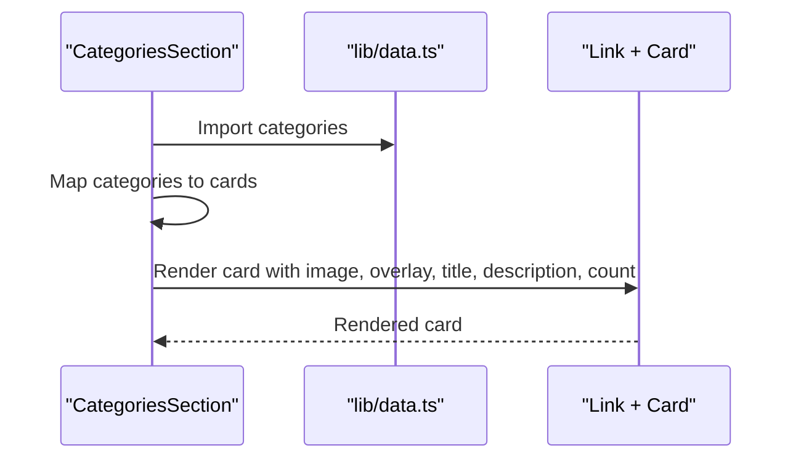

**Diagram sources**
- [components/Categories.tsx:7-46](file://components/Categories.tsx#L7-L46)
- [lib/data.ts:1-74](file://lib/data.ts#L1-L74)

**Section sources**
- [components/Categories.tsx:1-47](file://components/Categories.tsx#L1-L47)
- [lib/data.ts:1-74](file://lib/data.ts#L1-L74)

### Stats Bar
- Displays key statistics in a responsive grid layout.

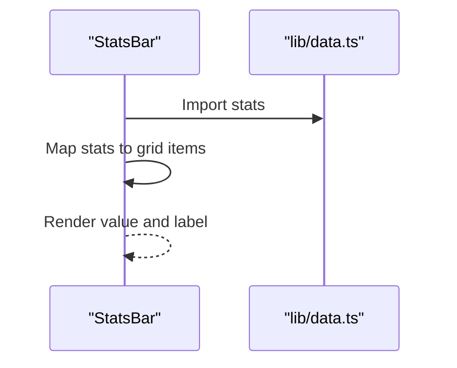

**Diagram sources**
- [components/StatsBar.tsx:5-20](file://components/StatsBar.tsx#L5-L20)
- [lib/data.ts:246-251](file://lib/data.ts#L246-L251)

**Section sources**
- [components/StatsBar.tsx:1-21](file://components/StatsBar.tsx#L1-L21)
- [lib/data.ts:246-251](file://lib/data.ts#L246-L251)

### Featured Tours and Tour Cards
- Filters featured tours and renders them using TourCard components.
- TourCard displays metadata, ratings, pricing, and hover effects.

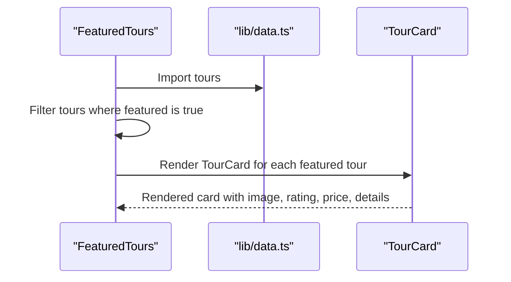

**Diagram sources**
- [components/FeaturedTours.tsx:8-33](file://components/FeaturedTours.tsx#L8-L33)
- [components/TourCard.tsx:21-62](file://components/TourCard.tsx#L21-L62)
- [lib/data.ts:76-205](file://lib/data.ts#L76-L205)

**Section sources**
- [components/FeaturedTours.tsx:1-34](file://components/FeaturedTours.tsx#L1-L34)
- [components/TourCard.tsx:1-63](file://components/TourCard.tsx#L1-L63)
- [lib/data.ts:76-205](file://lib/data.ts#L76-L205)

### Testimonials and Why Us
- Testimonials renders guest stories with star ratings and avatar images.
- WhyUs renders a two-column layout highlighting brand values with colored icon containers.

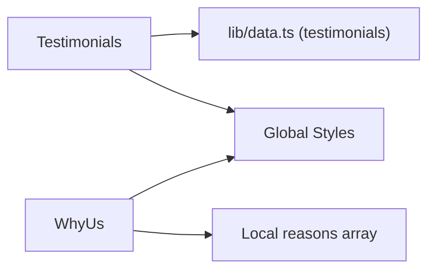

**Diagram sources**
- [components/Testimonials.tsx:6-40](file://components/Testimonials.tsx#L6-L40)
- [components/WhyUs.tsx:44-100](file://components/WhyUs.tsx#L44-L100)
- [lib/data.ts:207-244](file://lib/data.ts#L207-L244)

**Section sources**
- [components/Testimonials.tsx:1-41](file://components/Testimonials.tsx#L1-L41)
- [components/WhyUs.tsx:1-101](file://components/WhyUs.tsx#L1-L101)
- [lib/data.ts:207-244](file://lib/data.ts#L207-L244)

### Call-to-Action Banner and Footer
- CTABanner provides prominent action buttons and background styling.
- Footer organizes contact info, social links, newsletter signup, and legal links.

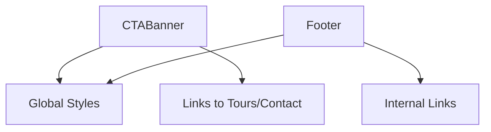

**Diagram sources**
- [components/CTABanner.tsx:6-31](file://components/CTABanner.tsx#L6-L31)
- [components/Footer.tsx:25-103](file://components/Footer.tsx#L25-L103)
- [app/globals.css:1-190](file://app/globals.css#L1-L190)

**Section sources**
- [components/CTABanner.tsx:1-32](file://components/CTABanner.tsx#L1-L32)
- [components/Footer.tsx:1-104](file://components/Footer.tsx#L1-L104)
- [app/globals.css:1-190](file://app/globals.css#L1-L190)

## Dependency Analysis
- File-based routing: app/page.tsx is the default route; components are imported and rendered by the page.
- Data dependencies: Components import data directly from lib/data.ts, enabling straightforward props propagation.
- Styling dependencies: Components import CSS Modules; global styles are applied via app/globals.css.
- Runtime dependencies: Next.js, React, and Lucide React provide framework and UI primitives.

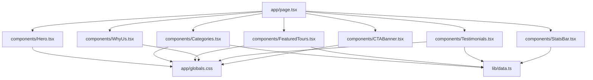

**Diagram sources**
- [app/page.tsx:1-22](file://app/page.tsx#L1-L22)
- [lib/data.ts:1-252](file://lib/data.ts#L1-L252)
- [app/globals.css:1-190](file://app/globals.css#L1-L190)

**Section sources**
- [app/page.tsx:1-22](file://app/page.tsx#L1-L22)
- [lib/data.ts:1-252](file://lib/data.ts#L1-L252)
- [package.json:10-16](file://package.json#L10-L16)

## Performance Considerations
- Image lazy loading: Components use loading="lazy" on images to improve initial load performance.
- Minimal client components: Only components requiring interactivity (e.g., Navbar, Hero) use the client directive.
- CSS Modules: Scoped styles reduce cascade overhead and enable efficient bundling.
- Global CSS: Centralized theme tokens and responsive rules minimize duplication.
- Next.js static generation and ISR: While not explicitly configured, the project uses Next.js defaults suitable for marketing sites.

[No sources needed since this section provides general guidance]

## Troubleshooting Guide
- Missing data: If a component fails to render content, verify the corresponding dataset exists in lib/data.ts and is exported.
- Styling issues: Ensure CSS Module class names match the component’s JSX and global styles are loaded via app/globals.css.
- Routing issues: Confirm the page route exists at app/page.tsx and that child components are imported correctly.
- Accessibility: Verify ARIA attributes (e.g., aria-expanded, aria-label) are present on interactive elements.

**Section sources**
- [lib/data.ts:1-252](file://lib/data.ts#L1-L252)
- [components/Navbar.tsx:54-59](file://components/Navbar.tsx#L54-L59)
- [components/Navbar.tsx:89-91](file://components/Navbar.tsx#L89-L91)
- [app/globals.css:1-190](file://app/globals.css#L1-L190)

## Conclusion
NatIndia employs a clean, scalable architecture leveraging Next.js App Router for file-based routing and SSR, a component-based UI with CSS Modules, and a centralized data layer. The root layout coordinates global navigation and footer, while the home page composes feature sections that share data and styling. The design emphasizes composability, maintainability, and performance through selective client components, lazy-loaded images, and global theme tokens.