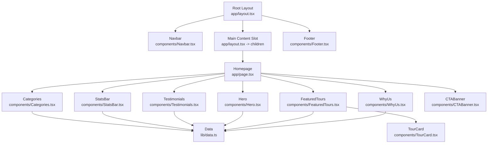
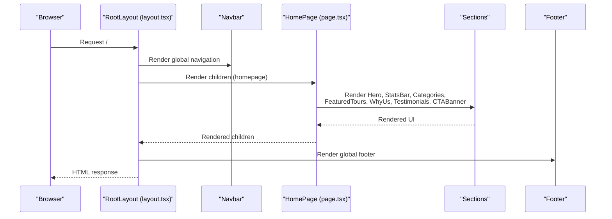
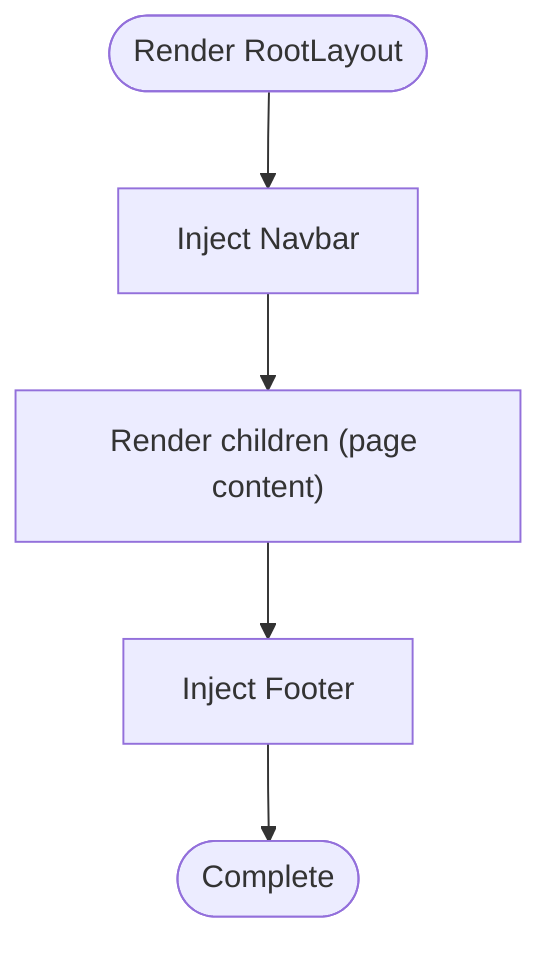
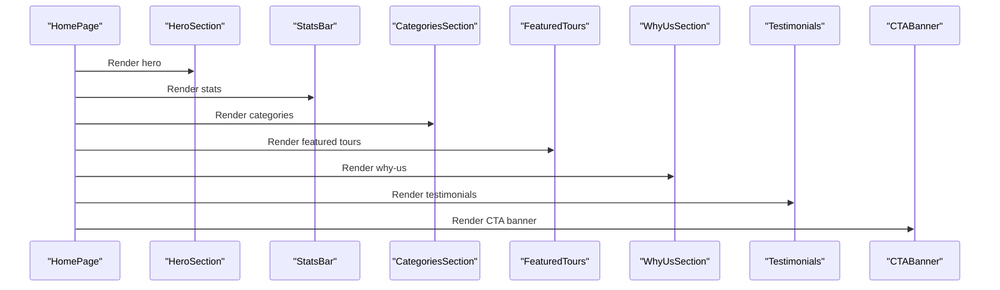
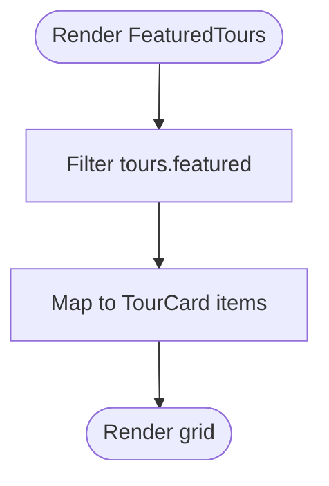
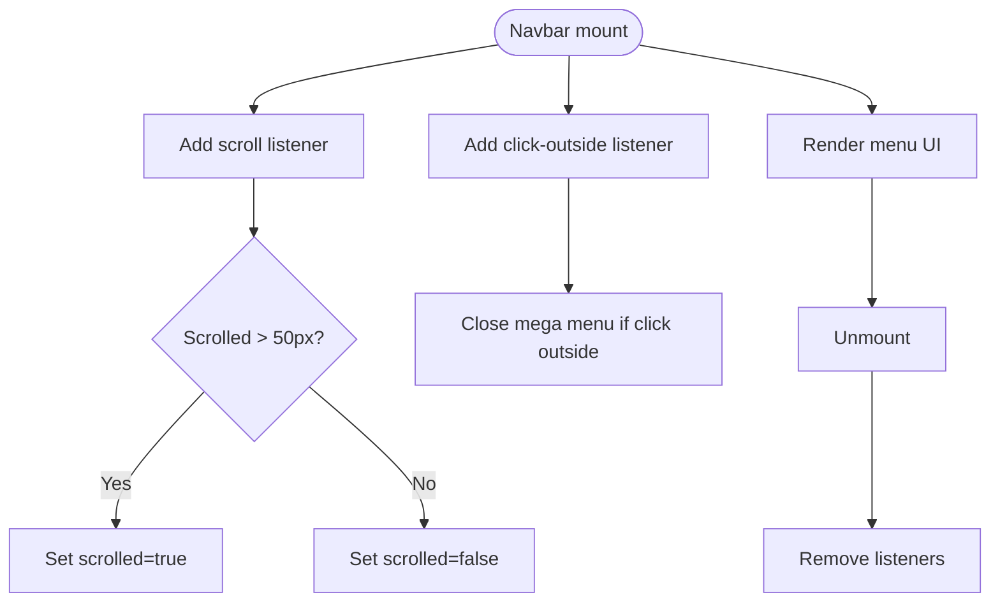
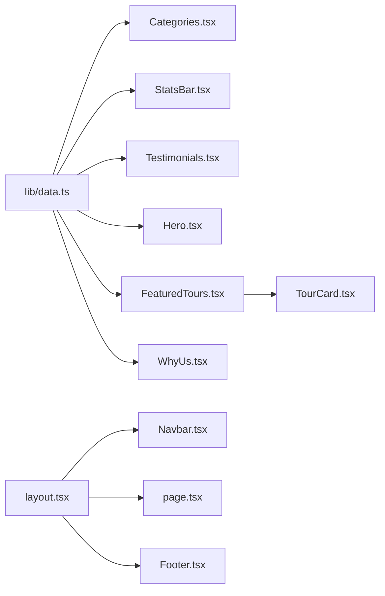

# Component Hierarchy

<cite>
**Referenced Files in This Document**
- [app/layout.tsx](file://app/layout.tsx)
- [app/page.tsx](file://app/page.tsx)
- [components/Navbar.tsx](file://components/Navbar.tsx)
- [components/Footer.tsx](file://components/Footer.tsx)
- [components/Hero.tsx](file://components/Hero.tsx)
- [components/Categories.tsx](file://components/Categories.tsx)
- [components/StatsBar.tsx](file://components/StatsBar.tsx)
- [components/Testimonials.tsx](file://components/Testimonials.tsx)
- [components/FeaturedTours.tsx](file://components/FeaturedTours.tsx)
- [components/WhyUs.tsx](file://components/WhyUs.tsx)
- [components/CTABanner.tsx](file://components/CTABanner.tsx)
- [components/TourCard.tsx](file://components/TourCard.tsx)
- [lib/data.ts](file://lib/data.ts)
</cite>

## Table of Contents
1. [Introduction](#introduction)
2. [Project Structure](#project-structure)
3. [Core Components](#core-components)
4. [Architecture Overview](#architecture-overview)
5. [Detailed Component Analysis](#detailed-component-analysis)
6. [Dependency Analysis](#dependency-analysis)
7. [Performance Considerations](#performance-considerations)
8. [Troubleshooting Guide](#troubleshooting-guide)
9. [Conclusion](#conclusion)

## Introduction
This document explains the component architecture and hierarchy of the Next.js application. It focuses on how the root layout orchestrates global components (Navbar, main content area, and Footer), how individual sections compose to form the homepage, and how data flows from parent components to children via props. It also covers lifecycle management, state coordination, and inter-component communication patterns used across the site.

## Project Structure
The application follows a conventional Next.js App Router structure with a root layout and a homepage that composes multiple marketing-focused sections. Global navigation and footer are injected at the root level, while the homepage renders a series of reusable components that consume shared data.

**Diagram sources**
- [app/layout.tsx:17-27](file://app/layout.tsx#L17-L27)
- [app/page.tsx:9-21](file://app/page.tsx#L9-L21)
- [components/Navbar.tsx:18-112](file://components/Navbar.tsx#L18-L112)
- [components/Footer.tsx:25-103](file://components/Footer.tsx#L25-L103)
- [components/Hero.tsx:20-99](file://components/Hero.tsx#L20-L99)
- [components/Categories.tsx:7-46](file://components/Categories.tsx#L7-L46)
- [components/StatsBar.tsx:5-19](file://components/StatsBar.tsx#L5-L19)
- [components/Testimonials.tsx:6-39](file://components/Testimonials.tsx#L6-L39)
- [components/FeaturedTours.tsx:8-32](file://components/FeaturedTours.tsx#L8-L32)
- [components/WhyUs.tsx:44-99](file://components/WhyUs.tsx#L44-L99)
- [components/CTABanner.tsx:6-31](file://components/CTABanner.tsx#L6-L31)
- [components/TourCard.tsx:21-62](file://components/TourCard.tsx#L21-L62)
- [lib/data.ts:1-252](file://lib/data.ts#L1-L252)

**Section sources**
- [app/layout.tsx:17-27](file://app/layout.tsx#L17-L27)
- [app/page.tsx:9-21](file://app/page.tsx#L9-L21)

## Core Components
- Root Layout: Provides global shell with Navbar, main content slot, and Footer. The main content slot receives the homepage component tree.
- Homepage: Composes Hero, StatsBar, Categories, FeaturedTours, WhyUs, Testimonials, and CTABanner.
- Shared Data: Centralized in lib/data.ts, consumed by multiple sections.

Key orchestration points:
- Root injects global header/footer around the page’s children.
- Homepage composes sections in a fixed order optimized for conversion and storytelling.

**Section sources**
- [app/layout.tsx:17-27](file://app/layout.tsx#L17-L27)
- [app/page.tsx:9-21](file://app/page.tsx#L9-L21)
- [lib/data.ts:1-252](file://lib/data.ts#L1-L252)

## Architecture Overview
The architecture is a top-down composition model:
- app/layout.tsx defines the global scaffold.
- app/page.tsx defines the homepage composition.
- Individual components render UI and optionally manage local state.
- Data is passed down as props from parents to children.

**Diagram sources**
- [app/layout.tsx:17-27](file://app/layout.tsx#L17-L27)
- [app/page.tsx:9-21](file://app/page.tsx#L9-L21)
- [components/Navbar.tsx:18-112](file://components/Navbar.tsx#L18-L112)
- [components/Footer.tsx:25-103](file://components/Footer.tsx#L25-L103)

## Detailed Component Analysis

### Root Layout Orchestration
- Purpose: Establish global header/footer and expose a children slot for page-specific content.
- Behavior: Renders Navbar at the top, main content via children, and Footer at the bottom.
- Impact: Ensures consistent branding and navigation across pages.

**Diagram sources**
- [app/layout.tsx:17-27](file://app/layout.tsx#L17-L27)

**Section sources**
- [app/layout.tsx:17-27](file://app/layout.tsx#L17-L27)

### Homepage Composition Pattern
- Purpose: Define the visual and conversion-first ordering of marketing sections.
- Composition: Hero → StatsBar → Categories → FeaturedTours → WhyUs → Testimonials → CTABanner.
- Props: Each section consumes data from lib/data.ts and renders its own UI.

**Diagram sources**
- [app/page.tsx:9-21](file://app/page.tsx#L9-L21)
- [components/Hero.tsx:20-99](file://components/Hero.tsx#L20-L99)
- [components/StatsBar.tsx:5-19](file://components/StatsBar.tsx#L5-L19)
- [components/Categories.tsx:7-46](file://components/Categories.tsx#L7-L46)
- [components/FeaturedTours.tsx:8-32](file://components/FeaturedTours.tsx#L8-L32)
- [components/WhyUs.tsx:44-99](file://components/WhyUs.tsx#L44-L99)
- [components/Testimonials.tsx:6-39](file://components/Testimonials.tsx#L6-L39)
- [components/CTABanner.tsx:6-31](file://components/CTABanner.tsx#L6-L31)

**Section sources**
- [app/page.tsx:9-21](file://app/page.tsx#L9-L21)

### Hero Section
- Purpose: Hero unit with background slides, overlay, headline, and quick search.
- Props: None required; uses static assets and hardcoded slide data.
- Lifecycle: Uses client directive for interactivity; no external state management.

**Section sources**
- [components/Hero.tsx:20-99](file://components/Hero.tsx#L20-L99)

### Stats Bar
- Purpose: Highlight company stats.
- Props: Consumes stats array from lib/data.ts.
- Lifecycle: Stateless presentation component.

**Section sources**
- [components/StatsBar.tsx:5-19](file://components/StatsBar.tsx#L5-L19)
- [lib/data.ts:246-251](file://lib/data.ts#L246-L251)

### Categories Section
- Purpose: Grid of destination categories with hover effects and counts.
- Props: Consumes categories array from lib/data.ts.
- Lifecycle: Stateless presentation component.

**Section sources**
- [components/Categories.tsx:7-46](file://components/Categories.tsx#L7-L46)
- [lib/data.ts:1-74](file://lib/data.ts#L1-L74)

### Featured Tours
- Purpose: Showcase curated tours with a grid of TourCard items.
- Props: Consumes tours array from lib/data.ts and filters featured items.
- Lifecycle: Stateless presentation component.

**Diagram sources**
- [components/FeaturedTours.tsx:8-32](file://components/FeaturedTours.tsx#L8-L32)
- [lib/data.ts:76-205](file://lib/data.ts#L76-L205)
- [components/TourCard.tsx:21-62](file://components/TourCard.tsx#L21-L62)

**Section sources**
- [components/FeaturedTours.tsx:8-32](file://components/FeaturedTours.tsx#L8-L32)
- [lib/data.ts:76-205](file://lib/data.ts#L76-L205)

### Tour Card
- Purpose: Individual tour tile with image, metadata, ratings, pricing, and CTA.
- Props: Receives a single tour object from FeaturedTours.
- Lifecycle: Stateless presentation component.

**Section sources**
- [components/TourCard.tsx:21-62](file://components/TourCard.tsx#L21-L62)

### Why Us Section
- Purpose: Value propositions with icons, titles, and descriptions.
- Props: Consumes reasons array from within the component.
- Lifecycle: Stateless presentation component.

**Section sources**
- [components/WhyUs.tsx:44-99](file://components/WhyUs.tsx#L44-L99)

### Testimonials
- Purpose: Guest stories with star ratings and avatar.
- Props: Consumes testimonials array from lib/data.ts.
- Lifecycle: Stateless presentation component.

**Section sources**
- [components/Testimonials.tsx:6-39](file://components/Testimonials.tsx#L6-L39)
- [lib/data.ts:207-244](file://lib/data.ts#L207-L244)

### Call-to-Action Banner
- Purpose: Prominent CTA for tours and expert consultation.
- Props: None required; static content.
- Lifecycle: Stateless presentation component.

**Section sources**
- [components/CTABanner.tsx:6-31](file://components/CTABanner.tsx#L6-L31)

### Navbar
- Purpose: Global navigation with desktop mega-menu, mobile menu, and scroll-aware styling.
- Props: None required; manages internal state for scroll, mega menu, and mobile menu.
- Lifecycle: Uses useEffect for scroll listener and click-outside detection; cleans up listeners on unmount.

**Diagram sources**
- [components/Navbar.tsx:18-112](file://components/Navbar.tsx#L18-L112)

**Section sources**
- [components/Navbar.tsx:18-112](file://components/Navbar.tsx#L18-L112)

### Footer
- Purpose: Brand presence, contact info, social links, newsletter, and legal links.
- Props: None required; static content.
- Lifecycle: Stateless presentation component.

**Section sources**
- [components/Footer.tsx:25-103](file://components/Footer.tsx#L25-L103)

## Dependency Analysis
- Data dependencies: All sections consuming lib/data.ts rely on exported arrays (categories, tours, testimonials, stats).
- Component dependencies:
  - FeaturedTours depends on TourCard.
  - Navbar and Footer are leaf-level components with no downstream dependencies.
  - Root Layout composes Navbar, children, and Footer.

**Diagram sources**
- [lib/data.ts:1-252](file://lib/data.ts#L1-L252)
- [components/Categories.tsx:7-46](file://components/Categories.tsx#L7-L46)
- [components/StatsBar.tsx:5-19](file://components/StatsBar.tsx#L5-L19)
- [components/Testimonials.tsx:6-39](file://components/Testimonials.tsx#L6-L39)
- [components/Hero.tsx:20-99](file://components/Hero.tsx#L20-L99)
- [components/FeaturedTours.tsx:8-32](file://components/FeaturedTours.tsx#L8-L32)
- [components/WhyUs.tsx:44-99](file://components/WhyUs.tsx#L44-L99)
- [components/TourCard.tsx:21-62](file://components/TourCard.tsx#L21-L62)
- [app/layout.tsx:17-27](file://app/layout.tsx#L17-L27)
- [app/page.tsx:9-21](file://app/page.tsx#L9-L21)

**Section sources**
- [lib/data.ts:1-252](file://lib/data.ts#L1-L252)
- [components/FeaturedTours.tsx:8-32](file://components/FeaturedTours.tsx#L8-L32)
- [components/TourCard.tsx:21-62](file://components/TourCard.tsx#L21-L62)
- [app/layout.tsx:17-27](file://app/layout.tsx#L17-L27)
- [app/page.tsx:9-21](file://app/page.tsx#L9-L21)

## Performance Considerations
- Client directives: Navbar, Hero, StatsBar, Categories, Testimonials, WhyUs, and FeaturedTours use the client directive. Minimize unnecessary client-side reactivity to reduce bundle size and initial hydration cost.
- Data locality: Keep data fetching close to where it is used. The current approach centralizes data in lib/data.ts, which simplifies imports but increases payload size. Consider lazy-loading data or splitting datasets for sections that do not require all data.
- Image optimization: Hero uses external images; ensure they are appropriately sized and compressed. TourCard images are used in grids; consider responsive image strategies.
- Event listeners: Navbar adds scroll and click-outside listeners; ensure cleanup occurs on unmount to avoid memory leaks.

[No sources needed since this section provides general guidance]

## Troubleshooting Guide
- Navigation not closing on item click:
  - Verify the click handler toggles the appropriate state and closes menus.
  - Confirm the click-outside logic targets the correct DOM nodes.
- Scroll effect not activating:
  - Ensure the scroll threshold is correct and the listener is attached after mount.
- Tour links incorrect:
  - Verify tour.slug matches the route pattern and TourCard links to the correct path.
- Data mismatch:
  - Confirm that the keys used by components match the exported data shape.

**Section sources**
- [components/Navbar.tsx:18-112](file://components/Navbar.tsx#L18-L112)
- [components/TourCard.tsx:21-62](file://components/TourCard.tsx#L21-L62)
- [lib/data.ts:76-205](file://lib/data.ts#L76-L205)

## Conclusion
The application employs a clean, top-down composition model: a root layout provides global scaffolding, the homepage composes marketing sections, and data is centralized for easy consumption. Props drilling is straightforward and explicit, with each component receiving only the data it needs. State is localized where appropriate (e.g., Navbar), and lifecycle hooks are used for efficient event handling. This structure balances simplicity, maintainability, and scalability for a marketing-driven travel website.