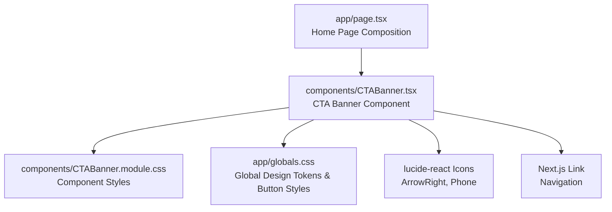
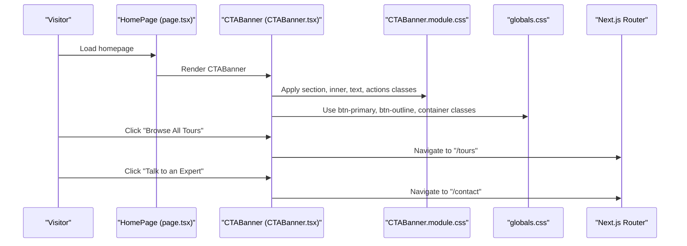
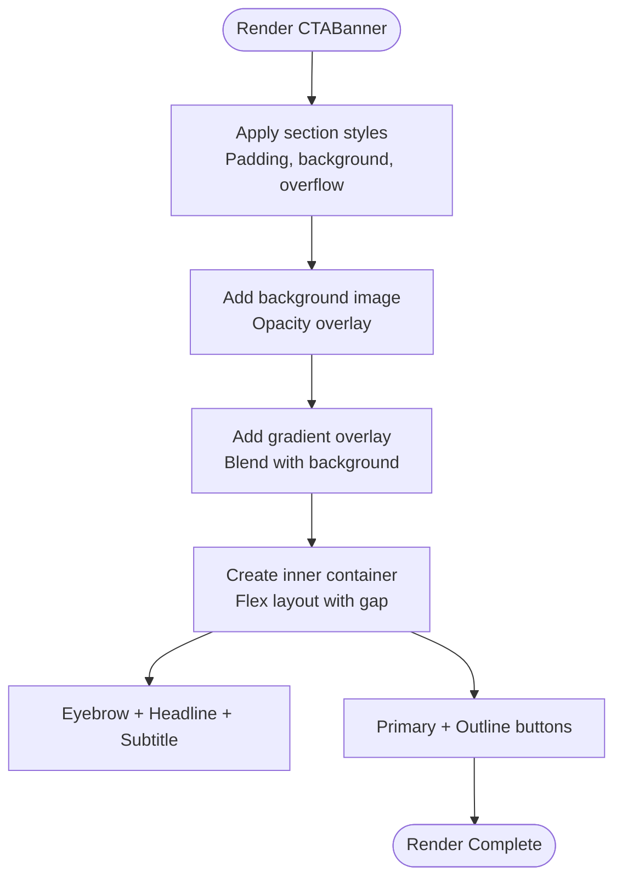
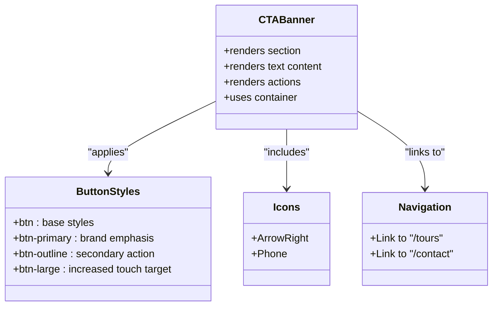
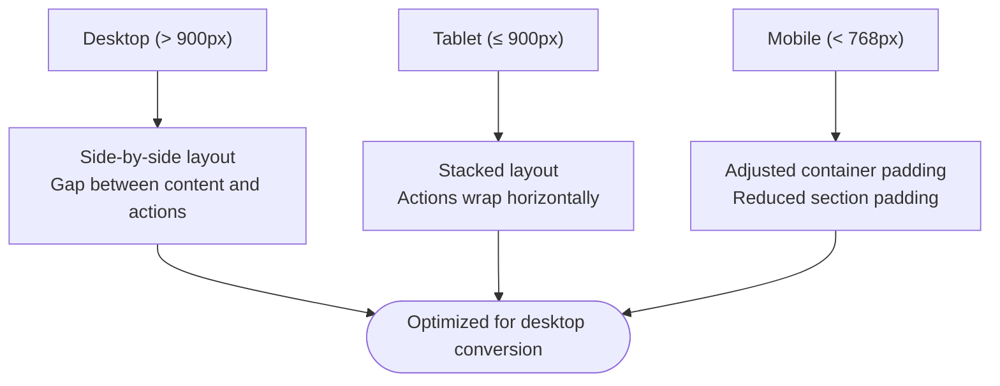
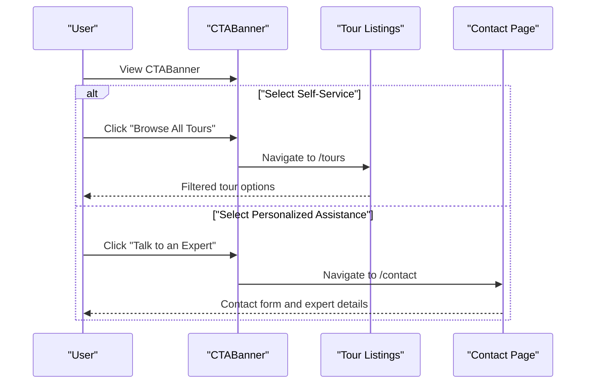
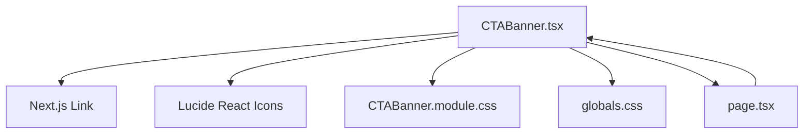

# Call-to-Action Banner

<cite>
**Referenced Files in This Document**
- [CTABanner.tsx](file://components/CTABanner.tsx)
- [CTABanner.module.css](file://components/CTABanner.module.css)
- [globals.css](file://app/globals.css)
- [page.tsx](file://app/page.tsx)
- [Hero.tsx](file://components/Hero.tsx)
</cite>

## Table of Contents
1. [Introduction](#introduction)
2. [Project Structure](#project-structure)
3. [Core Components](#core-components)
4. [Architecture Overview](#architecture-overview)
5. [Detailed Component Analysis](#detailed-component-analysis)
6. [Dependency Analysis](#dependency-analysis)
7. [Performance Considerations](#performance-considerations)
8. [Troubleshooting Guide](#troubleshooting-guide)
9. [Conclusion](#conclusion)

## Introduction
The CTABanner component is a focused, conversion-driven element designed to drive user engagement and action on travel websites. It presents compelling promotional content alongside dual call-to-action buttons, strategically positioned to maximize conversion rates. The component emphasizes visual prominence through layered backgrounds, typography scaling, and a cohesive design system aligned with brand identity.

## Project Structure
The CTABanner resides within the components directory and integrates seamlessly with the Next.js application layout. It leverages shared design tokens and global styles to maintain consistency across the site.

**Diagram sources**
- [page.tsx:1-22](file://app/page.tsx#L1-L22)
- [CTABanner.tsx:1-32](file://components/CTABanner.tsx#L1-L32)
- [CTABanner.module.css:1-76](file://components/CTABanner.module.css#L1-L76)
- [globals.css:1-190](file://app/globals.css#L1-L190)

**Section sources**
- [page.tsx:1-22](file://app/page.tsx#L1-L22)
- [CTABanner.tsx:1-32](file://components/CTABanner.tsx#L1-L32)
- [globals.css:1-190](file://app/globals.css#L1-L190)

## Core Components
The CTABanner component consists of:
- A visually prominent section with layered background effects
- Promotional content area with eyebrow, headline, and descriptive text
- Dual call-to-action buttons styled with primary and outline variants
- Responsive layout that adapts across device sizes

Key implementation highlights:
- Uses a container class for consistent horizontal spacing
- Applies a large button variant class for increased touch target size
- Integrates Lucide React icons for visual cues on actions
- Leverages global design tokens for brand-consistent colors and typography

**Section sources**
- [CTABanner.tsx:6-31](file://components/CTABanner.tsx#L6-L31)
- [CTABanner.module.css:1-76](file://components/CTABanner.module.css#L1-L76)
- [globals.css:98-146](file://app/globals.css#L98-L146)

## Architecture Overview
The CTABanner participates in the home page composition and benefits from a shared design system. It composes content and actions that guide users toward tours discovery and expert consultation.

**Diagram sources**
- [page.tsx:9-21](file://app/page.tsx#L9-L21)
- [CTABanner.tsx:6-31](file://components/CTABanner.tsx#L6-L31)
- [CTABanner.module.css:1-76](file://components/CTABanner.module.css#L1-L76)
- [globals.css:98-146](file://app/globals.css#L98-L146)

## Detailed Component Analysis

### Layout System and Visual Prominence
The CTABanner employs a layered visual approach to ensure prominence:
- A full-bleed background image with low opacity overlay
- A gradient overlay to enhance text readability
- A centered content container with flexible inner layout
- Typography scaling using clamp for responsive sizing

**Diagram sources**
- [CTABanner.module.css:1-76](file://components/CTABanner.module.css#L1-L76)

**Section sources**
- [CTABanner.module.css:1-76](file://components/CTABanner.module.css#L1-L76)

### Call-to-Action Button Implementation
The component provides two complementary CTAs:
- Primary CTA: Strong brand color with elevated shadow and hover lift
- Outline CTA: Transparent background with white text and subtle border

Button styling characteristics:
- Large touch-friendly padding and font size
- Consistent icon alignment and spacing
- Hover states with elevation and subtle transitions
- Accessible contrast against the gradient background

**Diagram sources**
- [CTABanner.tsx:19-26](file://components/CTABanner.tsx#L19-L26)
- [globals.css:98-146](file://app/globals.css#L98-L146)

**Section sources**
- [CTABanner.tsx:19-26](file://components/CTABanner.tsx#L19-L26)
- [globals.css:98-146](file://app/globals.css#L98-L146)

### Promotional Content Display
Content strategy focuses on clarity and urgency:
- Eyebrow: Short, uppercase, brand-aligned descriptor
- Headline: Scalable, serif-based typography with strong weight
- Subtitle: Readable body copy with appropriate line height

Typography and spacing:
- Clamp-based font sizing for fluid responsiveness
- Letter spacing and transforms for visual hierarchy
- Line heights optimized for readability across devices

**Section sources**
- [CTABanner.tsx:12-17](file://components/CTABanner.tsx#L12-L17)
- [CTABanner.module.css:36-58](file://components/CTABanner.module.css#L36-L58)

### Conversion Optimization Strategies
The component incorporates several conversion-focused design patterns:
- Dual CTAs: Reduces friction by offering multiple paths to action
- Icon integration: Provides immediate visual cues for action types
- Large touch targets: Improves accessibility and clickability on mobile
- Strategic positioning: Headline and CTAs aligned to guide the eye
- Contrast enhancement: Gradient overlay ensures text legibility

Integration patterns:
- Links to tour browsing and expert consultation
- Consistent button styling across the site
- Responsive adaptation for mobile and tablet

**Section sources**
- [CTABanner.tsx:19-26](file://components/CTABanner.tsx#L19-L26)
- [CTABanner.module.css:60-76](file://components/CTABanner.module.css#L60-L76)

### Responsive Behavior Across Devices
The component adapts its layout based on viewport width:
- Desktop: Side-by-side layout with substantial gap between content and actions
- Tablet/Mobile: Stacked layout with actions arranged horizontally and wrapped

Breakpoint behavior:
- Flex direction switches to column on smaller screens
- Action buttons wrap to accommodate various screen widths
- Typography continues to scale using clamp for optimal readability

**Diagram sources**
- [CTABanner.module.css:72-76](file://components/CTABanner.module.css#L72-L76)
- [globals.css:185-189](file://app/globals.css#L185-L189)

**Section sources**
- [CTABanner.module.css:72-76](file://components/CTABanner.module.css#L72-L76)
- [globals.css:185-189](file://app/globals.css#L185-L189)

### Integration with Lead Capture and Booking Workflows
While the CTABanner itself does not implement form handling, it serves as a gateway to lead capture and booking processes:
- Primary CTA navigates to tour listings for self-service exploration
- Secondary CTA directs users to contact pages for personalized assistance
- Shared button styles ensure consistent user expectations across workflows

**Diagram sources**
- [CTABanner.tsx:20-25](file://components/CTABanner.tsx#L20-L25)

**Section sources**
- [CTABanner.tsx:20-25](file://components/CTABanner.tsx#L20-L25)

### Design Patterns and Best Practices
The CTABanner demonstrates several established design patterns:
- Layered background technique for visual depth
- Typography scaling for responsive readability
- Dual CTA pattern for reduced choice paralysis
- Consistent button styling across the interface
- Mobile-first responsive adaptation

**Section sources**
- [CTABanner.module.css:1-76](file://components/CTABanner.module.css#L1-L76)
- [globals.css:98-146](file://app/globals.css#L98-L146)

## Dependency Analysis
The CTABanner component has minimal external dependencies and relies on shared design systems:
- Next.js Link for navigation
- Lucide React icons for visual cues
- Component-specific CSS module for styling
- Global CSS for design tokens and button styles

**Diagram sources**
- [CTABanner.tsx:2-4](file://components/CTABanner.tsx#L2-L4)
- [page.tsx:7](file://app/page.tsx#L7)

**Section sources**
- [CTABanner.tsx:2-4](file://components/CTABanner.tsx#L2-L4)
- [page.tsx:7](file://app/page.tsx#L7)

## Performance Considerations
- Image optimization: Background image uses a compressed quality setting suitable for web delivery
- CSS isolation: Component-specific module CSS prevents style leakage
- Minimal JavaScript: Uses client directive only for interactivity, keeping bundle size small
- Responsive design: Media queries adapt layout without additional heavy assets
- Font loading: Global font imports configured for efficient loading

## Troubleshooting Guide
Common issues and resolutions:
- Button hover states not applying: Verify global button styles are loaded and not overridden by local styles
- Text readability problems: Check gradient overlay opacity and ensure sufficient contrast against background
- Layout shifts on mobile: Confirm media query breakpoints align with intended device categories
- Navigation links not working: Ensure Next.js routing is properly configured and routes exist

**Section sources**
- [globals.css:98-146](file://app/globals.css#L98-L146)
- [CTABanner.module.css:17-23](file://components/CTABanner.module.css#L17-L23)

## Conclusion
The CTABanner component exemplifies effective conversion-focused design through strategic visual prominence, responsive layout, and consistent brand integration. Its dual CTA approach, layered background technique, and scalable typography create a compelling user experience that drives engagement across devices. The component's modular structure and reliance on shared design systems ensure maintainability and scalability within larger applications.