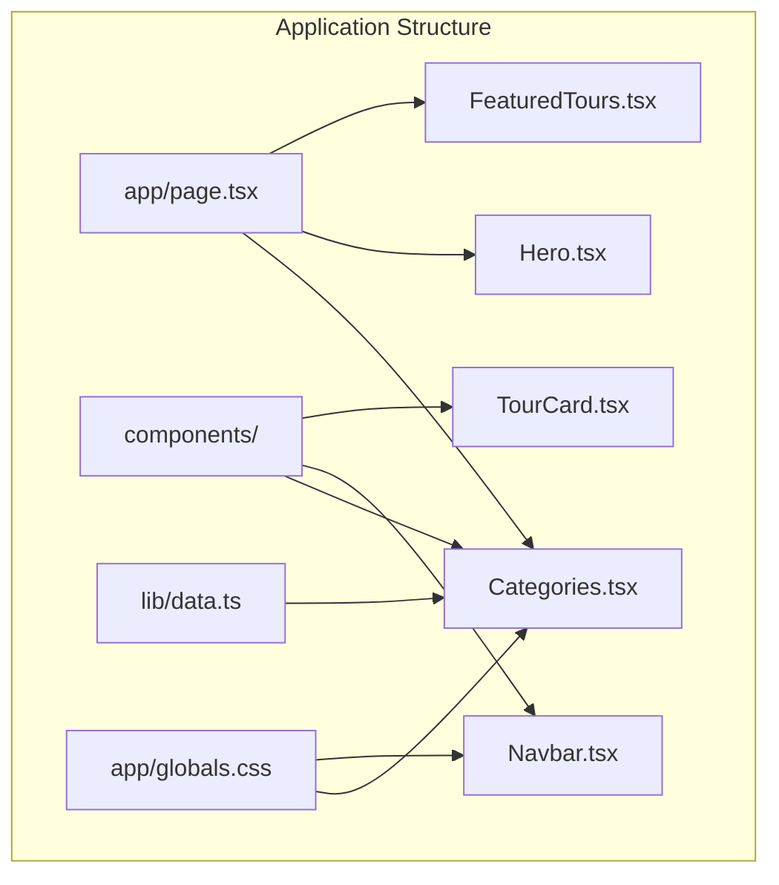
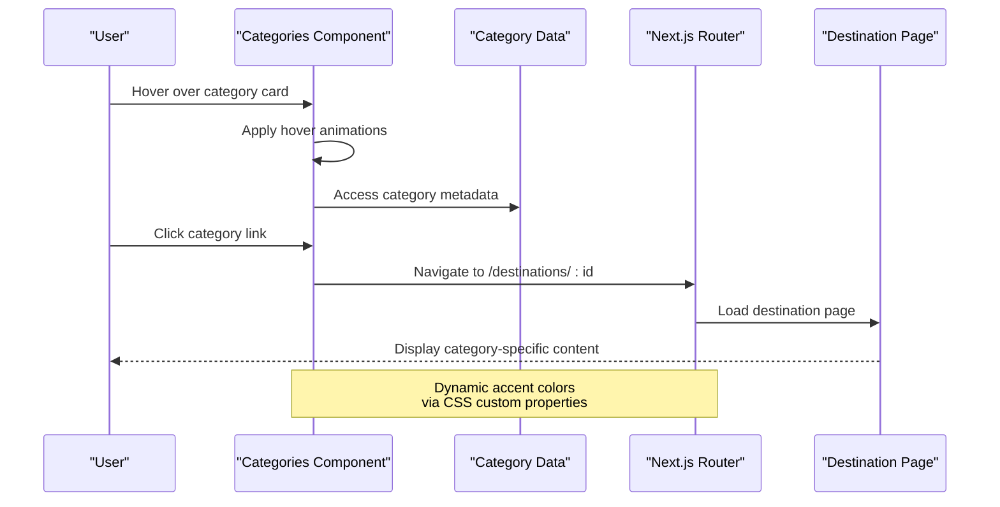
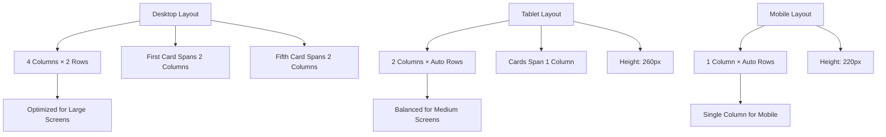
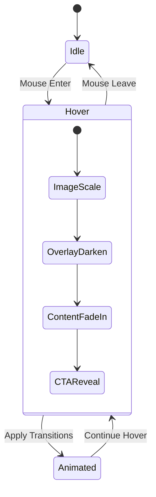
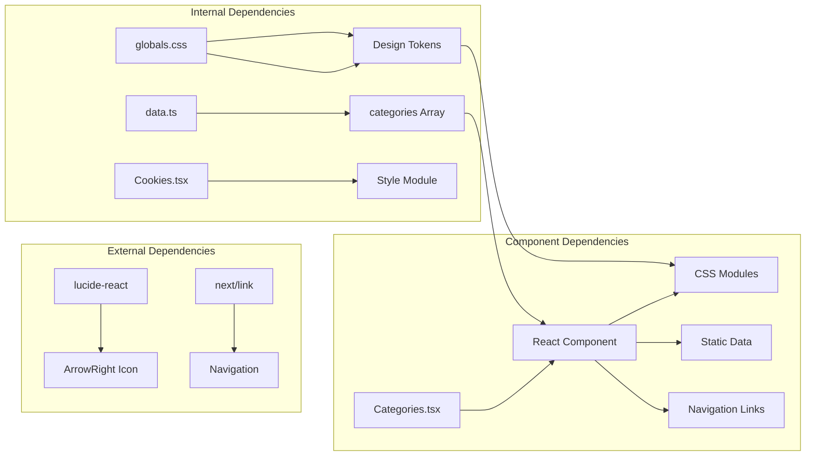

# Categories Section

<cite>
**Referenced Files in This Document**
- [Categories.tsx](file://components/Categories.tsx)
- [Categories.module.css](file://components/Categories.module.css)
- [data.ts](file://lib/data.ts)
- [page.tsx](file://app/page.tsx)
- [globals.css](file://app/globals.css)
- [Navbar.tsx](file://components/Navbar.tsx)
- [Hero.tsx](file://components/Hero.tsx)
- [FeaturedTours.tsx](file://components/FeaturedTours.tsx)
</cite>

## Table of Contents
1. [Introduction](#introduction)
2. [Project Structure](#project-structure)
3. [Core Components](#core-components)
4. [Architecture Overview](#architecture-overview)
5. [Detailed Component Analysis](#detailed-component-analysis)
6. [Dependency Analysis](#dependency-analysis)
7. [Performance Considerations](#performance-considerations)
8. [Troubleshooting Guide](#troubleshooting-guide)
9. [Conclusion](#conclusion)

## Introduction
The Categories component serves as the primary destination exploration interface, presenting tour categories through visually compelling cards that combine rich imagery, descriptive content, and interactive elements. It enables users to discover India's diverse experiences through eight distinct thematic categories, each represented by a unique visual identity, icon, and tour count indicator.

The component integrates seamlessly with the overall navigation flow, providing both direct category access and complementary navigation pathways through the hero section and navbar. Its responsive design ensures optimal presentation across all device sizes while maintaining visual consistency with the brand's design system.

## Project Structure
The Categories component is organized within the components directory alongside other UI elements that collectively form the homepage experience. The component leverages shared design tokens from the global CSS and consumes category data from the centralized data module.

**Diagram sources**
- [page.tsx:1-22](file://app/page.tsx#L1-L22)
- [Categories.tsx:1-47](file://components/Categories.tsx#L1-L47)
- [data.ts:1-252](file://lib/data.ts#L1-L252)
- [globals.css:1-190](file://app/globals.css#L1-L190)

**Section sources**
- [page.tsx:1-22](file://app/page.tsx#L1-L22)
- [Categories.tsx:1-47](file://components/Categories.tsx#L1-L47)
- [data.ts:1-252](file://lib/data.ts#L1-L252)

## Core Components
The Categories component consists of several interconnected elements that work together to deliver an immersive destination exploration experience:

### Category Card Structure
Each category card presents a unified visual experience combining:
- **Visual Layer**: Full-bleed background image with gradient overlay
- **Content Layer**: Icon, title, description, and tour count
- **Interactive Elements**: Hover effects, animated transitions, and call-to-action
- **Styling System**: CSS custom properties for dynamic accent colors

### Data Integration
The component consumes a structured dataset containing eight predefined categories, each with specific attributes that drive both visual presentation and functional behavior. The data structure supports seamless integration with the routing system and maintains consistency across all presentation contexts.

### Navigation Integration
Categories serve as both standalone destination explorers and navigational anchors within the broader site architecture. They connect to the hero section's quick search functionality and complement the navbar's mega-menu system.

**Section sources**
- [Categories.tsx:7-46](file://components/Categories.tsx#L7-L46)
- [Categories.module.css:1-135](file://components/Categories.module.css#L1-L135)
- [data.ts:1-74](file://lib/data.ts#L1-L74)

## Architecture Overview
The Categories component operates within a cohesive ecosystem that emphasizes visual storytelling and intuitive navigation. The architecture balances static presentation with dynamic interactivity while maintaining performance optimization through lazy loading and efficient CSS transitions.

**Diagram sources**
- [Categories.tsx:21-25](file://components/Categories.tsx#L21-L25)
- [data.ts:1-74](file://lib/data.ts#L1-L74)

The component architecture demonstrates several key design patterns:
- **Component Composition**: Modular card structure with reusable visual elements
- **Data-Driven Rendering**: Dynamic content generation from structured data
- **Responsive Design**: Adaptive grid layout with breakpoint-specific behavior
- **Performance Optimization**: Lazy loading for images and efficient CSS animations

**Section sources**
- [Categories.tsx:1-47](file://components/Categories.tsx#L1-L47)
- [Navbar.tsx:18-112](file://components/Navbar.tsx#L18-L112)
- [Hero.tsx:13-18](file://components/Hero.tsx#L13-L18)

## Detailed Component Analysis

### Visual Design System
The Categories component implements a sophisticated visual design system that prioritizes visual impact while maintaining accessibility and performance.

#### Grid Layout Architecture
The component employs a responsive CSS Grid system that adapts to different screen sizes while maintaining visual balance:

**Diagram sources**
- [Categories.module.css:24-29](file://components/Categories.module.css#L24-L29)
- [Categories.module.css:126-134](file://components/Categories.module.css#L126-L134)

#### Interactive Animation System
The component features sophisticated hover animations that enhance user engagement without compromising performance:

**Diagram sources**
- [Categories.module.css:45-46](file://components/Categories.module.css#L45-L46)
- [Categories.module.css:58-64](file://components/Categories.module.css#L58-L64)
- [Categories.module.css:109](file://components/Categories.module.css#L109)
- [Categories.module.css:124](file://components/Categories.module.css#L124)

#### Color and Typography System
The component leverages a comprehensive color palette derived from the global design system, with each category receiving a unique accent color:

| Category | Accent Color | Icon | Purpose |
|----------|--------------|------|---------|
| Wildlife | Forest Green (#166534) | 🐯 | Bengal tigers, rhinos, elephants |
| Cultural | Gold (#D97706) | 🏛️ | Ancient traditions, festivals |
| Himalayan | Blue (#1E40AF) | ⛰️ | High passes, monasteries |
| Coastal | Ocean Blue (#0369A1) | 🏖️ | Beaches, islands, lagoons |
| Spiritual | Purple (#7C3AED) | 🕌 | Pilgrimages, ghats |
| Heritage | Brown (#B45309) | 🏰 | UNESCO sites, forts |
| Northeast | Forest Green (#065F46) | 🌿 | Living root bridges, tribes |
| Kerala | Emerald (#15803D) | 🌴 | Backwaters, spices |

**Section sources**
- [Categories.module.css:1-135](file://components/Categories.module.css#L1-L135)
- [data.ts:1-74](file://lib/data.ts#L1-L74)
- [globals.css:3-42](file://app/globals.css#L3-L42)

### Data Structure Requirements
The Categories component requires a specific data structure to function correctly, with each category object containing the following essential properties:

#### Required Category Properties
- **id**: Unique identifier for routing (string)
- **title**: Display name for the category (string)
- **description**: Brief description of category offerings (string)
- **image**: URL to background image (string)
- **count**: Number of tours in category (number)
- **color**: CSS color value for accent styling (string)
- **icon**: Unicode emoji representing the category (string)

#### Data Validation and Error Handling
The component expects consistent data formatting and handles potential rendering issues gracefully. Each property serves a specific visual or functional purpose within the card layout.

**Section sources**
- [data.ts:1-74](file://lib/data.ts#L1-L74)
- [Categories.tsx:21-40](file://components/Categories.tsx#L21-L40)

### Interactive Behavior Patterns
The component implements several interactive patterns that enhance user engagement and provide clear feedback:

#### Hover Effects Implementation
The hover state triggers coordinated animations across multiple visual elements:
- Background image scales by 8% with smooth easing
- Gradient overlay darkens for improved text readability
- Description text fades in with upward slide animation
- Call-to-action button becomes fully visible with slight delay

#### Click Handling and Navigation
Category cards function as interactive links that navigate users to category-specific destination pages. The navigation follows Next.js routing conventions with dynamic segments.

#### Responsive Behavior
The component adapts its layout and styling based on viewport size, ensuring optimal presentation across mobile, tablet, and desktop devices.

**Section sources**
- [Categories.tsx:21-40](file://components/Categories.tsx#L21-L40)
- [Categories.module.css:45-46](file://components/Categories.module.css#L45-L46)
- [Categories.module.css:58-64](file://components/Categories.module.css#L58-L64)

### Integration with Navigation Flow
The Categories component integrates seamlessly with the site's navigation architecture through multiple touchpoints:

#### Hero Section Integration
The hero section provides complementary navigation through quick search functionality and direct links to popular categories, creating multiple pathways for destination discovery.

#### Navbar Mega-Menu Alignment
The navbar's destination mega-menu mirrors the Categories component's offerings, ensuring consistency across navigation channels while providing alternative access patterns for different user preferences.

#### Cross-Component Consistency
Both the Categories component and navbar maintain identical category lists and visual representations, reinforcing brand consistency and reducing cognitive load for users.

**Section sources**
- [Hero.tsx:13-18](file://components/Hero.tsx#L13-L18)
- [Navbar.tsx:7-16](file://components/Navbar.tsx#L7-L16)
- [Navbar.tsx:62-77](file://components/Navbar.tsx#L62-L77)

## Dependency Analysis
The Categories component maintains focused dependencies that support modularity and maintainability while enabling powerful functionality.

**Diagram sources**
- [Categories.tsx:2-5](file://components/Categories.tsx#L2-L5)
- [data.ts:1-74](file://lib/data.ts#L1-L74)
- [globals.css:1-190](file://app/globals.css#L1-L190)

### Component Coupling Analysis
The Categories component demonstrates low to moderate coupling with external systems:
- **Data Coupling**: Direct import of category data array
- **UI Coupling**: Minimal styling dependencies through CSS modules
- **Navigation Coupling**: Standardized link structure for routing

### Cohesion and Separation of Concerns
The component maintains high internal cohesion by grouping related functionality:
- Visual presentation logic within CSS modules
- Data consumption and rendering logic within the component
- Navigation behavior through standardized link components

**Section sources**
- [Categories.tsx:1-47](file://components/Categories.tsx#L1-L47)
- [data.ts:1-74](file://lib/data.ts#L1-L74)

## Performance Considerations
The Categories component implements several performance optimization strategies to ensure smooth user experience across various devices and network conditions.

### Image Loading Optimization
- **Lazy Loading**: Images use native lazy loading for improved initial page load performance
- **Responsive Sizing**: Image URLs include width parameters for appropriate asset delivery
- **Progressive Enhancement**: Graceful degradation when JavaScript is disabled

### CSS Performance Strategies
- **Hardware Acceleration**: Transform properties utilize GPU acceleration for smooth animations
- **Efficient Transitions**: Optimized timing functions reduce computational overhead
- **Custom Property Usage**: Dynamic accent colors minimize CSS duplication

### Memory Management
- **Component Lifecycle**: Proper cleanup of event listeners and scroll handlers
- **State Management**: Minimal state updates to reduce re-render cycles
- **Event Delegation**: Efficient hover state management through CSS transitions

## Troubleshooting Guide
Common issues and solutions for the Categories component:

### Visual Rendering Issues
**Problem**: Cards not displaying correctly on mobile devices
**Solution**: Verify CSS media query breakpoints and ensure proper container sizing

**Problem**: Hover animations not triggering
**Solution**: Check for CSS transition conflicts and ensure proper event handler attachment

### Data Integration Problems
**Problem**: Missing category data or incorrect rendering
**Solution**: Validate data structure consistency and ensure all required properties are present

**Problem**: Navigation links not functioning
**Solution**: Verify routing configuration and ensure destination pages exist

### Performance Issues
**Problem**: Slow initial load times
**Solution**: Optimize image assets and consider implementing skeleton loading states

**Problem**: Animation stuttering on lower-end devices
**Solution**: Adjust animation timing functions and consider reduced motion preferences

**Section sources**
- [Categories.tsx:1-47](file://components/Categories.tsx#L1-L47)
- [Categories.module.css:1-135](file://components/Categories.module.css#L1-L135)

## Conclusion
The Categories component represents a sophisticated implementation of destination exploration functionality that balances visual appeal with practical usability. Through its thoughtful integration of responsive design, interactive animations, and data-driven content, it provides users with an engaging pathway to discover India's diverse travel experiences.

The component's architecture demonstrates strong separation of concerns, with clear boundaries between presentation, data, and navigation concerns. Its modular design facilitates maintenance and extension while maintaining consistency with the broader application ecosystem.

Key strengths include the responsive grid system that adapts to various screen sizes, the dynamic color system that reinforces brand identity, and the seamless integration with complementary navigation elements. The component successfully transforms static category data into an interactive, engaging user experience that encourages exploration and discovery.

Future enhancements could include advanced filtering capabilities, category-based content previews, and integration with analytics to track user engagement patterns. However, the current implementation provides a solid foundation for destination exploration that effectively serves the needs of travelers seeking to discover India's remarkable diversity.