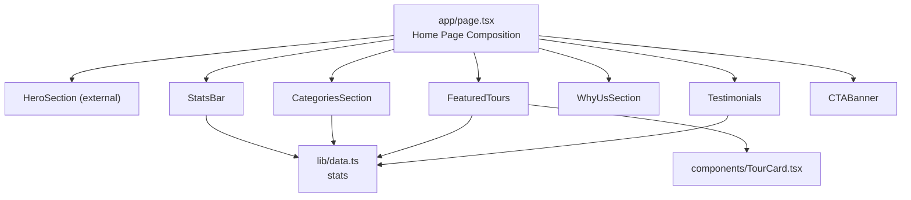
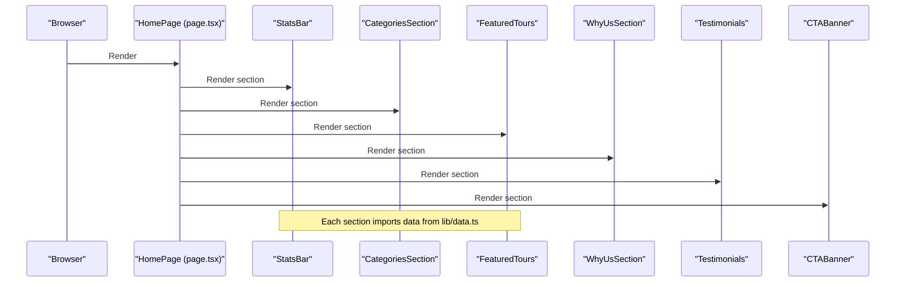
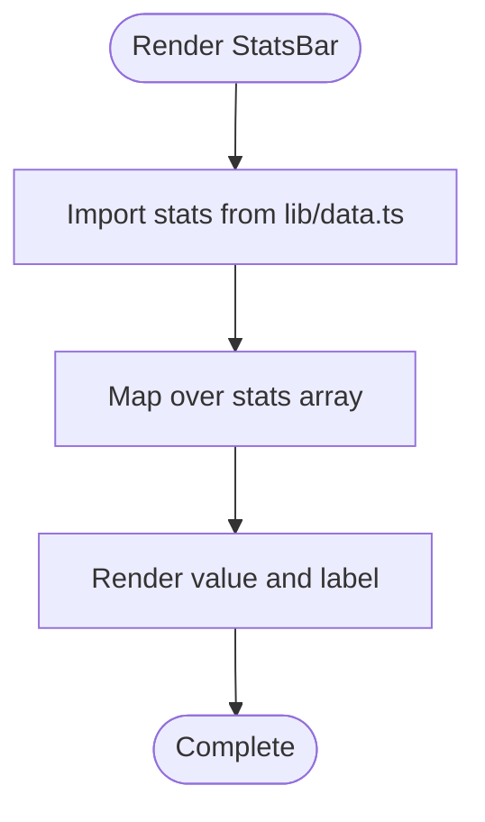
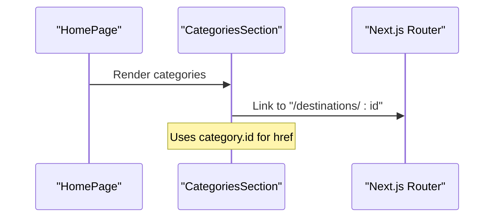
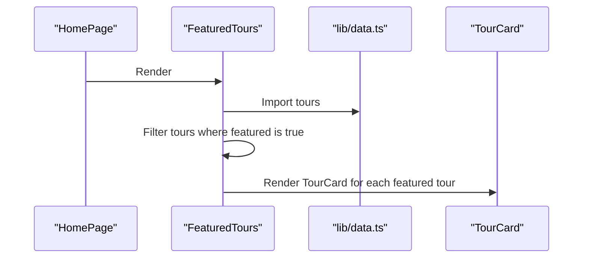
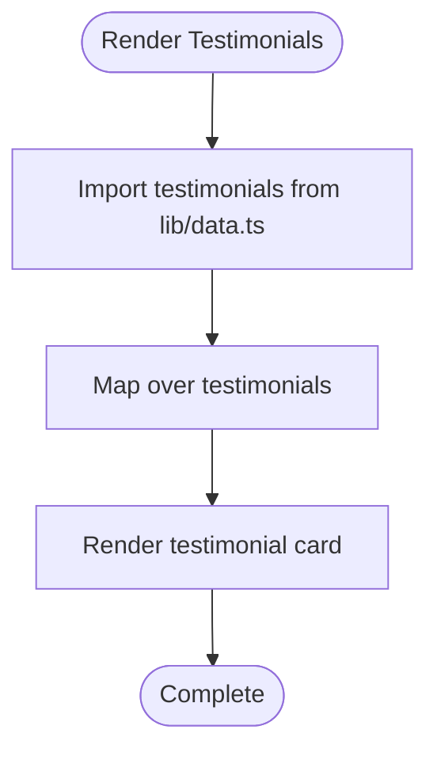
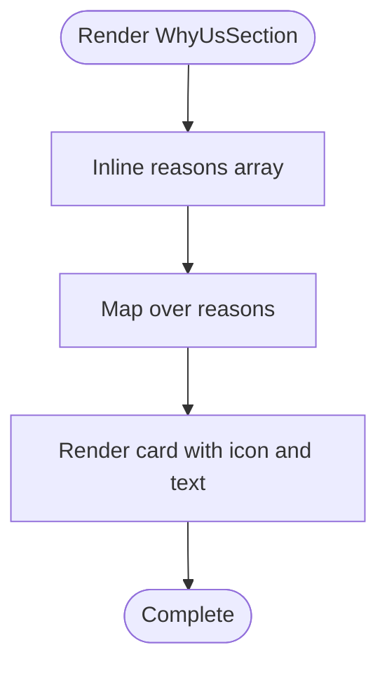
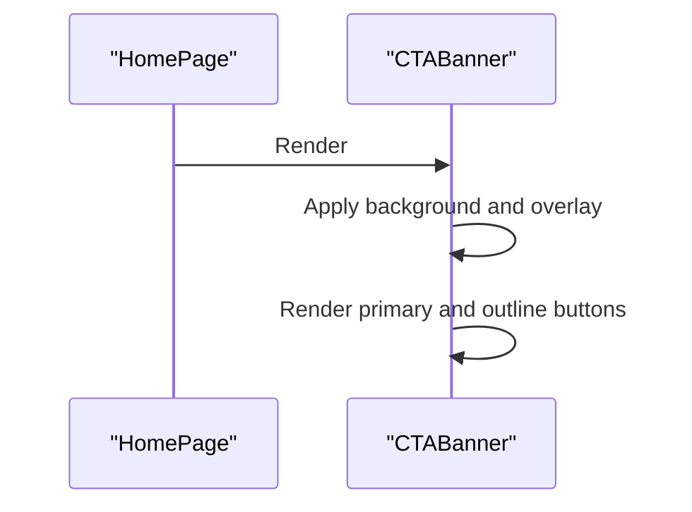
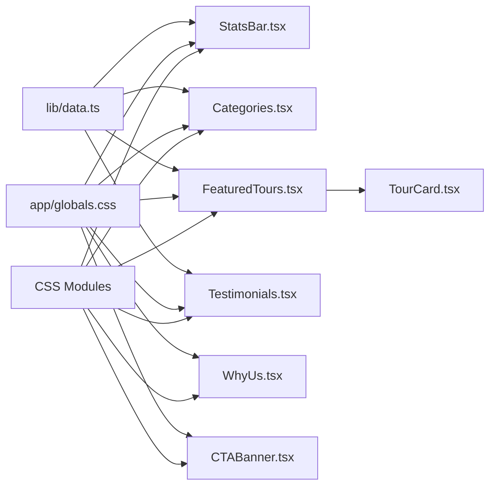

# Content Sections

<cite>
**Referenced Files in This Document**
- [app/page.tsx](file://app/page.tsx)
- [lib/data.ts](file://lib/data.ts)
- [components/StatsBar.tsx](file://components/StatsBar.tsx)
- [components/Categories.tsx](file://components/Categories.tsx)
- [components/FeaturedTours.tsx](file://components/FeaturedTours.tsx)
- [components/Testimonials.tsx](file://components/Testimonials.tsx)
- [components/WhyUs.tsx](file://components/WhyUs.tsx)
- [components/CTABanner.tsx](file://components/CTABanner.tsx)
- [components/TourCard.tsx](file://components/TourCard.tsx)
- [app/globals.css](file://app/globals.css)
- [components/StatsBar.module.css](file://components/StatsBar.module.css)
- [components/Categories.module.css](file://components/Categories.module.css)
- [components/FeaturedTours.module.css](file://components/FeaturedTours.module.css)
- [components/Testimonials.module.css](file://components/Testimonials.module.css)
- [components/WhyUs.module.css](file://components/WhyUs.module.css)
- [components/CTABanner.module.css](file://components/CTABanner.module.css)
</cite>

## Table of Contents
1. [Introduction](#introduction)
2. [Project Structure](#project-structure)
3. [Core Components](#core-components)
4. [Architecture Overview](#architecture-overview)
5. [Detailed Component Analysis](#detailed-component-analysis)
6. [Dependency Analysis](#dependency-analysis)
7. [Performance Considerations](#performance-considerations)
8. [Troubleshooting Guide](#troubleshooting-guide)
9. [Conclusion](#conclusion)

## Introduction
This document explains the content sections that compose the main page layout. It covers each section’s purpose, data requirements, and implementation patterns. It also documents the shared styling approach via CSS modules, the data source in lib/data.ts, and responsive design strategies. Examples of component composition, stateless rendering, and integration with the overall page structure are included to help developers and designers implement or extend the layout effectively.

## Project Structure
The main page composes multiple content sections that render static data from a centralized data source. Each section is implemented as a standalone React component with its own CSS module for styling. Global styles define typography, spacing, buttons, and responsive breakpoints.

**Diagram sources**
- [app/page.tsx](file://app/page.tsx)
- [components/StatsBar.tsx](file://components/StatsBar.tsx)
- [components/Categories.tsx](file://components/Categories.tsx)
- [components/FeaturedTours.tsx](file://components/FeaturedTours.tsx)
- [components/Testimonials.tsx](file://components/Testimonials.tsx)
- [components/WhyUs.tsx](file://components/WhyUs.tsx)
- [components/CTABanner.tsx](file://components/CTABanner.tsx)
- [components/TourCard.tsx](file://components/TourCard.tsx)
- [lib/data.ts](file://lib/data.ts)

**Section sources**
- [app/page.tsx](file://app/page.tsx)
- [app/globals.css](file://app/globals.css)

## Core Components
This section outlines the purpose, data requirements, and implementation patterns for each content section.

- StatsBar
  - Purpose: Display key brand statistics in a visually prominent, hero-like section.
  - Data requirements: An array of stat items with value and label fields.
  - Implementation pattern: Stateless component mapping over stats and applying CSS module classes.
  - Styling: Dark-themed gradient background with responsive grid and text effects.
  - Integration: Positioned early in the page after the hero to reinforce credibility.

- CategoriesSection
  - Purpose: Enable destination exploration by showcasing thematic categories with imagery and counts.
  - Data requirements: Array of category objects with id, title, description, image, count, color, icon.
  - Implementation pattern: Stateless component rendering cards with dynamic accent color and lazy-loaded images.
  - Styling: Grid layout with hover animations, overlay gradients, and responsive breakpoints.
  - Integration: Anchored with an ID for navigation and linked to destination pages.

- FeaturedTours
  - Purpose: Showcase curated tours to drive engagement and conversions.
  - Data requirements: Array of tour objects; filters to featured entries.
  - Implementation pattern: Stateless component filtering tours and rendering TourCard instances.
  - Styling: Two-row header and grid layout with responsive columns.
  - Integration: Links to a broader tours catalog and individual tour pages.

- Testimonials
  - Purpose: Build trust through guest stories and ratings.
  - Data requirements: Array of testimonial objects with name, role, avatar, tour, rating, text.
  - Implementation pattern: Stateless component rendering quote icons, star ratings, and author metadata.
  - Styling: Card-based grid with hover elevation and responsive single-column layout.
  - Integration: Part of the main page flow to reinforce social proof.

- WhyUsSection
  - Purpose: Communicate company values and differentiators.
  - Data requirements: Static reasons array with icon, title, description, and color.
  - Implementation pattern: Stateless component with a two-column layout and hover cards.
  - Styling: Split layout with trust imagery and color-mapped icon backgrounds.
  - Integration: Provides context before showcasing tours.

- CTABanner
  - Purpose: Drive conversions with clear actions to browse tours or contact experts.
  - Data requirements: None; uses static copy and links.
  - Implementation pattern: Stateless component with background overlay and action buttons.
  - Styling: Full-width banner with gradient overlay and responsive alignment.
  - Integration: Ends the main page with strong conversion-focused visuals.

**Section sources**
- [components/StatsBar.tsx](file://components/StatsBar.tsx)
- [components/Categories.tsx](file://components/Categories.tsx)
- [components/FeaturedTours.tsx](file://components/FeaturedTours.tsx)
- [components/Testimonials.tsx](file://components/Testimonials.tsx)
- [components/WhyUs.tsx](file://components/WhyUs.tsx)
- [components/CTABanner.tsx](file://components/CTABanner.tsx)
- [lib/data.ts](file://lib/data.ts)

## Architecture Overview
The main page composes all content sections in a fixed order. Each section consumes data from lib/data.ts and applies its own CSS module for styling. Global styles define typography, spacing, and responsive behavior. TourCard is reused within FeaturedTours to maintain consistent presentation.

**Diagram sources**
- [app/page.tsx](file://app/page.tsx)
- [components/StatsBar.tsx](file://components/StatsBar.tsx)
- [components/Categories.tsx](file://components/Categories.tsx)
- [components/FeaturedTours.tsx](file://components/FeaturedTours.tsx)
- [components/Testimonials.tsx](file://components/Testimonials.tsx)
- [components/WhyUs.tsx](file://components/WhyUs.tsx)
- [components/CTABanner.tsx](file://components/CTABanner.tsx)
- [lib/data.ts](file://lib/data.ts)

## Detailed Component Analysis

### StatsBar
- Purpose: Present key statistics in a visually engaging way.
- Data source: lib/data.ts stats array.
- Implementation pattern:
  - Stateless functional component.
  - Maps over stats to render value and label with CSS module classes.
- Styling highlights:
  - Dark gradient background with decorative radial element.
  - Responsive grid with vertical separators on larger screens.
- Accessibility and UX:
  - Uses semantic sectioning and readable typography scales.
- Composition:
  - Called directly by the home page.

**Diagram sources**
- [components/StatsBar.tsx](file://components/StatsBar.tsx)
- [lib/data.ts](file://lib/data.ts)
- [components/StatsBar.module.css](file://components/StatsBar.module.css)

**Section sources**
- [components/StatsBar.tsx](file://components/StatsBar.tsx)
- [components/StatsBar.module.css](file://components/StatsBar.module.css)
- [lib/data.ts](file://lib/data.ts)

### CategoriesSection
- Purpose: Allow users to explore themed destinations.
- Data source: lib/data.ts categories array.
- Implementation pattern:
  - Stateless component with dynamic accent color via CSS variable.
  - Lazy-loading images and overlay effects on hover.
- Styling highlights:
  - Responsive grid with special spanning for first and fifth cards on large screens.
  - Hover animations for content reveal and scaling image.
- Navigation:
  - Links to destination-specific pages using category IDs.

**Diagram sources**
- [components/Categories.tsx](file://components/Categories.tsx)
- [lib/data.ts](file://lib/data.ts)
- [components/Categories.module.css](file://components/Categories.module.css)

**Section sources**
- [components/Categories.tsx](file://components/Categories.tsx)
- [components/Categories.module.css](file://components/Categories.module.css)
- [lib/data.ts](file://lib/data.ts)

### FeaturedTours
- Purpose: Showcase curated tours to drive interest and conversions.
- Data source: lib/data.ts tours array; filters to featured entries.
- Implementation pattern:
  - Stateless component filtering tours and rendering TourCard for each.
  - Includes a “View All Tours” link to navigate to the tours catalog.
- Styling highlights:
  - Two-part header with title/subtitle and a ghost button.
  - Responsive grid reducing columns at smaller breakpoints.
- Composition:
  - Reuses TourCard for consistent presentation.

**Diagram sources**
- [components/FeaturedTours.tsx](file://components/FeaturedTours.tsx)
- [components/TourCard.tsx](file://components/TourCard.tsx)
- [lib/data.ts](file://lib/data.ts)
- [components/FeaturedTours.module.css](file://components/FeaturedTours.module.css)

**Section sources**
- [components/FeaturedTours.tsx](file://components/FeaturedTours.tsx)
- [components/TourCard.tsx](file://components/TourCard.tsx)
- [components/FeaturedTours.module.css](file://components/FeaturedTours.module.css)
- [lib/data.ts](file://lib/data.ts)

### Testimonials
- Purpose: Provide social proof through guest stories and ratings.
- Data source: lib/data.ts testimonials array.
- Implementation pattern:
  - Stateless component rendering quote icon, stars, text, and author info.
  - Uses avatar images with lazy loading.
- Styling highlights:
  - Card layout with hover elevation and responsive single-column grid on small screens.

**Diagram sources**
- [components/Testimonials.tsx](file://components/Testimonials.tsx)
- [lib/data.ts](file://lib/data.ts)
- [components/Testimonials.module.css](file://components/Testimonials.module.css)

**Section sources**
- [components/Testimonials.tsx](file://components/Testimonials.tsx)
- [components/Testimonials.module.css](file://components/Testimonials.module.css)
- [lib/data.ts](file://lib/data.ts)

### WhyUsSection
- Purpose: Communicate company values and differentiators.
- Data source: Inline reasons array with icon, title, description, and color.
- Implementation pattern:
  - Stateless component with a two-column layout.
  - Hover cards with color-mapped icon backgrounds.
- Styling highlights:
  - Trust imagery and badge; responsive split layout.

**Diagram sources**
- [components/WhyUs.tsx](file://components/WhyUs.tsx)
- [components/WhyUs.module.css](file://components/WhyUs.module.css)

**Section sources**
- [components/WhyUs.tsx](file://components/WhyUs.tsx)
- [components/WhyUs.module.css](file://components/WhyUs.module.css)

### CTABanner
- Purpose: Encourage immediate action with clear primary and secondary buttons.
- Data source: None; uses static copy and links.
- Implementation pattern:
  - Stateless component with background image and gradient overlay.
  - Action buttons styled with global button classes and module overrides.
- Styling highlights:
  - Full-width banner with centered content and responsive stacking on small screens.

**Diagram sources**
- [components/CTABanner.tsx](file://components/CTABanner.tsx)
- [components/CTABanner.module.css](file://components/CTABanner.module.css)

**Section sources**
- [components/CTABanner.tsx](file://components/CTABanner.tsx)
- [components/CTABanner.module.css](file://components/CTABanner.module.css)

## Dependency Analysis
- Data dependencies:
  - StatsBar, CategoriesSection, FeaturedTours, and Testimonials depend on lib/data.ts.
  - FeaturedTours further depends on TourCard for rendering tour details.
- Styling dependencies:
  - Each component imports its dedicated CSS module and uses global classes (e.g., container, section-label, buttons).
- Coupling and cohesion:
  - Components are cohesive around a single responsibility and loosely coupled via shared data and global styles.
  - No circular dependencies observed among the main page sections.

**Diagram sources**
- [lib/data.ts](file://lib/data.ts)
- [components/StatsBar.tsx](file://components/StatsBar.tsx)
- [components/Categories.tsx](file://components/Categories.tsx)
- [components/FeaturedTours.tsx](file://components/FeaturedTours.tsx)
- [components/Testimonials.tsx](file://components/Testimonials.tsx)
- [components/TourCard.tsx](file://components/TourCard.tsx)
- [components/WhyUs.tsx](file://components/WhyUs.tsx)
- [components/CTABanner.tsx](file://components/CTABanner.tsx)
- [app/globals.css](file://app/globals.css)
- [components/StatsBar.module.css](file://components/StatsBar.module.css)
- [components/Categories.module.css](file://components/Categories.module.css)
- [components/FeaturedTours.module.css](file://components/FeaturedTours.module.css)
- [components/Testimonials.module.css](file://components/Testimonials.module.css)
- [components/WhyUs.module.css](file://components/WhyUs.module.css)
- [components/CTABanner.module.css](file://components/CTABanner.module.css)

**Section sources**
- [lib/data.ts](file://lib/data.ts)
- [components/FeaturedTours.tsx](file://components/FeaturedTours.tsx)
- [components/TourCard.tsx](file://components/TourCard.tsx)
- [app/globals.css](file://app/globals.css)
- [components/StatsBar.module.css](file://components/StatsBar.module.css)
- [components/Categories.module.css](file://components/Categories.module.css)
- [components/FeaturedTours.module.css](file://components/FeaturedTours.module.css)
- [components/Testimonials.module.css](file://components/Testimonials.module.css)
- [components/WhyUs.module.css](file://components/WhyUs.module.css)
- [components/CTABanner.module.css](file://components/CTABanner.module.css)

## Performance Considerations
- Image optimization:
  - Lazy loading is applied to images in CategoriesSection and TourCard to improve initial load performance.
- Rendering:
  - All components are stateless and rely on props from lib/data.ts, minimizing re-renders.
- CSS modules:
  - Scoped styles reduce specificity conflicts and enable efficient bundling.
- Responsive design:
  - CSS media queries adjust grid layouts and typography scales to optimize readability and performance across devices.

[No sources needed since this section provides general guidance]

## Troubleshooting Guide
- Missing or incorrect data:
  - Verify that lib/data.ts exports arrays with the expected keys (e.g., categories, tours, testimonials, stats).
- Styling issues:
  - Ensure CSS modules are imported and class names match the component’s expected selectors.
  - Confirm global styles (container, section-label, buttons) are available and not overridden unexpectedly.
- Navigation:
  - Check that category IDs and tour slugs used in Links correspond to actual routes.
- Responsive behavior:
  - Review media queries in component CSS modules and globals.css to confirm breakpoints align with design specs.

**Section sources**
- [lib/data.ts](file://lib/data.ts)
- [app/globals.css](file://app/globals.css)

## Conclusion
The main page layout is composed of five content sections and one conversion-focused banner, unified by a shared data source and consistent styling approach. Each section is implemented as a stateless component with clear responsibilities, enabling maintainability and scalability. The combination of global styles and CSS modules ensures a cohesive design language while preserving modularity. TourCard is reused to maintain consistent presentation across featured tours, and responsive design patterns ensure optimal experiences across devices.