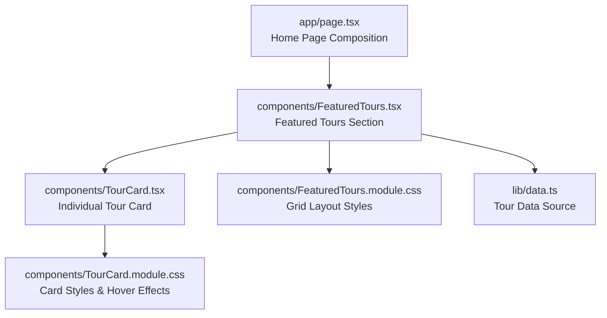
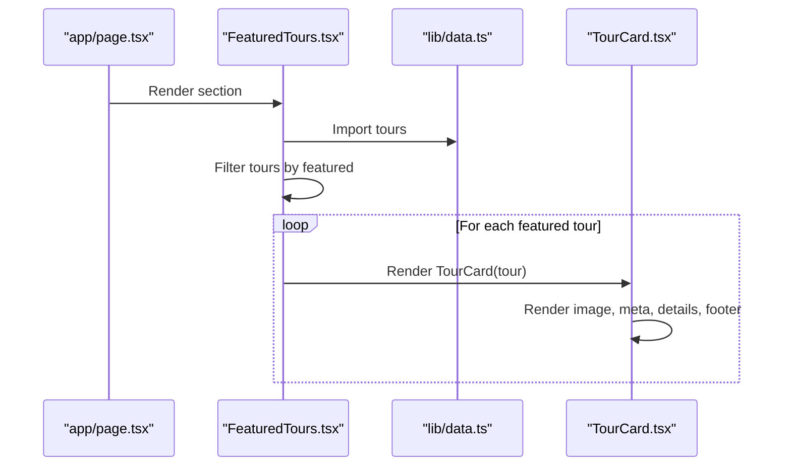
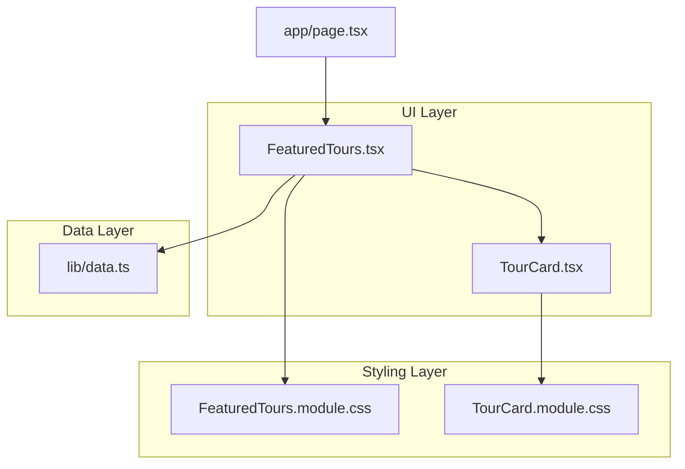
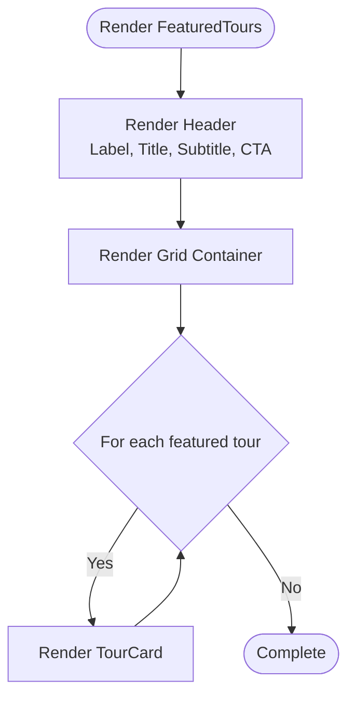
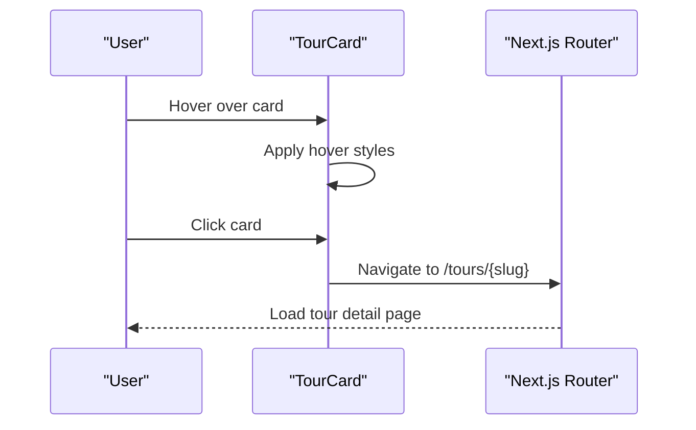

# Featured Tours

<cite>
**Referenced Files in This Document**
- [FeaturedTours.tsx](file://components/FeaturedTours.tsx)
- [FeaturedTours.module.css](file://components/FeaturedTours.module.css)
- [TourCard.tsx](file://components/TourCard.tsx)
- [TourCard.module.css](file://components/TourCard.module.css)
- [data.ts](file://lib/data.ts)
- [page.tsx](file://app/page.tsx)
</cite>

## Table of Contents
1. [Introduction](#introduction)
2. [Project Structure](#project-structure)
3. [Core Components](#core-components)
4. [Architecture Overview](#architecture-overview)
5. [Detailed Component Analysis](#detailed-component-analysis)
6. [Dependency Analysis](#dependency-analysis)
7. [Performance Considerations](#performance-considerations)
8. [Troubleshooting Guide](#troubleshooting-guide)
9. [Conclusion](#conclusion)

## Introduction
This document provides comprehensive technical documentation for the FeaturedTours component, which showcases premium tour offerings on the homepage. The component implements a grid-based layout system, integrates individual tour cards, and demonstrates responsive design patterns. It also documents the data flow from the centralized data source, tour object requirements, interactive elements, and the relationship with the TourCard component.

## Project Structure
The FeaturedTours component is part of the Next.js application and is integrated into the homepage layout. The component relies on shared data and styling modules to render a curated selection of featured tours.

**Diagram sources**
- [page.tsx:9-21](file://app/page.tsx#L9-L21)
- [FeaturedTours.tsx:8-33](file://components/FeaturedTours.tsx#L8-L33)
- [TourCard.tsx:21-62](file://components/TourCard.tsx#L21-L62)
- [FeaturedTours.module.css:1-38](file://components/FeaturedTours.module.css#L1-L38)
- [TourCard.module.css:1-173](file://components/TourCard.module.css#L1-L173)
- [data.ts:76-205](file://lib/data.ts#L76-L205)

**Section sources**
- [page.tsx:9-21](file://app/page.tsx#L9-L21)
- [FeaturedTours.tsx:8-33](file://components/FeaturedTours.tsx#L8-L33)
- [data.ts:76-205](file://lib/data.ts#L76-L205)

## Core Components
- FeaturedTours: Renders a header with a section label, title, and subtitle, plus a "View All Tours" link. It filters the tour dataset to display only featured items and renders them in a responsive grid layout using TourCard components.
- TourCard: Displays individual tour details including image, badge, region, rating, title, description, duration, group size, pricing, and a "Learn More" action. Implements hover effects and lazy-loading for images.
- Data Source: Provides categories and tours arrays, including tour metadata such as slug, title, category, region, duration, group size, price, rating, reviews, featured flag, badge, image, and description.

Key responsibilities:
- FeaturedTours: Filters tours by the featured property and orchestrates rendering within a grid container.
- TourCard: Encapsulates presentation and interactivity for a single tour, including navigation via slug.
- Data Source: Supplies structured tour objects and category metadata.

**Section sources**
- [FeaturedTours.tsx:8-33](file://components/FeaturedTours.tsx#L8-L33)
- [TourCard.tsx:21-62](file://components/TourCard.tsx#L21-L62)
- [data.ts:76-205](file://lib/data.ts#L76-L205)

## Architecture Overview
The FeaturedTours component follows a unidirectional data flow:
- Data is imported from lib/data.ts.
- FeaturedTours filters the tours array to select only featured items.
- Each featured tour is rendered as a TourCard component.
- TourCard handles its own presentation and navigation to the tour detail page.

**Diagram sources**
- [page.tsx:9-21](file://app/page.tsx#L9-L21)
- [FeaturedTours.tsx:8-33](file://components/FeaturedTours.tsx#L8-L33)
- [data.ts:76-205](file://lib/data.ts#L76-L205)
- [TourCard.tsx:21-62](file://components/TourCard.tsx#L21-L62)

## Detailed Component Analysis

### FeaturedTours Component
Purpose:
- Display a curated set of premium tours marked as featured.
- Provide a call-to-action to view all tours.
- Render a responsive grid of TourCard components.

Implementation highlights:
- Client-side rendering enabled via the directive.
- Imports the tours array from lib/data.ts.
- Filters tours where featured is true.
- Uses a container-based layout with a header and a grid section.
- Grid layout uses CSS Grid with responsive breakpoints.

Responsive design:
- Desktop: 4 columns.
- Tablet: 2 columns.
- Mobile: 1 column.

Interactive elements:
- "View All Tours" link navigates to the tours listing page.
- Individual TourCard links navigate to the tour detail page using the tour slug.

Filtering capability:
- Current implementation filters by the featured property.
- No runtime category filtering is implemented in this component.

Customization:
- The component can be adapted to support category-based filtering by extending the filter logic and adding UI controls.

**Section sources**
- [FeaturedTours.tsx:1-34](file://components/FeaturedTours.tsx#L1-L34)
- [FeaturedTours.module.css:27-37](file://components/FeaturedTours.module.css#L27-L37)
- [data.ts:76-205](file://lib/data.ts#L76-L205)

### TourCard Component
Purpose:
- Present a single tour with image, metadata, ratings, pricing, and navigation affordances.

Implementation highlights:
- Client-side rendering enabled.
- Accepts a tour prop conforming to the Tour interface.
- Renders:
  - Image with lazy loading and overlay.
  - Badge if present.
  - Region and rating metadata.
  - Title and description.
  - Duration and group size details.
  - Price display with "From" label and "/person" suffix.
  - "Learn More" action link.
- Hover effects:
  - Card lifts and gains shadow.
  - Image scales slightly.
  - Overlay fades to reveal an "Explore Tour" button.

Navigation:
- Wraps the entire card in a Next.js Link targeting `/tours/${slug}`.

Accessibility and UX:
- Lazy loading for images improves performance.
- Responsive typography and spacing.
- Clear visual hierarchy for pricing and details.

**Section sources**
- [TourCard.tsx:1-63](file://components/TourCard.tsx#L1-L63)
- [TourCard.module.css:1-173](file://components/TourCard.module.css#L1-L173)

### Data Model and Filtering
Tour object requirements:
- Required fields: slug, title, category, region, duration, groupSize, price, rating, reviews, image, description.
- Optional fields: badge, featured.
- Additional fields present in the dataset: highlights.

Filtering examples:
- Featured filtering: Select tours where featured is true.
- Category filtering: Select tours where category equals a target category ID.
- Sorting options:
  - By rating (descending).
  - By price (ascending or descending).
  - By duration (ascending).
  - By reviews count (descending).

Sorting implementation patterns:
- Use Array.sort with comparison functions.
- Combine with filtering to refine results.

Customization for different tour types:
- Add new fields to the Tour interface as needed.
- Extend TourCard to display additional attributes.
- Update filtering logic to handle new categories or properties.

**Section sources**
- [data.ts:76-205](file://lib/data.ts#L76-L205)
- [TourCard.tsx:6-19](file://components/TourCard.tsx#L6-L19)

### Responsive Design Patterns
FeaturedTours grid:
- Desktop: 4 columns with 24px gaps.
- Tablet: 2 columns with 24px gaps.
- Mobile: 1 column with stacked layout.

TourCard hover effects:
- Card lift and shadow increase on hover.
- Image scales slightly.
- Overlay reveals an animated "Explore Tour" button.

Media queries:
- Breakpoints at 1200px and 768px for FeaturedTours grid.
- Breakpoints at 1024px and 600px for related components.

**Section sources**
- [FeaturedTours.module.css:27-37](file://components/FeaturedTours.module.css#L27-L37)
- [TourCard.module.css:13-29](file://components/TourCard.module.css#L13-L29)
- [TourCard.module.css:126-129](file://components/TourCard.module.css#L126-L129)

## Architecture Overview
The FeaturedTours component integrates with the homepage layout and depends on shared data and styling modules. The component maintains a clear separation of concerns: data fetching/import, filtering, rendering, and styling.

**Diagram sources**
- [page.tsx:9-21](file://app/page.tsx#L9-L21)
- [FeaturedTours.tsx:8-33](file://components/FeaturedTours.tsx#L8-L33)
- [TourCard.tsx:21-62](file://components/TourCard.tsx#L21-L62)
- [data.ts:76-205](file://lib/data.ts#L76-L205)
- [FeaturedTours.module.css:1-38](file://components/FeaturedTours.module.css#L1-L38)
- [TourCard.module.css:1-173](file://components/TourCard.module.css#L1-L173)

## Detailed Component Analysis

### FeaturedTours Grid Layout
The grid layout is implemented using CSS Grid with responsive breakpoints:
- Desktop: 4 columns.
- Tablet: 2 columns.
- Mobile: 1 column.

The grid container uses a fixed gap of 24px between items. The header layout stacks vertically on smaller screens to improve readability.

**Diagram sources**
- [FeaturedTours.tsx:10-31](file://components/FeaturedTours.tsx#L10-L31)
- [FeaturedTours.module.css:27-37](file://components/FeaturedTours.module.css#L27-L37)

**Section sources**
- [FeaturedTours.tsx:25-29](file://components/FeaturedTours.tsx#L25-L29)
- [FeaturedTours.module.css:27-37](file://components/FeaturedTours.module.css#L27-L37)

### Tour Card Interaction Flow
The TourCard component implements hover-based interactions and navigation:
- Hover effect increases elevation and scales the image.
- Overlay reveals an animated "Explore Tour" button.
- Clicking anywhere on the card navigates to the tour detail page.

**Diagram sources**
- [TourCard.tsx:21-62](file://components/TourCard.tsx#L21-L62)
- [TourCard.module.css:13-29](file://components/TourCard.module.css#L13-L29)

**Section sources**
- [TourCard.tsx:21-62](file://components/TourCard.tsx#L21-L62)
- [TourCard.module.css:13-29](file://components/TourCard.module.css#L13-L29)

### Filtering and Sorting Options
Current implementation:
- Filtering: Only tours where featured is true are displayed.
- No runtime category filtering is implemented in FeaturedTours.

Proposed enhancements:
- Category filtering: Add a dropdown or category chips to filter by category ID.
- Sorting: Add sort controls to order by rating, price, duration, or reviews.

Example patterns:
- Category filter: Filter tours by category field equality.
- Rating sort: Sort by rating descending.
- Price sort: Sort by price ascending/descending.
- Reviews sort: Sort by reviews count descending.

These patterns can be implemented by extending the component state and re-rendering the grid accordingly.

**Section sources**
- [FeaturedTours.tsx:9](file://components/FeaturedTours.tsx#L9)
- [data.ts:76-205](file://lib/data.ts#L76-L205)

## Dependency Analysis
The FeaturedTours component has the following dependencies:
- Client directive enables client-side rendering.
- Next.js Link for navigation.
- TourCard component for rendering individual tours.
- lib/data.ts for tour data.
- FeaturedTours.module.css for layout and responsiveness.

Coupling and cohesion:
- Low coupling: Depends only on the data source and TourCard.
- High cohesion: Focused on rendering featured tours and grid layout.

Potential circular dependencies:
- None observed in the current structure.

External dependencies:
- lucide-react icons for UI elements.
- Next.js routing for navigation.

**Section sources**
- [FeaturedTours.tsx:1-6](file://components/FeaturedTours.tsx#L1-L6)
- [data.ts:76-205](file://lib/data.ts#L76-L205)

## Performance Considerations
- Lazy loading: TourCard images use lazy loading to reduce initial payload.
- CSS transitions: Smooth but minimal animations to avoid jank.
- Grid layout: Efficient CSS Grid rendering with fixed gaps.
- Data locality: Tours are imported statically, minimizing network requests.

Recommendations:
- Consider virtualizing the grid for large datasets.
- Optimize image sizes and formats for different breakpoints.
- Debounce search/filter inputs if additional UI controls are added.

## Troubleshooting Guide
Common issues and resolutions:
- Missing tour data: Ensure tours array is populated and includes featured items.
- Navigation errors: Verify slug values are unique and match route parameters.
- Styling inconsistencies: Confirm CSS modules are correctly scoped and media queries apply at intended breakpoints.
- Hover effects not working: Check CSS specificity and ensure hover selectors are not overridden.

Validation steps:
- Confirm the tours array contains entries with featured set to true.
- Verify TourCard receives a valid tour object with required fields.
- Inspect computed styles for hover states and grid layout.

**Section sources**
- [data.ts:76-205](file://lib/data.ts#L76-L205)
- [TourCard.tsx:21-62](file://components/TourCard.tsx#L21-L62)

## Conclusion
The FeaturedTours component provides a robust foundation for showcasing premium tours with a responsive grid layout and interactive tour cards. Its design promotes maintainability through clear separation of concerns and reusable components. Extending the component to support category filtering and advanced sorting would enhance user experience while preserving the existing architecture and styling patterns.