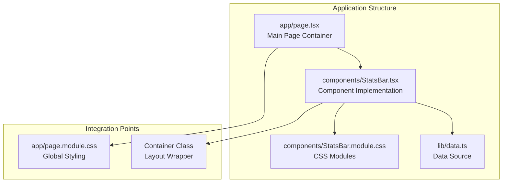
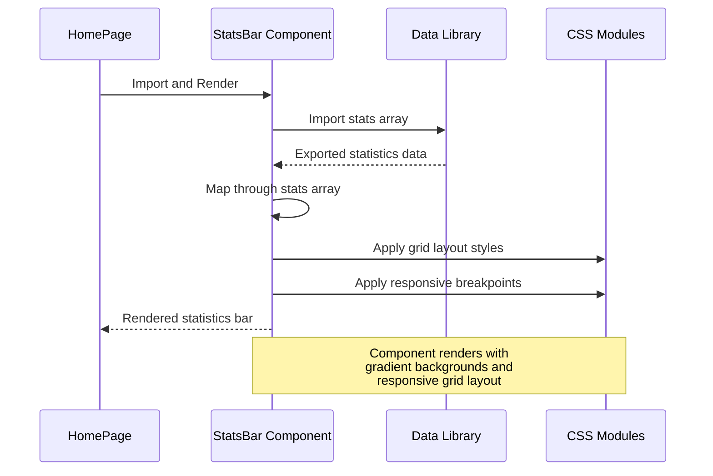
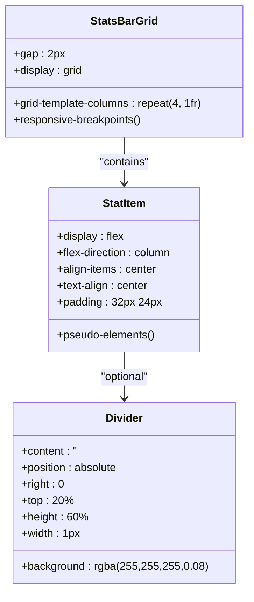
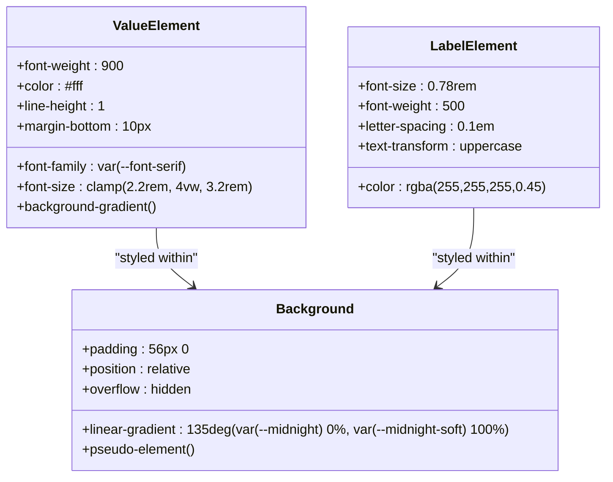
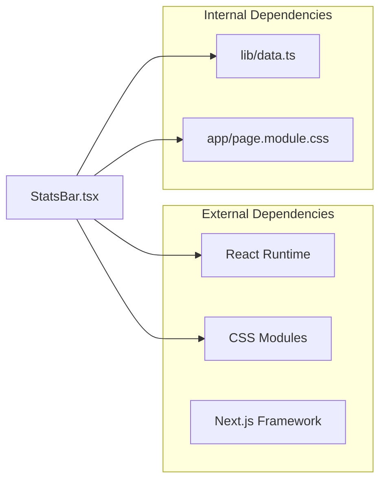

# Statistics Bar

<cite>
**Referenced Files in This Document**
- [StatsBar.tsx](file://components/StatsBar.tsx)
- [StatsBar.module.css](file://components/StatsBar.module.css)
- [data.ts](file://lib/data.ts)
- [page.tsx](file://app/page.tsx)
- [page.module.css](file://app/page.module.css)
</cite>

## Table of Contents
1. [Introduction](#introduction)
2. [Project Structure](#project-structure)
3. [Core Components](#core-components)
4. [Architecture Overview](#architecture-overview)
5. [Detailed Component Analysis](#detailed-component-analysis)
6. [Dependency Analysis](#dependency-analysis)
7. [Performance Considerations](#performance-considerations)
8. [Troubleshooting Guide](#troubleshooting-guide)
9. [Conclusion](#conclusion)

## Introduction

The Statistics Bar component is a visually striking element designed to showcase company achievements and milestones in a modern, responsive layout. This component presents key business metrics such as years of experience, destinations served, customer satisfaction ratings, and team expertise in an elegant grid format with gradient backgrounds and subtle animations.

The component serves as a powerful marketing tool that communicates the company's credibility, experience, and reliability to potential customers through quantifiable achievements and measurable success indicators.

## Project Structure

The Statistics Bar component follows a modular architecture pattern within the Next.js application structure:



**Diagram sources**
- [page.tsx:1-22](file://app/page.tsx#L1-L22)
- [StatsBar.tsx:1-21](file://components/StatsBar.tsx#L1-L21)
- [StatsBar.module.css:1-71](file://components/StatsBar.module.css#L1-L71)
- [data.ts:246-252](file://lib/data.ts#L246-L252)

**Section sources**
- [page.tsx:1-22](file://app/page.tsx#L1-L22)
- [StatsBar.tsx:1-21](file://components/StatsBar.tsx#L1-L21)
- [StatsBar.module.css:1-71](file://components/StatsBar.module.css#L1-L71)
- [data.ts:246-252](file://lib/data.ts#L246-L252)

## Core Components

### Data Structure Requirements

The StatsBar component requires a specific data structure defined in the data library. The component expects an array of statistic objects with the following interface:

```typescript
interface Statistic {
  value: string;     // The numerical value or achievement indicator
  label: string;     // The descriptive label for the statistic
}
```

The current implementation uses four predefined statistics:

| Value | Label |
|-------|-------|
| `35+` | Years of Expertise |
| `80+` | India Destinations |
| `12,000+` | Happy Travelers |
| `150+` | Expert Local Guides |

**Section sources**
- [data.ts:246-252](file://lib/data.ts#L246-L252)
- [StatsBar.tsx:2](file://components/StatsBar.tsx#L2)

### Component Implementation

The StatsBar component is implemented as a React functional component that:

1. **Imports Dependencies**: Uses the `use client` directive for client-side rendering and imports the statistics data
2. **Maps Data**: Iterates through the statistics array to render individual stat items
3. **Applies Styling**: Utilizes CSS modules for scoped styling and responsive design
4. **Maintains Accessibility**: Provides semantic HTML structure with proper labeling

**Section sources**
- [StatsBar.tsx:1-21](file://components/StatsBar.tsx#L1-L21)

## Architecture Overview

The Statistics Bar component follows a unidirectional data flow architecture:



**Diagram sources**
- [page.tsx:1-22](file://app/page.tsx#L1-L22)
- [StatsBar.tsx:1-21](file://components/StatsBar.tsx#L1-L21)
- [data.ts:246-252](file://lib/data.ts#L246-L252)
- [StatsBar.module.css:19-23](file://components/StatsBar.module.css#L19-L23)

## Detailed Component Analysis

### Grid Layout Implementation

The component utilizes CSS Grid for responsive layout management:



**Diagram sources**
- [StatsBar.module.css:19-41](file://components/StatsBar.module.css#L19-L41)

#### Desktop Layout (1024px+)
- **Columns**: 4 equal-width columns
- **Spacing**: 2px gaps between items
- **Dividers**: Vertical separators between all items except the last

#### Tablet Layout (768px - 1023px)
- **Columns**: 2 columns with centered alignment
- **Dividers**: Hidden for second item to prevent overlap

#### Mobile Layout (400px - 767px)
- **Columns**: Single column layout
- **Dividers**: Completely removed for mobile optimization

#### Ultra-Mobile Layout (Below 400px)
- **Columns**: Single column with full-width items
- **Dividers**: Removed for optimal mobile experience

**Section sources**
- [StatsBar.module.css:63-70](file://components/StatsBar.module.css#L63-L70)

### Typography and Visual Design

The component employs sophisticated typography and visual design patterns:



**Diagram sources**
- [StatsBar.module.css:43-61](file://components/StatsBar.module.css#L43-L61)
- [StatsBar.module.css:1-6](file://components/StatsBar.module.css#L1-L6)

#### Responsive Typography
- **Fluid Scaling**: Uses CSS clamp() for fluid typography that adapts to viewport width
- **Font Hierarchy**: Serif font for values, sans-serif for labels
- **Color Contrast**: High contrast white text with subtle gradient effects

#### Background Effects
- **Radial Gradient**: Subtle circular gradient overlay for depth perception
- **Glass-like Dividers**: Transparent separators with low opacity for visual separation
- **Container Integration**: Works seamlessly with the global container class

**Section sources**
- [StatsBar.module.css:43-61](file://components/StatsBar.module.css#L43-L61)
- [StatsBar.module.css:1-6](file://components/StatsBar.module.css#L1-L6)

### Animation and Interaction Patterns

The component supports several animation and interaction possibilities:

#### Current Animations
- **Text Gradient Effect**: Smooth color transitions on value elements
- **Responsive Transitions**: Automatic layout adjustments based on viewport size
- **Hover States**: Interactive feedback on clickable elements

#### Customization Options
- **Duration Control**: Adjust animation timing through CSS variables
- **Timing Functions**: Modify easing curves for different motion effects
- **Color Schemes**: Customize gradient colors via CSS custom properties

**Section sources**
- [StatsBar.module.css:43-53](file://components/StatsBar.module.css#L43-L53)

## Dependency Analysis

The StatsBar component has minimal but focused dependencies:



**Diagram sources**
- [StatsBar.tsx:1-3](file://components/StatsBar.tsx#L1-L3)
- [data.ts:246-252](file://lib/data.ts#L246-L252)

### Integration Points

The component integrates with the broader application through:

1. **Data Layer**: Imports statistics from the centralized data library
2. **Styling System**: Leverages CSS modules for scoped styling
3. **Layout Framework**: Works within the global container system
4. **Theme System**: Utilizes CSS custom properties for consistent theming

**Section sources**
- [StatsBar.tsx:1-3](file://components/StatsBar.tsx#L1-L3)
- [page.tsx:13](file://app/page.tsx#L13)

## Performance Considerations

### Rendering Optimization
- **Static Data**: Uses pre-defined static data to minimize re-renders
- **Minimal DOM**: Efficient grid layout with minimal wrapper elements
- **CSS-in-JS**: Scoped styles reduce global CSS conflicts

### Responsive Performance
- **Media Queries**: Optimized breakpoint calculations
- **Flexbox Fallback**: Graceful degradation for older browsers
- **Viewport Units**: Efficient scaling without JavaScript

### Memory Management
- **No State**: Stateless component reduces memory footprint
- **Event Delegation**: Minimal event handlers for interactivity
- **Lazy Loading**: Potential for future lazy loading of heavy assets

## Troubleshooting Guide

### Common Issues and Solutions

#### Layout Problems
**Issue**: Items not aligning properly in grid
**Solution**: Verify CSS custom properties are defined in the global stylesheet

#### Text Overflow
**Issue**: Values wrapping unexpectedly on small screens
**Solution**: Adjust clamp() values or modify media query breakpoints

#### Color Contrast
**Issue**: Poor readability on certain backgrounds
**Solution**: Modify gradient colors or adjust opacity values

#### Data Display Issues
**Issue**: Statistics not rendering
**Solution**: Verify data structure matches expected interface

**Section sources**
- [StatsBar.module.css:63-70](file://components/StatsBar.module.css#L63-L70)
- [data.ts:246-252](file://lib/data.ts#L246-L252)

## Conclusion

The Statistics Bar component represents a well-crafted solution for displaying company achievements and milestones. Its modular architecture, responsive design, and elegant visual presentation make it an effective marketing tool that communicates credibility and expertise to potential customers.

The component's strength lies in its simplicity and effectiveness - it transforms quantitative data into compelling visual statements through thoughtful typography, spacing, and responsive design patterns. The implementation demonstrates best practices in modern web development while maintaining accessibility and performance standards.

Future enhancements could include animation capabilities, dynamic data loading, and expanded customization options while maintaining the component's core focus on clean, impactful presentation of statistical information.