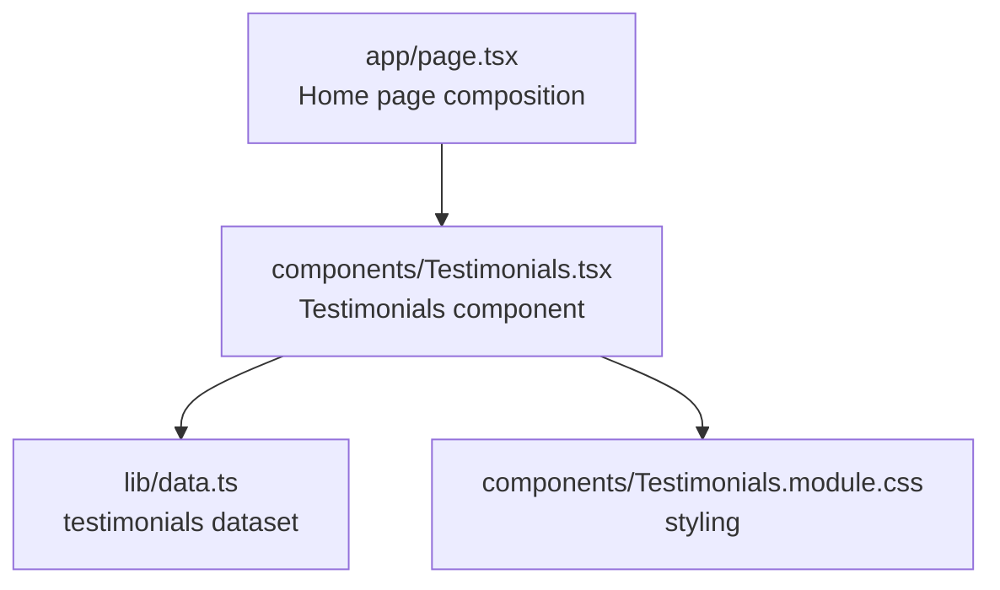
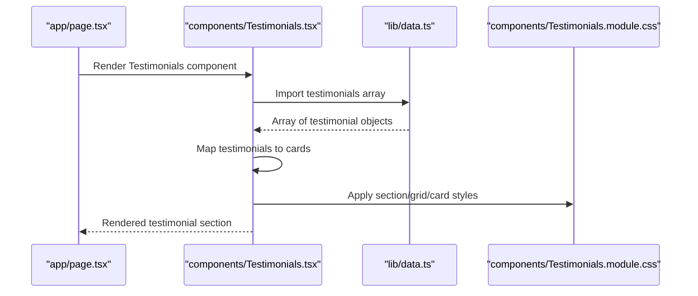
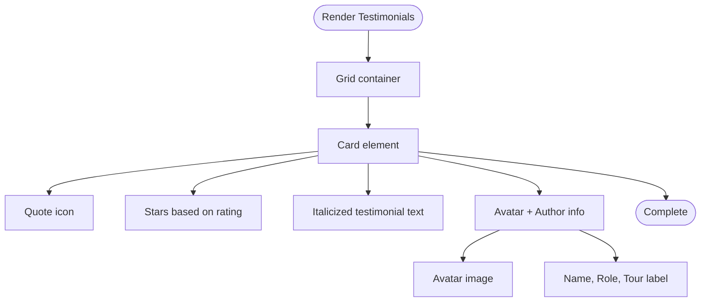
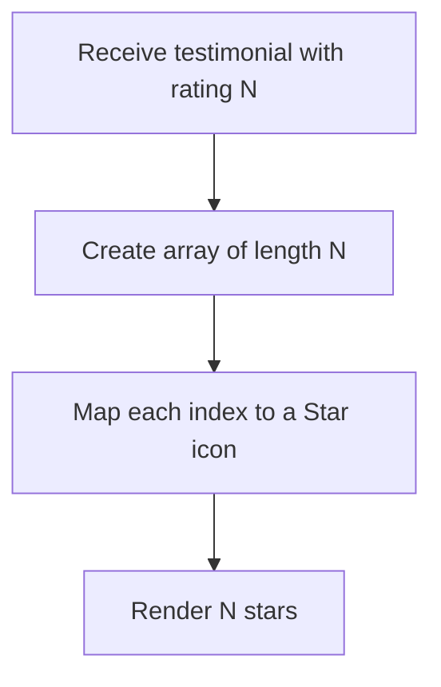
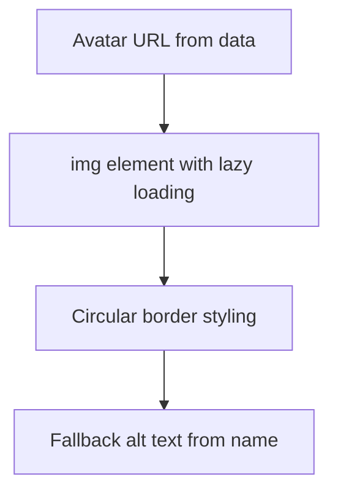
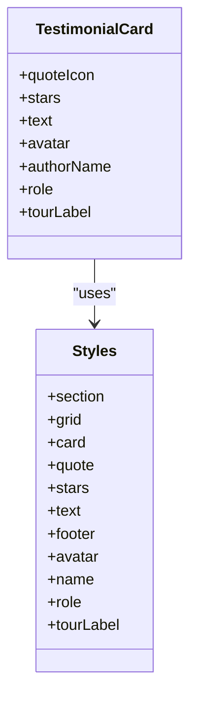
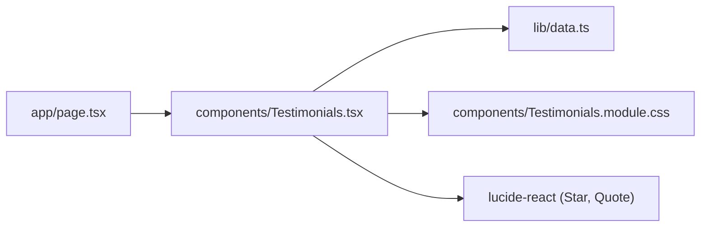

# Testimonials

<cite>
**Referenced Files in This Document**
- [Testimonials.tsx](file://components/Testimonials.tsx)
- [Testimonials.module.css](file://components/Testimonials.module.css)
- [data.ts](file://lib/data.ts)
- [page.tsx](file://app/page.tsx)
</cite>

## Table of Contents
1. [Introduction](#introduction)
2. [Project Structure](#project-structure)
3. [Core Components](#core-components)
4. [Architecture Overview](#architecture-overview)
5. [Detailed Component Analysis](#detailed-component-analysis)
6. [Dependency Analysis](#dependency-analysis)
7. [Performance Considerations](#performance-considerations)
8. [Troubleshooting Guide](#troubleshooting-guide)
9. [Conclusion](#conclusion)

## Introduction
This document describes the Testimonials component that renders guest stories and feedback. It explains how testimonials are structured, how ratings are visualized with star icons, how avatars are handled, and how content is formatted. It also documents the data model for testimonials, responsive layout patterns, and how the component integrates into the homepage. Where applicable, it outlines potential enhancements for interactive features such as review expansion or carousel navigation, and how filtering and rating calculations could be implemented.

## Project Structure
The Testimonials component is a self-contained UI module that renders a grid of testimonial cards. It imports static data from a centralized data file and applies modular CSS for styling. The component is integrated into the homepage layout.

**Diagram sources**
- [page.tsx:1-22](file://app/page.tsx#L1-L22)
- [Testimonials.tsx:1-41](file://components/Testimonials.tsx#L1-L41)
- [data.ts:207-244](file://lib/data.ts#L207-L244)
- [Testimonials.module.css:1-101](file://components/Testimonials.module.css#L1-L101)

**Section sources**
- [page.tsx:1-22](file://app/page.tsx#L1-L22)
- [Testimonials.tsx:1-41](file://components/Testimonials.tsx#L1-L41)
- [data.ts:207-244](file://lib/data.ts#L207-L244)
- [Testimonials.module.css:1-101](file://components/Testimonials.module.css#L1-L101)

## Core Components
- Testimonials component: Renders a section with a header and a grid of testimonial cards. Each card displays a quote icon, stars based on rating, the testimonial text, and a footer with avatar, name, role, and tour label.
- Styling: Modular CSS defines typography, spacing, hover effects, and responsive grid behavior.
- Data: Static testimonials dataset with fields for identity, author, role, avatar URL, tour, rating, and text.

Key implementation references:
- Rendering loop and card structure: [Testimonials.tsx:16-36](file://components/Testimonials.tsx#L16-L36)
- Rating visualization: [Testimonials.tsx:20-24](file://components/Testimonials.tsx#L20-L24)
- Avatar and metadata: [Testimonials.tsx:26-33](file://components/Testimonials.tsx#L26-L33)
- Responsive grid: [Testimonials.module.css:21-25](file://components/Testimonials.module.css#L21-L25)
- Mobile layout: [Testimonials.module.css:98-100](file://components/Testimonials.module.css#L98-L100)

**Section sources**
- [Testimonials.tsx:16-36](file://components/Testimonials.tsx#L16-L36)
- [Testimonials.tsx:20-24](file://components/Testimonials.tsx#L20-L24)
- [Testimonials.tsx:26-33](file://components/Testimonials.tsx#L26-L33)
- [Testimonials.module.css:21-25](file://components/Testimonials.module.css#L21-L25)
- [Testimonials.module.css:98-100](file://components/Testimonials.module.css#L98-L100)

## Architecture Overview
The Testimonials component follows a unidirectional data flow:
- Data source: lib/data.ts exports a testimonials array.
- Presentation: Testimonials.tsx imports the array and renders each item into a card.
- Styling: Testimonials.module.css provides scoped styles for the section, grid, cards, and responsive breakpoints.

**Diagram sources**
- [page.tsx:1-22](file://app/page.tsx#L1-L22)
- [Testimonials.tsx:1-41](file://components/Testimonials.tsx#L1-L41)
- [data.ts:207-244](file://lib/data.ts#L207-L244)
- [Testimonials.module.css:1-101](file://components/Testimonials.module.css#L1-L101)

## Detailed Component Analysis

### Testimonial Card Layout
Each testimonial card includes:
- Header area with decorative quote icon and star rating visualization.
- Body with italicized testimonial text.
- Footer with avatar image, author name, role, and tour label.

**Diagram sources**
- [Testimonials.tsx:16-36](file://components/Testimonials.tsx#L16-L36)
- [Testimonials.module.css:27-39](file://components/Testimonials.module.css#L27-L39)

**Section sources**
- [Testimonials.tsx:16-36](file://components/Testimonials.tsx#L16-L36)
- [Testimonials.module.css:27-39](file://components/Testimonials.module.css#L27-L39)

### Rating Visualization with Star Icons
The component renders a row of filled star icons proportional to the numeric rating value. The implementation uses a dynamic array mapped to individual star elements.

**Diagram sources**
- [Testimonials.tsx:20-24](file://components/Testimonials.tsx#L20-L24)

**Section sources**
- [Testimonials.tsx:20-24](file://components/Testimonials.tsx#L20-L24)

### User Avatar Handling
Avatars are rendered as images with lazy loading and rounded borders. The alt text is derived from the author’s name.

**Diagram sources**
- [Testimonials.tsx:27](file://components/Testimonials.tsx#L27)
- [Testimonials.module.css:71-78](file://components/Testimonials.module.css#L71-L78)

**Section sources**
- [Testimonials.tsx:27](file://components/Testimonials.tsx#L27)
- [Testimonials.module.css:71-78](file://components/Testimonials.module.css#L71-L78)

### Content Formatting
- Quote icon: Decorative and thematic, styled with a muted color.
- Stars: Colored gold with tight spacing.
- Text: Italicized, family display, moderate line height for readability.
- Footer: Flex layout with avatar and stacked metadata.

**Diagram sources**
- [Testimonials.tsx:18-33](file://components/Testimonials.tsx#L18-L33)
- [Testimonials.module.css:1-101](file://components/Testimonials.module.css#L1-L101)

**Section sources**
- [Testimonials.tsx:18-33](file://components/Testimonials.tsx#L18-L33)
- [Testimonials.module.css:1-101](file://components/Testimonials.module.css#L1-L101)

### Data Model for Testimonial Objects
The testimonials dataset defines each testimonial with the following fields:
- id: Unique identifier for the testimonial.
- name: Author’s name.
- role: Professional or personal title/affiliation.
- avatar: URL to the author’s avatar image.
- tour: Name of the tour associated with the testimonial.
- rating: Numeric rating used for star visualization.
- text: The testimonial content.

Example definition reference:
- [data.ts:207-244](file://lib/data.ts#L207-L244)

Fields and usage:
- Rendering loop key: [Testimonials.tsx:17](file://components/Testimonials.tsx#L17)
- Avatar source: [Testimonials.tsx:27](file://components/Testimonials.tsx#L27)
- Metadata display: [Testimonials.tsx:28-32](file://components/Testimonials.tsx#L28-L32)
- Rating-driven stars: [Testimonials.tsx:20-24](file://components/Testimonials.tsx#L20-L24)

**Section sources**
- [data.ts:207-244](file://lib/data.ts#L207-L244)
- [Testimonials.tsx:17](file://components/Testimonials.tsx#L17)
- [Testimonials.tsx:20-24](file://components/Testimonials.tsx#L20-L24)
- [Testimonials.tsx:27](file://components/Testimonials.tsx#L27)
- [Testimonials.tsx:28-32](file://components/Testimonials.tsx#L28-L32)

### Responsive Layout Patterns
- Desktop: Two-column grid layout for testimonial cards.
- Tablet/Mobile: Single-column grid to fit smaller screens.

Breakpoint reference:
- [Testimonials.module.css:98-100](file://components/Testimonials.module.css#L98-L100)

Hover and interaction:
- Cards lift slightly and gain shadow on hover for subtle interactivity.

Hover effect reference:
- [Testimonials.module.css:36-39](file://components/Testimonials.module.css#L36-L39)

**Section sources**
- [Testimonials.module.css:21-25](file://components/Testimonials.module.css#L21-L25)
- [Testimonials.module.css:98-100](file://components/Testimonials.module.css#L98-L100)
- [Testimonials.module.css:36-39](file://components/Testimonials.module.css#L36-L39)

### Interactive Elements
Current behavior:
- No interactive expansion or collapse of testimonials.
- No carousel navigation controls.

Potential enhancements:
- Expand/collapse: Add a button to toggle full text visibility for long testimonials.
- Carousel: Implement arrow buttons and indicators for horizontal scrolling through cards.
- Filtering: Add controls to filter by tour or rating thresholds.

These are conceptual suggestions and not present in the current codebase.

[No sources needed since this section provides conceptual enhancements]

### Review Filtering and Rating Calculations
Conceptual examples:
- Filtering by tour: Filter testimonials whose tour matches a selected value.
- Filtering by rating: Keep testimonials where rating equals or exceeds a threshold.
- Rating calculation: Compute average rating across testimonials or by tour.

Implementation notes:
- Filtering would require state and event handlers in the component.
- Rating calculations can be performed on the imported dataset.

[No sources needed since this section provides conceptual guidance]

### Social Proof Integration
- The component showcases authentic guest stories and expert ratings.
- Pairing testimonials with tour ratings and badges can reinforce trust.

Reference for external social proof context:
- [WhyUs.tsx:78](file://components/WhyUs.tsx#L78)

**Section sources**
- [WhyUs.tsx:78](file://components/WhyUs.tsx#L78)

## Dependency Analysis
The Testimonials component depends on:
- Static data from lib/data.ts.
- Modular CSS for styling.
- Icon libraries for star and quote visuals.

**Diagram sources**
- [Testimonials.tsx:1-41](file://components/Testimonials.tsx#L1-L41)
- [data.ts:207-244](file://lib/data.ts#L207-L244)
- [Testimonials.module.css:1-101](file://components/Testimonials.module.css#L1-L101)
- [page.tsx:1-22](file://app/page.tsx#L1-L22)

**Section sources**
- [Testimonials.tsx:1-41](file://components/Testimonials.tsx#L1-L41)
- [data.ts:207-244](file://lib/data.ts#L207-L244)
- [Testimonials.module.css:1-101](file://components/Testimonials.module.css#L1-L101)
- [page.tsx:1-22](file://app/page.tsx#L1-L22)

## Performance Considerations
- Image lazy loading: Avatars use lazy loading to improve initial render performance.
- Minimal DOM: Each card is a lightweight structure with a small number of elements.
- CSS transitions: Hover effects use simple transforms and shadows; keep animations subtle for mobile devices.

References:
- Lazy loading: [Testimonials.tsx:27](file://components/Testimonials.tsx#L27)
- Hover transitions: [Testimonials.module.css:34-39](file://components/Testimonials.module.css#L34-L39)

**Section sources**
- [Testimonials.tsx:27](file://components/Testimonials.tsx#L27)
- [Testimonials.module.css:34-39](file://components/Testimonials.module.css#L34-L39)

## Troubleshooting Guide
Common issues and resolutions:
- Missing avatar image: Ensure avatar URLs are valid and accessible. Lazy loading will still render the fallback behavior if the image fails.
- Star rendering mismatch: Verify that rating values are integers within the expected range and that the mapping logic aligns with the intended number of stars.
- Layout overflow on small screens: Confirm the responsive breakpoint is triggered and adjust grid column counts if needed.

References:
- Avatar rendering: [Testimonials.tsx:27](file://components/Testimonials.tsx#L27)
- Star mapping: [Testimonials.tsx:20-24](file://components/Testimonials.tsx#L20-L24)
- Responsive grid: [Testimonials.module.css:98-100](file://components/Testimonials.module.css#L98-L100)

**Section sources**
- [Testimonials.tsx:27](file://components/Testimonials.tsx#L27)
- [Testimonials.tsx:20-24](file://components/Testimonials.tsx#L20-L24)
- [Testimonials.module.css:98-100](file://components/Testimonials.module.css#L98-L100)

## Conclusion
The Testimonials component presents a clean, responsive showcase of guest experiences. It uses a simple data model, straightforward star visualization, and accessible avatar handling. The modular CSS ensures consistent styling and responsive behavior. While the current implementation focuses on static presentation, future enhancements such as expand/collapse, carousel navigation, filtering, and rating computations can be added to increase interactivity and enable richer social proof strategies.