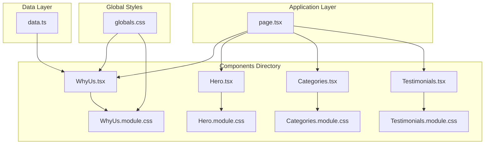
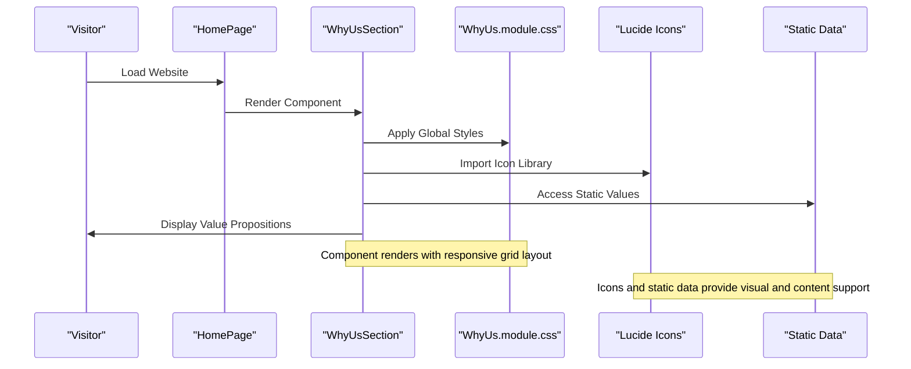
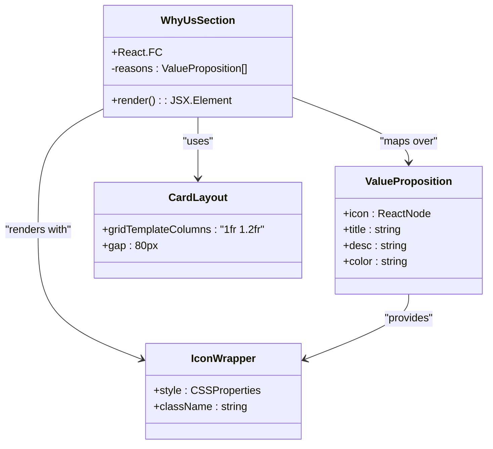
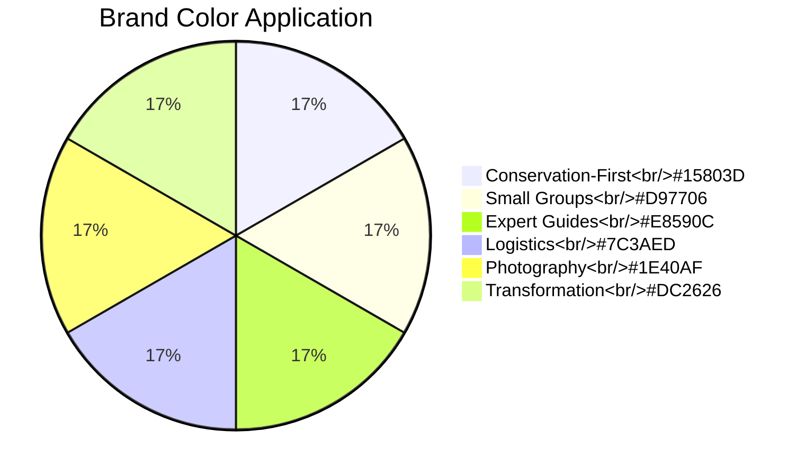
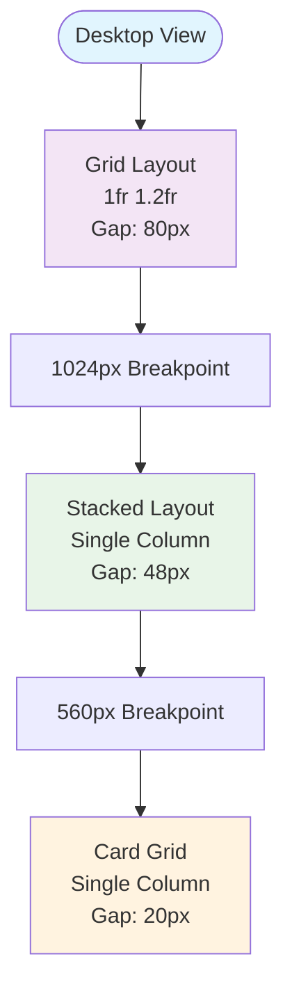

# Why Us Section

<cite>
**Referenced Files in This Document**
- [WhyUs.tsx](file://components/WhyUs.tsx)
- [WhyUs.module.css](file://components/WhyUs.module.css)
- [globals.css](file://app/globals.css)
- [page.tsx](file://app/page.tsx)
- [data.ts](file://lib/data.ts)
</cite>

## Table of Contents
1. [Introduction](#introduction)
2. [Project Structure](#project-structure)
3. [Core Components](#core-components)
4. [Architecture Overview](#architecture-overview)
5. [Detailed Component Analysis](#detailed-component-analysis)
6. [Value Proposition System](#value-proposition-system)
7. [Visual Design Elements](#visual-design-elements)
8. [Responsive Layout Implementation](#responsive-layout-implementation)
9. [Integration with Brand Messaging](#integration-with-brand-messaging)
10. [Customization Guidelines](#customization-guidelines)
11. [Performance Considerations](#performance-considerations)
12. [Troubleshooting Guide](#troubleshooting-guide)
13. [Conclusion](#conclusion)

## Introduction

The Why Us Section is a critical component of NatIndia's marketing strategy, designed to communicate the company's core values and competitive advantages to potential customers. This component serves as a powerful differentiator in the Indian tourism market by showcasing six key value propositions that set NatIndia apart from conventional tour operators.

The component employs a sophisticated design system that combines meaningful icons, color-coded visual elements, and compelling copywriting to create an immersive experience that demonstrates why travelers should choose NatIndia for their Indian adventure holidays. It positions the company as a conservation-focused, expert-led, and transformative travel experience provider.

## Project Structure

The Why Us Section is organized within the components directory alongside other marketing-focused sections of the website. The component follows Next.js conventions with dedicated TypeScript and CSS files for optimal separation of concerns.



**Diagram sources**
- [WhyUs.tsx:1-101](file://components/WhyUs.tsx#L1-L101)
- [page.tsx:1-22](file://app/page.tsx#L1-L22)
- [globals.css:1-190](file://app/globals.css#L1-L190)

**Section sources**
- [WhyUs.tsx:1-101](file://components/WhyUs.tsx#L1-L101)
- [page.tsx:1-22](file://app/page.tsx#L1-L22)

## Core Components

The Why Us Section consists of two primary structural elements that work together to create a cohesive value proposition presentation:

### Left Panel Content Area
The left panel serves as the narrative foundation, establishing NatIndia's positioning and building trust through:
- **Section Label**: "Why NatIndia" with branded typography
- **Primary Heading**: "The NatIndia Difference" communicating unique value
- **Brand Story**: Three decades of expertise and commitment to meaningful travel
- **Partnership Statement**: Emphasizing exclusive access through local connections
- **Trust Elements**: Visual proof through curated imagery and customer ratings

### Right Grid Value Cards
The right panel presents six distinct value propositions through a responsive grid system, each featuring:
- **Icon Integration**: Lucide React icons representing each value area
- **Color-Coded Identity**: Unique accent colors for visual distinction
- **Title and Description**: Concise, benefit-focused copy
- **Hover Interactions**: Subtle animations enhancing user engagement

**Section sources**
- [WhyUs.tsx:44-100](file://components/WhyUs.tsx#L44-L100)
- [WhyUs.module.css:6-103](file://components/WhyUs.module.css#L6-L103)

## Architecture Overview

The Why Us Section follows a modular architecture pattern that integrates seamlessly with NatIndia's overall design system while maintaining flexibility for future enhancements.



**Diagram sources**
- [page.tsx:9-21](file://app/page.tsx#L9-L21)
- [WhyUs.tsx:1-3](file://components/WhyUs.tsx#L1-L3)
- [WhyUs.tsx:44-100](file://components/WhyUs.tsx#L44-L100)

The architecture demonstrates clear separation of concerns:
- **Presentation Logic**: Component handles rendering and user interactions
- **Styling System**: CSS modules provide scoped styling with global theme integration
- **Content Management**: Static data arrays define the value proposition structure
- **Icon System**: External library provides consistent visual elements

## Detailed Component Analysis

### Component Structure and Data Flow

The Why Us Section utilizes a centralized data structure that defines all six value propositions, each containing icon, title, description, and color information.



**Diagram sources**
- [WhyUs.tsx:5-42](file://components/WhyUs.tsx#L5-L42)
- [WhyUs.tsx:84-94](file://components/WhyUs.tsx#L84-L94)

### Value Proposition Data Structure

Each value proposition follows a consistent structure that enables easy modification and extension:

| Property | Type | Purpose | Example |
|----------|------|---------|---------|
| `icon` | ReactNode | Visual representation of value area | `<Leaf size={28} />` |
| `title` | string | Benefit-focused headline | "Conservation-First Travel" |
| `desc` | string | Detailed explanation of value | "Every journey directly supports..." |
| `color` | string | Brand color for visual identity | "#15803D" |

**Section sources**
- [WhyUs.tsx:5-42](file://components/WhyUs.tsx#L5-L42)

### Styling Architecture

The component leverages a comprehensive CSS module system that integrates with the global design system:

```mermaid
graph LR
subgraph "Global Theme Variables"
A[--saffron<br/>--forest<br/>--midnight<br/>--muted]
end
subgraph "Component Styles"
B[.section<br/>.layout<br/>.left<br/>.right]
C[.card<br/>.iconWrap<br/>.title<br/>.body]
end
subgraph "Responsive Breakpoints"
D[@media 1024px<br/>@media 560px]
end
A --> B
A --> C
B --> D
```

**Diagram sources**
- [globals.css:3-42](file://app/globals.css#L3-L42)
- [WhyUs.module.css:1-103](file://components/WhyUs.module.css#L1-L103)

**Section sources**
- [WhyUs.module.css:1-103](file://components/WhyUs.module.css#L1-L103)
- [globals.css:1-190](file://app/globals.css#L1-L190)

## Value Proposition System

### Six Core Value Areas

The Why Us Section presents six distinct value propositions that collectively differentiate NatIndia from competitors:

#### 1. Conservation-First Travel
**Icon**: Leaf  
**Focus**: Environmental stewardship and sustainability  
**Differentiator**: Direct financial contribution to conservation efforts  
**Message**: "Every journey directly supports wildlife and cultural preservation"

#### 2. Intimate Small Groups  
**Icon**: Users  
**Focus**: Personalized experience quality  
**Differentiator**: Limited group sizes for exclusivity  
**Message**: "Maximum 12 guests per tour — ensuring personal attention"

#### 3. World-Class Expert Guides
**Icon**: Star  
**Focus**: Professional excellence and expertise  
**Differentiator**: Extensive field experience and local connections  
**Message**: "Naturalists average 15+ years in the field"

#### 4. Meticulous Logistics
**Icon**: Shield  
**Focus**: Operational excellence and reliability  
**Differentiator**: Comprehensive service coordination  
**Message**: "Every detail is arranged for seamless experience"

#### 5. Unrivalled Photographic Access
**Icon**: Camera  
**Focus**: Visual documentation capabilities  
**Differentiator**: Exclusive access and professional guidance  
**Message**: "Early morning safaris and expert photo coaching"

#### 6. Transformative Experiences
**Icon**: Heart  
**Focus**: Emotional and personal impact  
**Differentiator**: Life-changing connections and insights  
**Message**: "Guests return more connected to India and the planet"

### Value Statement Formatting Patterns

Each value proposition follows a consistent formatting pattern that maximizes impact:

**Structure**: Icon + Title + Description + Color Accent
**Typography**: Hierarchical scaling with emphasis on benefits
**Visual Hierarchy**: Clear progression from headline to supporting details
**Brand Integration**: Consistent color coding that reinforces brand identity

**Section sources**
- [WhyUs.tsx:5-42](file://components/WhyUs.tsx#L5-L42)

## Visual Design Elements

### Color System Integration

The Why Us Section implements a sophisticated color system that enhances both visual appeal and brand recognition:



**Diagram sources**
- [WhyUs.tsx:10-41](file://components/WhyUs.tsx#L10-L41)

### Icon Integration Strategy

The component utilizes Lucide React icons to create immediate visual recognition and enhance comprehension:

| Icon | Value Area | Symbolism | Implementation |
|------|------------|-----------|----------------|
| Leaf | Conservation | Growth, nature, sustainability | Primary green palette |
| Users | Community | People, exclusivity, connection | Warm orange accents |
| Star | Excellence | Quality, achievement, expertise | Rich red-orange blend |
| Shield | Protection | Security, reliability, care | Purple/blue gradient |
| Camera | Documentation | Memory, photography, experience | Deep blue tones |
| Heart | Transformation | Connection, emotion, impact | Bold red accent |

### Interactive Elements

The component incorporates subtle interactive elements that enhance user engagement without overwhelming the content:

**Hover Effects**: Cards lift slightly with enhanced shadow depth
**Transition Timing**: Smooth 0.3-second transitions with spring easing
**Visual Feedback**: Consistent motion patterns across all interactive elements

**Section sources**
- [WhyUs.module.css:60-74](file://components/WhyUs.module.css#L60-L74)

## Responsive Layout Implementation

### Mobile-First Design Approach

The Why Us Section implements a sophisticated responsive design system that adapts seamlessly across all device sizes:



**Diagram sources**
- [WhyUs.module.css:101-103](file://components/WhyUs.module.css#L101-L103)

### Breakpoint Specifications

The responsive system employs strategic breakpoints that optimize content presentation:

| Breakpoint | Device Type | Layout Change | Impact |
|------------|-------------|---------------|---------|
| 1024px | Tablets/Laptops | Stacked layout | Improves readability |
| 560px | Mobile Phones | Single column grid | Optimizes touch interaction |

### Typography Responsiveness

The component utilizes CSS clamp() functions for fluid typography that scales appropriately across devices:

**Title Scaling**: `clamp(1.9rem, 3vw, 2.6rem)` ensures optimal readability
**Body Text**: Consistent 1rem base with 1.75 line height for readability
**Card Typography**: Reduced scale (0.95rem for titles, 0.82rem for descriptions)

**Section sources**
- [WhyUs.module.css:16-27](file://components/WhyUs.module.css#L16-L27)
- [WhyUs.module.css:101-103](file://components/WhyUs.module.css#L101-L103)

## Integration with Brand Messaging

### Brand Positioning Alignment

The Why Us Section aligns perfectly with NatIndia's established brand positioning:

**Core Message**: "We don't show you India — we let you feel it"
**Target Audience**: Curious, passionate, and bold travelers seeking meaningful experiences
**Competitive Differentiation**: Conservation focus, expert guides, small groups, exclusive access

### Visual Brand Reinforcement

The component reinforces brand identity through consistent use of:

**Color Palette**: Integration with established saffron and gold branding
**Typography**: Alignment with Playfair Display and Inter font families
**Layout Philosophy**: Symmetry and balance reflecting Indian aesthetic principles

### Trust Building Elements

Multiple trust indicators reinforce credibility:

**Customer Ratings**: "★ 4.9 / 5 from 12,000+ guests" establishes social proof
**Visual Evidence**: Curated imagery of wildlife, culture, and heritage
**Partnership Emphasis**: Highlighting exclusive access through local connections

**Section sources**
- [WhyUs.tsx:54-79](file://components/WhyUs.tsx#L54-L79)
- [globals.css:4-21](file://app/globals.css#L4-L21)

## Customization Guidelines

### Adding New Value Propositions

To add new value propositions while maintaining design consistency:

1. **Data Structure Extension**: Add new object to reasons array with icon, title, desc, and color
2. **Color Selection**: Choose from existing brand palette or request new color
3. **Icon Selection**: Use Lucide React icons for consistency
4. **Content Validation**: Ensure benefit-focused, concise messaging

### Modifying Existing Elements

Customization options include:

**Typography Changes**: Adjust font sizes and weights through CSS variables
**Color Modifications**: Update brand colors in global CSS variables
**Layout Adjustments**: Modify grid gaps and column ratios
**Interactive Elements**: Customize hover effects and transitions

### Content Structure Requirements

Each value proposition must meet these structural requirements:

**Minimum Information**: Icon + Title + Description + Color
**Content Quality**: Benefit-focused, action-oriented language
**Length Constraints**: Titles under 25 characters, descriptions under 120 words
**Accessibility**: Proper alt text for all images and icons

**Section sources**
- [WhyUs.tsx:5-42](file://components/WhyUs.tsx#L5-L42)
- [WhyUs.module.css:60-99](file://components/WhyUs.module.css#L60-L99)

## Performance Considerations

### Optimization Strategies

The Why Us Section implements several performance optimization techniques:

**Bundle Size**: Minimal external dependencies (only lucide-react icons)
**Rendering Efficiency**: Static data structure reduces re-rendering needs
**CSS Optimization**: Modular CSS prevents style conflicts and improves caching
**Image Loading**: Lazy loading through CDN delivery for trust imagery

### Loading Performance

**Critical Rendering Path**: Essential content loads above the fold immediately
**Resource Prioritization**: Non-critical elements deferred for later loading
**Cache Strategy**: Static assets cached for optimal repeat visits

### Accessibility Features

The component includes built-in accessibility considerations:

**Semantic HTML**: Proper heading hierarchy and structural elements
**Color Contrast**: Sufficient contrast ratios for all text elements
**Keyboard Navigation**: Hover effects complement focus states
**Screen Reader**: Descriptive alt text for all visual elements

## Troubleshooting Guide

### Common Issues and Solutions

**Icon Display Problems**:
- Verify lucide-react installation and import statements
- Check icon sizing and color inheritance
- Ensure proper React node rendering

**Layout Issues**:
- Confirm CSS module import and class name correctness
- Verify container class application
- Check media query breakpoint functionality

**Color Inconsistencies**:
- Validate CSS variable definitions in globals.css
- Ensure color property precedence in CSS custom properties
- Check for conflicting style declarations

**Responsive Behavior**:
- Test breakpoint functionality across device widths
- Verify grid layout adaptation
- Confirm typography scaling across devices

### Debugging Tools

Recommended debugging approaches:

**React DevTools**: Inspect component props and state
**Browser Developer Tools**: Examine computed styles and layout
**CSS Debugging**: Use element highlighting for layout verification
**Performance Profiling**: Monitor rendering performance and bundle size

**Section sources**
- [WhyUs.tsx:1-3](file://components/WhyUs.tsx#L1-L3)
- [WhyUs.module.css:1-103](file://components/WhyUs.module.css#L1-L103)

## Conclusion

The Why Us Section represents a masterful integration of design, content, and technology that effectively communicates NatIndia's unique value proposition to potential customers. Through its strategic use of icons, color-coded value areas, and responsive design, the component successfully differentiates NatIndia from competitors while reinforcing brand identity.

The component's modular architecture ensures maintainability and scalability, while its performance optimizations guarantee smooth user experience across all devices. By following the established patterns and customization guidelines, teams can extend the component's functionality while maintaining design consistency and brand alignment.

This implementation serves as a model for effective digital storytelling in the travel industry, demonstrating how thoughtful design and strategic content placement can create compelling narratives that drive customer engagement and conversion.