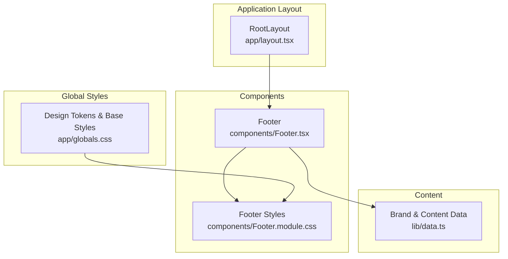
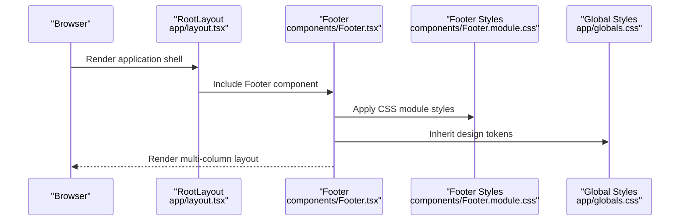
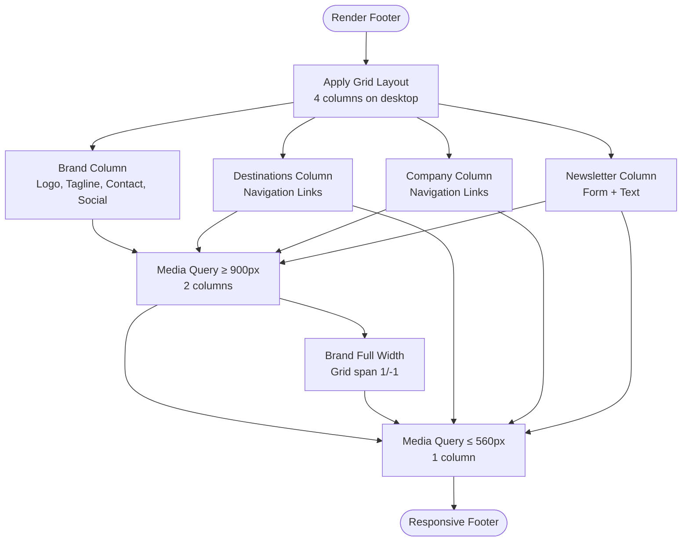
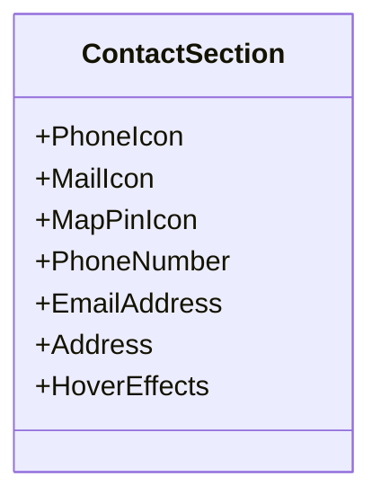
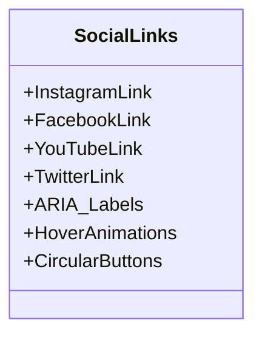
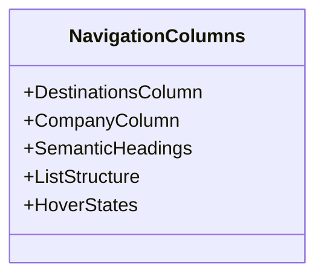
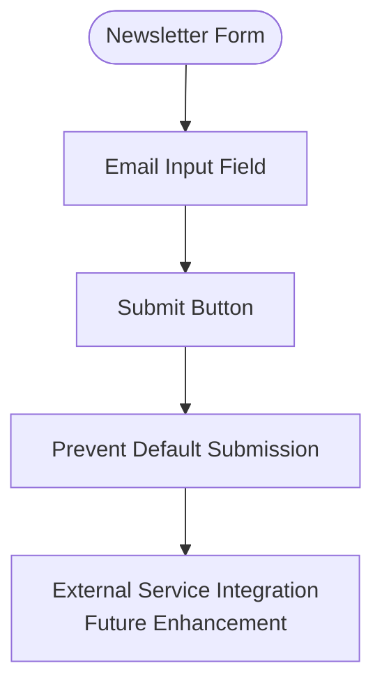
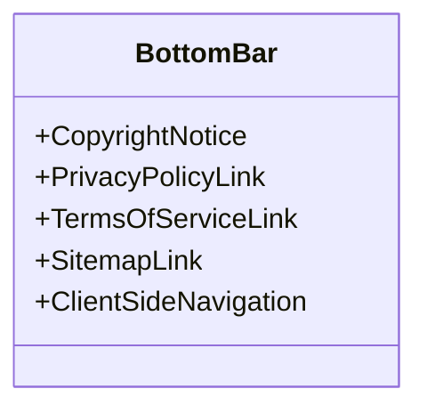
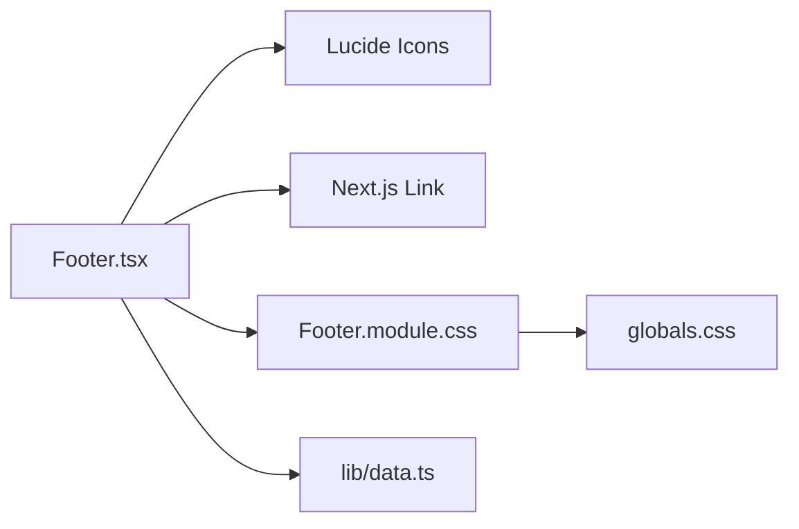

# Footer System

<cite>
**Referenced Files in This Document**
- [Footer.tsx](file://components/Footer.tsx)
- [Footer.module.css](file://components/Footer.module.css)
- [layout.tsx](file://app/layout.tsx)
- [globals.css](file://app/globals.css)
- [data.ts](file://lib/data.ts)
- [page.tsx](file://app/page.tsx)
</cite>

## Table of Contents
1. [Introduction](#introduction)
2. [Project Structure](#project-structure)
3. [Core Components](#core-components)
4. [Architecture Overview](#architecture-overview)
5. [Detailed Component Analysis](#detailed-component-analysis)
6. [Dependency Analysis](#dependency-analysis)
7. [Performance Considerations](#performance-considerations)
8. [Troubleshooting Guide](#troubleshooting-guide)
9. [Conclusion](#conclusion)

## Introduction
This document provides comprehensive documentation for the Footer component system used across the NatIndia travel website. The Footer serves as a multi-column layout that communicates brand identity, provides navigation aids, displays contact information, integrates social media channels, and manages newsletter subscriptions. It is designed with responsive behavior, accessibility considerations, and brand consistency in mind, integrating seamlessly with the broader Next.js application architecture.

## Project Structure
The Footer system is implemented as a standalone React component with dedicated CSS module styling. It is integrated into the application layout so that it appears consistently across all pages.

**Diagram sources**
- [layout.tsx:17-27](file://app/layout.tsx#L17-L27)
- [Footer.tsx:25-103](file://components/Footer.tsx#L25-L103)
- [Footer.module.css:1-164](file://components/Footer.module.css#L1-L164)
- [globals.css:3-42](file://app/globals.css#L3-L42)
- [data.ts:1-252](file://lib/data.ts#L1-L252)

**Section sources**
- [layout.tsx:17-27](file://app/layout.tsx#L17-L27)
- [Footer.tsx:25-103](file://components/Footer.tsx#L25-L103)
- [Footer.module.css:1-164](file://components/Footer.module.css#L1-L164)
- [globals.css:3-42](file://app/globals.css#L3-L42)
- [data.ts:1-252](file://lib/data.ts#L1-L252)

## Core Components
The Footer component is composed of several distinct sections:
- Top accent band for brand visibility
- Main content area with brand identity, contact information, social links, destination and company navigation columns, and a newsletter subscription form
- Bottom bar containing legal links and copyright notice

Key implementation characteristics:
- Uses a CSS Grid layout for the main content area with responsive breakpoints
- Implements accessibility attributes for social media links
- Integrates with Next.js Link components for internal navigation
- Leverages design tokens from global CSS for consistent theming

**Section sources**
- [Footer.tsx:25-103](file://components/Footer.tsx#L25-L103)
- [Footer.module.css:18-164](file://components/Footer.module.css#L18-L164)
- [globals.css:3-42](file://app/globals.css#L3-L42)

## Architecture Overview
The Footer is rendered within the application layout and participates in the page lifecycle as a persistent element. It does not rely on external service integrations for its core functionality, though it is designed to accommodate future newsletter integration.

**Diagram sources**
- [layout.tsx:17-27](file://app/layout.tsx#L17-L27)
- [Footer.tsx:25-103](file://components/Footer.tsx#L25-L103)
- [Footer.module.css:1-164](file://components/Footer.module.css#L1-L164)
- [globals.css:3-42](file://app/globals.css#L3-L42)

## Detailed Component Analysis

### Multi-Column Layout Implementation
The main content area uses a CSS Grid with four columns on larger screens and progressively fewer columns on smaller devices. The layout ensures the brand section spans the full width on medium screens and stacks on mobile.

**Diagram sources**
- [Footer.module.css:18-164](file://components/Footer.module.css#L18-L164)

**Section sources**
- [Footer.module.css:18-164](file://components/Footer.module.css#L18-L164)

### Contact Information Display
The contact section presents phone, email, and physical address using iconography and hover effects. Links are implemented with semantic HTML anchors for accessibility and SEO benefits.

**Diagram sources**
- [Footer.tsx:40-50](file://components/Footer.tsx#L40-L50)
- [Footer.module.css:49-59](file://components/Footer.module.css#L49-L59)

**Section sources**
- [Footer.tsx:40-50](file://components/Footer.tsx#L40-L50)
- [Footer.module.css:49-59](file://components/Footer.module.css#L49-L59)

### Social Media Integration
Social links are presented as circular buttons with hover animations and ARIA labels for accessibility. The icons are sourced from the Lucide React library.

**Diagram sources**
- [Footer.tsx:51-56](file://components/Footer.tsx#L51-L56)
- [Footer.module.css:61-74](file://components/Footer.module.css#L61-L74)

**Section sources**
- [Footer.tsx:51-56](file://components/Footer.tsx#L51-L56)
- [Footer.module.css:61-74](file://components/Footer.module.css#L61-L74)

### Navigation Columns
Two navigation columns provide quick access to destinations and company information. Both use semantic headings and list structures for improved accessibility.

**Diagram sources**
- [Footer.tsx:60-75](file://components/Footer.tsx#L60-L75)
- [Footer.module.css:77-94](file://components/Footer.module.css#L77-L94)

**Section sources**
- [Footer.tsx:60-75](file://components/Footer.tsx#L60-L75)
- [Footer.module.css:77-94](file://components/Footer.module.css#L77-L94)

### Newsletter Functionality
The newsletter form includes an email input field and a submit button. The form currently prevents default submission behavior, indicating it is designed to integrate with external newsletter services in the future.

**Diagram sources**
- [Footer.tsx:77-86](file://components/Footer.tsx#L77-L86)

**Section sources**
- [Footer.tsx:77-86](file://components/Footer.tsx#L77-L86)

### Legal Information Display
The bottom bar contains copyright information and links to privacy policy, terms of service, and sitemap. These links use Next.js Link components for client-side navigation.

**Diagram sources**
- [Footer.tsx:89-100](file://components/Footer.tsx#L89-L100)
- [Footer.module.css:139-154](file://components/Footer.module.css#L139-L154)

**Section sources**
- [Footer.tsx:89-100](file://components/Footer.tsx#L89-L100)
- [Footer.module.css:139-154](file://components/Footer.module.css#L139-L154)

### Responsive Design Approach
The Footer implements a tiered responsive strategy:
- Desktop: Four-column grid layout
- Tablet: Two-column layout with brand spanning full width
- Mobile: Single-column stacked layout with centered bottom bar

Breakpoints are defined at 900px and 560px, with corresponding CSS media queries.

**Section sources**
- [Footer.module.css:156-163](file://components/Footer.module.css#L156-L163)

### Accessibility Features
Accessibility considerations implemented in the Footer:
- ARIA labels for social media links
- Semantic HTML structure with headings and lists
- Focus-visible states and keyboard navigation support
- Color contrast maintained against dark background
- Hover states provide clear visual feedback

**Section sources**
- [Footer.tsx:51-56](file://components/Footer.tsx#L51-L56)
- [Footer.module.css:62-74](file://components/Footer.module.css#L62-L74)

### Integration with External Services
The Footer is designed to integrate with external services:
- Newsletter form is prepared for external service integration
- Social media links are placeholders for actual platform URLs
- Contact information is structured for easy linking

**Section sources**
- [Footer.tsx:77-86](file://components/Footer.tsx#L77-L86)
- [Footer.tsx:51-56](file://components/Footer.tsx#L51-L56)
- [Footer.tsx:40-50](file://components/Footer.tsx#L40-L50)

### Role in Navigation Aids and Brand Consistency
The Footer contributes to navigation and brand consistency by:
- Providing secondary navigation paths to key content areas
- Maintaining consistent typography and color scheme
- Reinforcing brand identity through logo and tagline
- Ensuring legal compliance through required links

**Section sources**
- [Footer.tsx:25-103](file://components/Footer.tsx#L25-L103)
- [Footer.module.css:1-164](file://components/Footer.module.css#L1-L164)

## Dependency Analysis
The Footer component has minimal external dependencies and relies on the Next.js ecosystem and design tokens.

**Diagram sources**
- [Footer.tsx:1-4](file://components/Footer.tsx#L1-L4)
- [Footer.tsx:25-103](file://components/Footer.tsx#L25-L103)
- [Footer.module.css:1-164](file://components/Footer.module.css#L1-L164)
- [globals.css:3-42](file://app/globals.css#L3-L42)
- [data.ts:1-252](file://lib/data.ts#L1-L252)

**Section sources**
- [Footer.tsx:1-4](file://components/Footer.tsx#L1-L4)
- [Footer.tsx:25-103](file://components/Footer.tsx#L25-L103)
- [Footer.module.css:1-164](file://components/Footer.module.css#L1-L164)
- [globals.css:3-42](file://app/globals.css#L3-L42)
- [data.ts:1-252](file://lib/data.ts#L1-L252)

## Performance Considerations
- The Footer uses CSS Grid for efficient layout rendering
- Minimal JavaScript execution reduces runtime overhead
- Icon components are imported statically for predictable bundle size
- CSS animations are scoped to the top band to minimize reflows
- Responsive breakpoints are optimized for common device widths

## Troubleshooting Guide
Common issues and resolutions:
- Newsletter form not submitting: The form prevents default submission to enable external service integration
- Social media links not opening: Replace placeholder URLs with actual platform links
- Contact links not working: Verify tel: and mailto: protocols are supported by the browser
- Responsive layout not applying: Ensure container classes are properly applied in parent layouts
- Color contrast issues: Adjust theme variables in globals.css to meet accessibility guidelines

**Section sources**
- [Footer.tsx:77-86](file://components/Footer.tsx#L77-L86)
- [Footer.tsx:51-56](file://components/Footer.tsx#L51-L56)
- [Footer.tsx:40-50](file://components/Footer.tsx#L40-L50)
- [Footer.module.css:156-163](file://components/Footer.module.css#L156-L163)
- [globals.css:3-42](file://app/globals.css#L3-L42)

## Conclusion
The Footer component system provides a robust foundation for navigation, brand communication, and legal compliance across the NatIndia website. Its responsive design, accessibility features, and integration-ready structure support both current functionality and future enhancements. The component's modular architecture and consistent use of design tokens ensure maintainability and scalability across different page contexts.