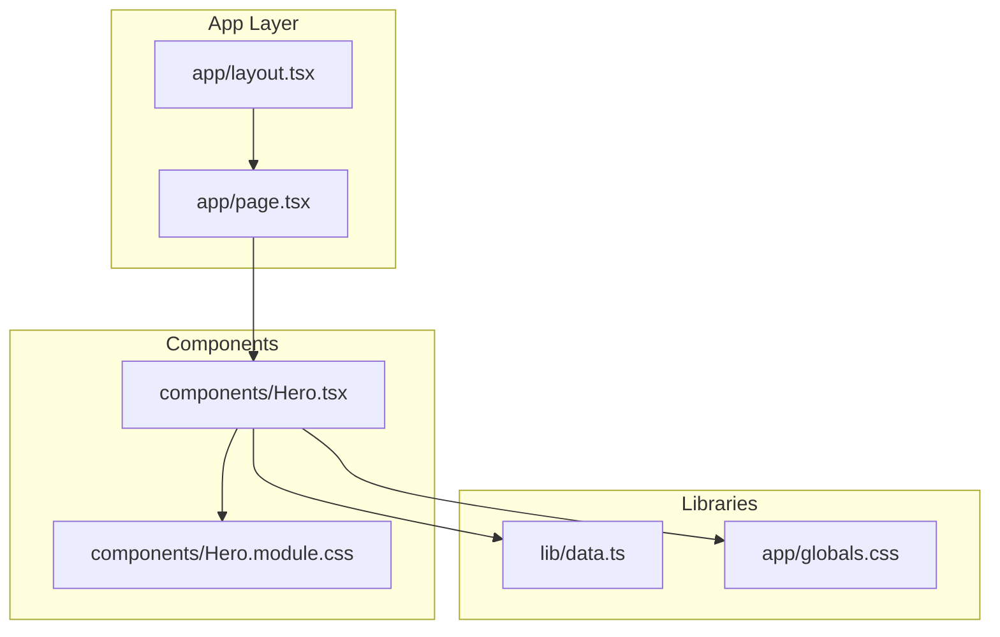
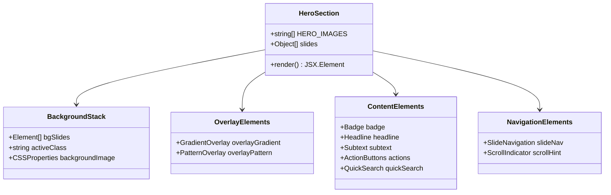
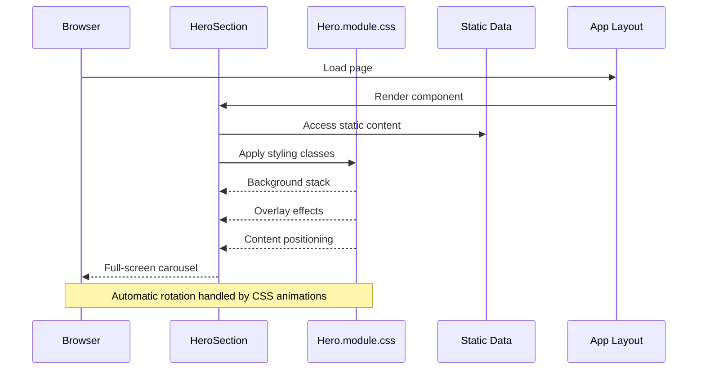
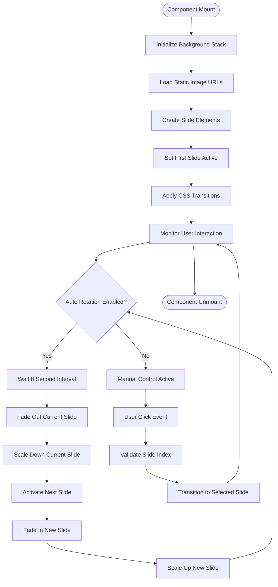
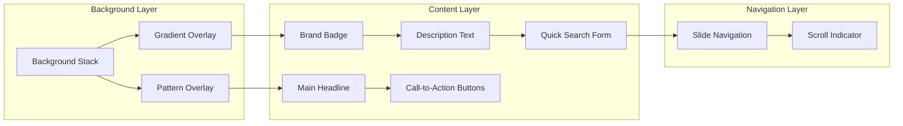
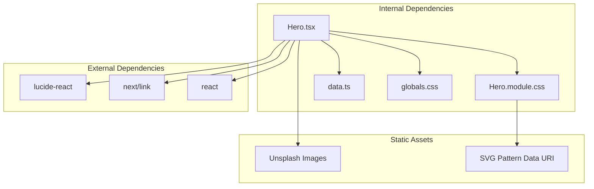
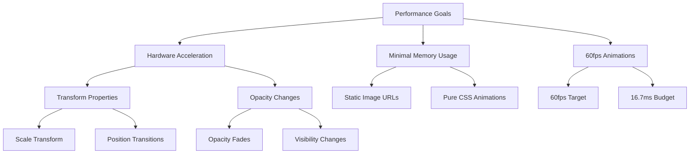

# Hero Section

<cite>
**Referenced Files in This Document**
- [Hero.tsx](file://components/Hero.tsx)
- [Hero.module.css](file://components/Hero.module.css)
- [globals.css](file://app/globals.css)
- [page.tsx](file://app/page.tsx)
- [layout.tsx](file://app/layout.tsx)
- [data.ts](file://lib/data.ts)
</cite>

## Table of Contents
1. [Introduction](#introduction)
2. [Project Structure](#project-structure)
3. [Core Components](#core-components)
4. [Architecture Overview](#architecture-overview)
5. [Detailed Component Analysis](#detailed-component-analysis)
6. [Dependency Analysis](#dependency-analysis)
7. [Performance Considerations](#performance-considerations)
8. [Troubleshooting Guide](#troubleshooting-guide)
9. [Conclusion](#conclusion)

## Introduction

The Hero component serves as the flagship landing page element for NatIndia's travel experience, featuring a full-screen carousel with automatic rotation, manual controls, and sophisticated background image management. This component showcases India's diverse tourism offerings through stunning imagery while maintaining excellent performance and responsive design characteristics.

The implementation demonstrates modern React patterns with Next.js App Router, utilizing CSS Modules for scoped styling and leveraging the design system established in the global CSS variables. The component integrates seamlessly with the overall application architecture while providing an engaging user experience.

## Project Structure

The Hero component follows a modular architecture pattern within the Next.js application structure:

**Diagram sources**
- [layout.tsx:17-27](file://app/layout.tsx#L17-L27)
- [page.tsx:9-21](file://app/page.tsx#L9-L21)
- [Hero.tsx:1-4](file://components/Hero.tsx#L1-L4)

**Section sources**
- [layout.tsx:17-27](file://app/layout.tsx#L17-L27)
- [page.tsx:9-21](file://app/page.tsx#L9-L21)

## Core Components

### HeroSection Component Structure

The Hero component consists of several interconnected elements that work together to create a cohesive full-screen experience:

**Diagram sources**
- [Hero.tsx:6-18](file://components/Hero.tsx#L6-L18)
- [Hero.tsx:20-99](file://components/Hero.tsx#L20-L99)

### Key Data Structures

The component utilizes predefined data structures for content management:

| Data Type | Structure | Purpose |
|-----------|-----------|---------|
| HERO_IMAGES | Array of URLs | Background carousel images |
| slides | Array of Objects | Carousel slide metadata |
| Individual Slide | `{label, title, subtitle, link}` | Slide content definition |

**Section sources**
- [Hero.tsx:6-18](file://components/Hero.tsx#L6-L18)

## Architecture Overview

The Hero component implements a layered architecture with clear separation of concerns:

**Diagram sources**
- [Hero.tsx:20-99](file://components/Hero.tsx#L20-L99)
- [Hero.module.css:11-28](file://components/Hero.module.css#L11-L28)

The architecture emphasizes performance through pure CSS animations and minimal JavaScript intervention, ensuring smooth 60fps transitions across devices.

## Detailed Component Analysis

### Background Image Management System

The background carousel system employs a sophisticated stacking mechanism with CSS transitions:

**Diagram sources**
- [Hero.tsx:24-32](file://components/Hero.tsx#L24-L32)
- [Hero.module.css:16-28](file://components/Hero.module.css#L16-L28)

### Animation Implementation Details

The carousel employs carefully crafted CSS animations for optimal performance:

| Property | Duration | Easing | Effect |
|----------|----------|--------|--------|
| Opacity Transition | 1.2s | ease | Smooth fade between slides |
| Transform Scale | 8s | ease | Subtle zoom effect during transitions |
| Scroll Indicator | 2s | infinite | Continuous loading animation |

**Section sources**
- [Hero.module.css:23](file://components/Hero.module.css#L23)
- [Hero.module.css:243-246](file://components/Hero.module.css#L243-L246)

### Content Management System

The component manages multiple content layers with distinct styling approaches:

**Diagram sources**
- [Hero.tsx:22-99](file://components/Hero.tsx#L22-L99)
- [Hero.module.css:31-48](file://components/Hero.module.css#L31-L48)

**Section sources**
- [Hero.tsx:39-80](file://components/Hero.tsx#L39-L80)

### Quick Search Integration

The quick search functionality provides immediate access to tour content:

| Element | Styling Class | Functionality |
|---------|---------------|---------------|
| Search Icon | `.qsIcon` | Visual indicator |
| Input Field | `.qsInput` | Text input for search terms |
| Search Button | `.qsBtn` | Navigation to tour results |
| Container | `.quickSearch` | Flexible container with blur effect |

**Section sources**
- [Hero.tsx:68-79](file://components/Hero.tsx#L68-L79)
- [Hero.module.css:128-171](file://components/Hero.module.css#L128-L171)

## Dependency Analysis

### External Dependencies

The Hero component maintains minimal external dependencies:

**Diagram sources**
- [Hero.tsx:1-4](file://components/Hero.tsx#L1-L4)
- [globals.css:3-42](file://app/globals.css#L3-L42)

### Design System Integration

The component seamlessly integrates with the established design system:

| Design Aspect | Implementation | Benefits |
|---------------|----------------|----------|
| Color Palette | CSS Variables (--saffron, --gold) | Consistent branding |
| Typography | Font families via variables | Cohesive typography |
| Spacing | Container max-width | Responsive layout |
| Animations | CSS transitions | Hardware acceleration |

**Section sources**
- [globals.css:3-42](file://app/globals.css#L3-L42)
- [Hero.module.css:35-40](file://components/Hero.module.css#L35-L40)

## Performance Considerations

### Animation Performance

The component achieves optimal performance through strategic animation choices:

**Diagram sources**
- [Hero.module.css:23](file://components/Hero.module.css#L23)
- [Hero.module.css:24](file://components/Hero.module.css#L24)

### Responsive Design Implementation

The component adapts gracefully across device sizes:

| Breakpoint | Changes | Impact |
|------------|---------|--------|
| 768px | Hide slide navigation | Simplified interface |
| 768px | Hide scroll indicators | Reduced visual clutter |
| 768px | Adjust headline sizing | Improved readability |
| Mobile Optimizations | Reduced padding | Better mobile experience |

**Section sources**
- [Hero.module.css:248-253](file://components/Hero.module.css#L248-L253)

### Image Loading Strategy

The implementation uses optimized image URLs from Unsplash with appropriate dimensions and quality settings to balance visual quality with loading performance.

## Troubleshooting Guide

### Common Issues and Solutions

| Issue | Symptoms | Solution |
|-------|----------|----------|
| Background Images Not Loading | Blank carousel area | Verify image URLs are accessible |
| Animation Stuttering | Choppy transitions | Check hardware acceleration support |
| Mobile Responsiveness | Content overlapping | Review media query breakpoints |
| Color Consistency | Brand colors inconsistent | Verify CSS variable definitions |

### Performance Monitoring

Key metrics to monitor:
- Animation frame rate (target: 60fps)
- Memory usage during image transitions
- Initial load time for background images
- Mobile device performance metrics

**Section sources**
- [Hero.module.css:23](file://components/Hero.module.css#L23)
- [Hero.module.css:24](file://components/Hero.module.css#L24)

## Conclusion

The Hero component represents a sophisticated implementation of modern web design principles, combining aesthetic appeal with technical excellence. Through careful consideration of performance, accessibility, and user experience, the component delivers an engaging introduction to NatIndia's travel offerings while maintaining optimal performance characteristics.

The modular architecture ensures maintainability and extensibility, while the integration with the design system guarantees consistency across the entire application. The component serves as an excellent foundation for future enhancements and demonstrates best practices for React component development in Next.js applications.