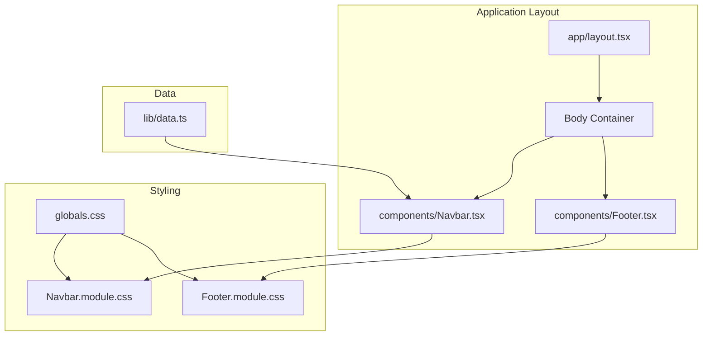
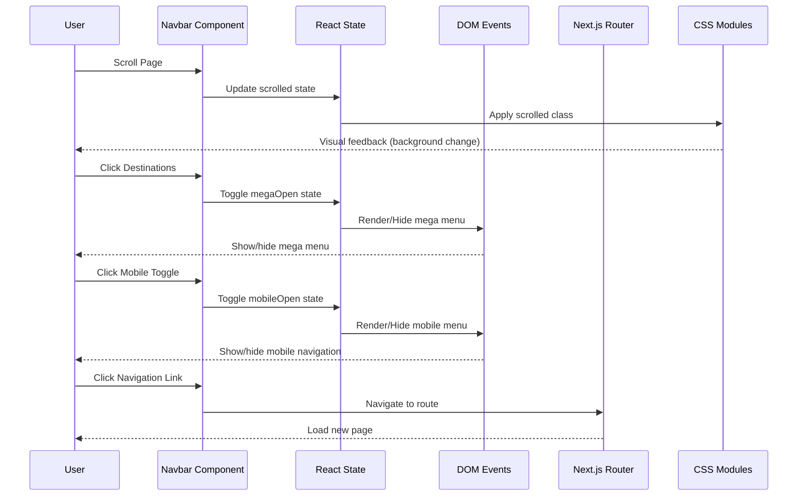
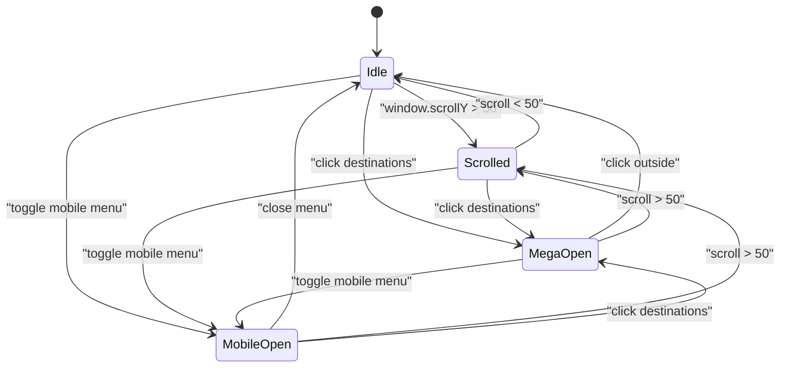
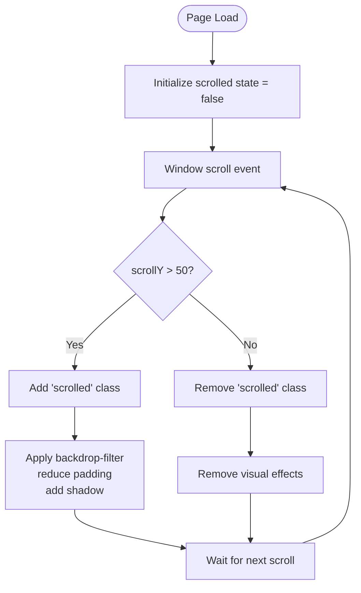
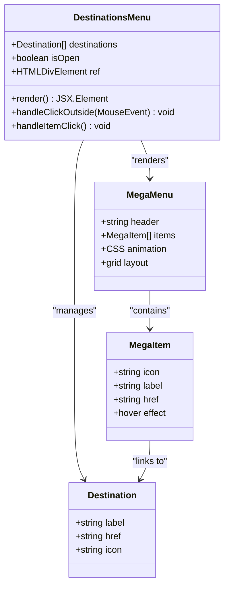
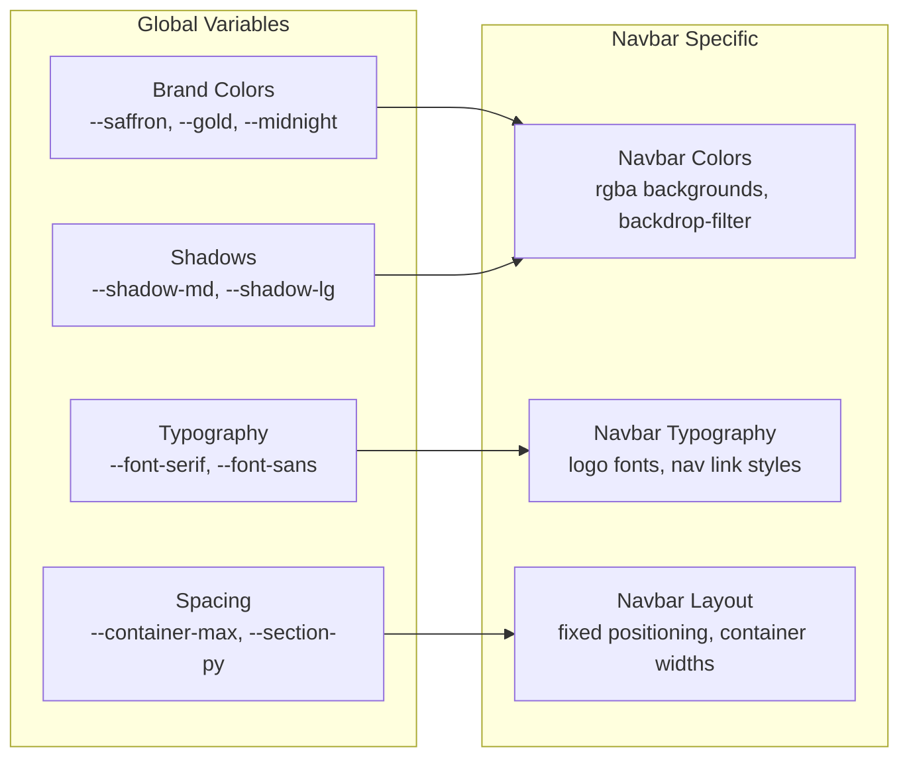
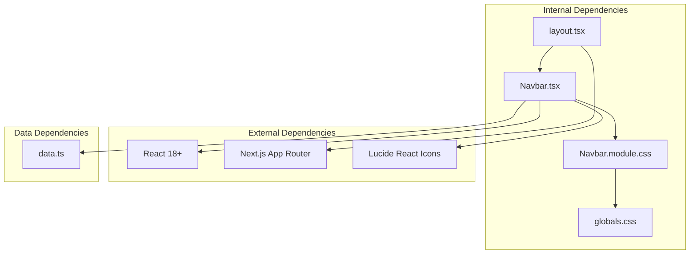

# Navigation System

<cite>
**Referenced Files in This Document**
- [Navbar.tsx](file://components/Navbar.tsx)
- [Navbar.module.css](file://components/Navbar.module.css)
- [layout.tsx](file://app/layout.tsx)
- [globals.css](file://app/globals.css)
- [data.ts](file://lib/data.ts)
- [Footer.tsx](file://components/Footer.tsx)
- [Footer.module.css](file://components/Footer.module.css)
</cite>

## Table of Contents
1. [Introduction](#introduction)
2. [Project Structure](#project-structure)
3. [Core Components](#core-components)
4. [Architecture Overview](#architecture-overview)
5. [Detailed Component Analysis](#detailed-component-analysis)
6. [Dependency Analysis](#dependency-analysis)
7. [Performance Considerations](#performance-considerations)
8. [Troubleshooting Guide](#troubleshooting-guide)
9. [Conclusion](#conclusion)

## Introduction
This document provides comprehensive documentation for the navigation system architecture, focusing on the Navbar component implementation. It covers state management for mobile responsiveness, scroll effects, and mega-menu functionality. The documentation explains how the component coordinates with Next.js routing, handles user interactions, maintains accessibility standards, and integrates with the overall layout structure. It also includes examples of navigation state transitions, menu behavior, and mobile hamburger menu implementation.

## Project Structure
The navigation system is primarily implemented within the Navbar component and its associated styles. The Navbar is integrated into the application layout and works alongside the Footer component to provide a cohesive navigation experience.



**Diagram sources**
- [layout.tsx:17-27](file://app/layout.tsx#L17-L27)
- [Navbar.tsx:18-112](file://components/Navbar.tsx#L18-L112)
- [globals.css:1-190](file://app/globals.css#L1-L190)

**Section sources**
- [layout.tsx:17-27](file://app/layout.tsx#L17-L27)
- [globals.css:1-190](file://app/globals.css#L1-L190)

## Core Components
The navigation system consists of two primary components: the Navbar and the Footer. The Navbar serves as the main navigation interface, while the Footer provides complementary navigation links and branding information.

Key responsibilities:
- Navbar: Primary navigation, scroll effects, mobile responsiveness, mega-menu functionality
- Footer: Secondary navigation, contact information, social links, newsletter subscription

**Section sources**
- [Navbar.tsx:18-112](file://components/Navbar.tsx#L18-L112)
- [Footer.tsx:25-103](file://components/Footer.tsx#L25-L103)

## Architecture Overview
The navigation system follows a modular architecture with clear separation of concerns between presentation, state management, and styling.



**Diagram sources**
- [Navbar.tsx:19-38](file://components/Navbar.tsx#L19-L38)
- [Navbar.tsx:40-112](file://components/Navbar.tsx#L40-L112)

## Detailed Component Analysis

### Navbar Component Implementation
The Navbar component implements a sophisticated navigation system with multiple interactive features and responsive design patterns.

#### State Management Architecture
The component manages three distinct states using React hooks:



**Diagram sources**
- [Navbar.tsx:19-38](file://components/Navbar.tsx#L19-L38)

#### Scroll Effect Implementation
The navbar implements a dynamic scroll effect that transforms its appearance when the user scrolls past a threshold:



**Diagram sources**
- [Navbar.tsx:24-28](file://components/Navbar.tsx#L24-L28)
- [Navbar.module.css:12-17](file://components/Navbar.module.css#L12-L17)

#### Mega-Menu Functionality
The destinations mega-menu provides an extensive navigation interface with categorized content:



**Diagram sources**
- [Navbar.tsx:7-16](file://components/Navbar.tsx#L7-L16)
- [Navbar.tsx:62-77](file://components/Navbar.tsx#L62-L77)

#### Mobile Responsiveness Implementation
The navbar implements a comprehensive mobile-first design with adaptive behavior:

```mermaid
flowchart TD
Desktop[Desktop View] --> CheckWidth{"Viewport < 900px?"}
CheckWidth --> |No| ShowDesktop["Show desktop nav<br/>hide mobile toggle"]
CheckWidth --> |Yes| ShowMobile["Show mobile menu<br/>hide desktop nav"]
ShowDesktop --> DesktopFeatures{
"Desktop Features:<br/>• Full navigation<br/>• Mega menu<br/>• CTA button<br/>• Scroll effects"
}
ShowMobile --> MobileFeatures{
"Mobile Features:<br/>• Hamburger menu<br/>• Slide-down menu<br/>• Simplified links<br/>• Touch-friendly"
}
MobileFeatures --> Interaction{
"Interaction Patterns:<br/>• Toggle button<br/>• Click to navigate<br/>• Auto-close on selection"
}
```

**Diagram sources**
- [Navbar.module.css:195-200](file://components/Navbar.module.css#L195-L200)
- [Navbar.tsx:95-109](file://components/Navbar.tsx#L95-L109)

#### Accessibility Features
The navbar implements several accessibility standards:

- **ARIA Attributes**: Proper `aria-expanded` states for interactive elements
- **Keyboard Navigation**: Focus management and keyboard event handling
- **Screen Reader Support**: Descriptive labels and semantic markup
- **Color Contrast**: High contrast ratios for text and interactive elements
- **Focus Indicators**: Visible focus states for keyboard navigation

**Section sources**
- [Navbar.tsx:19-38](file://components/Navbar.tsx#L19-L38)
- [Navbar.tsx:58](file://components/Navbar.tsx#L58)
- [Navbar.tsx:89](file://components/Navbar.tsx#L89)

### CSS Module Styling Approach
The navigation system uses CSS modules for scoped styling with a comprehensive design system:

#### Design System Integration
The navbar styling integrates with the global design system through CSS custom properties:



**Diagram sources**
- [globals.css:3-42](file://app/globals.css#L3-L42)
- [Navbar.module.css:12-17](file://components/Navbar.module.css#L12-L17)

#### Responsive Design Patterns
The navbar implements a tiered responsive approach:

**Desktop (900px+)**:
- Full navigation bar with hover effects
- Mega menu with grid layout
- Fixed positioning with backdrop blur
- Full CTA button visibility

**Mobile (Below 900px)**:
- Hamburger menu toggle
- Slide-down mobile navigation
- Hidden desktop navigation
- Minimal CTA button

**Section sources**
- [Navbar.module.css:195-200](file://components/Navbar.module.css#L195-L200)
- [Navbar.module.css:12-17](file://components/Navbar.module.css#L12-L17)

### Integration with Next.js Routing
The navigation system seamlessly integrates with Next.js routing through the Link component:

```mermaid
sequenceDiagram
participant User as User
participant Navbar as Navbar
participant Link as Next.js Link
participant Router as Next.js Router
participant Page as Target Page
User->>Navbar : Click navigation link
Navbar->>Link : Render with href
Link->>Router : Trigger navigation
Router->>Page : Load target page
Page-->>User : Render new content
Note over Navbar,Router : Client-side navigation<br/>without full page reload
```

**Diagram sources**
- [Navbar.tsx:44](file://components/Navbar.tsx#L44)
- [Navbar.tsx:79](file://components/Navbar.tsx#L79)

**Section sources**
- [Navbar.tsx:44-107](file://components/Navbar.tsx#L44-L107)

## Dependency Analysis
The navigation system has minimal external dependencies and follows Next.js best practices:



**Diagram sources**
- [Navbar.tsx:1-5](file://components/Navbar.tsx#L1-L5)
- [layout.tsx:3](file://app/layout.tsx#L3)

### Component Coupling
The navigation system demonstrates low coupling with clear separation of concerns:

- **Navbar** depends only on React hooks, Next.js Link, and local CSS modules
- **Styling** is completely isolated through CSS modules
- **Data** is passed as props from the data library
- **Integration** occurs through the layout component

**Section sources**
- [Navbar.tsx:1-5](file://components/Navbar.tsx#L1-L5)
- [layout.tsx:3](file://app/layout.tsx#L3)

## Performance Considerations
The navigation system implements several performance optimizations:

### Event Listener Management
- Scroll events use passive listeners to prevent layout thrashing
- Cleanup functions remove event listeners on component unmount
- Debounced scroll handling prevents excessive re-renders

### CSS Animation Performance
- Hardware-accelerated transforms for smooth animations
- Backdrop filters optimized for modern browsers
- Efficient CSS transitions with cubic-bezier timing functions

### Bundle Size Optimization
- Icon components are imported individually
- CSS modules scoped to reduce specificity conflicts
- Minimal external dependencies

## Troubleshooting Guide

### Common Issues and Solutions

#### Mega Menu Not Closing
**Problem**: Mega menu remains open after clicking outside
**Solution**: Verify click handler is attached to document and cleanup removes event listener

#### Scroll Effects Not Working
**Problem**: Navbar doesn't change appearance on scroll
**Solution**: Check scroll threshold value and ensure passive event listeners are supported

#### Mobile Menu Not Responding
**Problem**: Hamburger menu doesn't toggle on mobile devices
**Solution**: Verify viewport media queries and touch event handling

#### Accessibility Issues
**Problem**: Screen reader compatibility problems
**Solution**: Ensure ARIA attributes are properly managed and focus states are visible

**Section sources**
- [Navbar.tsx:24-38](file://components/Navbar.tsx#L24-L38)
- [Navbar.tsx:58](file://components/Navbar.tsx#L58)
- [Navbar.tsx:89](file://components/Navbar.tsx#L89)

## Conclusion
The navigation system architecture demonstrates a well-structured, accessible, and performant implementation of a modern web navigation component. The Navbar component successfully balances functionality with simplicity, providing users with intuitive navigation across all device sizes while maintaining excellent performance characteristics.

Key strengths of the implementation include:
- Clean separation of concerns between state, presentation, and styling
- Comprehensive accessibility support with proper ARIA attributes
- Sophisticated responsive design patterns that adapt to different screen sizes
- Efficient state management with proper cleanup and performance optimizations
- Seamless integration with Next.js routing and the broader application architecture

The system provides a solid foundation for future enhancements while maintaining excellent user experience across all interaction modes and device capabilities.