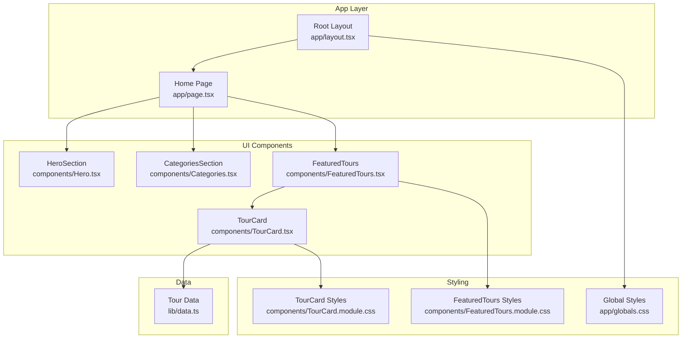
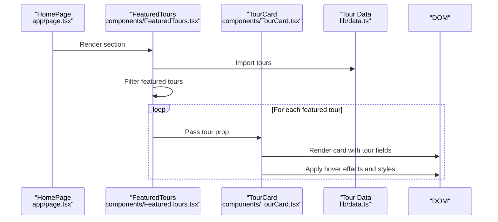
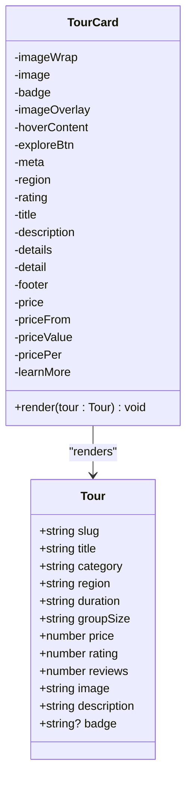
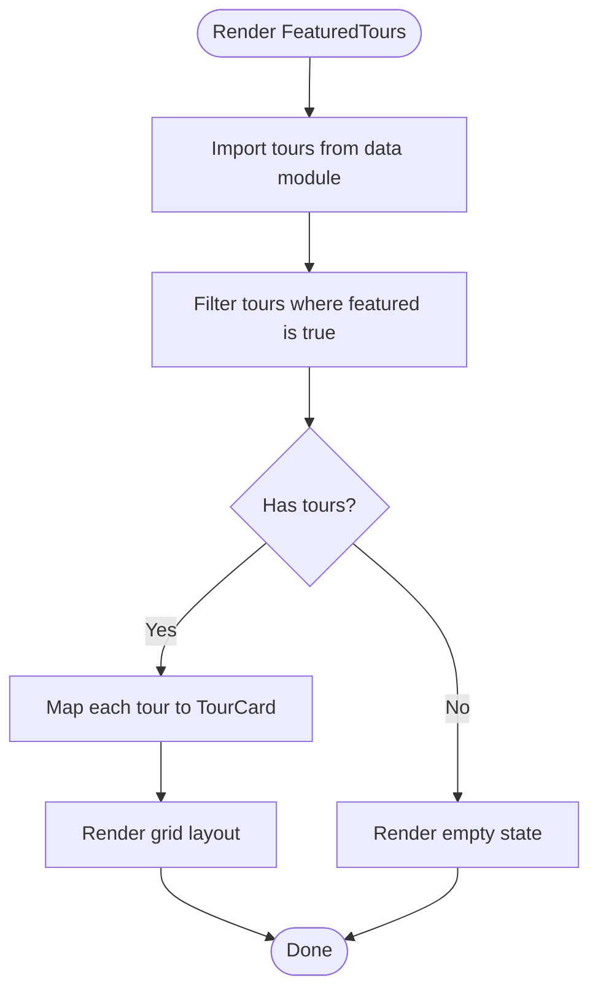
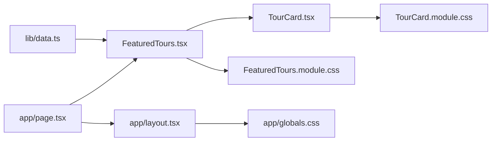

# Tour Management

<cite>
**Referenced Files in This Document**
- [TourCard.tsx](file://components/TourCard.tsx)
- [TourCard.module.css](file://components/TourCard.module.css)
- [FeaturedTours.tsx](file://components/FeaturedTours.tsx)
- [FeaturedTours.module.css](file://components/FeaturedTours.module.css)
- [data.ts](file://lib/data.ts)
- [page.tsx](file://app/page.tsx)
- [layout.tsx](file://app/layout.tsx)
- [globals.css](file://app/globals.css)
- [Hero.tsx](file://components/Hero.tsx)
- [Categories.tsx](file://components/Categories.tsx)
</cite>

## Table of Contents
1. [Introduction](#introduction)
2. [Project Structure](#project-structure)
3. [Core Components](#core-components)
4. [Architecture Overview](#architecture-overview)
5. [Detailed Component Analysis](#detailed-component-analysis)
6. [Dependency Analysis](#dependency-analysis)
7. [Performance Considerations](#performance-considerations)
8. [Troubleshooting Guide](#troubleshooting-guide)
9. [Conclusion](#conclusion)
10. [Appendices](#appendices)

## Introduction
This document provides comprehensive documentation for the tour management system with a focus on the TourCard component. It explains how individual tours are presented, how interactive hover effects are implemented, how pricing and availability indicators are displayed, and how the component integrates with the tour data model. It also covers stateless interaction patterns, responsive design, card layout, image handling, rating display, and filtering capabilities. Practical examples of tour data binding, event handling, and customization options for different tour types are included.

## Project Structure
The tour management system is organized around reusable UI components and a centralized data module. The TourCard component renders a single tour’s information, while FeaturedTours composes multiple cards and applies responsive layouts. The data module supplies the tour catalog and categories used across the site.

**Diagram sources**
- [layout.tsx:17-27](file://app/layout.tsx#L17-L27)
- [page.tsx:9-21](file://app/page.tsx#L9-L21)
- [FeaturedTours.tsx:8-33](file://components/FeaturedTours.tsx#L8-L33)
- [TourCard.tsx:21-62](file://components/TourCard.tsx#L21-L62)
- [data.ts:76-205](file://lib/data.ts#L76-L205)
- [globals.css:1-190](file://app/globals.css#L1-L190)
- [TourCard.module.css:1-173](file://components/TourCard.module.css#L1-L173)
- [FeaturedTours.module.css:1-38](file://components/FeaturedTours.module.css#L1-L38)

**Section sources**
- [layout.tsx:17-27](file://app/layout.tsx#L17-L27)
- [page.tsx:9-21](file://app/page.tsx#L9-L21)
- [globals.css:1-190](file://app/globals.css#L1-L190)

## Core Components
- TourCard: Renders a single tour with image, badge, region, rating, title, description, duration, group size, pricing, and “Learn More” action. Implements hover effects and lazy image loading.
- FeaturedTours: Filters and displays featured tours using TourCard instances, with responsive grid layout.
- Data Model: Centralized tour and category definitions used by components.

Key responsibilities:
- Data binding: TourCard receives a tour object and renders its fields.
- Interactive hover: Card elevation and image zoom, plus overlay reveal.
- Pricing display: Formatted currency with “From” label and “per person” indicator.
- Availability indicators: Badge support for labels like “Best Seller,” “Top Rated,” etc.
- Responsive design: Grid layout adapts to breakpoints; typography and spacing adjust via CSS variables.

**Section sources**
- [TourCard.tsx:21-62](file://components/TourCard.tsx#L21-L62)
- [TourCard.module.css:1-173](file://components/TourCard.module.css#L1-L173)
- [FeaturedTours.tsx:8-33](file://components/FeaturedTours.tsx#L8-L33)
- [FeaturedTours.module.css:27-37](file://components/FeaturedTours.module.css#L27-L37)
- [data.ts:76-205](file://lib/data.ts#L76-L205)

## Architecture Overview
The system follows a component-driven architecture:
- Components are self-contained and declarative.
- Data is injected via props from parent components or shared modules.
- Styling is scoped to components using CSS Modules for encapsulation.
- Global design tokens (colors, fonts, shadows) are defined in global CSS.

**Diagram sources**
- [page.tsx:9-21](file://app/page.tsx#L9-L21)
- [FeaturedTours.tsx:8-33](file://components/FeaturedTours.tsx#L8-L33)
- [TourCard.tsx:21-62](file://components/TourCard.tsx#L21-L62)
- [data.ts:76-205](file://lib/data.ts#L76-L205)

## Detailed Component Analysis

### TourCard Component
Purpose:
- Present a single tour with a visually rich card layout.
- Provide navigation to a tour detail route.
- Display metadata, pricing, and interactive elements.

Implementation highlights:
- Props: Receives a tour object typed with essential fields.
- Image handling: Lazy loading via the loading attribute; aspect ratio maintained; hover zoom effect.
- Hover effects: Card lift and shadow increase; image scale-up; overlay reveals a centered button.
- Pricing display: “From” label, formatted price, and “per person.”
- Rating display: Star icon with numeric rating and review count.
- Availability indicator: Optional badge rendered when present.
- Accessibility: Proper alt text for images; semantic heading and paragraph elements.

**Diagram sources**
- [TourCard.tsx:6-19](file://components/TourCard.tsx#L6-L19)
- [TourCard.tsx:21-62](file://components/TourCard.tsx#L21-L62)

**Section sources**
- [TourCard.tsx:21-62](file://components/TourCard.tsx#L21-L62)
- [TourCard.module.css:1-173](file://components/TourCard.module.css#L1-L173)

### FeaturedTours Integration
Purpose:
- Filter and render a set of featured tours.
- Provide a “View All Tours” call-to-action.

Behavior:
- Filters tours by a featured flag.
- Maps filtered tours to TourCard instances.
- Uses a responsive grid layout with CSS Grid and media queries.

**Diagram sources**
- [FeaturedTours.tsx:8-33](file://components/FeaturedTours.tsx#L8-L33)
- [FeaturedTours.module.css:27-37](file://components/FeaturedTours.module.css#L27-L37)
- [data.ts:76-205](file://lib/data.ts#L76-L205)

**Section sources**
- [FeaturedTours.tsx:8-33](file://components/FeaturedTours.tsx#L8-L33)
- [FeaturedTours.module.css:27-37](file://components/FeaturedTours.module.css#L27-L37)

### Data Model and Binding
- Tour type: Defines the shape of tour data used by TourCard.
- Data source: Centralized in lib/data.ts with arrays of tours and categories.
- Binding: FeaturedTours imports tours and passes each tour to TourCard.

Customization options:
- Badges: Optional badge field enables labels like “Best Seller,” “Top Rated,” “Adventure,” etc.
- Pricing: Numeric price is formatted for display.
- Ratings: Numeric rating and review count enable star-based display.
- Details: Duration and group size are shown as icons with text.

**Section sources**
- [TourCard.tsx:6-19](file://components/TourCard.tsx#L6-L19)
- [data.ts:76-205](file://lib/data.ts#L76-L205)

### Interactive Hover Effects
Hover behavior:
- Card lifts and gains stronger shadow.
- Image scales up slightly.
- Overlay fades in to reveal an “Explore Tour” button.

Implementation:
- CSS transitions and transforms define the animations.
- Pseudo-hover selectors target child elements on card hover.

Accessibility:
- No keyboard interaction is implemented; hover is decorative.

**Section sources**
- [TourCard.module.css:13-16](file://components/TourCard.module.css#L13-L16)
- [TourCard.module.css:29](file://components/TourCard.module.css#L29)
- [TourCard.module.css:63](file://components/TourCard.module.css#L63)

### Pricing Display and Availability Indicators
Pricing:
- “From” label indicates starting price.
- Price is formatted as a localized string.
- “Per person” suffix clarifies cost structure.

Availability:
- Badge rendering is conditional; when present, badges appear in the top-left corner of the image area.

**Section sources**
- [TourCard.tsx:52-58](file://components/TourCard.tsx#L52-L58)
- [TourCard.tsx:26](file://components/TourCard.tsx#L26)
- [TourCard.module.css:159-162](file://components/TourCard.module.css#L159-L162)
- [TourCard.module.css:31-44](file://components/TourCard.module.css#L31-L44)

### Card Layout System and Image Handling
Layout:
- Flexbox-based card container with a body section containing meta, title, description, details, and footer.
- Aspect-ratio maintained for the image wrapper to preserve visual balance.

Image handling:
- Lazy loading improves initial load performance.
- Cover fit ensures full coverage without distortion.
- Gradient overlay enhances readability of text layered over images.

Responsive patterns:
- FeaturedTours grid adjusts columns based on viewport width.
- Typography and spacing adapt via CSS variables.

**Section sources**
- [TourCard.module.css:18-28](file://components/TourCard.module.css#L18-L28)
- [TourCard.module.css:46-51](file://components/TourCard.module.css#L46-L51)
- [FeaturedTours.module.css:27-37](file://components/FeaturedTours.module.css#L27-L37)
- [globals.css:23-42](file://app/globals.css#L23-L42)

### Rating Display and Filtering Capabilities
Rating:
- Star icon with numeric rating and parenthesized review count.
- Color and sizing controlled via CSS variables and component classes.

Filtering:
- FeaturedTours filters tours by a featured flag.
- CategoriesSection demonstrates category-based navigation and filtering via links.

Note: Additional filtering (e.g., by region, duration, or rating) is not implemented in the current codebase and would require extending the data model and adding UI controls.

**Section sources**
- [TourCard.tsx:38-40](file://components/TourCard.tsx#L38-L40)
- [TourCard.module.css:106-114](file://components/TourCard.module.css#L106-L114)
- [FeaturedTours.tsx:9](file://components/FeaturedTours.tsx#L9)
- [Categories.tsx:21-41](file://components/Categories.tsx#L21-L41)

### Event Handling and Navigation
Navigation:
- TourCard wraps the entire card in a Next.js Link to the tour detail route.
- FeaturedTours provides a “View All Tours” link to a tours index.

Event handling:
- Hover effects are purely visual and do not require JavaScript event handlers.
- Quick search in HeroSection demonstrates form-like interactions, but TourCard itself does not include interactive controls.

**Section sources**
- [TourCard.tsx:23](file://components/TourCard.tsx#L23)
- [FeaturedTours.tsx:21-23](file://components/FeaturedTours.tsx#L21-L23)
- [Hero.tsx:69-79](file://components/Hero.tsx#L69-L79)

## Dependency Analysis
- TourCard depends on:
  - Tour type definition.
  - Lucide icons for metadata.
  - TourCard.module.css for styling.
- FeaturedTours depends on:
  - TourCard component.
  - lib/data.ts for tours.
  - FeaturedTours.module.css for layout.
- Global dependencies:
  - app/globals.css defines brand colors, typography, and responsive breakpoints.

**Diagram sources**
- [data.ts:76-205](file://lib/data.ts#L76-L205)
- [FeaturedTours.tsx:4-6](file://components/FeaturedTours.tsx#L4-L6)
- [TourCard.tsx:3](file://components/TourCard.tsx#L3)
- [TourCard.module.css:1-173](file://components/TourCard.module.css#L1-L173)
- [FeaturedTours.module.css:1-38](file://components/FeaturedTours.module.css#L1-L38)
- [layout.tsx:17-27](file://app/layout.tsx#L17-L27)
- [page.tsx:9-21](file://app/page.tsx#L9-L21)
- [globals.css:1-190](file://app/globals.css#L1-L190)

**Section sources**
- [data.ts:76-205](file://lib/data.ts#L76-L205)
- [FeaturedTours.tsx:4-6](file://components/FeaturedTours.tsx#L4-L6)
- [TourCard.tsx:3](file://components/TourCard.tsx#L3)
- [globals.css:1-190](file://app/globals.css#L1-L190)

## Performance Considerations
- Lazy image loading: TourCard uses the loading attribute to defer offscreen images.
- CSS transitions: Smooth animations are hardware-accelerated via transforms and opacity changes.
- Minimal JavaScript: Hover effects rely on CSS, reducing runtime overhead.
- Responsive grid: CSS Grid reduces layout thrashing compared to manual calculations.

Recommendations:
- Consider implementing intersection observer for additional lazy loading beyond the built-in attribute.
- Optimize image sizes and formats for production deployment.
- Add skeleton loaders for initial render when fetching tours dynamically.

[No sources needed since this section provides general guidance]

## Troubleshooting Guide
Common issues and resolutions:
- Missing tour image: Ensure the image URL is valid and accessible. Verify alt text is descriptive.
- Hover effects not appearing: Confirm the card element is hovered and CSS selectors match the component structure.
- Pricing not formatted: Verify the price is a number and that the formatted display logic is applied.
- Badge not visible: Confirm the badge field is present and truthy in the tour object.
- Responsive layout not adapting: Check media queries and grid template columns in the relevant CSS modules.

**Section sources**
- [TourCard.tsx:25](file://components/TourCard.tsx#L25)
- [TourCard.module.css:13-16](file://components/TourCard.module.css#L13-L16)
- [TourCard.tsx:54](file://components/TourCard.tsx#L54)
- [TourCard.tsx:26](file://components/TourCard.tsx#L26)
- [FeaturedTours.module.css:33-37](file://components/FeaturedTours.module.css#L33-L37)

## Conclusion
The TourCard component delivers a polished, accessible, and responsive presentation of tour offerings. Its integration with the data model and FeaturedTours showcases a clean separation of concerns, enabling easy customization and extension. While current interactions are hover-driven and filtering is basic, the architecture supports adding richer interactivity and advanced filtering in the future.

[No sources needed since this section summarizes without analyzing specific files]

## Appendices

### Example: Tour Data Binding
- TourCard receives a tour object and renders:
  - Region and rating with icons.
  - Title and description.
  - Duration and group size.
  - Formatted price and “per person.”
  - Optional badge.
- FeaturedTours filters tours and maps them to TourCard instances.

**Section sources**
- [TourCard.tsx:21-62](file://components/TourCard.tsx#L21-L62)
- [FeaturedTours.tsx:8-33](file://components/FeaturedTours.tsx#L8-L33)
- [data.ts:76-205](file://lib/data.ts#L76-L205)

### Example: Customization Options
- Badges: Add or modify badge labels in the tour data to reflect promotions or tour themes.
- Pricing: Adjust price formatting or introduce dynamic pricing tiers.
- Ratings: Extend rating display to include partial stars or alternate icons.
- Details: Add new metadata fields (e.g., difficulty level) and render them similarly.

**Section sources**
- [data.ts:88-89](file://lib/data.ts#L88-L89)
- [TourCard.tsx:47-49](file://components/TourCard.tsx#L47-L49)
- [TourCard.module.css:142-149](file://components/TourCard.module.css#L142-L149)