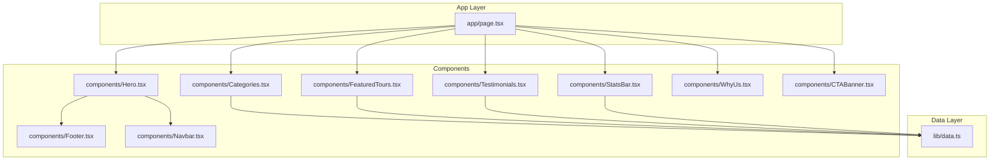
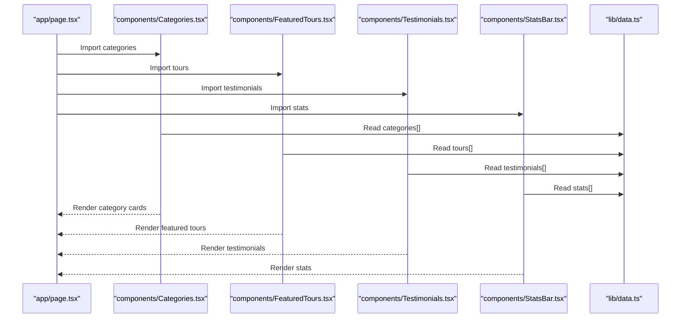
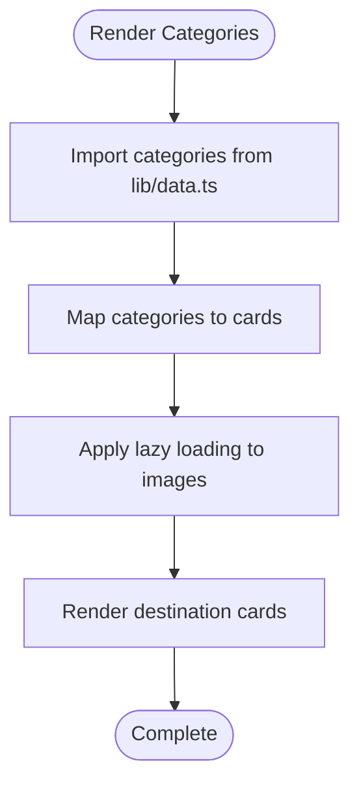
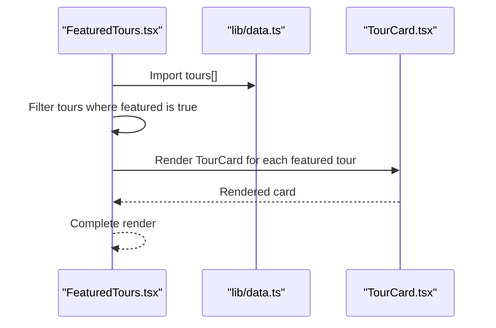
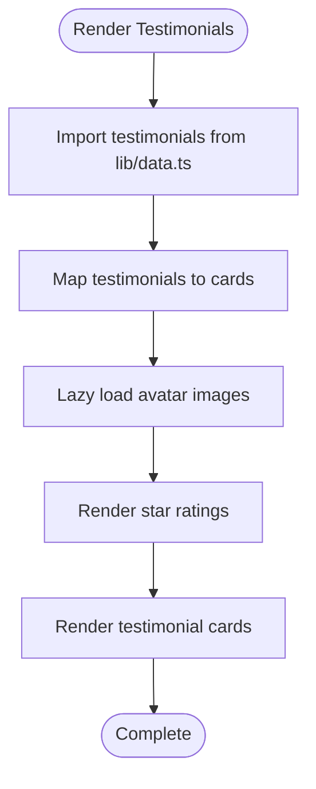
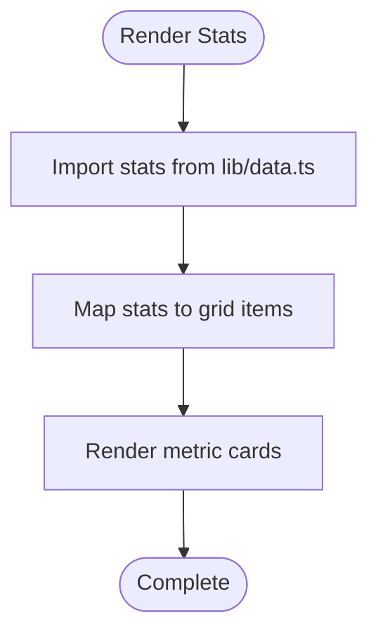
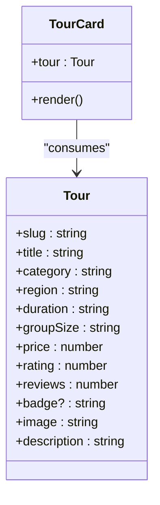
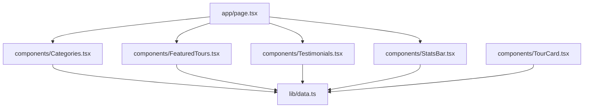

# Data Flow Architecture

<cite>
**Referenced Files in This Document**
- [data.ts](file://lib/data.ts)
- [page.tsx](file://app/page.tsx)
- [Categories.tsx](file://components/Categories.tsx)
- [FeaturedTours.tsx](file://components/FeaturedTours.tsx)
- [Testimonials.tsx](file://components/Testimonials.tsx)
- [StatsBar.tsx](file://components/StatsBar.tsx)
- [TourCard.tsx](file://components/TourCard.tsx)
- [Hero.tsx](file://components/Hero.tsx)
- [WhyUs.tsx](file://components/WhyUs.tsx)
- [CTABanner.tsx](file://components/CTABanner.tsx)
- [Footer.tsx](file://components/Footer.tsx)
- [Navbar.tsx](file://components/Navbar.tsx)
- [README.md](file://README.md)
- [package.json](file://package.json)
</cite>

## Table of Contents
1. [Introduction](#introduction)
2. [Project Structure](#project-structure)
3. [Core Components](#core-components)
4. [Architecture Overview](#architecture-overview)
5. [Detailed Component Analysis](#detailed-component-analysis)
6. [Dependency Analysis](#dependency-analysis)
7. [Performance Considerations](#performance-considerations)
8. [Troubleshooting Guide](#troubleshooting-guide)
9. [Conclusion](#conclusion)

## Introduction
This document explains the data management and flow architecture of the application, focusing on how lib/data.ts serves as the centralized data source for all components. It documents the data structures for categories, tours, testimonials, and statistics, along with their TypeScript interfaces. The document also covers how components consume data, handle state updates, manage data transformations, and outlines patterns for data fetching, caching strategies, and performance optimization techniques.

## Project Structure
The project follows a conventional Next.js App Router structure with a clear separation between the presentation layer (components) and the centralized data layer (lib/data.ts). The homepage orchestrates multiple sections that each import shared data from the central library.

**Diagram sources**
- [page.tsx:1-22](file://app/page.tsx#L1-L22)
- [Categories.tsx:1-47](file://components/Categories.tsx#L1-L47)
- [FeaturedTours.tsx:1-34](file://components/FeaturedTours.tsx#L1-L34)
- [Testimonials.tsx:1-41](file://components/Testimonials.tsx#L1-L41)
- [StatsBar.tsx:1-21](file://components/StatsBar.tsx#L1-L21)
- [data.ts:1-252](file://lib/data.ts#L1-L252)

**Section sources**
- [README.md:1-37](file://README.md#L1-L37)
- [package.json:1-24](file://package.json#L1-L24)

## Core Components
This section documents the centralized data structures and their TypeScript interfaces used across the application.

- Categories
  - Purpose: Defines curated travel experiences with metadata such as id, title, description, image, count, color, and icon.
  - Consumption: Used by the Categories section to render destination cards and by navigation components to populate destination menus.
  - Data shape: Array of category objects with string identifiers and numeric counts.

- Tours
  - Purpose: Provides detailed tour offerings including slug, title, category, region, duration, group size, pricing, ratings, reviews, badges, images, and highlights.
  - Consumption: Used by FeaturedTours to filter and display featured tours, and by TourCard to render individual tour cards.
  - Data shape: Array of tour objects with structured metadata for filtering and display.

- Testimonials
  - Purpose: Stores guest stories with identifiers, names, roles, avatar URLs, associated tour, star ratings, and quoted testimonials.
  - Consumption: Rendered by the Testimonials section to showcase guest experiences.
  - Data shape: Array of testimonial objects with embedded tour references.

- Statistics
  - Purpose: Displays key metrics such as years of expertise, destinations covered, happy travelers, and expert guides.
  - Consumption: Consumed by StatsBar to render a responsive statistics grid.
  - Data shape: Array of stat objects with value and label pairs.

**Section sources**
- [data.ts:1-252](file://lib/data.ts#L1-L252)

## Architecture Overview
The application employs a unidirectional data flow pattern:
- Centralized data source: lib/data.ts exports constants for categories, tours, testimonials, and stats.
- Component consumption: Each UI component imports the relevant dataset(s) and renders them without managing external state.
- Filtering and transformations: Components perform lightweight transformations (e.g., filtering featured tours) locally.
- No external data fetching: The current implementation relies on static data; there is no runtime API integration.

**Diagram sources**
- [page.tsx:1-22](file://app/page.tsx#L1-L22)
- [Categories.tsx:1-47](file://components/Categories.tsx#L1-L47)
- [FeaturedTours.tsx:1-34](file://components/FeaturedTours.tsx#L1-L34)
- [Testimonials.tsx:1-41](file://components/Testimonials.tsx#L1-L41)
- [StatsBar.tsx:1-21](file://components/StatsBar.tsx#L1-L21)
- [data.ts:1-252](file://lib/data.ts#L1-L252)

## Detailed Component Analysis

### Categories Section
- Data consumption: Imports categories from lib/data.ts and renders a grid of destination cards.
- State management: Uses client-side rendering; no internal state is maintained for categories.
- Transformations: None; displays raw category data.
- Performance: Minimal; uses lazy loading for images.

**Diagram sources**
- [Categories.tsx:1-47](file://components/Categories.tsx#L1-L47)
- [data.ts:1-74](file://lib/data.ts#L1-L74)

**Section sources**
- [Categories.tsx:1-47](file://components/Categories.tsx#L1-L47)
- [data.ts:1-74](file://lib/data.ts#L1-L74)

### Featured Tours Section
- Data consumption: Imports tours from lib/data.ts and filters for featured items.
- State management: Client-side; maintains no persistent state.
- Transformations: Filters tours where featured is true.
- Performance: Efficient filtering; renders TourCard components for each featured tour.

**Diagram sources**
- [FeaturedTours.tsx:1-34](file://components/FeaturedTours.tsx#L1-L34)
- [TourCard.tsx:1-63](file://components/TourCard.tsx#L1-L63)
- [data.ts:76-205](file://lib/data.ts#L76-L205)

**Section sources**
- [FeaturedTours.tsx:1-34](file://components/FeaturedTours.tsx#L1-L34)
- [TourCard.tsx:1-63](file://components/TourCard.tsx#L1-L63)
- [data.ts:76-205](file://lib/data.ts#L76-L205)

### Testimonials Section
- Data consumption: Imports testimonials from lib/data.ts and renders guest stories with star ratings.
- State management: Client-side; no internal state.
- Transformations: Renders stars based on rating values; displays avatar images with lazy loading.
- Performance: Lightweight rendering; uses mapped arrays for testimonials.

**Diagram sources**
- [Testimonials.tsx:1-41](file://components/Testimonials.tsx#L1-L41)
- [data.ts:207-244](file://lib/data.ts#L207-L244)

**Section sources**
- [Testimonials.tsx:1-41](file://components/Testimonials.tsx#L1-L41)
- [data.ts:207-244](file://lib/data.ts#L207-L244)

### Stats Bar Section
- Data consumption: Imports stats from lib/data.ts and renders a responsive grid of metric cards.
- State management: Client-side; no internal state.
- Transformations: None; displays value and label pairs directly.
- Performance: Minimal overhead; efficient grid rendering.

**Diagram sources**
- [StatsBar.tsx:1-21](file://components/StatsBar.tsx#L1-L21)
- [data.ts:246-251](file://lib/data.ts#L246-L251)

**Section sources**
- [StatsBar.tsx:1-21](file://components/StatsBar.tsx#L1-L21)
- [data.ts:246-251](file://lib/data.ts#L246-L251)

### TourCard Component
- Data consumption: Receives a single tour object via props.
- State management: Stateless functional component.
- Transformations: Formats price with locale string; renders metadata icons and hover effects.
- Performance: Optimized for reuse; minimal DOM operations.

**Diagram sources**
- [TourCard.tsx:1-63](file://components/TourCard.tsx#L1-L63)
- [data.ts:76-205](file://lib/data.ts#L76-L205)

**Section sources**
- [TourCard.tsx:1-63](file://components/TourCard.tsx#L1-L63)
- [data.ts:76-205](file://lib/data.ts#L76-L205)

### Navigation and Footer Components
- Navigation: Uses hardcoded destination lists for desktop and mobile menus.
- Footer: Uses hardcoded link groups for destinations and company pages.
- Data consumption: These components do not import from lib/data.ts; they rely on static routing and hardcoded data.

**Section sources**
- [Navbar.tsx:1-113](file://components/Navbar.tsx#L1-L113)
- [Footer.tsx:1-104](file://components/Footer.tsx#L1-L104)

## Dependency Analysis
The dependency graph shows how components depend on the centralized data source and how the homepage orchestrates the rendering of multiple sections.

**Diagram sources**
- [page.tsx:1-22](file://app/page.tsx#L1-L22)
- [Categories.tsx:1-47](file://components/Categories.tsx#L1-L47)
- [FeaturedTours.tsx:1-34](file://components/FeaturedTours.tsx#L1-L34)
- [Testimonials.tsx:1-41](file://components/Testimonials.tsx#L1-L41)
- [StatsBar.tsx:1-21](file://components/StatsBar.tsx#L1-L21)
- [TourCard.tsx:1-63](file://components/TourCard.tsx#L1-L63)
- [data.ts:1-252](file://lib/data.ts#L1-L252)

**Section sources**
- [page.tsx:1-22](file://app/page.tsx#L1-L22)
- [data.ts:1-252](file://lib/data.ts#L1-L252)

## Performance Considerations
- Static data loading: All datasets are imported statically from lib/data.ts, eliminating network latency and enabling fast initial loads.
- Client-side rendering: Components use the 'use client' directive, enabling interactivity while keeping data access straightforward.
- Image optimization: Components leverage lazy loading for images to improve perceived performance and reduce bandwidth usage.
- Minimal transformations: Filtering and mapping occur on the client side with small datasets, minimizing computational overhead.
- No caching layer: Since data is static, explicit caching is unnecessary; however, future enhancements could include:
  - In-memory caching for dynamic data if API endpoints are introduced.
  - React Query or SWR for server-state synchronization and cache invalidation.
  - Edge caching via CDN for images and assets.
  - Pagination or virtualization for large datasets if tours expand significantly.

[No sources needed since this section provides general guidance]

## Troubleshooting Guide
- Data not rendering:
  - Verify that components import from lib/data.ts and that the export names match the expected keys.
  - Confirm that the 'use client' directive is present in components that render UI elements.
- Incorrect data types:
  - Ensure TypeScript interfaces align with the exported data shapes to prevent runtime errors.
- Performance issues:
  - Monitor image loading and consider preloading critical hero images.
  - Consider virtualizing long lists if testimonials or tours grow substantially.
- State-related problems:
  - Avoid introducing unnecessary state for static data; keep state minimal and scoped to user interactions.

**Section sources**
- [Categories.tsx:1-47](file://components/Categories.tsx#L1-L47)
- [FeaturedTours.tsx:1-34](file://components/FeaturedTours.tsx#L1-L34)
- [Testimonials.tsx:1-41](file://components/Testimonials.tsx#L1-L41)
- [StatsBar.tsx:1-21](file://components/StatsBar.tsx#L1-L21)
- [data.ts:1-252](file://lib/data.ts#L1-L252)

## Conclusion
The application’s data architecture centers around a single, centralized data source in lib/data.ts, consumed by multiple UI components with minimal state and straightforward transformations. This design promotes simplicity, maintainability, and predictable performance. As the application evolves, adopting caching strategies and scalable data patterns will help sustain performance and user experience.