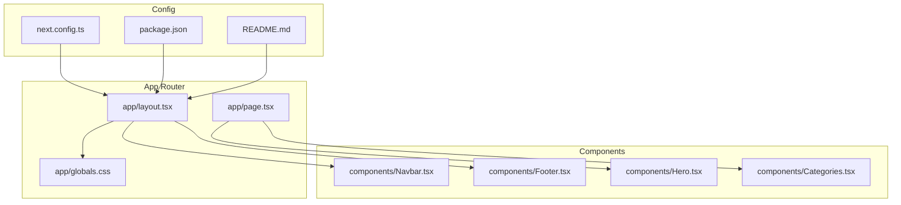
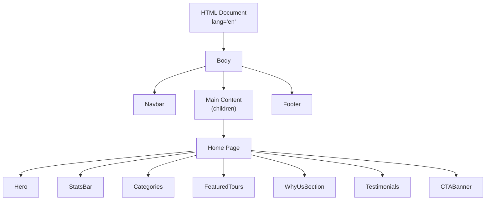
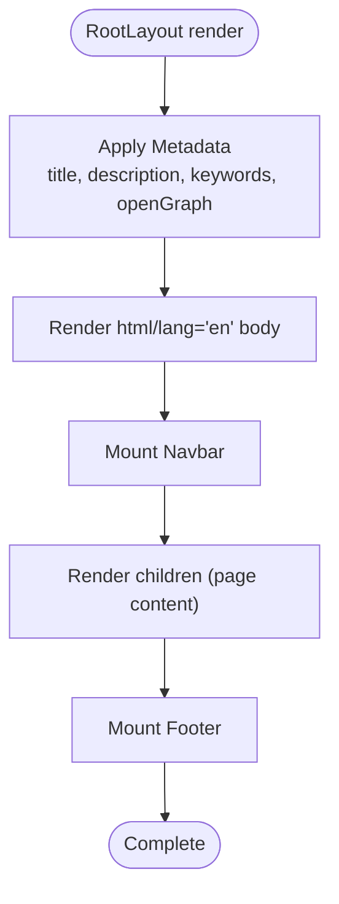
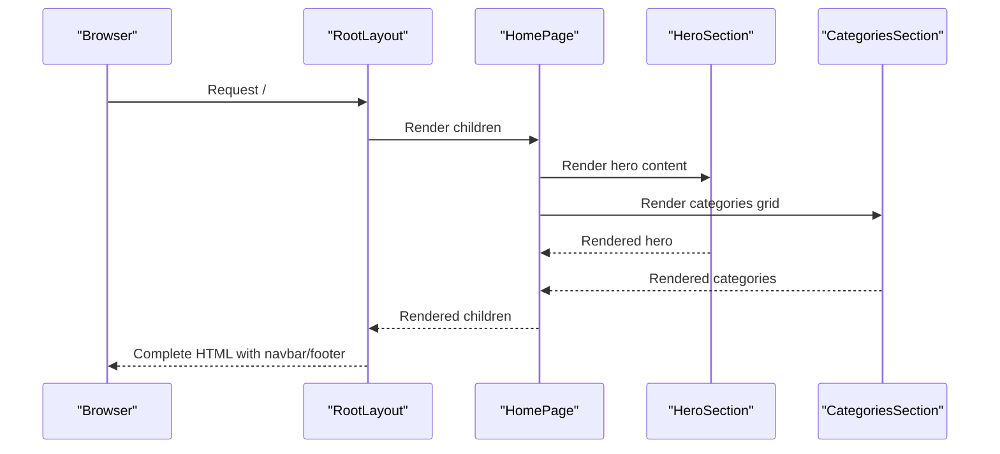
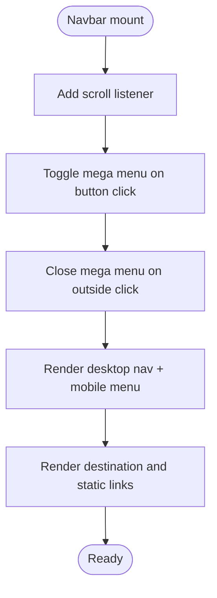
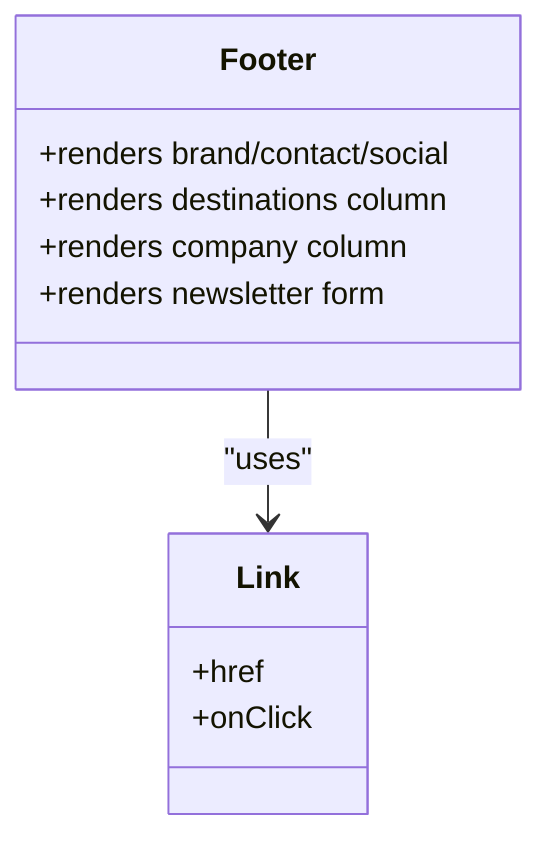
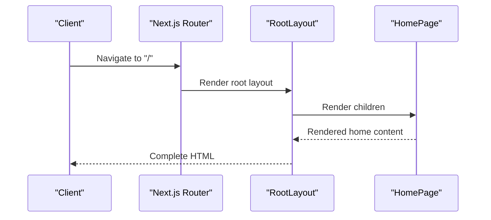
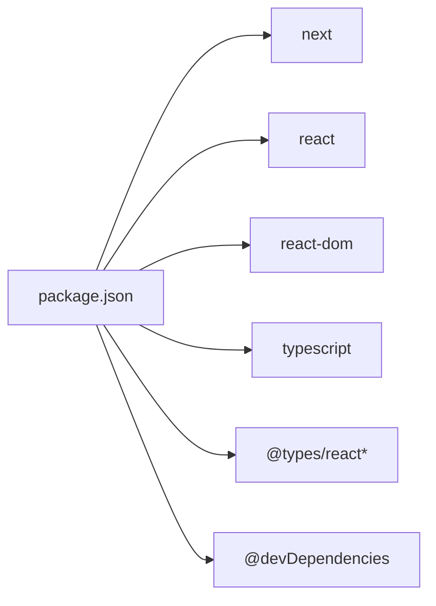

# Routing System

<cite>
**Referenced Files in This Document**
- [layout.tsx](file://app/layout.tsx)
- [page.tsx](file://app/page.tsx)
- [globals.css](file://app/globals.css)
- [Navbar.tsx](file://components/Navbar.tsx)
- [Footer.tsx](file://components/Footer.tsx)
- [Hero.tsx](file://components/Hero.tsx)
- [Categories.tsx](file://components/Categories.tsx)
- [next.config.ts](file://next.config.ts)
- [package.json](file://package.json)
- [README.md](file://README.md)
</cite>

## Table of Contents
1. [Introduction](#introduction)
2. [Project Structure](#project-structure)
3. [Core Components](#core-components)
4. [Architecture Overview](#architecture-overview)
5. [Detailed Component Analysis](#detailed-component-analysis)
6. [Dependency Analysis](#dependency-analysis)
7. [Performance Considerations](#performance-considerations)
8. [Troubleshooting Guide](#troubleshooting-guide)
9. [Conclusion](#conclusion)

## Introduction
This document explains the Next.js App Router architecture used in the project. It focuses on the file-based routing model, the root layout and home page as the primary entry points, metadata configuration for SEO and social sharing, server-side rendering behavior, and how the layout system manages global UI elements such as navigation and footer. It also outlines route structure, metadata management, and component rendering within the routing system.

## Project Structure
The project follows Next.js App Router conventions:
- app/layout.tsx defines the root HTML shell and global layout, including shared header and footer.
- app/page.tsx renders the home page content.
- app/globals.css provides global styles applied across pages.
- components/ contains reusable UI building blocks (navigation, footer, hero, categories, etc.).
- next.config.ts holds Next.js configuration.
- package.json lists dependencies and scripts.
- README.md provides getting started instructions.

**Diagram sources**
- [layout.tsx:1-28](file://app/layout.tsx#L1-L28)
- [page.tsx:1-22](file://app/page.tsx#L1-L22)
- [globals.css:1-190](file://app/globals.css#L1-L190)
- [Navbar.tsx:1-113](file://components/Navbar.tsx#L1-L113)
- [Footer.tsx:1-104](file://components/Footer.tsx#L1-L104)
- [Hero.tsx:1-100](file://components/Hero.tsx#L1-L100)
- [Categories.tsx:1-47](file://components/Categories.tsx#L1-L47)
- [next.config.ts:1-8](file://next.config.ts#L1-L8)
- [package.json:1-24](file://package.json#L1-L24)
- [README.md:1-37](file://README.md#L1-L37)

**Section sources**
- [layout.tsx:1-28](file://app/layout.tsx#L1-L28)
- [page.tsx:1-22](file://app/page.tsx#L1-L22)
- [globals.css:1-190](file://app/globals.css#L1-L190)
- [next.config.ts:1-8](file://next.config.ts#L1-L8)
- [package.json:1-24](file://package.json#L1-L24)
- [README.md:1-37](file://README.md#L1-L37)

## Core Components
- Root Layout and Metadata
  - The root layout sets the HTML document structure and defines global metadata for SEO and social sharing. It composes the navigation bar and footer around the page’s children.
  - See [layout.tsx:6-15](file://app/layout.tsx#L6-L15) for metadata fields and [layout.tsx:17-27](file://app/layout.tsx#L17-L27) for the layout render tree.

- Home Page Composition
  - The home page aggregates multiple feature components (hero, stats, categories, testimonials, featured tours, why-us, CTA) into a single view.
  - See [page.tsx:1-22](file://app/page.tsx#L1-L22).

- Global Styles
  - Global CSS defines brand tokens, typography, spacing, and responsive defaults applied site-wide.
  - See [globals.css:1-190](file://app/globals.css#L1-L190).

- Navigation and Footer
  - The navigation component provides desktop and mobile menus with destination links and responsive behavior.
  - The footer organizes links, contact info, and legal pages.
  - See [Navbar.tsx:1-113](file://components/Navbar.tsx#L1-L113) and [Footer.tsx:1-104](file://components/Footer.tsx#L1-L104).

**Section sources**
- [layout.tsx:6-27](file://app/layout.tsx#L6-L27)
- [page.tsx:1-22](file://app/page.tsx#L1-L22)
- [globals.css:1-190](file://app/globals.css#L1-L190)
- [Navbar.tsx:1-113](file://components/Navbar.tsx#L1-L113)
- [Footer.tsx:1-104](file://components/Footer.tsx#L1-L104)

## Architecture Overview
The App Router renders the root layout for every page. The home page component is rendered inside the layout’s children area. Global styles are imported at the root. Navigation and footer are consistently present across pages via the root layout.

**Diagram sources**
- [layout.tsx:17-27](file://app/layout.tsx#L17-L27)
- [page.tsx:9-21](file://app/page.tsx#L9-L21)
- [Hero.tsx:20-99](file://components/Hero.tsx#L20-L99)
- [Categories.tsx:7-46](file://components/Categories.tsx#L7-L46)

**Section sources**
- [layout.tsx:17-27](file://app/layout.tsx#L17-L27)
- [page.tsx:9-21](file://app/page.tsx#L9-L21)

## Detailed Component Analysis

### Root Layout and Metadata
- Purpose
  - Provides the HTML document shell, global metadata, and mounts shared UI (navbar and footer).
- Metadata
  - Includes title, description, keywords, and OpenGraph fields. These influence browser tabs, search engine results, and social media previews.
- Rendering
  - Wraps child content in html/body and renders Navbar above main and Footer below main.

**Diagram sources**
- [layout.tsx:6-15](file://app/layout.tsx#L6-L15)
- [layout.tsx:17-27](file://app/layout.tsx#L17-L27)

**Section sources**
- [layout.tsx:6-15](file://app/layout.tsx#L6-L15)
- [layout.tsx:17-27](file://app/layout.tsx#L17-L27)

### Home Page Composition
- Purpose
  - Assemble feature sections for the landing page.
- Composition
  - Renders Hero, StatsBar, Categories, FeaturedTours, WhyUsSection, Testimonials, and CTABanner.
- Rendering
  - Returns a fragment of components in a specific order.

**Diagram sources**
- [layout.tsx:17-27](file://app/layout.tsx#L17-L27)
- [page.tsx:9-21](file://app/page.tsx#L9-L21)
- [Hero.tsx:20-99](file://components/Hero.tsx#L20-L99)
- [Categories.tsx:7-46](file://components/Categories.tsx#L7-L46)

**Section sources**
- [page.tsx:1-22](file://app/page.tsx#L1-L22)
- [Hero.tsx:1-100](file://components/Hero.tsx#L1-L100)
- [Categories.tsx:1-47](file://components/Categories.tsx#L1-L47)

### Navigation Bar
- Purpose
  - Provide primary navigation and a mega-menu for destinations, plus mobile responsiveness.
- Behavior
  - Tracks scroll state, toggles mega menu and mobile menu, and closes the mega menu when clicking outside.
- Routing
  - Uses Next.js Link components to navigate to routes such as destinations and static pages.

**Diagram sources**
- [Navbar.tsx:18-38](file://components/Navbar.tsx#L18-L38)
- [Navbar.tsx:40-112](file://components/Navbar.tsx#L40-L112)

**Section sources**
- [Navbar.tsx:1-113](file://components/Navbar.tsx#L1-L113)

### Footer
- Purpose
  - Present brand identity, contact info, social links, and organized site links.
- Structure
  - Divided into brand/contact/social, two link columns, and a newsletter form.
- Routing
  - Uses Next.js Link for internal navigation to pages like About, Tours, Contact, Privacy, Terms, and Sitemap.

**Diagram sources**
- [Footer.tsx:25-103](file://components/Footer.tsx#L25-L103)

**Section sources**
- [Footer.tsx:1-104](file://components/Footer.tsx#L1-L104)

### Route Structure and Rendering
- Single Route Example
  - The root route "/" renders the home page via app/page.tsx, which is wrapped by app/layout.tsx.
- How Children Are Rendered
  - The layout’s children prop receives the current page component, enabling consistent global elements (navbar/footer) while switching page-specific content.

**Diagram sources**
- [layout.tsx:17-27](file://app/layout.tsx#L17-L27)
- [page.tsx:9-21](file://app/page.tsx#L9-L21)

**Section sources**
- [layout.tsx:17-27](file://app/layout.tsx#L17-L27)
- [page.tsx:9-21](file://app/page.tsx#L9-L21)

## Dependency Analysis
- Runtime Dependencies
  - Next.js, React, and React DOM power the framework and UI runtime.
- Build-Time and Tooling
  - TypeScript and type packages enable type checking and editor support.
- Scripts
  - Development, build, and start scripts are defined for local workflows.

**Diagram sources**
- [package.json:10-22](file://package.json#L10-L22)

**Section sources**
- [package.json:1-24](file://package.json#L1-L24)

## Performance Considerations
- Global Styles
  - Global CSS is imported at the root layout level, ensuring consistent styling across pages without per-page duplication.
- Client Components
  - Several components are marked as client components, enabling interactivity but increasing client bundle size. Consider code-splitting or lazy-loading where appropriate.
- Image Handling
  - Hero images are referenced via external URLs. Ensure proper image optimization and consider Next.js Image for improved performance.
- Navigation Responsiveness
  - The navigation component uses event listeners and state updates. Keep event handlers efficient and avoid unnecessary re-renders.

**Section sources**
- [globals.css:1-190](file://app/globals.css#L1-L190)
- [Navbar.tsx:1-113](file://components/Navbar.tsx#L1-L113)
- [Hero.tsx:6-11](file://components/Hero.tsx#L6-L11)

## Troubleshooting Guide
- Metadata Not Reflecting
  - Verify metadata export in the root layout and ensure the page is rendering under the layout.
  - Confirm the metadata keys and OpenGraph fields are correctly set.
  - Reference: [layout.tsx:6-15](file://app/layout.tsx#L6-L15)
- Navigation Links Not Working
  - Ensure Link components are used for internal navigation and that the target routes exist.
  - Review Navbar and Footer link definitions.
  - References: [Navbar.tsx:44-109](file://components/Navbar.tsx#L44-L109), [Footer.tsx:6-23](file://components/Footer.tsx#L6-L23)
- Styles Not Applied
  - Confirm globals.css is imported in the root layout and that CSS variables and selectors match component styles.
  - Reference: [layout.tsx](file://app/layout.tsx#L1), [globals.css:1-190](file://app/globals.css#L1-L190)
- Development Server Issues
  - Use the documented scripts to start the dev server and verify the local URL.
  - Reference: [README.md:5-15](file://README.md#L5-L15), [package.json:5-8](file://package.json#L5-L8)

**Section sources**
- [layout.tsx:6-15](file://app/layout.tsx#L6-L15)
- [Navbar.tsx:44-109](file://components/Navbar.tsx#L44-L109)
- [Footer.tsx:6-23](file://components/Footer.tsx#L6-L23)
- [globals.css:1-190](file://app/globals.css#L1-L190)
- [README.md:5-15](file://README.md#L5-L15)
- [package.json:5-8](file://package.json#L5-L8)

## Conclusion
The project leverages Next.js App Router with a clear separation of concerns: a root layout that manages global metadata and shared UI, and a home page that composes feature components. The metadata configuration supports SEO and social sharing via OpenGraph properties. The layout system ensures consistent navigation and footer across pages, while the component-based structure promotes maintainability and scalability.