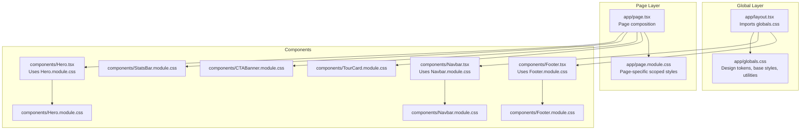
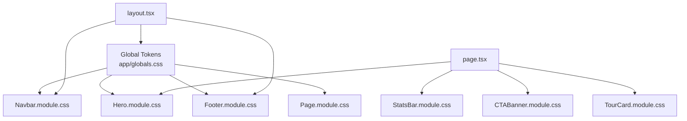
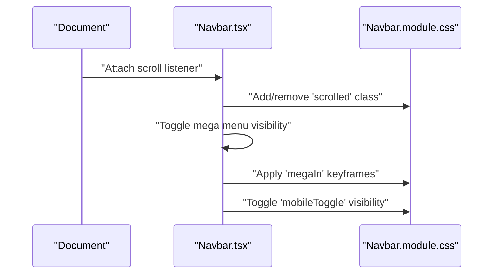
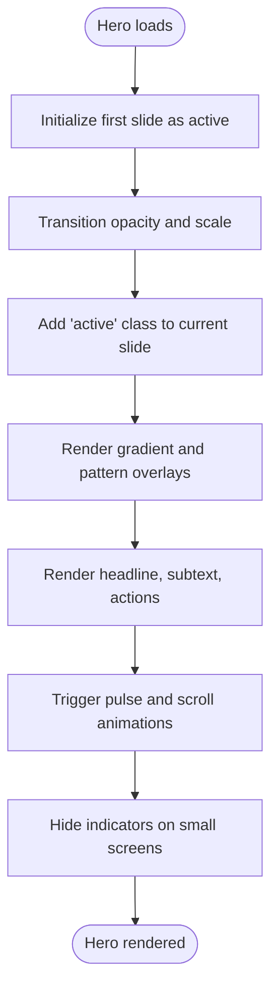
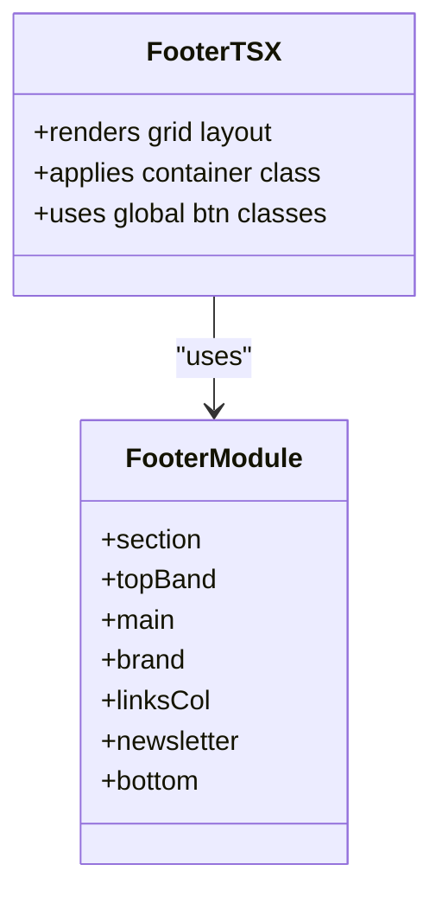
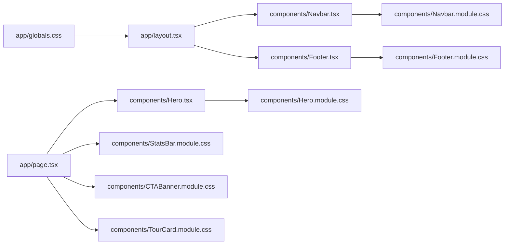

# Styling Architecture

<cite>
**Referenced Files in This Document**
- [app/globals.css](file://app/globals.css)
- [app/layout.tsx](file://app/layout.tsx)
- [app/page.tsx](file://app/page.tsx)
- [app/page.module.css](file://app/page.module.css)
- [components/Navbar.module.css](file://components/Navbar.module.css)
- [components/Navbar.tsx](file://components/Navbar.tsx)
- [components/Hero.module.css](file://components/Hero.module.css)
- [components/Hero.tsx](file://components/Hero.tsx)
- [components/Footer.module.css](file://components/Footer.module.css)
- [components/Footer.tsx](file://components/Footer.tsx)
- [components/CTABanner.module.css](file://components/CTABanner.module.css)
- [components/StatsBar.module.css](file://components/StatsBar.module.css)
- [components/TourCard.module.css](file://components/TourCard.module.css)
- [package.json](file://package.json)
- [next.config.ts](file://next.config.ts)
</cite>

## Table of Contents
1. [Introduction](#introduction)
2. [Project Structure](#project-structure)
3. [Core Components](#core-components)
4. [Architecture Overview](#architecture-overview)
5. [Detailed Component Analysis](#detailed-component-analysis)
6. [Dependency Analysis](#dependency-analysis)
7. [Performance Considerations](#performance-considerations)
8. [Troubleshooting Guide](#troubleshooting-guide)
9. [Conclusion](#conclusion)

## Introduction
This document explains the styling architecture of the project, focusing on CSS Modules for component-scoped styling, global design tokens and typography, animations and transitions, responsive design patterns, and best practices for consistent theming. It demonstrates how each component encapsulates its styles while leveraging shared design tokens and global base styles to maintain a cohesive visual system.

## Project Structure
The styling system is organized around:
- Global baseline styles and design tokens in a single global stylesheet
- Component-specific styles using CSS Modules for scoping and encapsulation
- Shared utility classes applied via container composition
- Animation and transition tokens centralized in the global design system

**Diagram sources**
- [app/layout.tsx:1-28](file://app/layout.tsx#L1-L28)
- [app/globals.css:1-190](file://app/globals.css#L1-L190)
- [app/page.tsx:1-22](file://app/page.tsx#L1-L22)
- [app/page.module.css:1-143](file://app/page.module.css#L1-L143)
- [components/Navbar.tsx:1-113](file://components/Navbar.tsx#L1-L113)
- [components/Navbar.module.css:1-200](file://components/Navbar.module.css#L1-L200)
- [components/Hero.tsx:1-100](file://components/Hero.tsx#L1-L100)
- [components/Hero.module.css:1-254](file://components/Hero.module.css#L1-L254)
- [components/Footer.tsx:1-104](file://components/Footer.tsx#L1-L104)
- [components/Footer.module.css:1-164](file://components/Footer.module.css#L1-L164)
- [components/CTABanner.module.css:1-76](file://components/CTABanner.module.css#L1-L76)
- [components/StatsBar.module.css:1-71](file://components/StatsBar.module.css#L1-L71)
- [components/TourCard.module.css:1-173](file://components/TourCard.module.css#L1-L173)

**Section sources**
- [app/layout.tsx:1-28](file://app/layout.tsx#L1-L28)
- [app/globals.css:1-190](file://app/globals.css#L1-L190)
- [app/page.tsx:1-22](file://app/page.tsx#L1-L22)
- [app/page.module.css:1-143](file://app/page.module.css#L1-L143)

## Core Components
- Global design tokens and base styles: Centralized in the global stylesheet, defining brand colors, typography families, spacing, shadows, and transitions. These tokens are consumed by both global and component styles.
- Component-scoped CSS Modules: Each component imports its own module CSS to ensure class names are locally scoped and avoid conflicts.
- Utility classes: Shared utilities (e.g., container) are applied by composing class names with component classes.
- Animation and transitions: Consistent easing and duration tokens are defined globally and reused across components for motion.

Key implementation references:
- Global tokens and utilities: [app/globals.css:1-190](file://app/globals.css#L1-L190)
- Component imports and usage: [components/Navbar.tsx:5](file://components/Navbar.tsx#L5), [components/Hero.tsx:4](file://components/Hero.tsx#L4), [components/Footer.tsx:4](file://components/Footer.tsx#L4)
- Page-level scoping: [app/page.module.css:1-143](file://app/page.module.css#L1-L143)

**Section sources**
- [app/globals.css:1-190](file://app/globals.css#L1-L190)
- [components/Navbar.tsx:5](file://components/Navbar.tsx#L5)
- [components/Hero.tsx:4](file://components/Hero.tsx#L4)
- [components/Footer.tsx:4](file://components/Footer.tsx#L4)
- [app/page.module.css:1-143](file://app/page.module.css#L1-L143)

## Architecture Overview
The styling architecture follows a layered approach:
- Global layer: Establishes design tokens and base styles, ensuring consistent typography, colors, spacing, and motion.
- Component layer: Uses CSS Modules to scope styles per component, enabling predictable overrides and local changes.
- Composition layer: Pages compose components and apply global utilities (e.g., container) to maintain consistent layout.

**Diagram sources**
- [app/globals.css:1-190](file://app/globals.css#L1-L190)
- [app/layout.tsx:1-28](file://app/layout.tsx#L1-L28)
- [app/page.tsx:1-22](file://app/page.tsx#L1-L22)
- [components/Navbar.module.css:1-200](file://components/Navbar.module.css#L1-L200)
- [components/Hero.module.css:1-254](file://components/Hero.module.css#L1-L254)
- [components/Footer.module.css:1-164](file://components/Footer.module.css#L1-L164)
- [app/page.module.css:1-143](file://app/page.module.css#L1-L143)
- [components/StatsBar.module.css:1-71](file://components/StatsBar.module.css#L1-L71)
- [components/CTABanner.module.css:1-76](file://components/CTABanner.module.css#L1-L76)
- [components/TourCard.module.css:1-173](file://components/TourCard.module.css#L1-L173)

## Detailed Component Analysis

### Global Styles and Design Tokens
- Purpose: Define brand colors, typography families, spacing units, shadow presets, and transition/easing tokens. These are consumed via CSS variables to enable consistent theming across components.
- Usage patterns:
  - Color tokens: Used for backgrounds, borders, and interactive states.
  - Typography tokens: Applied to headings and body text for consistent family and rhythm.
  - Motion tokens: Used to animate transitions and keyframes uniformly.
- Responsive adjustments: Media queries override section padding and container spacing for smaller screens.

References:
- [app/globals.css:3-42](file://app/globals.css#L3-L42) — Design tokens (colors, fonts, spacing, shadows, transitions)
- [app/globals.css:83-190](file://app/globals.css#L83-L190) — Utilities and responsive rules

**Section sources**
- [app/globals.css:1-190](file://app/globals.css#L1-L190)

### Navbar: Scrolling Effects and Animations
- Scrolling behavior: Adds a scrolled class to change background, blur effect, and padding on scroll.
- Dropdown animation: Uses a keyframe to slide in the mega dropdown.
- Responsive toggle: Hides desktop navigation and shows a mobile toggle button below a breakpoint.

**Diagram sources**
- [components/Navbar.tsx:18-38](file://components/Navbar.tsx#L18-L38)
- [components/Navbar.module.css:12-17](file://components/Navbar.module.css#L12-L17)
- [components/Navbar.module.css:96-99](file://components/Navbar.module.css#L96-L99)
- [components/Navbar.module.css:195-200](file://components/Navbar.module.css#L195-L200)

Implementation highlights:
- Scrolling effect: [components/Navbar.tsx:19-28](file://components/Navbar.tsx#L19-L28), [components/Navbar.module.css:12-17](file://components/Navbar.module.css#L12-L17)
- Dropdown animation: [components/Navbar.module.css:96-99](file://components/Navbar.module.css#L96-L99)
- Mobile responsiveness: [components/Navbar.module.css:195-200](file://components/Navbar.module.css#L195-L200)

**Section sources**
- [components/Navbar.tsx:1-113](file://components/Navbar.tsx#L1-L113)
- [components/Navbar.module.css:1-200](file://components/Navbar.module.css#L1-L200)

### Hero: Background Slides, Gradient Overlay, and Pulse Animation
- Background stack: Multiple slides fade in/out with opacity and scaling transforms.
- Overlay gradients and SVG pattern: Enhance contrast and texture.
- Animated elements: Pulsing dot and animated scroll indicator line.
- Responsive adjustments: Hides slide indicators and scroll hint on small screens.

**Diagram sources**
- [components/Hero.tsx:20-97](file://components/Hero.tsx#L20-L97)
- [components/Hero.module.css:11-28](file://components/Hero.module.css#L11-L28)
- [components/Hero.module.css:31-48](file://components/Hero.module.css#L31-L48)
- [components/Hero.module.css:81-84](file://components/Hero.module.css#L81-L84)
- [components/Hero.module.css:243-246](file://components/Hero.module.css#L243-L246)
- [components/Hero.module.css:248-254](file://components/Hero.module.css#L248-L254)

Implementation highlights:
- Background slides: [components/Hero.module.css:11-28](file://components/Hero.module.css#L11-L28)
- Gradient overlay: [components/Hero.module.css:31-41](file://components/Hero.module.css#L31-L41)
- Pulse animation: [components/Hero.module.css:81-84](file://components/Hero.module.css#L81-L84)
- Scroll indicator animation: [components/Hero.module.css:243-246](file://components/Hero.module.css#L243-L246)
- Responsive behavior: [components/Hero.module.css:248-254](file://components/Hero.module.css#L248-L254)

**Section sources**
- [components/Hero.tsx:1-100](file://components/Hero.tsx#L1-L100)
- [components/Hero.module.css:1-254](file://components/Hero.module.css#L1-L254)

### Footer: Grid Layout, Animated Band, and Focus States
- Grid-based layout: Responsive four-column structure with media queries for smaller screens.
- Animated top band: Shimmer animation across a multi-hue gradient.
- Interactive focus states: Inputs and buttons use global transition tokens for smooth feedback.
- Utility composition: Uses the global container class for consistent horizontal spacing.

**Diagram sources**
- [components/Footer.tsx:25-101](file://components/Footer.tsx#L25-L101)
- [components/Footer.module.css:1-164](file://components/Footer.module.css#L1-L164)

Implementation highlights:
- Grid layout: [components/Footer.module.css:19-23](file://components/Footer.module.css#L19-L23)
- Shimmer animation: [components/Footer.module.css:13-16](file://components/Footer.module.css#L13-L16)
- Focus states: [components/Footer.module.css:115-117](file://components/Footer.module.css#L115-L117)
- Responsive grid: [components/Footer.module.css:156-163](file://components/Footer.module.css#L156-L163)

**Section sources**
- [components/Footer.tsx:1-104](file://components/Footer.tsx#L1-L104)
- [components/Footer.module.css:1-164](file://components/Footer.module.css#L1-L164)

### Page-Level Scoping and Dark Mode
- Page module CSS defines page-level variables and layout containers.
- Uses prefers-color-scheme media queries to adapt colors for dark mode.
- Composes with global utilities for consistent padding and typography.

References:
- [app/page.module.css:1-143](file://app/page.module.css#L1-L143)

**Section sources**
- [app/page.module.css:1-143](file://app/page.module.css#L1-L143)

### Additional Components: CTABanner, StatsBar, TourCard
- CTABanner: Uses global tokens for background and gradient overlays; responsive action layout.
- StatsBar: Gradient background with radial accent and responsive grid.
- TourCard: Hover effects, image scaling, and overlay content with global shadow and transition tokens.

References:
- [components/CTABanner.module.css:1-76](file://components/CTABanner.module.css#L1-L76)
- [components/StatsBar.module.css:1-71](file://components/StatsBar.module.css#L1-L71)
- [components/TourCard.module.css:1-173](file://components/TourCard.module.css#L1-L173)

**Section sources**
- [components/CTABanner.module.css:1-76](file://components/CTABanner.module.css#L1-L76)
- [components/StatsBar.module.css:1-71](file://components/StatsBar.module.css#L1-L71)
- [components/TourCard.module.css:1-173](file://components/TourCard.module.css#L1-L173)

## Dependency Analysis
- Global stylesheet dependency: The root layout imports the global stylesheet to seed design tokens and utilities for all pages and components.
- Component imports: Each component imports its CSS Module to scope styles and access design tokens.
- Utility composition: Components apply global utility classes (e.g., container) to maintain consistent layout.
- Animation dependencies: Components rely on global transition and easing tokens for consistent motion.

**Diagram sources**
- [app/layout.tsx:1-28](file://app/layout.tsx#L1-L28)
- [app/globals.css:1-190](file://app/globals.css#L1-L190)
- [app/page.tsx:1-22](file://app/page.tsx#L1-L22)
- [components/Navbar.tsx:1-113](file://components/Navbar.tsx#L1-L113)
- [components/Hero.tsx:1-100](file://components/Hero.tsx#L1-L100)
- [components/Footer.tsx:1-104](file://components/Footer.tsx#L1-L104)
- [components/Navbar.module.css:1-200](file://components/Navbar.module.css#L1-L200)
- [components/Hero.module.css:1-254](file://components/Hero.module.css#L1-L254)
- [components/Footer.module.css:1-164](file://components/Footer.module.css#L1-L164)

**Section sources**
- [app/layout.tsx:1-28](file://app/layout.tsx#L1-L28)
- [app/globals.css:1-190](file://app/globals.css#L1-L190)
- [app/page.tsx:1-22](file://app/page.tsx#L1-L22)

## Performance Considerations
- CSS Modules scoping: Encapsulated styles reduce cascade complexity and improve render predictability.
- Motion tokens: Centralized easing and durations minimize repeated declarations and ensure smooth performance.
- Image handling: Components use modern CSS features (object-fit, backdrop-filter) with appropriate fallbacks; consider lazy-loading for hero images in larger implementations.
- Utility composition: Using a single container class reduces duplication and keeps layout logic centralized.

[No sources needed since this section provides general guidance]

## Troubleshooting Guide
- Conflicts between global and component styles:
  - Ensure component classes are imported and applied via CSS Modules to avoid global leakage.
  - Verify that global utilities (e.g., container) are applied alongside component classes.
- Animation not playing:
  - Confirm keyframes are defined in the component’s module CSS and referenced by the component’s class.
  - Check that transition tokens are defined in the global stylesheet.
- Responsive breakpoints:
  - Review media queries in both global and component CSS to ensure consistent breakpoints.
  - Validate that container widths and paddings adjust appropriately across screen sizes.
- Dark mode differences:
  - Confirm prefers-color-scheme media queries are present in page-level CSS and adjust variables accordingly.

**Section sources**
- [components/Navbar.module.css:96-99](file://components/Navbar.module.css#L96-L99)
- [components/Hero.module.css:81-84](file://components/Hero.module.css#L81-L84)
- [components/Hero.module.css:243-246](file://components/Hero.module.css#L243-L246)
- [app/globals.css:185-190](file://app/globals.css#L185-L190)
- [app/page.module.css:126-142](file://app/page.module.css#L126-L142)

## Conclusion
The project employs a robust styling architecture:
- Global design tokens and utilities establish a consistent foundation.
- CSS Modules provide component-scoped styles, preventing conflicts and enabling maintainable overrides.
- Animations and transitions leverage centralized motion tokens for coherent user experiences.
- Responsive patterns and utility composition ensure layouts remain consistent across breakpoints.
Adhering to these patterns will help preserve visual coherence and scalability as the project evolves.