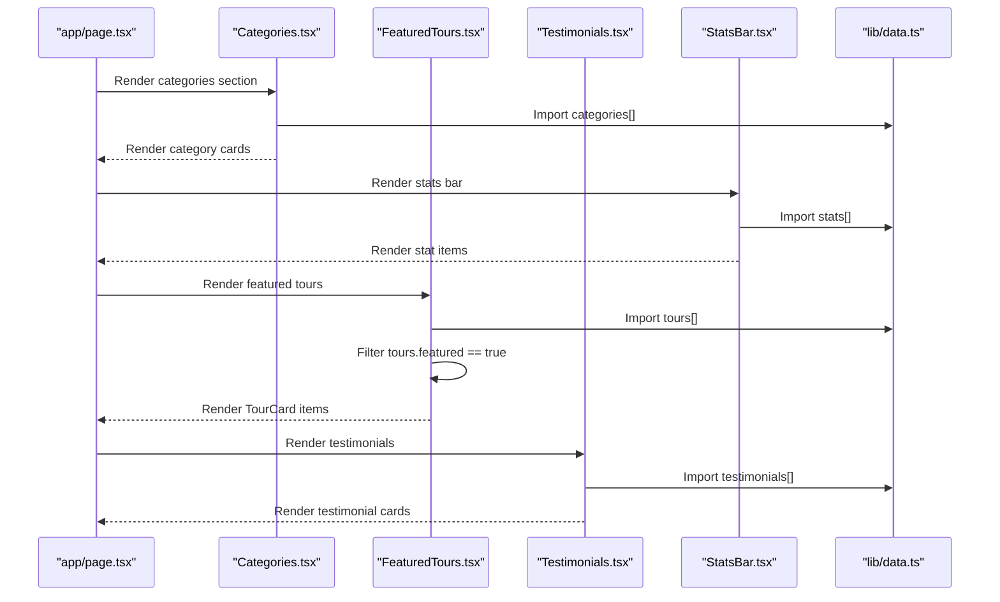
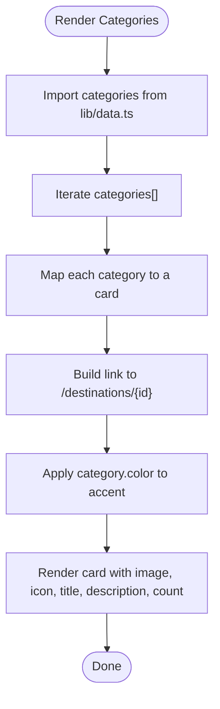
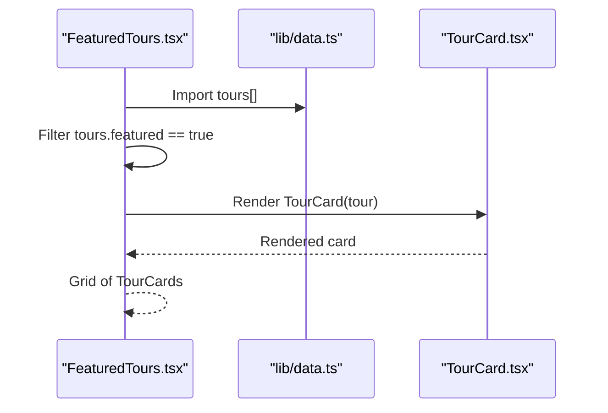
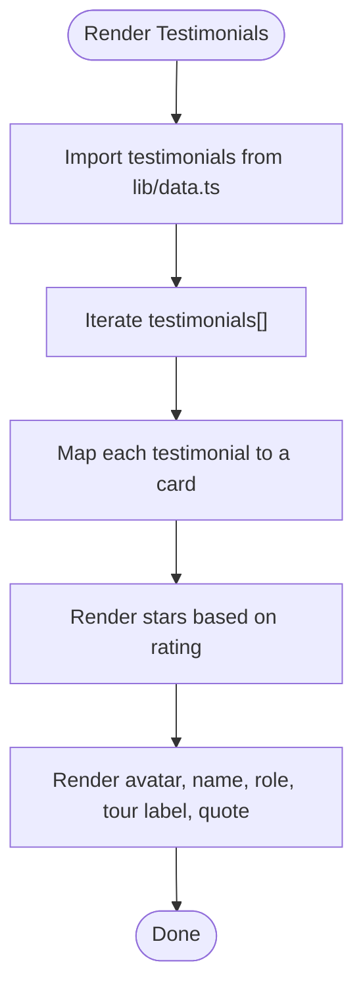
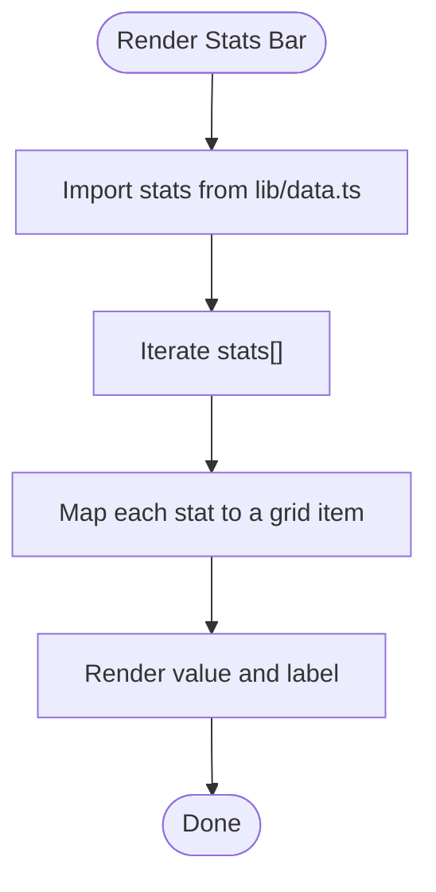
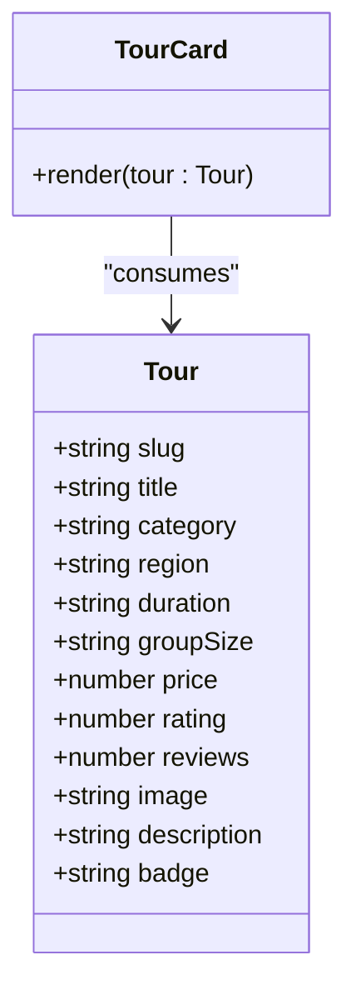
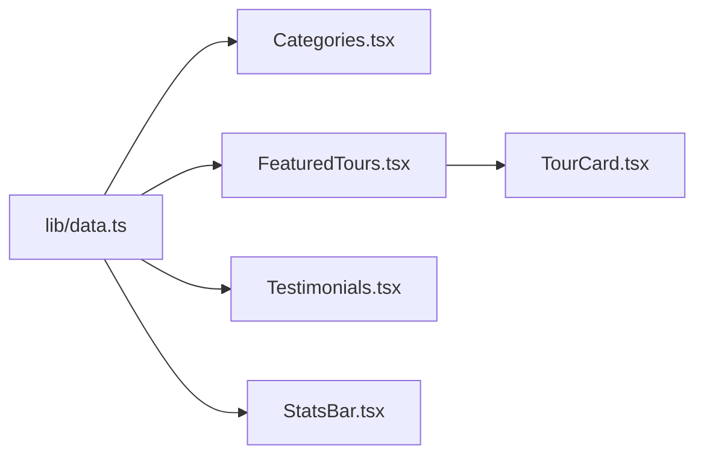

# Data Management

<cite>
**Referenced Files in This Document**
- [lib/data.ts](file://lib/data.ts)
- [components/Categories.tsx](file://components/Categories.tsx)
- [components/FeaturedTours.tsx](file://components/FeaturedTours.tsx)
- [components/Testimonials.tsx](file://components/Testimonials.tsx)
- [components/StatsBar.tsx](file://components/StatsBar.tsx)
- [components/TourCard.tsx](file://components/TourCard.tsx)
- [app/page.tsx](file://app/page.tsx)
- [package.json](file://package.json)
</cite>

## Table of Contents
1. [Introduction](#introduction)
2. [Project Structure](#project-structure)
3. [Core Components](#core-components)
4. [Architecture Overview](#architecture-overview)
5. [Detailed Component Analysis](#detailed-component-analysis)
6. [Dependency Analysis](#dependency-analysis)
7. [Performance Considerations](#performance-considerations)
8. [Troubleshooting Guide](#troubleshooting-guide)
9. [Conclusion](#conclusion)
10. [Appendices](#appendices)

## Introduction
This document explains the centralized data management for the NatIndia project. It focuses on the central data module in lib/data.ts, detailing the data models for categories, tours, testimonials, and statistics. It describes how components consume this data, the type-safe patterns used, and practical guidance for updates, extensibility, and content authoring workflows.

## Project Structure
The data model is defined centrally and consumed by multiple UI components. The home page composes several sections that render data from lib/data.ts.

```mermaid
graph TB
subgraph "App"
Page["app/page.tsx"]
end
subgraph "Components"
Cat["components/Categories.tsx"]
FT["components/FeaturedTours.tsx"]
Tst["components/Testimonials.tsx"]
Stat["components/StatsBar.tsx"]
TC["components/TourCard.tsx"]
end
subgraph "Data"
Data["lib/data.ts"]
end
Page --> Cat
Page --> Stat
Page --> FT
Page --> Tst
Cat --> Data
FT --> Data
Tst --> Data
Stat --> Data
FT --> TC
```

**Diagram sources**
- [app/page.tsx:1-22](file://app/page.tsx#L1-L22)
- [components/Categories.tsx:1-47](file://components/Categories.tsx#L1-L47)
- [components/FeaturedTours.tsx:1-34](file://components/FeaturedTours.tsx#L1-L34)
- [components/Testimonials.tsx:1-41](file://components/Testimonials.tsx#L1-L41)
- [components/StatsBar.tsx:1-21](file://components/StatsBar.tsx#L1-L21)
- [components/TourCard.tsx:1-63](file://components/TourCard.tsx#L1-L63)
- [lib/data.ts:1-252](file://lib/data.ts#L1-L252)

**Section sources**
- [app/page.tsx:1-22](file://app/page.tsx#L1-L22)

## Core Components
This section documents the centralized data structure and the models used across the application.

- categories: An array of category objects representing tour themes. Each category includes identifiers, metadata, branding attributes, and counts.
- tours: An array of tour objects representing specific journeys. Each tour includes identifiers, categorization, pricing, ratings, images, and descriptive content.
- testimonials: An array of guest testimonial objects. Each testimonial includes identifiers, author profile, tour association, rating, and quoted text.
- stats: An array of statistic objects used for highlighting company capabilities and achievements.

Key characteristics:
- Centralized definition: All arrays are exported from lib/data.ts and imported by components.
- Static data: Data is embedded directly in the source code, enabling fast SSR and avoiding network latency.
- Type-safe consumption: Components import and iterate over these arrays, relying on TypeScript’s inference from the static structure.

Validation rules observed in the data:
- Unique identifiers:
  - categories.id must be unique across entries.
  - tours.slug must be unique across entries.
  - testimonials.id must be unique across entries.
- Consistent types:
  - Numeric fields such as tours.price, tours.rating, tours.reviews are numbers.
  - tours.featured is a boolean flag used to filter featured items.
  - tours.badge is optional and may be omitted.
  - testimonials.rating is a numeric score used to render star icons.
- String fields:
  - titles, descriptions, regions, durations, group sizes, labels, values, and image URLs are strings.
- Optional fields:
  - tours.badge is optional.
  - testimonials.tour is present in the dataset; however, the model does not enforce it as required.

Data relationships:
- tours.category references categories.id to associate a tour with a category theme.
- testimonials.tour associates a testimonial with a specific tour title.

**Section sources**
- [lib/data.ts:1-252](file://lib/data.ts#L1-L252)

## Architecture Overview
The data flow follows a unidirectional path from the central data module to UI components. Components import the arrays and render them directly. Filtering and selection logic (for example, selecting featured tours) is performed inside components.



**Diagram sources**
- [app/page.tsx:1-22](file://app/page.tsx#L1-L22)
- [components/Categories.tsx:1-47](file://components/Categories.tsx#L1-L47)
- [components/FeaturedTours.tsx:1-34](file://components/FeaturedTours.tsx#L1-L34)
- [components/Testimonials.tsx:1-41](file://components/Testimonials.tsx#L1-L41)
- [components/StatsBar.tsx:1-21](file://components/StatsBar.tsx#L1-L21)
- [lib/data.ts:1-252](file://lib/data.ts#L1-L252)

## Detailed Component Analysis

### Categories Section
Purpose:
- Renders a grid of category cards, each linking to a destination route derived from the category id.

Data consumption:
- Imports categories from lib/data.ts.
- Iterates over categories to render cards with title, description, icon, count, and image.
- Uses category.color to apply accent styling.

Validation and relationships:
- Relies on categories.id for routing and categories.count for display.



**Diagram sources**
- [components/Categories.tsx:1-47](file://components/Categories.tsx#L1-L47)
- [lib/data.ts:1-74](file://lib/data.ts#L1-L74)

**Section sources**
- [components/Categories.tsx:1-47](file://components/Categories.tsx#L1-L47)
- [lib/data.ts:1-74](file://lib/data.ts#L1-L74)

### Featured Tours Section
Purpose:
- Displays a curated subset of tours marked as featured.

Data consumption:
- Imports tours from lib/data.ts.
- Filters tours where featured is true.
- Renders each tour using TourCard.

Validation and relationships:
- Uses tours.slug for navigation.
- Uses tours.category to associate with categories.



**Diagram sources**
- [components/FeaturedTours.tsx:1-34](file://components/FeaturedTours.tsx#L1-L34)
- [components/TourCard.tsx:1-63](file://components/TourCard.tsx#L1-L63)
- [lib/data.ts:76-205](file://lib/data.ts#L76-L205)

**Section sources**
- [components/FeaturedTours.tsx:1-34](file://components/FeaturedTours.tsx#L1-L34)
- [components/TourCard.tsx:1-63](file://components/TourCard.tsx#L1-L63)
- [lib/data.ts:76-205](file://lib/data.ts#L76-L205)

### Testimonials Section
Purpose:
- Presents guest stories with star ratings and associated tour information.

Data consumption:
- Imports testimonials from lib/data.ts.
- Renders each testimonial with avatar, name, role, tour label, and quoted text.
- Renders stars based on testimonials.rating.

Validation and relationships:
- Uses testimonials.id as the unique key for rendering.
- Uses testimonials.tour to indicate which tour the testimonial refers to.



**Diagram sources**
- [components/Testimonials.tsx:1-41](file://components/Testimonials.tsx#L1-L41)
- [lib/data.ts:207-244](file://lib/data.ts#L207-L244)

**Section sources**
- [components/Testimonials.tsx:1-41](file://components/Testimonials.tsx#L1-L41)
- [lib/data.ts:207-244](file://lib/data.ts#L207-L244)

### Stats Bar
Purpose:
- Displays key metrics about the company’s expertise and reach.

Data consumption:
- Imports stats from lib/data.ts.
- Renders a grid of stat items with value and label.

Validation and relationships:
- Uses stats.label as the key for iteration.



**Diagram sources**
- [components/StatsBar.tsx:1-21](file://components/StatsBar.tsx#L1-L21)
- [lib/data.ts:246-251](file://lib/data.ts#L246-L251)

**Section sources**
- [components/StatsBar.tsx:1-21](file://components/StatsBar.tsx#L1-L21)
- [lib/data.ts:246-251](file://lib/data.ts#L246-L251)

### TourCard Component
Purpose:
- Reusable card for displaying tour details.

Type model:
- Defines a local TypeScript type Tour with fields for slug, title, category, region, duration, groupSize, price, rating, reviews, optional badge, image, and description.

Data consumption:
- Receives a single tour object and renders details including region, rating, duration, group size, price, and optional badge.

Validation and relationships:
- Uses tour.slug for navigation.
- Uses tour.category to associate with categories.



**Diagram sources**
- [components/TourCard.tsx:6-19](file://components/TourCard.tsx#L6-L19)

**Section sources**
- [components/TourCard.tsx:1-63](file://components/TourCard.tsx#L1-L63)

## Dependency Analysis
- Centralized data module: lib/data.ts exports four arrays used by multiple components.
- Component imports: Each component imports the arrays it needs, establishing a unidirectional dependency from components to lib/data.ts.
- No internal state management: Data is static and not managed by a global state library; filtering and selection occur inside components.
- Routing dependencies: Components rely on category ids and tour slugs for navigation.



**Diagram sources**
- [lib/data.ts:1-252](file://lib/data.ts#L1-L252)
- [components/Categories.tsx:1-47](file://components/Categories.tsx#L1-L47)
- [components/FeaturedTours.tsx:1-34](file://components/FeaturedTours.tsx#L1-L34)
- [components/Testimonials.tsx:1-41](file://components/Testimonials.tsx#L1-L41)
- [components/StatsBar.tsx:1-21](file://components/StatsBar.tsx#L1-L21)
- [components/TourCard.tsx:1-63](file://components/TourCard.tsx#L1-L63)

**Section sources**
- [lib/data.ts:1-252](file://lib/data.ts#L1-L252)
- [components/Categories.tsx:1-47](file://components/Categories.tsx#L1-L47)
- [components/FeaturedTours.tsx:1-34](file://components/FeaturedTours.tsx#L1-L34)
- [components/Testimonials.tsx:1-41](file://components/Testimonials.tsx#L1-L41)
- [components/StatsBar.tsx:1-21](file://components/StatsBar.tsx#L1-L21)
- [components/TourCard.tsx:1-63](file://components/TourCard.tsx#L1-L63)

## Performance Considerations
- Static data loading: Data is bundled statically, minimizing network requests and enabling fast initial rendering.
- Minimal computation: Filtering for featured tours occurs in-memory on the client, which is efficient for small datasets.
- Image optimization: Components use lazy loading for images, reducing initial payload.
- Scalability note: As datasets grow, consider pagination, virtualized lists, or server-side filtering to keep UI responsive.

## Troubleshooting Guide
Common issues and resolutions:
- Duplicate identifiers:
  - Symptom: Navigation or rendering anomalies when ids/slug are duplicated.
  - Resolution: Ensure categories.id, tours.slug, and testimonials.id remain unique.
- Type mismatches:
  - Symptom: Unexpected behavior when numeric fields are strings or vice versa.
  - Resolution: Verify numeric fields (price, rating, reviews) are numbers; string fields are strings.
- Missing optional fields:
  - Symptom: Badge not displayed or star rendering issues.
  - Resolution: Confirm optional fields like tours.badge and testimonials.rating are handled gracefully in components.
- Routing errors:
  - Symptom: Links to destinations or tours fail.
  - Resolution: Ensure category ids and tour slugs match the routes used by the application.

**Section sources**
- [lib/data.ts:1-252](file://lib/data.ts#L1-L252)
- [components/Categories.tsx:1-47](file://components/Categories.tsx#L1-L47)
- [components/FeaturedTours.tsx:1-34](file://components/FeaturedTours.tsx#L1-L34)
- [components/Testimonials.tsx:1-41](file://components/Testimonials.tsx#L1-L41)
- [components/StatsBar.tsx:1-21](file://components/StatsBar.tsx#L1-L21)
- [components/TourCard.tsx:1-63](file://components/TourCard.tsx#L1-L63)

## Conclusion
NatIndia’s data management relies on a centralized, static data module that is consumed directly by components. This approach delivers simplicity, predictability, and strong developer ergonomics through TypeScript inference. The current design supports straightforward updates and content authoring while maintaining type safety and fast rendering. Future enhancements can introduce formal TypeScript interfaces, content validation, and modular content management without disrupting existing consumers.

## Appendices

### Data Model Definitions
- categories: Array of category objects with fields for id, title, description, image, count, color, and icon.
- tours: Array of tour objects with fields for slug, title, category, region, duration, groupSize, price, rating, reviews, optional badge, image, and description.
- testimonials: Array of testimonial objects with fields for id, name, role, avatar, tour, rating, and text.
- stats: Array of stat objects with fields for value and label.

Validation rules:
- Unique identifiers across arrays.
- Numeric fields validated for type correctness.
- Optional fields handled gracefully in components.

**Section sources**
- [lib/data.ts:1-252](file://lib/data.ts#L1-L252)

### Content Management Strategies
- Centralized editing: Modify data in lib/data.ts to update UI across components.
- Incremental updates: Add new entries to arrays and ensure unique identifiers.
- Content authoring workflow:
  - Prepare assets (images, avatars) and ensure URLs are valid.
  - Add or update entries with consistent types and relationships.
  - Verify component rendering and navigation links.

**Section sources**
- [lib/data.ts:1-252](file://lib/data.ts#L1-L252)

### Extensibility and Future Enhancements
- Formal TypeScript interfaces: Define explicit interfaces for categories, tours, testimonials, and stats to improve type safety and IDE support.
- Validation layer: Introduce runtime validation or build-time checks to enforce data contracts.
- Modular content: Split large arrays into smaller modules per region or theme for maintainability.
- State management: Introduce a lightweight state container if dynamic filtering or caching becomes necessary.
- Content editor: Provide a simple admin interface or CMS integration to manage data without code changes.

**Section sources**
- [lib/data.ts:1-252](file://lib/data.ts#L1-L252)
- [package.json:10-22](file://package.json#L10-L22)