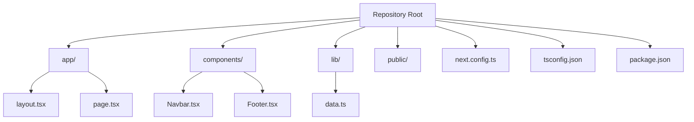
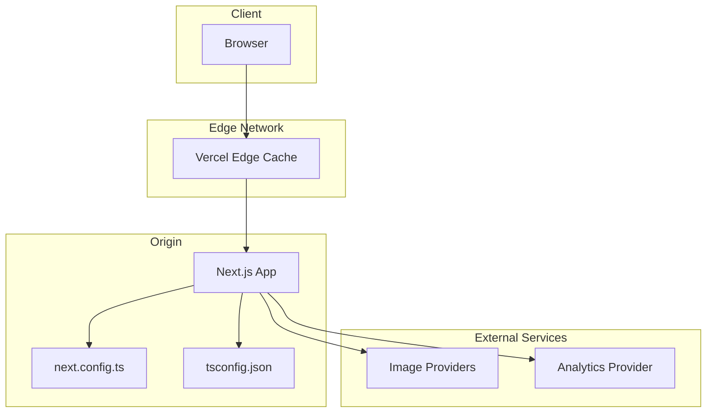
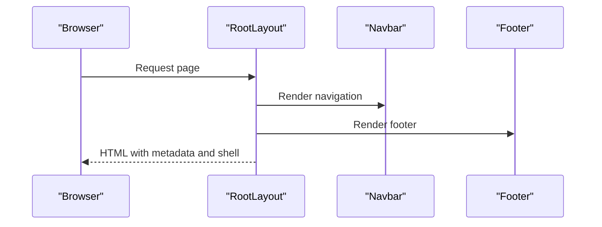
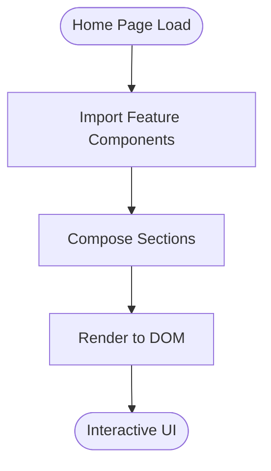
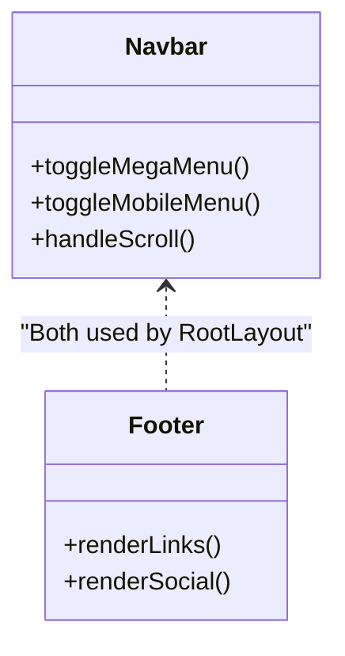
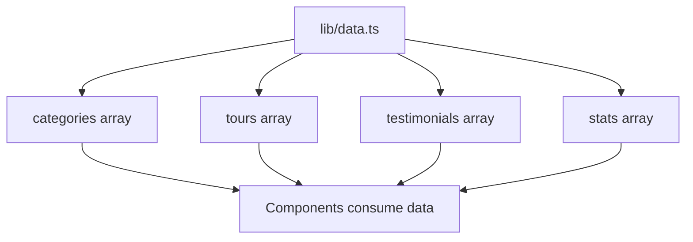
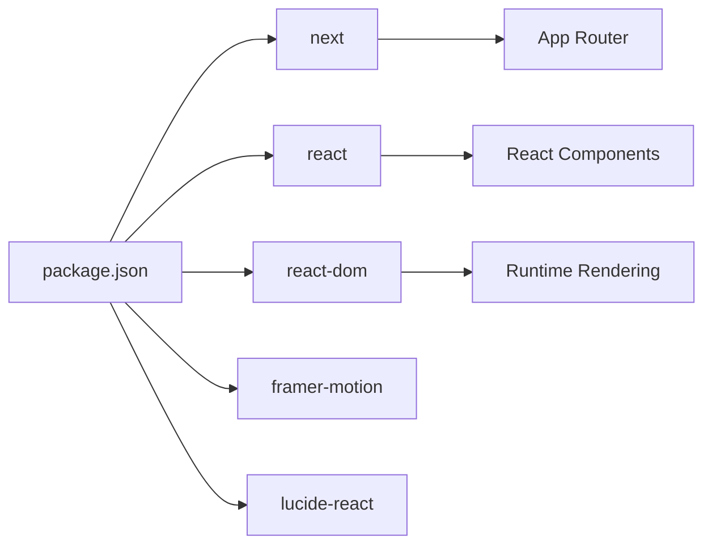

# Deployment & Production

<cite>
**Referenced Files in This Document**
- [package.json](file://package.json)
- [next.config.ts](file://next.config.ts)
- [tsconfig.json](file://tsconfig.json)
- [README.md](file://README.md)
- [app/layout.tsx](file://app/layout.tsx)
- [app/page.tsx](file://app/page.tsx)
- [lib/data.ts](file://lib/data.ts)
- [components/Navbar.tsx](file://components/Navbar.tsx)
- [components/Footer.tsx](file://components/Footer.tsx)
</cite>

## Table of Contents
1. [Introduction](#introduction)
2. [Project Structure](#project-structure)
3. [Core Components](#core-components)
4. [Architecture Overview](#architecture-overview)
5. [Detailed Component Analysis](#detailed-component-analysis)
6. [Dependency Analysis](#dependency-analysis)
7. [Performance Considerations](#performance-considerations)
8. [Troubleshooting Guide](#troubleshooting-guide)
9. [Conclusion](#conclusion)
10. [Appendices](#appendices)

## Introduction
This document provides comprehensive deployment guidance for the NatIndia project, focusing on Vercel deployment, environment configuration, build optimization, continuous deployment, production build configuration, asset optimization, performance monitoring, environment variable management, API integration setup, external service connections, CDN configuration, caching strategies, edge computing benefits, troubleshooting, rollback procedures, monitoring setup, scaling considerations, performance benchmarking, maintenance procedures, custom domain setup, SSL certificate management, and analytics integration.

The project is a Next.js 16 application using TypeScript and modern React components. It is structured using the App Router pattern with a global layout and page composition. The repository includes a minimal Next.js configuration file and a TypeScript configuration that enables strict type checking and bundler module resolution.

## Project Structure
The repository follows a conventional Next.js structure with the App Router. Key areas relevant to deployment and production:
- Application entry points and routing are defined under the app directory.
- Global styles and metadata are configured in the root layout.
- Page composition aggregates reusable components.
- Static assets are served from the public directory.
- Build-time configuration is centralized in next.config.ts and tsconfig.json.
- Environment variables are managed via Vercel’s project settings and runtime environment.

**Diagram sources**
- [app/layout.tsx:1-28](file://app/layout.tsx#L1-L28)
- [app/page.tsx:1-22](file://app/page.tsx#L1-L22)
- [components/Navbar.tsx:1-113](file://components/Navbar.tsx#L1-L113)
- [components/Footer.tsx:1-104](file://components/Footer.tsx#L1-L104)
- [lib/data.ts:1-252](file://lib/data.ts#L1-L252)
- [next.config.ts:1-8](file://next.config.ts#L1-L8)
- [tsconfig.json:1-35](file://tsconfig.json#L1-L35)
- [package.json:1-24](file://package.json#L1-L24)

**Section sources**
- [app/layout.tsx:1-28](file://app/layout.tsx#L1-L28)
- [app/page.tsx:1-22](file://app/page.tsx#L1-L22)
- [next.config.ts:1-8](file://next.config.ts#L1-L8)
- [tsconfig.json:1-35](file://tsconfig.json#L1-L35)
- [package.json:1-24](file://package.json#L1-L24)

## Core Components
This section outlines the core components relevant to deployment and production readiness:
- Global layout and metadata: Defines site-wide metadata and wraps pages with shared navigation and footer.
- Home page composition: Aggregates feature sections and showcases content.
- Navigation and footer: Provide internal linking and branding; these influence SEO and navigation performance.
- Data library: Contains static content arrays used across the site; these are embedded in the client bundle and affect initial payload size.

Key deployment-relevant observations:
- The layout sets global metadata and includes a navigation bar and footer, which are rendered on every page and contribute to First Contentful Paint (FCP) and Largest Contentful Paint (LCP) metrics.
- The home page composes multiple feature components, increasing initial render complexity and hydration time.
- The data library exports arrays of categories, tours, testimonials, and statistics. These arrays are imported directly into components and increase the client-side JavaScript bundle size.

**Section sources**
- [app/layout.tsx:6-15](file://app/layout.tsx#L6-L15)
- [app/page.tsx:1-22](file://app/page.tsx#L1-L22)
- [components/Navbar.tsx:1-113](file://components/Navbar.tsx#L1-L113)
- [components/Footer.tsx:1-104](file://components/Footer.tsx#L1-L104)
- [lib/data.ts:1-252](file://lib/data.ts#L1-L252)

## Architecture Overview
The production architecture leverages Vercel’s platform for hosting, edge computing, and automatic HTTPS. The application uses Next.js App Router with static generation and client-side rendering. Assets are optimized by Next.js and served via Vercel’s CDN.

**Diagram sources**
- [next.config.ts:1-8](file://next.config.ts#L1-L8)
- [tsconfig.json:1-35](file://tsconfig.json#L1-L35)
- [README.md:32-36](file://README.md#L32-L36)

## Detailed Component Analysis

### Global Layout and Metadata
The global layout defines site metadata and wraps all pages with a shared navbar and footer. This impacts SEO, social sharing, and perceived performance.

**Diagram sources**
- [app/layout.tsx:17-27](file://app/layout.tsx#L17-L27)
- [components/Navbar.tsx:18-113](file://components/Navbar.tsx#L18-L113)
- [components/Footer.tsx:25-104](file://components/Footer.tsx#L25-L104)

**Section sources**
- [app/layout.tsx:6-15](file://app/layout.tsx#L6-L15)
- [app/layout.tsx:17-27](file://app/layout.tsx#L17-L27)

### Home Page Composition
The home page composes multiple feature sections. Understanding this composition helps estimate initial payload and hydration costs.

**Diagram sources**
- [app/page.tsx:1-22](file://app/page.tsx#L1-L22)

**Section sources**
- [app/page.tsx:1-22](file://app/page.tsx#L1-L22)

### Navigation and Footer
Navigation and footer components provide internal linking and branding. Their client-side interactivity influences First Interactive (TTI) and Total Blocking Time (TBT).

**Diagram sources**
- [components/Navbar.tsx:1-113](file://components/Navbar.tsx#L1-L113)
- [components/Footer.tsx:1-104](file://components/Footer.tsx#L1-L104)

**Section sources**
- [components/Navbar.tsx:1-113](file://components/Navbar.tsx#L1-L113)
- [components/Footer.tsx:1-104](file://components/Footer.tsx#L1-L104)

### Data Library
The data library exports arrays used across the site. These arrays are embedded in the client bundle and affect initial JavaScript size.

**Diagram sources**
- [lib/data.ts:1-252](file://lib/data.ts#L1-L252)

**Section sources**
- [lib/data.ts:1-252](file://lib/data.ts#L1-L252)

## Dependency Analysis
The project relies on Next.js 16, React 19, and TypeScript. The dependency graph is straightforward, with minimal external dependencies.

**Diagram sources**
- [package.json:10-22](file://package.json#L10-L22)

**Section sources**
- [package.json:1-24](file://package.json#L1-L24)

## Performance Considerations
Production performance hinges on build optimization, asset delivery, and runtime efficiency. The following recommendations apply to the current codebase:

- Build optimization
  - Enable Next.js automatic optimizations by default. Keep next.config.ts minimal and avoid unnecessary transformations.
  - Use dynamic imports for heavy components to reduce initial bundle size.
  - Prefer client components only when necessary; leverage server-rendered pages for content-heavy routes.

- Asset optimization
  - Utilize Next.js Image component for responsive images and automatic optimization.
  - Serve images from reliable CDNs; ensure image providers support compression and resizing.
  - Minimize third-party fonts and preload only essential ones.

- Runtime efficiency
  - Defer non-critical JavaScript to reduce main thread work during initial load.
  - Use React.lazy and Suspense for feature sections that are not immediately visible.
  - Optimize navigation by avoiding heavy computations in Navbar and Footer on scroll.

- Monitoring
  - Integrate Vercel Analytics or a similar provider to track performance metrics.
  - Monitor Core Web Vitals (LCP, FID, CLS) and server response times.

[No sources needed since this section provides general guidance]

## Troubleshooting Guide
Common deployment and runtime issues and their resolutions:

- Build failures
  - Verify Node.js and npm versions match the project requirements.
  - Clear node_modules and reinstall dependencies if builds fail intermittently.
  - Ensure next.config.ts remains minimal and does not introduce unsupported options.

- Runtime errors
  - Check console logs in Vercel dashboard for unhandled exceptions.
  - Validate environment variables are correctly set in Vercel project settings.
  - Confirm all imports resolve correctly; avoid circular dependencies.

- Performance regressions
  - Compare Lighthouse scores before and after changes.
  - Audit bundle size using Next.js telemetry or webpack-bundle-analyzer.
  - Review component composition in app/page.tsx for unnecessary re-renders.

- Rollback procedures
  - Use Vercel’s Git integration to revert to a previous commit.
  - Tag releases in Git to facilitate quick rollbacks.
  - Keep a staging environment synchronized with production for testing rollbacks.

**Section sources**
- [next.config.ts:1-8](file://next.config.ts#L1-L8)
- [README.md:32-36](file://README.md#L32-L36)

## Conclusion
The NatIndia project is well-positioned for production deployment on Vercel. Its minimal Next.js configuration, strict TypeScript setup, and modular component structure support scalable and maintainable deployments. By leveraging Vercel’s edge network, CDN, and analytics, combined with the performance recommendations in this document, the project can achieve strong performance, reliability, and operational efficiency.

[No sources needed since this section summarizes without analyzing specific files]

## Appendices

### Vercel Deployment Checklist
- Configure project on Vercel and connect the repository.
- Set environment variables in Vercel project settings.
- Enable automatic preview deployments for pull requests.
- Configure custom domains and SSL certificates in Vercel.
- Enable analytics and monitoring integrations.
- Set up branch protection and pre-deployment checks.

**Section sources**
- [README.md:32-36](file://README.md#L32-L36)

### Environment Variables Management
- Define variables in Vercel’s project settings under Environment Variables.
- Use NEXT_PUBLIC_ prefix for client-side consumption.
- Store secrets securely and avoid committing sensitive values to the repository.

[No sources needed since this section provides general guidance]

### API Integration Setup
- For future API needs, expose endpoints under app/api and secure them appropriately.
- Use Vercel Functions for lightweight serverless logic.
- Implement proper error handling and logging.

[No sources needed since this section provides general guidance]

### External Service Connections
- Connect analytics providers via environment variables and client-side SDKs.
- Ensure privacy-compliant tracking and consent mechanisms.
- Monitor external service health and set up alerts.

[No sources needed since this section provides general guidance]

### CDN Configuration and Edge Computing
- Rely on Vercel’s global CDN for static assets and ISR-generated content.
- Use edge functions for low-latency logic near users.
- Configure cache policies for optimal balance between freshness and performance.

[No sources needed since this section provides general guidance]

### Scaling Considerations
- Monitor traffic patterns and enable autoscaling in Vercel.
- Use preview deployments for feature branches to test scale.
- Optimize database queries and external API calls if integrated later.

[No sources needed since this section provides general guidance]

### Performance Benchmarking
- Establish baselines using Lighthouse, Pagespeed Insights, and Vercel Analytics.
- Track Core Web Vitals and server response times.
- Conduct periodic audits and iterate on optimizations.

[No sources needed since this section provides general guidance]

### Maintenance Procedures
- Regularly update dependencies and monitor for security advisories.
- Back up configuration and environment variables.
- Document deployment steps and maintain a runbook for incidents.

[No sources needed since this section provides general guidance]

### Custom Domain and SSL
- Add custom domain in Vercel project settings.
- Configure DNS records and SSL certificate provisioning.
- Enable automatic redirects from HTTP to HTTPS.

**Section sources**
- [README.md:32-36](file://README.md#L32-L36)