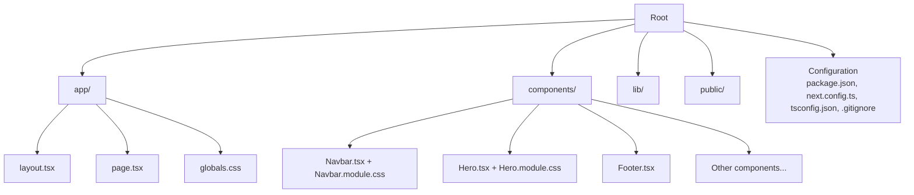
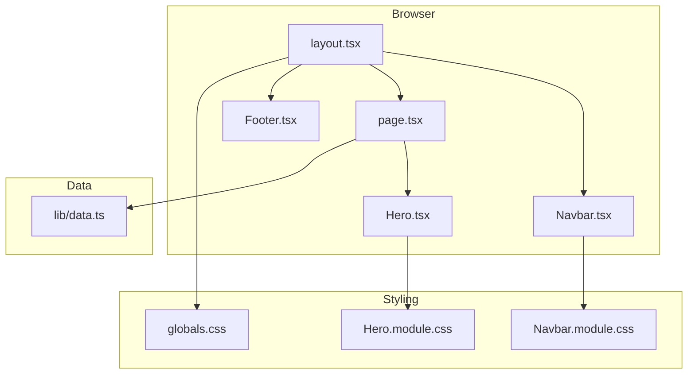
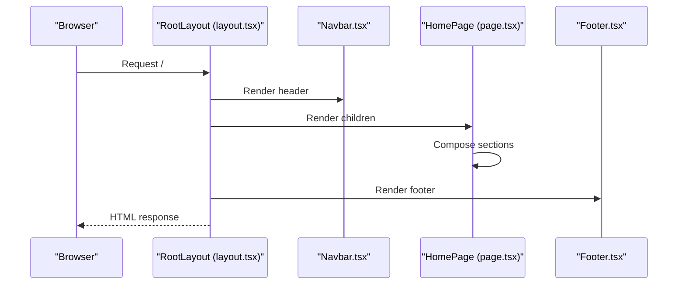
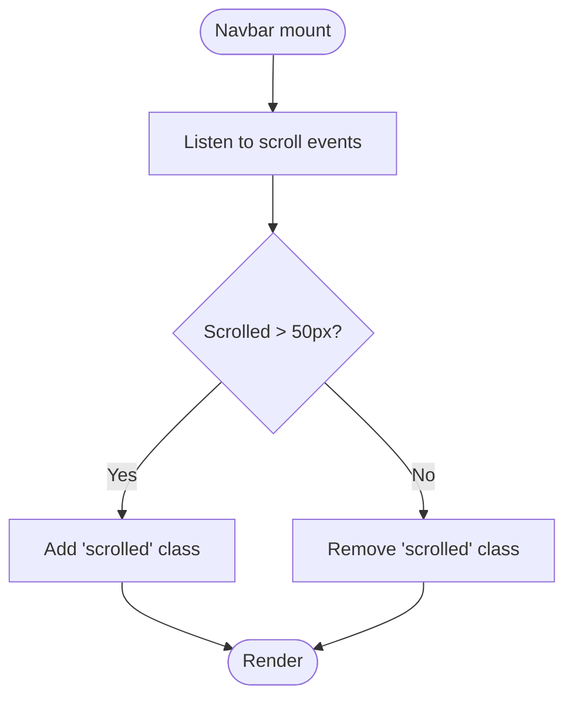
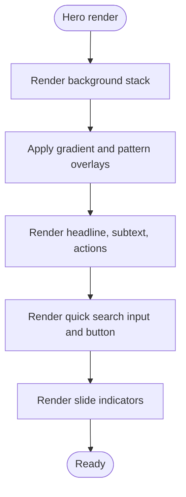
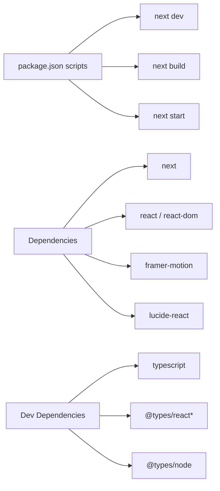

# Getting Started

<cite>
**Referenced Files in This Document**
- [package.json](file://package.json)
- [README.md](file://README.md)
- [next.config.ts](file://next.config.ts)
- [tsconfig.json](file://tsconfig.json)
- [.gitignore](file://.gitignore)
- [app/layout.tsx](file://app/layout.tsx)
- [app/page.tsx](file://app/page.tsx)
- [app/globals.css](file://app/globals.css)
- [components/Navbar.tsx](file://components/Navbar.tsx)
- [components/Hero.tsx](file://components/Hero.tsx)
- [components/Footer.tsx](file://components/Footer.tsx)
- [components/Navbar.module.css](file://components/Navbar.module.css)
- [components/Hero.module.css](file://components/Hero.module.css)
- [lib/data.ts](file://lib/data.ts)
</cite>

## Table of Contents
1. [Introduction](#introduction)
2. [Project Structure](#project-structure)
3. [Core Components](#core-components)
4. [Architecture Overview](#architecture-overview)
5. [Detailed Component Analysis](#detailed-component-analysis)
6. [Dependency Analysis](#dependency-analysis)
7. [Performance Considerations](#performance-considerations)
8. [Troubleshooting Guide](#troubleshooting-guide)
9. [Conclusion](#conclusion)
10. [Appendices](#appendices)

## Introduction
This guide helps you install, run, and develop the NatIndia project locally. It covers Node.js requirements, installing dependencies with npm, yarn, pnpm, or bun, starting the development server, understanding hot reload, exploring the project structure, and modifying the main landing page. It also includes environment setup tips, browser compatibility, recommended tools, and troubleshooting.

## Project Structure
The project follows a Next.js App Router structure with TypeScript and CSS Modules. Key areas:
- app/: Application pages and shared layout
- components/: Reusable UI components with CSS Modules
- lib/: Static data used by components
- public/: Static assets (not used in current structure)
- Configuration files for Next.js, TypeScript, and version control

**Diagram sources**
- [app/layout.tsx:1-28](file://app/layout.tsx#L1-L28)
- [app/page.tsx:1-22](file://app/page.tsx#L1-L22)
- [components/Navbar.tsx:1-113](file://components/Navbar.tsx#L1-L113)
- [components/Hero.tsx:1-100](file://components/Hero.tsx#L1-L100)
- [components/Footer.tsx:1-104](file://components/Footer.tsx#L1-L104)
- [lib/data.ts:1-252](file://lib/data.ts#L1-L252)
- [package.json:1-24](file://package.json#L1-L24)
- [next.config.ts:1-8](file://next.config.ts#L1-L8)
- [tsconfig.json:1-35](file://tsconfig.json#L1-L35)
- [.gitignore:1-42](file://.gitignore#L1-L42)

**Section sources**
- [app/layout.tsx:1-28](file://app/layout.tsx#L1-L28)
- [app/page.tsx:1-22](file://app/page.tsx#L1-L22)
- [components/Navbar.tsx:1-113](file://components/Navbar.tsx#L1-L113)
- [components/Hero.tsx:1-100](file://components/Hero.tsx#L1-L100)
- [components/Footer.tsx:1-104](file://components/Footer.tsx#L1-L104)
- [lib/data.ts:1-252](file://lib/data.ts#L1-L252)
- [package.json:1-24](file://package.json#L1-L24)
- [next.config.ts:1-8](file://next.config.ts#L1-L8)
- [tsconfig.json:1-35](file://tsconfig.json#L1-L35)
- [.gitignore:1-42](file://.gitignore#L1-L42)

## Core Components
- Layout and metadata: The root layout defines site metadata and wraps children with a global header and footer.
- Home page composition: The home page composes reusable sections (Hero, Stats, Categories, Featured Tours, Why Us, Testimonials, CTA).
- Navigation bar: A responsive navigation with desktop mega-menu and mobile menu.
- Hero section: Fullscreen hero with background slides, gradient overlays, quick search, and scroll hints.
- Footer: Multi-column footer with contact info, links, and newsletter form.
- Shared styles: Global CSS variables and typography, plus component-specific CSS Modules.

Key entry points and responsibilities:
- app/layout.tsx: Sets metadata and renders Navbar and Footer around page content.
- app/page.tsx: Renders the homepage sections.
- components/Navbar.tsx: Handles scroll effects, dropdowns, and mobile menu toggles.
- components/Hero.tsx: Manages background slides and quick search UI.
- components/Footer.tsx: Provides site links and newsletter subscription.
- app/globals.css: Defines brand colors, typography, buttons, and responsive base styles.

**Section sources**
- [app/layout.tsx:1-28](file://app/layout.tsx#L1-L28)
- [app/page.tsx:1-22](file://app/page.tsx#L1-L22)
- [components/Navbar.tsx:1-113](file://components/Navbar.tsx#L1-L113)
- [components/Hero.tsx:1-100](file://components/Hero.tsx#L1-L100)
- [components/Footer.tsx:1-104](file://components/Footer.tsx#L1-L104)
- [app/globals.css:1-190](file://app/globals.css#L1-L190)

## Architecture Overview
The application is a static Next.js app using the App Router. Pages are rendered server-side and hydrated on the client. Components are modular and styled with CSS Modules for scoped styles. Data is imported from a single data module.

**Diagram sources**
- [app/layout.tsx:1-28](file://app/layout.tsx#L1-L28)
- [app/page.tsx:1-22](file://app/page.tsx#L1-L22)
- [components/Navbar.tsx:1-113](file://components/Navbar.tsx#L1-L113)
- [components/Hero.tsx:1-100](file://components/Hero.tsx#L1-L100)
- [components/Footer.tsx:1-104](file://components/Footer.tsx#L1-L104)
- [app/globals.css:1-190](file://app/globals.css#L1-L190)
- [components/Navbar.module.css:1-200](file://components/Navbar.module.css#L1-L200)
- [components/Hero.module.css:1-254](file://components/Hero.module.css#L1-L254)
- [lib/data.ts:1-252](file://lib/data.ts#L1-L252)

## Detailed Component Analysis

### Layout and Root Page
- Root layout sets metadata and injects global CSS, then wraps children with Navbar and Footer.
- The home page composes multiple sections and is the primary place to modify the main page content.

**Diagram sources**
- [app/layout.tsx:1-28](file://app/layout.tsx#L1-L28)
- [app/page.tsx:1-22](file://app/page.tsx#L1-L22)
- [components/Navbar.tsx:1-113](file://components/Navbar.tsx#L1-L113)
- [components/Footer.tsx:1-104](file://components/Footer.tsx#L1-L104)

**Section sources**
- [app/layout.tsx:1-28](file://app/layout.tsx#L1-L28)
- [app/page.tsx:1-22](file://app/page.tsx#L1-L22)

### Navigation Bar
- Implements scroll-aware styling, a desktop mega-menu dropdown, and a mobile hamburger menu.
- Uses Lucide icons and CSS Modules for styling.

**Diagram sources**
- [components/Navbar.tsx:18-38](file://components/Navbar.tsx#L18-L38)

**Section sources**
- [components/Navbar.tsx:1-113](file://components/Navbar.tsx#L1-L113)
- [components/Navbar.module.css:1-200](file://components/Navbar.module.css#L1-L200)

### Hero Section
- Manages multiple background images and indicators, overlay gradients, and quick search UI.
- Includes scroll hint animation and responsive behavior.

**Diagram sources**
- [components/Hero.tsx:20-97](file://components/Hero.tsx#L20-L97)
- [components/Hero.module.css:1-254](file://components/Hero.module.css#L1-L254)

**Section sources**
- [components/Hero.tsx:1-100](file://components/Hero.tsx#L1-L100)
- [components/Hero.module.css:1-254](file://components/Hero.module.css#L1-L254)

### Footer
- Provides site branding, contact info, social links, and newsletter subscription.
- Organizes links into columns for destinations and company pages.

**Section sources**
- [components/Footer.tsx:1-104](file://components/Footer.tsx#L1-L104)

### Data Module
- Supplies categories, tours, testimonials, and stats used by various components.
- Useful for understanding content structure and adding/modifying data-driven UI.

**Section sources**
- [lib/data.ts:1-252](file://lib/data.ts#L1-L252)

## Dependency Analysis
- Package scripts define the development, build, and start commands.
- Dependencies include Next.js, React, Framer Motion, and Lucide React.
- Dev dependencies include TypeScript and type packages.
- TypeScript configuration enables strict mode, JSX transform, bundler resolution, and path aliases.

**Diagram sources**
- [package.json:5-22](file://package.json#L5-L22)
- [tsconfig.json:2-24](file://tsconfig.json#L2-L24)

**Section sources**
- [package.json:1-24](file://package.json#L1-L24)
- [tsconfig.json:1-35](file://tsconfig.json#L1-L35)

## Performance Considerations
- CSS Modules keep styles scoped and avoid global conflicts.
- Global CSS centralizes brand tokens and responsive breakpoints.
- Next.js Image optimization and font optimization are configured by default in Next.js projects.
- Keep component re-renders minimal by avoiding unnecessary state updates and using client directives only where needed.

[No sources needed since this section provides general guidance]

## Troubleshooting Guide
Common installation and setup issues:

- Node.js version mismatch
  - Symptom: Errors during install or runtime related to unsupported syntax.
  - Action: Ensure you are using a modern LTS or current Node.js version compatible with the project’s dependencies.

- Lockfile conflicts
  - Symptom: Errors when switching between npm, yarn, pnpm, or bun.
  - Action: Delete the existing lockfile and node_modules for one package manager, then reinstall with your chosen package manager.

- Missing environment variables
  - Symptom: Runtime errors referencing undefined environment variables.
  - Action: Create a local .env file if your project requires environment variables. Remember to keep sensitive keys out of version control.

- Port already in use
  - Symptom: Cannot start the dev server on port 3000.
  - Action: Stop the process using port 3000 or configure Next.js to use another port via environment variables.

Verifying successful setup:
- Run the development server using your preferred package manager command.
- Open http://localhost:3000 in your browser.
- Confirm that the homepage renders with the Hero, navigation, and footer.
- Edit the home page file to verify hot reload works.

**Section sources**
- [README.md:3-19](file://README.md#L3-L19)
- [.gitignore:16-18](file://.gitignore#L16-L18)

## Conclusion
You now have the essentials to install dependencies, run the development server, and modify the main page. Use the layout and page files to adjust content, and leverage components for UI changes. Keep dependencies updated, follow the troubleshooting steps when issues arise, and rely on Next.js hot reload for efficient iteration.

[No sources needed since this section summarizes without analyzing specific files]

## Appendices

### A. Installation and Setup
- Install dependencies with your preferred package manager:
  - npm: npm ci or npm install
  - yarn: yarn install
  - pnpm: pnpm install
  - bun: bun install
- Start the development server:
  - npm run dev
  - yarn dev
  - pnpm dev
  - bun dev
- Access the application at http://localhost:3000

**Section sources**
- [README.md:5-15](file://README.md#L5-L15)
- [package.json:5-9](file://package.json#L5-L9)

### B. Local Development Workflow
- Edit app/page.tsx to modify the main page content.
- Use app/layout.tsx to adjust the global layout and metadata.
- Modify components (e.g., components/Hero.tsx, components/Navbar.tsx) for UI changes.
- Hot reload updates the browser automatically when you save changes.

**Section sources**
- [app/page.tsx:1-22](file://app/page.tsx#L1-L22)
- [app/layout.tsx:1-28](file://app/layout.tsx#L1-L28)
- [README.md:19-19](file://README.md#L19-L19)

### C. Environment and Tools
- Node.js: Use a supported LTS/current version.
- Package managers: npm, yarn, pnpm, or bun.
- Editor: Recommended extensions for TypeScript and Next.js.
- Browser: Modern browsers with ES2017+ support.

**Section sources**
- [tsconfig.json:3-14](file://tsconfig.json#L3-L14)
- [package.json:10-22](file://package.json#L10-L22)

### D. Project Structure Basics
- app/: Contains pages, layout, and global styles.
- components/: Reusable UI components with CSS Modules.
- lib/: Static data used by components.
- Configuration: next.config.ts, tsconfig.json, package.json, .gitignore.

**Section sources**
- [app/layout.tsx:1-28](file://app/layout.tsx#L1-L28)
- [app/page.tsx:1-22](file://app/page.tsx#L1-L22)
- [components/Navbar.tsx:1-113](file://components/Navbar.tsx#L1-L113)
- [components/Hero.tsx:1-100](file://components/Hero.tsx#L1-L100)
- [components/Footer.tsx:1-104](file://components/Footer.tsx#L1-L104)
- [lib/data.ts:1-252](file://lib/data.ts#L1-L252)
- [next.config.ts:1-8](file://next.config.ts#L1-L8)
- [tsconfig.json:1-35](file://tsconfig.json#L1-L35)
- [package.json:1-24](file://package.json#L1-L24)
- [.gitignore:1-42](file://.gitignore#L1-L42)