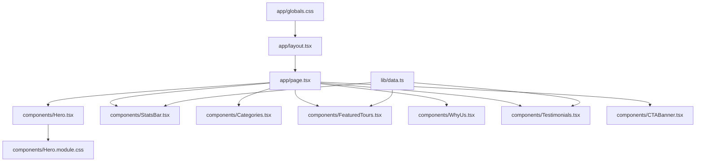
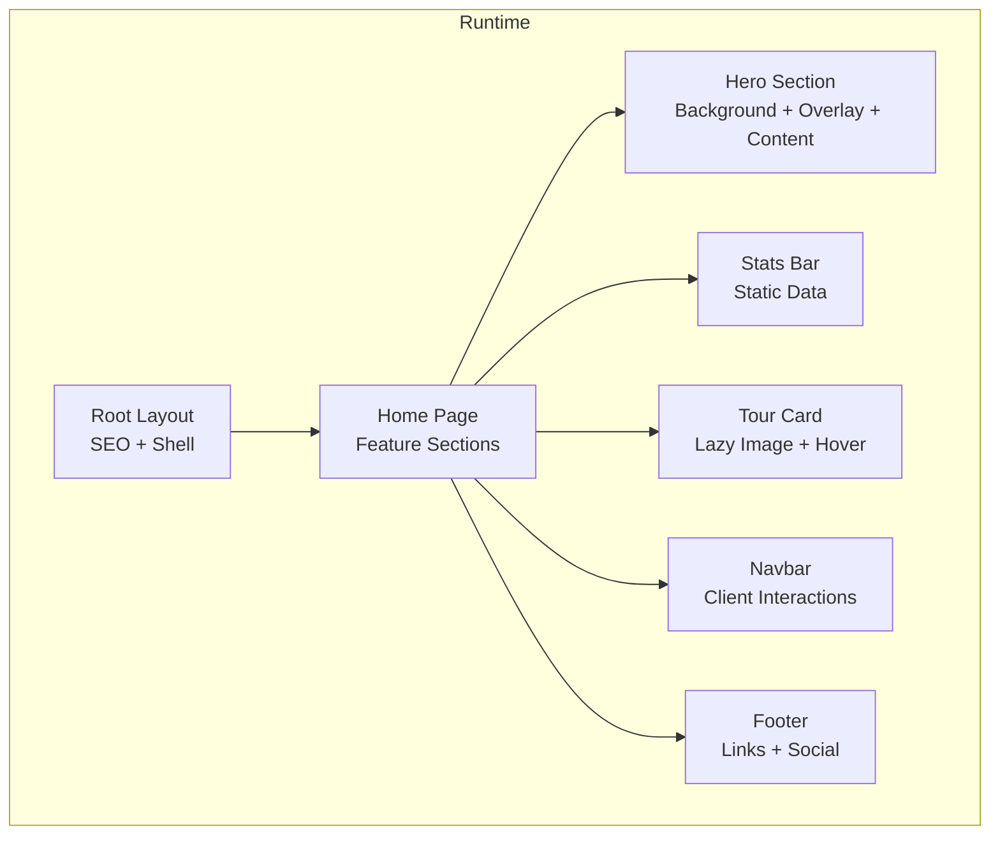
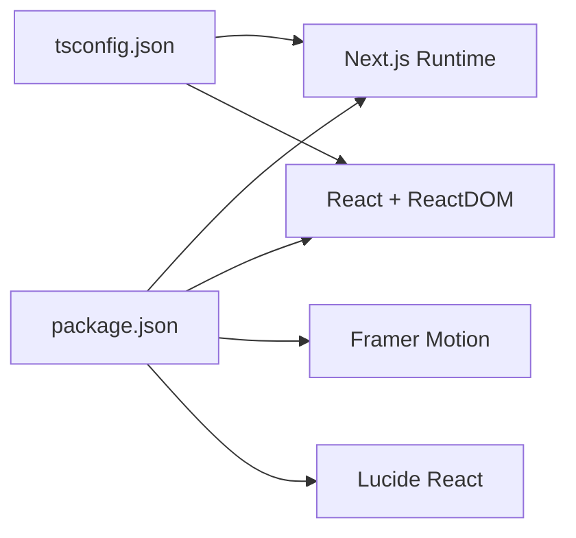

# Performance & Optimization

<cite>
**Referenced Files in This Document**
- [package.json](file://package.json)
- [next.config.ts](file://next.config.ts)
- [tsconfig.json](file://tsconfig.json)
- [app/layout.tsx](file://app/layout.tsx)
- [app/page.tsx](file://app/page.tsx)
- [app/globals.css](file://app/globals.css)
- [components/Hero.tsx](file://components/Hero.tsx)
- [components/Hero.module.css](file://components/Hero.module.css)
- [components/Navbar.tsx](file://components/Navbar.tsx)
- [components/Footer.tsx](file://components/Footer.tsx)
- [components/TourCard.tsx](file://components/TourCard.tsx)
- [components/StatsBar.tsx](file://components/StatsBar.tsx)
- [lib/data.ts](file://lib/data.ts)
</cite>

## Table of Contents
1. [Introduction](#introduction)
2. [Project Structure](#project-structure)
3. [Core Components](#core-components)
4. [Architecture Overview](#architecture-overview)
5. [Detailed Component Analysis](#detailed-component-analysis)
6. [Dependency Analysis](#dependency-analysis)
7. [Performance Considerations](#performance-considerations)
8. [Troubleshooting Guide](#troubleshooting-guide)
9. [Conclusion](#conclusion)
10. [Appendices](#appendices)

## Introduction
This document provides a comprehensive performance optimization guide for the NatIndia project. It focuses on leveraging Next.js built-in optimizations, image loading strategies, CSS optimization, bundle analysis, dependency hygiene, and monitoring practices. It also covers mobile-first rendering, user experience metrics, and operational best practices to maintain performance as features and content evolve.

## Project Structure
The project follows a modern Next.js App Router structure with a global stylesheet and modular CSS Modules per component. Pages are composed of reusable UI components that load images from external sources. The configuration is minimal, enabling Next.js to apply sensible defaults for performance.

**Diagram sources**
- [app/layout.tsx:17-27](file://app/layout.tsx#L17-L27)
- [app/page.tsx:9-21](file://app/page.tsx#L9-L21)
- [components/Hero.tsx:20-99](file://components/Hero.tsx#L20-L99)
- [components/StatsBar.tsx:5-20](file://components/StatsBar.tsx#L5-L20)
- [lib/data.ts:1-252](file://lib/data.ts#L1-L252)

**Section sources**
- [app/layout.tsx:1-28](file://app/layout.tsx#L1-L28)
- [app/page.tsx:1-22](file://app/page.tsx#L1-L22)
- [app/globals.css:1-190](file://app/globals.css#L1-L190)
- [components/Hero.tsx:1-100](file://components/Hero.tsx#L1-L100)
- [components/StatsBar.tsx:1-21](file://components/StatsBar.tsx#L1-L21)
- [lib/data.ts:1-252](file://lib/data.ts#L1-L252)

## Core Components
- Global layout and metadata define the root HTML shell and SEO metadata.
- Home page composes multiple feature sections.
- Hero showcases large background imagery with layered overlays and animated transitions.
- StatsBar renders static statistics from centralized data.
- TourCard displays tour items with lazy-loaded images and interactive overlays.
- Navbar and Footer provide navigation and branding with client-side interactivity.

Key performance-relevant observations:
- Hero uses multiple external image URLs and layered CSS animations.
- TourCard applies native lazy-loading via the img element attribute.
- StatsBar consumes data statically to avoid unnecessary re-renders.
- Navbar and Footer use client directives for interactivity.

**Section sources**
- [app/layout.tsx:6-27](file://app/layout.tsx#L6-L27)
- [app/page.tsx:9-21](file://app/page.tsx#L9-L21)
- [components/Hero.tsx:6-11](file://components/Hero.tsx#L6-L11)
- [components/Hero.tsx:20-99](file://components/Hero.tsx#L20-L99)
- [components/TourCard.tsx:21-62](file://components/TourCard.tsx#L21-L62)
- [components/StatsBar.tsx:5-20](file://components/StatsBar.tsx#L5-L20)
- [components/Navbar.tsx:18-112](file://components/Navbar.tsx#L18-L112)
- [components/Footer.tsx:25-103](file://components/Footer.tsx#L25-L103)

## Architecture Overview
The runtime architecture emphasizes:
- Static composition of pages from modular components.
- Client directives for interactive widgets.
- Centralized data sourcing for lists and cards.
- Global CSS for base styles and component-specific CSS Modules for scoping.

**Diagram sources**
- [app/layout.tsx:17-27](file://app/layout.tsx#L17-L27)
- [app/page.tsx:9-21](file://app/page.tsx#L9-L21)
- [components/Hero.tsx:20-99](file://components/Hero.tsx#L20-L99)
- [components/StatsBar.tsx:5-20](file://components/StatsBar.tsx#L5-L20)
- [components/TourCard.tsx:21-62](file://components/TourCard.tsx#L21-L62)
- [components/Navbar.tsx:18-112](file://components/Navbar.tsx#L18-L112)
- [components/Footer.tsx:25-103](file://components/Footer.tsx#L25-L103)

## Detailed Component Analysis

### Hero Section
- Uses multiple background images and layered overlays with CSS animations.
- Implements a slide indicator system and gradient/pattern overlays.
- Mobile responsiveness reduces overlay and navigation elements.

Optimization opportunities:
- Consider Next.js Image component for responsive images and automatic optimization.
- Lazy-load hero backgrounds conditionally if the hero is below the fold.
- Minimize animation-heavy transitions on lower-powered devices.

**Section sources**
- [components/Hero.tsx:6-11](file://components/Hero.tsx#L6-L11)
- [components/Hero.tsx:20-99](file://components/Hero.tsx#L20-L99)
- [components/Hero.module.css:1-254](file://components/Hero.module.css#L1-L254)

### Tour Card
- Renders a tour item with an image and hover effects.
- Applies native lazy-loading on the img element.

Optimization opportunities:
- Replace external image URLs with Next.js Image for automatic quality and format selection.
- Consider aspect ratio and sizing to reduce Cumulative Layout Shift (CLS).
- Defer non-critical hover effects on low-end devices.

**Section sources**
- [components/TourCard.tsx:21-62](file://components/TourCard.tsx#L21-L62)

### Stats Bar
- Renders a grid of static statistics sourced from lib/data.

Optimization opportunities:
- Keep data static to benefit from server-side rendering and caching.
- Ensure the grid is responsive and avoids layout thrashing.

**Section sources**
- [components/StatsBar.tsx:5-20](file://components/StatsBar.tsx#L5-L20)
- [lib/data.ts:246-251](file://lib/data.ts#L246-L251)

### Navbar and Footer
- Navbar uses client directives for scroll-aware styling and dropdown interactions.
- Footer uses client directives for newsletter form and social links.

Optimization opportunities:
- Defer heavy interactions until after hydration.
- Use IntersectionObserver for scroll-aware effects to reduce event listener overhead.
- Minimize re-renders by keeping state scoped to necessary components.

**Section sources**
- [components/Navbar.tsx:18-112](file://components/Navbar.tsx#L18-L112)
- [components/Footer.tsx:25-103](file://components/Footer.tsx#L25-L103)

### Home Page Composition
- Composes multiple feature sections in a single page.
- Benefits from Next.js automatic code splitting at route boundaries.

**Section sources**
- [app/page.tsx:9-21](file://app/page.tsx#L9-L21)

## Dependency Analysis
- Next.js version is configured via package.json.
- TypeScript configuration enables bundler module resolution and strict checks.
- No explicit Next.js configuration is present in next.config.ts, allowing defaults.

**Diagram sources**
- [package.json:10-16](file://package.json#L10-L16)
- [tsconfig.json:2-24](file://tsconfig.json#L2-L24)

**Section sources**
- [package.json:10-22](file://package.json#L10-L22)
- [tsconfig.json:2-24](file://tsconfig.json#L2-L24)
- [next.config.ts:3-5](file://next.config.ts#L3-L5)

## Performance Considerations

### Next.js Built-in Optimizations
- Automatic code splitting: Route segments naturally split bundles. Keep feature sections as separate route segments if needed to further optimize initial payload.
- Static generation: Pages render at build time by default in App Router; leverage static rendering for content sections.
- Image optimization: Use Next.js Image component for responsive images, automatic format selection, and quality tuning.
- ISR and caching: Configure incremental static regeneration for dynamic content to balance freshness and performance.

### Image Loading Strategies
- Lazy loading: Native lazy attribute is already applied in TourCard.
- Responsive images: Replace external URLs with Next.js Image to serve appropriately sized assets.
- Formats: Prefer modern formats (AVIF/WebP) when supported; Next.js can detect and convert assets.
- Alt text and accessibility: Ensure meaningful alt attributes to improve accessibility and SEO.

### CSS Optimization
- CSS Modules scoping: Component-scoped styles prevent conflicts and enable dead-code elimination.
- Unused CSS elimination: Remove unused selectors from Hero.module.css and other component styles.
- Global CSS: Keep app/globals.css minimal and essential; defer non-critical styles to components.

### Bundle Size Analysis and Tree Shaking
- Analyze bundles using Next.js build analyzer or similar tools to identify large dependencies.
- Prefer tree-shakeable libraries and import only what is needed.
- Consolidate repeated icons and animations to reduce duplication.

### Rendering and UX Metrics
- Largest Contentful Paint (LCP): Optimize hero images and ensure above-the-fold content loads quickly.
- First Input Delay (FID): Defer non-critical JavaScript and minimize long tasks.
- Cumulative Layout Shift (CLS): Set image dimensions, reserve space for ads/animations, and avoid dynamic insertions.
- Total Blocking Time (TBT): Reduce CPU-intensive work during critical interactions.

### Mobile Performance
- Use device pixel ratios and appropriate image sizes for mobile.
- Minimize heavy animations on low-end devices.
- Prioritize above-the-fold content and defer offscreen assets.

### Monitoring and Measurement
- Use Core Web Vitals reporting in analytics platforms.
- Track performance budgets and regressions in CI.
- Monitor Real User Monitoring (RUM) metrics in production.

## Troubleshooting Guide
Common performance pitfalls and remedies:
- Excessive external images: Replace with Next.js Image to leverage optimization and caching.
- Heavy CSS animations: Reduce or disable on lower-powered devices; consider prefers-reduced-motion.
- Unnecessary client directives: Limit to components requiring interactivity to reduce bundle size.
- Large third-party dependencies: Audit and prune unused features; prefer lightweight alternatives.

**Section sources**
- [components/Hero.tsx:6-11](file://components/Hero.tsx#L6-L11)
- [components/TourCard.tsx:25-25](file://components/TourCard.tsx#L25-L25)
- [components/Navbar.tsx:18-28](file://components/Navbar.tsx#L18-L28)
- [components/Footer.tsx:25-30](file://components/Footer.tsx#L25-L30)

## Conclusion
By adopting Next.js’s built-in optimizations, implementing responsible image loading, scoping CSS with modules, and monitoring Core Web Vitals, NatIndia can deliver fast, efficient experiences across devices. Continue to measure, iterate, and enforce performance budgets as new features and content are added.

## Appendices

### Best Practices Checklist
- Replace external image URLs with Next.js Image.
- Apply native lazy-loading consistently.
- Keep global CSS lean; move styles to CSS Modules.
- Audit and remove unused CSS.
- Measure and track Core Web Vitals.
- Enforce performance budgets in CI.
- Use client directives sparingly and defer non-critical logic.