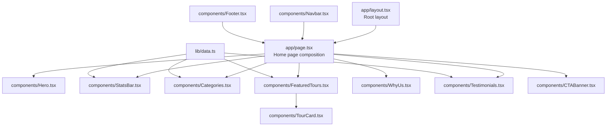
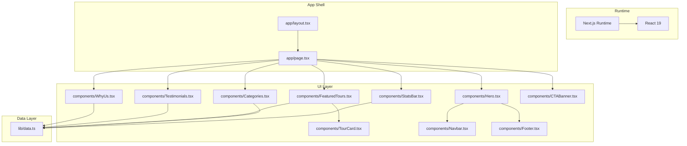
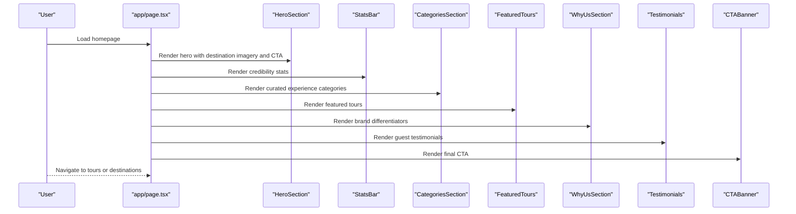
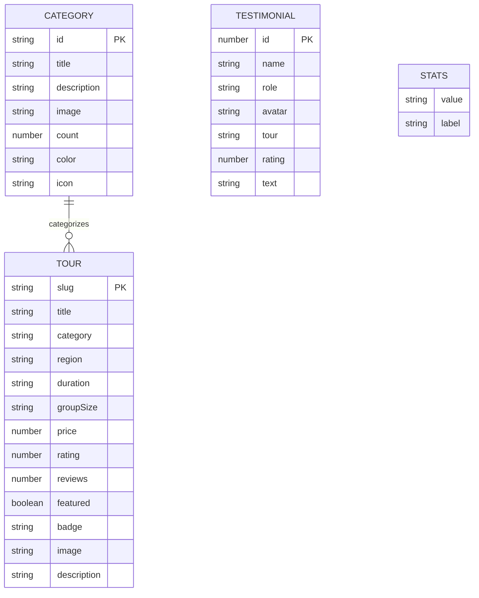
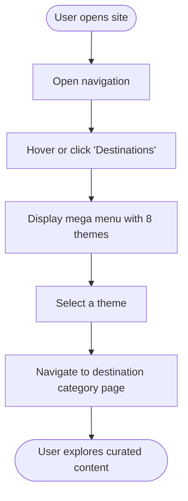
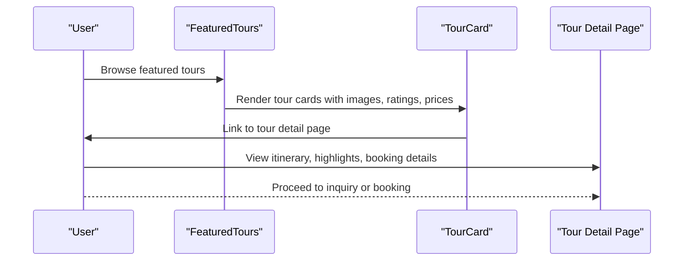
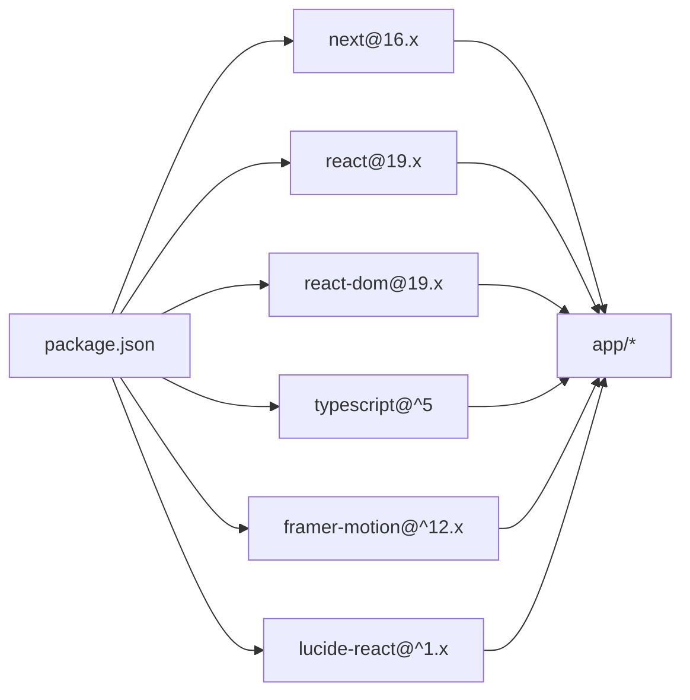

# Project Overview

<cite>
**Referenced Files in This Document**
- [README.md](file://README.md)
- [package.json](file://package.json)
- [next.config.ts](file://next.config.ts)
- [tsconfig.json](file://tsconfig.json)
- [app/layout.tsx](file://app/layout.tsx)
- [app/page.tsx](file://app/page.tsx)
- [components/Navbar.tsx](file://components/Navbar.tsx)
- [components/Footer.tsx](file://components/Footer.tsx)
- [components/Hero.tsx](file://components/Hero.tsx)
- [components/Categories.tsx](file://components/Categories.tsx)
- [components/StatsBar.tsx](file://components/StatsBar.tsx)
- [components/Testimonials.tsx](file://components/Testimonials.tsx)
- [components/FeaturedTours.tsx](file://components/FeaturedTours.tsx)
- [components/WhyUs.tsx](file://components/WhyUs.tsx)
- [components/CTABanner.tsx](file://components/CTABanner.tsx)
- [components/TourCard.tsx](file://components/TourCard.tsx)
- [lib/data.ts](file://lib/data.ts)
</cite>

## Table of Contents
1. [Introduction](#introduction)
2. [Project Structure](#project-structure)
3. [Core Components](#core-components)
4. [Architecture Overview](#architecture-overview)
5. [Detailed Component Analysis](#detailed-component-analysis)
6. [Dependency Analysis](#dependency-analysis)
7. [Performance Considerations](#performance-considerations)
8. [Troubleshooting Guide](#troubleshooting-guide)
9. [Conclusion](#conclusion)

## Introduction
NatIndia is a premium travel company dedicated to showcasing expert-led small-group expeditions across India. The brand positions itself as a curator of transformative experiences, combining deep local knowledge with sustainable tourism practices. Its mission is to help travelers discover India’s wildlife, cultures, mountains, and coasts through intimate, meaningful journeys guided by specialists who understand the land and its people.

Target audience:
- Adventure seekers drawn to wildlife safaris and Himalayan treks
- Cultural tourists interested in heritage, traditions, and spiritual sites
- Wildlife enthusiasts eager for authentic encounters and conservation-focused travel
- Spiritual pilgrims and wellness travelers exploring sacred destinations

Market positioning:
- Premium, small-group travel (maximum 12 guests per tour)
- Conservation-first approach with measurable impact
- Exclusive access enabled by trusted local partnerships
- World-class expert guides with deep, long-term relationships in their domains
- Photogenic, curated itineraries designed for memorable storytelling

Core value proposition:
- Expert guides who provide context and unlock hidden insights
- Authentic local experiences that go beyond typical tourist routes
- Thoughtful logistics ensuring comfort, exclusivity, and minimal environmental footprint
- Transformative outcomes that connect travelers emotionally to India and the planet

Scope of offerings:
- Wildlife safaris (e.g., tiger tracking, elephant encounters)
- Cultural journeys (palaces, forts, festivals, living heritage)
- Himalayan adventures (monasteries, high passes, camping)
- Spiritual pilgrimages (ghats, temples, ashrams)
- Coastal escapes and backwaters
- Heritage circuits and northeastern frontiers
- Kerala and southern regions

Differentiation in the travel industry:
- Personalized expedition experiences tailored to passion and timing
- Strong emphasis on conservation and community benefit
- Curated access to places and moments otherwise unavailable to mass tourism
- Focus on quality over quantity, ensuring meaningful engagement with destinations

## Project Structure
The project follows a modern Next.js App Router structure with a clear separation of concerns:
- app/: Application shell, routing, and page composition
- components/: Reusable UI building blocks
- lib/: Centralized data and content
- public/: Static assets (not actively used in current structure)
- Root-level configuration files for Next.js, TypeScript, and package management

**Diagram sources**
- [app/layout.tsx](file://app/layout.tsx)
- [app/page.tsx](file://app/page.tsx)
- [components/Hero.tsx](file://components/Hero.tsx)
- [components/StatsBar.tsx](file://components/StatsBar.tsx)
- [components/Categories.tsx](file://components/Categories.tsx)
- [components/FeaturedTours.tsx](file://components/FeaturedTours.tsx)
- [components/WhyUs.tsx](file://components/WhyUs.tsx)
- [components/Testimonials.tsx](file://components/Testimonials.tsx)
- [components/CTABanner.tsx](file://components/CTABanner.tsx)
- [components/TourCard.tsx](file://components/TourCard.tsx)
- [components/Navbar.tsx](file://components/Navbar.tsx)
- [components/Footer.tsx](file://components/Footer.tsx)
- [lib/data.ts](file://lib/data.ts)

**Section sources**
- [README.md:1-37](file://README.md#L1-L37)
- [package.json:1-24](file://package.json#L1-L24)
- [next.config.ts:1-8](file://next.config.ts#L1-L8)
- [tsconfig.json](file://tsconfig.json)
- [app/layout.tsx](file://app/layout.tsx)
- [app/page.tsx:1-22](file://app/page.tsx#L1-L22)

## Core Components
This section outlines the primary UI components and their roles in delivering the brand story and driving conversions.

- HeroSection: Sets the aspirational tone with destination-focused imagery, a compelling headline, and clear calls-to-action. It introduces the “Since 1989 · Expert-Led Small Groups · Conservation First” ethos.
- StatsBar: Reinforces credibility with quantified achievements (years of expertise, destinations covered, number of happy travelers, expert guides).
- CategoriesSection: Presents curated travel themes (wildlife, cultural, Himalayan, coastal, spiritual, heritage, northeast, Kerala) with icons, counts, and immersive visuals.
- FeaturedTours: Showcases top-rated, curated tours with essential metadata (duration, group size, pricing, ratings) and quick access to detailed pages.
- WhyUsSection: Articulates the brand’s differentiators (conservation-first travel, small groups, expert guides, meticulous logistics, photographic access, transformative experiences).
- Testimonials: Social proof via guest stories, photos, and star ratings, reinforcing trust and emotional connection.
- CTABanner: Drives action with a strong offer to browse tours or speak with an expert.
- TourCard: Encapsulates tour details for individual listings, enabling discovery and comparison.
- Navbar and Footer: Navigation and branding touchpoints that mirror the site’s personality and provide access to destinations, company info, and contact channels.

**Section sources**
- [components/Hero.tsx:1-100](file://components/Hero.tsx#L1-L100)
- [components/StatsBar.tsx:1-21](file://components/StatsBar.tsx#L1-L21)
- [components/Categories.tsx:1-47](file://components/Categories.tsx#L1-L47)
- [components/FeaturedTours.tsx:1-34](file://components/FeaturedTours.tsx#L1-L34)
- [components/WhyUs.tsx:1-101](file://components/WhyUs.tsx#L1-L101)
- [components/Testimonials.tsx:1-41](file://components/Testimonials.tsx#L1-L41)
- [components/CTABanner.tsx:1-32](file://components/CTABanner.tsx#L1-L32)
- [components/TourCard.tsx:1-63](file://components/TourCard.tsx#L1-L63)
- [components/Navbar.tsx:1-113](file://components/Navbar.tsx#L1-L113)
- [components/Footer.tsx:1-104](file://components/Footer.tsx#L1-L104)

## Architecture Overview
The frontend architecture centers on Next.js App Router, with a component-driven design that emphasizes reusability and maintainability. Data is centralized in a single module, enabling easy updates and consistent rendering across pages.

**Diagram sources**
- [app/layout.tsx](file://app/layout.tsx)
- [app/page.tsx:1-22](file://app/page.tsx#L1-L22)
- [components/Hero.tsx:1-100](file://components/Hero.tsx#L1-L100)
- [components/StatsBar.tsx:1-21](file://components/StatsBar.tsx#L1-L21)
- [components/Categories.tsx:1-47](file://components/Categories.tsx#L1-L47)
- [components/FeaturedTours.tsx:1-34](file://components/FeaturedTours.tsx#L1-L34)
- [components/WhyUs.tsx:1-101](file://components/WhyUs.tsx#L1-L101)
- [components/Testimonials.tsx:1-41](file://components/Testimonials.tsx#L1-L41)
- [components/CTABanner.tsx:1-32](file://components/CTABanner.tsx#L1-L32)
- [components/TourCard.tsx:1-63](file://components/TourCard.tsx#L1-L63)
- [components/Navbar.tsx:1-113](file://components/Navbar.tsx#L1-L113)
- [components/Footer.tsx:1-104](file://components/Footer.tsx#L1-L104)
- [lib/data.ts:1-252](file://lib/data.ts#L1-L252)

## Detailed Component Analysis

### Home Page Composition
The homepage composes the hero, statistics, categories, featured tours, brand differentiation, testimonials, and a final call-to-action. This arrangement guides users from inspiration to discovery to conversion.

**Diagram sources**
- [app/page.tsx:1-22](file://app/page.tsx#L1-L22)
- [components/Hero.tsx:1-100](file://components/Hero.tsx#L1-L100)
- [components/StatsBar.tsx:1-21](file://components/StatsBar.tsx#L1-L21)
- [components/Categories.tsx:1-47](file://components/Categories.tsx#L1-L47)
- [components/FeaturedTours.tsx:1-34](file://components/FeaturedTours.tsx#L1-L34)
- [components/WhyUs.tsx:1-101](file://components/WhyUs.tsx#L1-L101)
- [components/Testimonials.tsx:1-41](file://components/Testimonials.tsx#L1-L41)
- [components/CTABanner.tsx:1-32](file://components/CTABanner.tsx#L1-L32)

**Section sources**
- [app/page.tsx:1-22](file://app/page.tsx#L1-L22)

### Data Model and Content Strategy
Content is modeled centrally to support dynamic rendering across components. The data module defines categories, tours, testimonials, and statistics, enabling consistent updates without code changes.

**Diagram sources**
- [lib/data.ts:1-252](file://lib/data.ts#L1-L252)

**Section sources**
- [lib/data.ts:1-252](file://lib/data.ts#L1-L252)

### Navigation and Destination Discovery
The navigation bar provides structured access to eight distinct travel themes, supporting both desktop mega-menu and mobile-friendly toggling. This ensures intuitive discovery aligned with the brand’s eight-category experience model.

**Diagram sources**
- [components/Navbar.tsx:1-113](file://components/Navbar.tsx#L1-L113)
- [components/Categories.tsx:1-47](file://components/Categories.tsx#L1-L47)

**Section sources**
- [components/Navbar.tsx:1-113](file://components/Navbar.tsx#L1-L113)
- [components/Categories.tsx:1-47](file://components/Categories.tsx#L1-L47)

### Tour Discovery and Booking Path
Featured tours and individual tour cards streamline the discovery process, offering essential details and clear pathways to deeper content. Pricing, ratings, and badges communicate value and reputation.

**Diagram sources**
- [components/FeaturedTours.tsx:1-34](file://components/FeaturedTours.tsx#L1-L34)
- [components/TourCard.tsx:1-63](file://components/TourCard.tsx#L1-L63)
- [lib/data.ts:76-205](file://lib/data.ts#L76-L205)

**Section sources**
- [components/FeaturedTours.tsx:1-34](file://components/FeaturedTours.tsx#L1-L34)
- [components/TourCard.tsx:1-63](file://components/TourCard.tsx#L1-L63)
- [lib/data.ts:76-205](file://lib/data.ts#L76-L205)

## Dependency Analysis
The project leverages a focused set of technologies optimized for developer productivity, performance, and maintainability.

- Next.js: Provides the runtime, routing, and build pipeline for the application.
- React 19: Enables modern component patterns and concurrent features.
- TypeScript: Adds static typing for improved reliability and developer experience.
- Framer Motion: Used for animations and micro-interactions (as indicated by dependencies).
- Lucide React: Provides a consistent iconography system across components.
- No external CSS-in-JS frameworks are used; styling relies on modular CSS and inline styles where appropriate.

**Diagram sources**
- [package.json:1-24](file://package.json#L1-L24)

**Section sources**
- [package.json:1-24](file://package.json#L1-L24)
- [next.config.ts:1-8](file://next.config.ts#L1-L8)
- [tsconfig.json](file://tsconfig.json)

## Performance Considerations
- Image optimization: Components use lazy-loading attributes and high-quality image URLs, aligning with Next.js best practices.
- Minimal third-party dependencies: A lean stack reduces bundle size and potential maintenance overhead.
- Component modularity: Reusable components reduce duplication and improve caching efficiency.
- Client-side interactivity: Interactive elements (hero carousel indicators, mobile menus) are scoped to client components, minimizing server-rendered payload.

[No sources needed since this section provides general guidance]

## Troubleshooting Guide
Common areas to verify during development or deployment:
- Routing and navigation: Ensure internal links resolve correctly and the navigation reflects the intended destination structure.
- Data consistency: Confirm that category IDs, tour slugs, and test data remain synchronized across components.
- Styling and responsiveness: Validate that CSS modules apply correctly and responsive breakpoints render as expected.
- Accessibility: Verify focus management in interactive elements (e.g., navigation dropdowns, mobile menu toggles).

**Section sources**
- [components/Navbar.tsx:1-113](file://components/Navbar.tsx#L1-L113)
- [components/Categories.tsx:1-47](file://components/Categories.tsx#L1-L47)
- [lib/data.ts:1-252](file://lib/data.ts#L1-L252)

## Conclusion
NatIndia’s website embodies a premium travel philosophy centered on expert-led, small-group expeditions across India’s diverse landscapes and cultures. Through a modern Next.js architecture, a component-driven design, and a centralized content model, the platform communicates the brand’s values—conservation, authenticity, and transformation—while guiding users from inspiration to booking. The technology choices reflect a balance between performance, developer productivity, and maintainability, supporting the brand’s vision of deep, meaningful travel experiences.