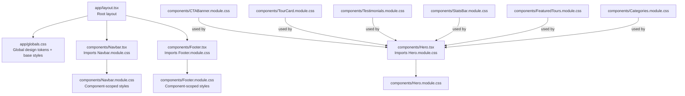
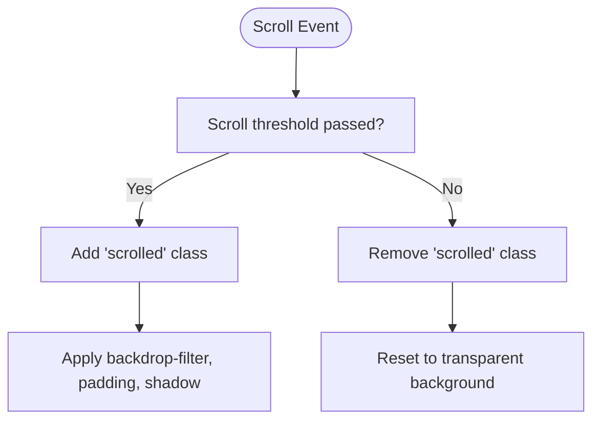
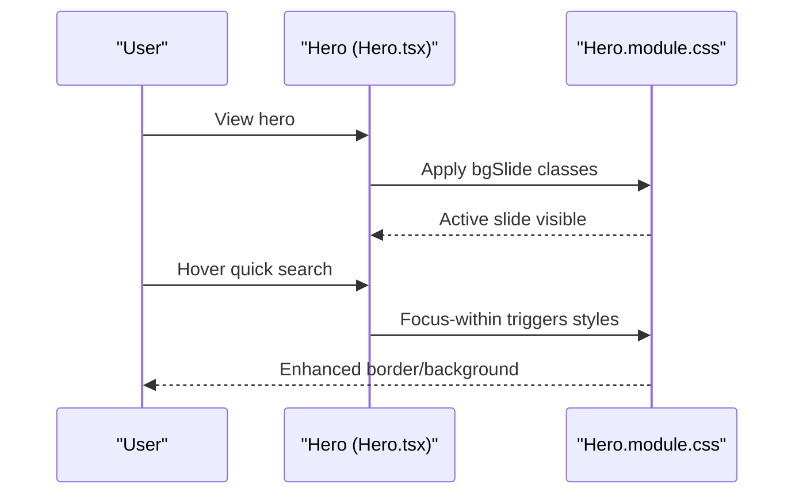
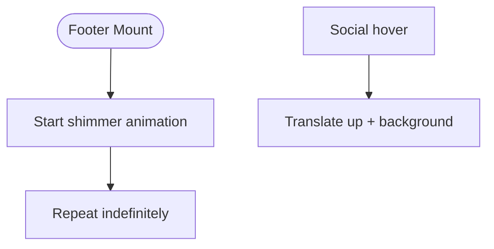
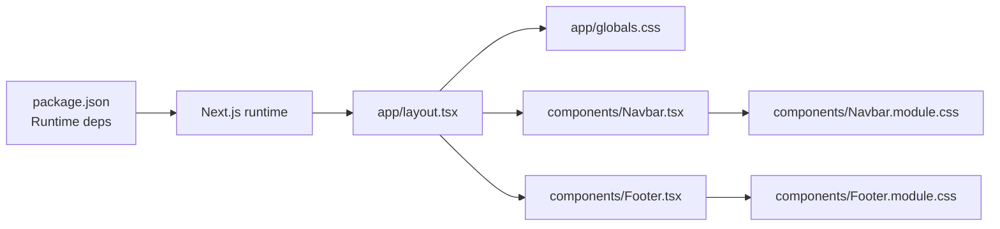

# Styling & Theming

<cite>
**Referenced Files in This Document**
- [app/globals.css](file://app/globals.css)
- [app/layout.tsx](file://app/layout.tsx)
- [components/Navbar.module.css](file://components/Navbar.module.css)
- [components/Navbar.tsx](file://components/Navbar.tsx)
- [components/Hero.module.css](file://components/Hero.module.css)
- [components/Hero.tsx](file://components/Hero.tsx)
- [components/Footer.module.css](file://components/Footer.module.css)
- [components/Footer.tsx](file://components/Footer.tsx)
- [components/CTABanner.module.css](file://components/CTABanner.module.css)
- [components/TourCard.module.css](file://components/TourCard.module.css)
- [components/Testimonials.module.css](file://components/Testimonials.module.css)
- [components/StatsBar.module.css](file://components/StatsBar.module.css)
- [components/FeaturedTours.module.css](file://components/FeaturedTours.module.css)
- [components/Categories.module.css](file://components/Categories.module.css)
- [next.config.ts](file://next.config.ts)
- [package.json](file://package.json)
</cite>

## Table of Contents
1. [Introduction](#introduction)
2. [Project Structure](#project-structure)
3. [Core Components](#core-components)
4. [Architecture Overview](#architecture-overview)
5. [Detailed Component Analysis](#detailed-component-analysis)
6. [Dependency Analysis](#dependency-analysis)
7. [Performance Considerations](#performance-considerations)
8. [Troubleshooting Guide](#troubleshooting-guide)
9. [Conclusion](#conclusion)
10. [Appendices](#appendices)

## Introduction
This document explains the styling and theming architecture of the NatIndia project. It covers how CSS Modules enable component-scoped styling, the design system built on CSS custom properties, responsive strategies, animations, and global styles. It also provides guidance on customization, theme extension, and performance optimization.

## Project Structure
The styling system is organized around:
- Global base styles and design tokens in a single CSS file imported at the root layout.
- Component-scoped styles via CSS Modules (.module.css) consumed by React components.
- Utility classes for containers, buttons, and typography applied directly in components.
- Minimal Next.js configuration; no special CSS tooling is configured.



**Diagram sources**
- [app/layout.tsx:17-27](file://app/layout.tsx#L17-L27)
- [app/globals.css:1-190](file://app/globals.css#L1-L190)
- [components/Navbar.tsx:1-113](file://components/Navbar.tsx#L1-L113)
- [components/Navbar.module.css:1-200](file://components/Navbar.module.css#L1-L200)
- [components/Hero.tsx:1-100](file://components/Hero.tsx#L1-L100)
- [components/Hero.module.css:1-254](file://components/Hero.module.css#L1-L254)
- [components/Footer.tsx:1-104](file://components/Footer.tsx#L1-L104)
- [components/Footer.module.css:1-164](file://components/Footer.module.css#L1-L164)

**Section sources**
- [app/layout.tsx:17-27](file://app/layout.tsx#L17-L27)
- [app/globals.css:1-190](file://app/globals.css#L1-L190)

## Core Components
- Global design tokens and base styles: Centralized in the global stylesheet, including brand colors, fonts, spacing, shadows, and transitions.
- Component-scoped CSS Modules: Each major UI component defines its own module stylesheet for local scoping and maintainability.
- Utility classes: Shared classes for container, buttons, typography, and interactive states are applied directly in components.

Key global tokens and patterns:
- Design tokens: CSS custom properties define brand colors, fonts, spacing, shadows, and transitions.
- Base styles: Normalize-like resets, body defaults, images, links, and button resets.
- Utilities: Container, button variants, section labels, divider, scrollbar, selection, and responsive overrides.

**Section sources**
- [app/globals.css:3-42](file://app/globals.css#L3-L42)
- [app/globals.css:44-63](file://app/globals.css#L44-L63)
- [app/globals.css:83-189](file://app/globals.css#L83-L189)

## Architecture Overview
The styling architecture follows a predictable flow:
- Root layout imports global styles.
- Components import their CSS Modules and apply utility classes.
- CSS custom properties unify design decisions across components.
- Media queries enforce responsive behavior at component boundaries.

```mermaid
sequenceDiagram
participant R as "Root Layout (layout.tsx)"
participant G as "Globals (globals.css)"
participant N as "Navbar (Navbar.tsx)"
participant NM as "Navbar.module.css"
participant F as "Footer (Footer.tsx)"
participant FM as "Footer.module.css"
R->>G : Import global styles
R->>N : Render Navbar
N->>NM : Apply scoped styles
R->>F : Render Footer
F->>FM : Apply scoped styles
Note over G,NM,FM : Tokens and utilities shared via CSS custom properties
```

**Diagram sources**
- [app/layout.tsx:17-27](file://app/layout.tsx#L17-L27)
- [app/globals.css:1-190](file://app/globals.css#L1-L190)
- [components/Navbar.tsx:1-113](file://components/Navbar.tsx#L1-L113)
- [components/Navbar.module.css:1-200](file://components/Navbar.module.css#L1-L200)
- [components/Footer.tsx:1-104](file://components/Footer.tsx#L1-L104)
- [components/Footer.module.css:1-164](file://components/Footer.module.css#L1-L164)

## Detailed Component Analysis

### Global Styles and Design System
- Brand palette: Defined as CSS custom properties for consistent usage across components.
- Typography: Serif and sans families are defined; headings and display fonts are applied via utility classes.
- Spacing: Section padding and container max-width are centralized; responsive adjustments occur at narrow widths.
- Shadows and transitions: Unified shadow and easing tokens enable consistent depth and motion.
- Base elements: Reset and normalize behavior for HTML elements, plus utility classes for buttons, labels, and dividers.

Responsive strategy:
- Breakpoints are embedded within component modules (e.g., max-width thresholds) rather than a central media-query registry.
- Global responsive overrides adjust section padding and container padding at narrower screens.

**Section sources**
- [app/globals.css:3-42](file://app/globals.css#L3-L42)
- [app/globals.css:83-189](file://app/globals.css#L83-L189)

### Navigation Bar (Navbar)
- Scrolling effect: Fixed header with background change and blur on scroll.
- Mega dropdown: Animated entrance with keyframes; hover states for items.
- Mobile menu: Toggle-driven visibility with grouped navigation items.
- Color and typography: Logo uses combined serif font; navigation items use sans-serif with subtle transparency.



**Diagram sources**
- [components/Navbar.tsx:18-28](file://components/Navbar.tsx#L18-L28)
- [components/Navbar.module.css:12-17](file://components/Navbar.module.css#L12-L17)

**Section sources**
- [components/Navbar.module.css:1-200](file://components/Navbar.module.css#L1-L200)
- [components/Navbar.tsx:1-113](file://components/Navbar.tsx#L1-L113)

### Hero Section
- Background carousel: Slides fade in/out with opacity and scale transforms.
- Overlay effects: Gradient and SVG pattern overlays for readability and texture.
- Content: Headlines use clamp for fluid sizing; quick search form uses backdrop filters and focus styles.
- Interactive indicators: Slide indicators and scroll hint with animated backgrounds.



**Diagram sources**
- [components/Hero.tsx:20-99](file://components/Hero.tsx#L20-L99)
- [components/Hero.module.css:11-28](file://components/Hero.module.css#L11-L28)
- [components/Hero.module.css:129-171](file://components/Hero.module.css#L129-L171)

**Section sources**
- [components/Hero.module.css:1-254](file://components/Hero.module.css#L1-L254)
- [components/Hero.tsx:1-100](file://components/Hero.tsx#L1-L100)

### Footer
- Animated accent band: Multi-hued gradient with continuous horizontal movement.
- Grid layout: Four-column structure with brand, links, and newsletter; responsive stacking.
- Interactive states: Social links lift slightly on hover; inputs highlight on focus.



**Diagram sources**
- [components/Footer.module.css:7-16](file://components/Footer.module.css#L7-L16)
- [components/Footer.module.css:156-163](file://components/Footer.module.css#L156-L163)

**Section sources**
- [components/Footer.module.css:1-164](file://components/Footer.module.css#L1-L164)
- [components/Footer.tsx:1-104](file://components/Footer.tsx#L1-L104)

### Additional Sections and Patterns
- CTABanner: Full-bleed section with gradient overlay and large primary actions; responsive layout stacks on smaller screens.
- TourCard: Card hover with elevation and image zoom; badge and overlay for visual hierarchy.
- Testimonials: Grid of cards with quote accents, star ratings, and avatar borders; subtle hover lift.
- StatsBar: Decorative radial background and value text gradients; responsive column count.
- FeaturedTours: Section with header and responsive grid of tour cards.
- Categories: Grid of destination cards with spanning items and hover reveal effects.

**Section sources**
- [components/CTABanner.module.css:1-76](file://components/CTABanner.module.css#L1-L76)
- [components/TourCard.module.css:1-173](file://components/TourCard.module.css#L1-L173)
- [components/Testimonials.module.css:1-101](file://components/Testimonials.module.css#L1-L101)
- [components/StatsBar.module.css:1-71](file://components/StatsBar.module.css#L1-L71)
- [components/FeaturedTours.module.css:1-38](file://components/FeaturedTours.module.css#L1-L38)
- [components/Categories.module.css:1-135](file://components/Categories.module.css#L1-L135)

## Dependency Analysis
- Root layout depends on global styles for design tokens and base resets.
- Components depend on their respective CSS Modules for layout and visuals.
- Utility classes (e.g., container, buttons) are referenced directly in components.
- No explicit CSS pre/post-processing is configured; Next.js default pipeline applies.



**Diagram sources**
- [package.json:10-22](file://package.json#L10-L22)
- [app/layout.tsx:17-27](file://app/layout.tsx#L17-L27)
- [app/globals.css:1-190](file://app/globals.css#L1-L190)
- [components/Navbar.tsx:1-113](file://components/Navbar.tsx#L1-L113)
- [components/Navbar.module.css:1-200](file://components/Navbar.module.css#L1-L200)
- [components/Footer.tsx:1-104](file://components/Footer.tsx#L1-L104)
- [components/Footer.module.css:1-164](file://components/Footer.module.css#L1-L164)

**Section sources**
- [package.json:10-22](file://package.json#L10-L22)
- [next.config.ts:1-8](file://next.config.ts#L1-L8)

## Performance Considerations
- CSS Modules scope styles per component, reducing selector specificity and minimizing cascade-related overhead.
- Global CSS is minimal and centralized, keeping initial payload small.
- Animations rely on transform and opacity where possible, leveraging GPU acceleration.
- Font loading uses external providers; ensure proper font-display strategies if optimizing Core Web Vitals.
- Bundle size: No dedicated CSS optimization steps are configured; keep component styles focused and avoid duplication.

[No sources needed since this section provides general guidance]

## Troubleshooting Guide
Common issues and resolutions:
- Styles not applying: Verify the component imports its module stylesheet and uses the returned class names.
- Conflicts across components: Ensure styles are scoped via .module.css and avoid global selectors where unnecessary.
- Responsive breakpoints: Confirm media queries are present in the component’s stylesheet and align with intended breakpoints.
- Animation jank: Prefer transform and opacity for motion; avoid animating layout-affecting properties.
- Fonts not loading: Check external font URLs and consider self-hosting or font-display optimization.

**Section sources**
- [components/Navbar.tsx:4-5](file://components/Navbar.tsx#L4-L5)
- [components/Hero.tsx:3-4](file://components/Hero.tsx#L3-L4)
- [components/Footer.tsx:3-4](file://components/Footer.tsx#L3-L4)

## Conclusion
The NatIndia project employs a clean, scalable styling architecture:
- Global design tokens unify brand identity.
- CSS Modules encapsulate component styles, preventing global leakage.
- Utility classes standardize common patterns.
- Responsive behavior is handled per component with clear breakpoints.
- Motion and visual effects are consistent and performant.

## Appendices

### Design System Reference
- Brand colors: Defined as CSS custom properties for reuse across components.
- Typography: Serif and sans families; headings and display fonts applied via utility classes.
- Spacing: Section padding and container max-width tokens; responsive adjustments at narrow widths.
- Shadows and transitions: Centralized tokens for consistent depth and motion.

**Section sources**
- [app/globals.css:3-42](file://app/globals.css#L3-L42)
- [app/globals.css:83-88](file://app/globals.css#L83-L88)

### Customization and Theme Extension Guidelines
- Extend brand palette: Add new CSS custom properties in the global stylesheet; consume via var().
- Add new utilities: Define reusable classes in the global stylesheet; apply in components.
- Modify transitions/shadows: Update tokens to propagate changes globally.
- Component overrides: Keep overrides localized to the component’s module stylesheet to preserve cohesion.

**Section sources**
- [app/globals.css:3-42](file://app/globals.css#L3-L42)
- [app/globals.css:83-189](file://app/globals.css#L83-L189)