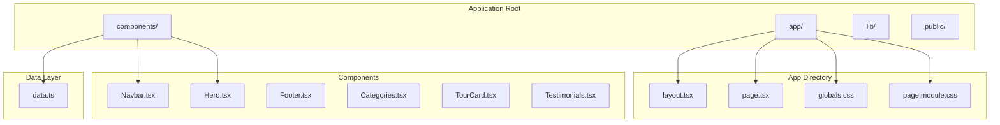
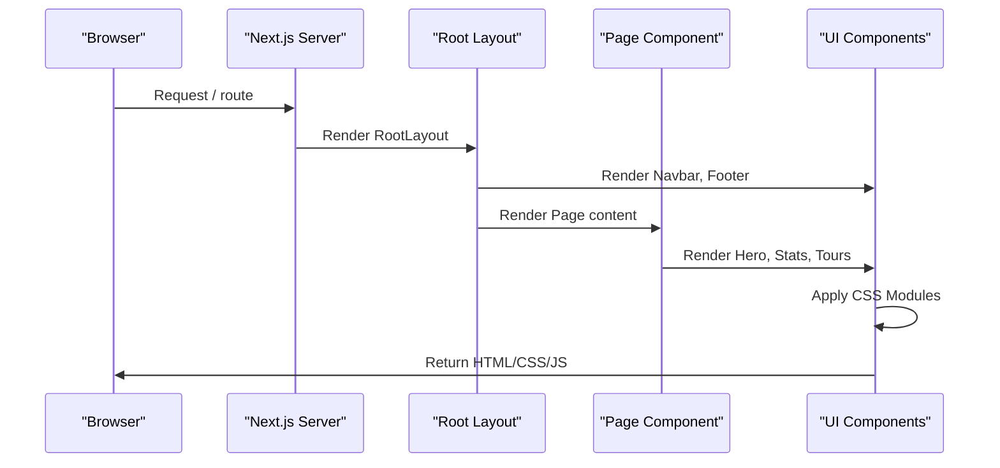
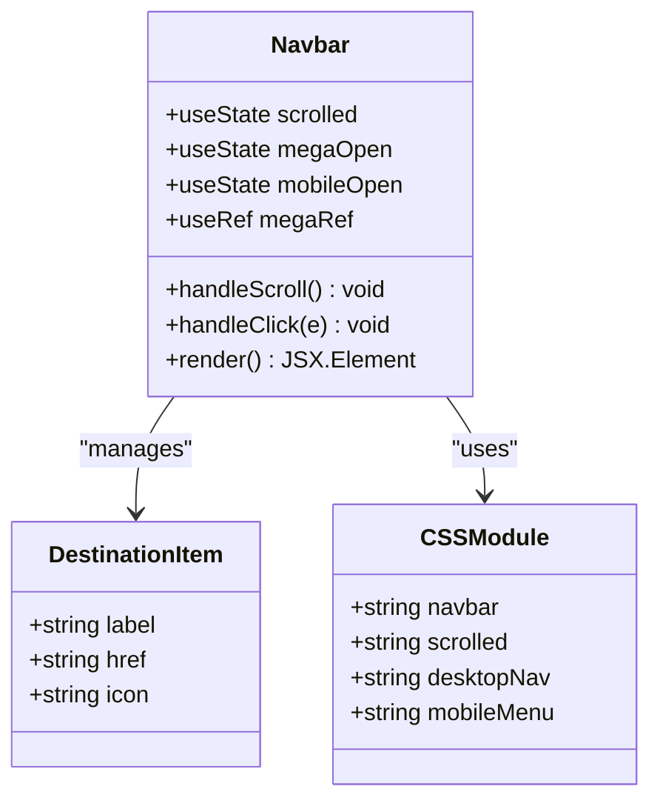
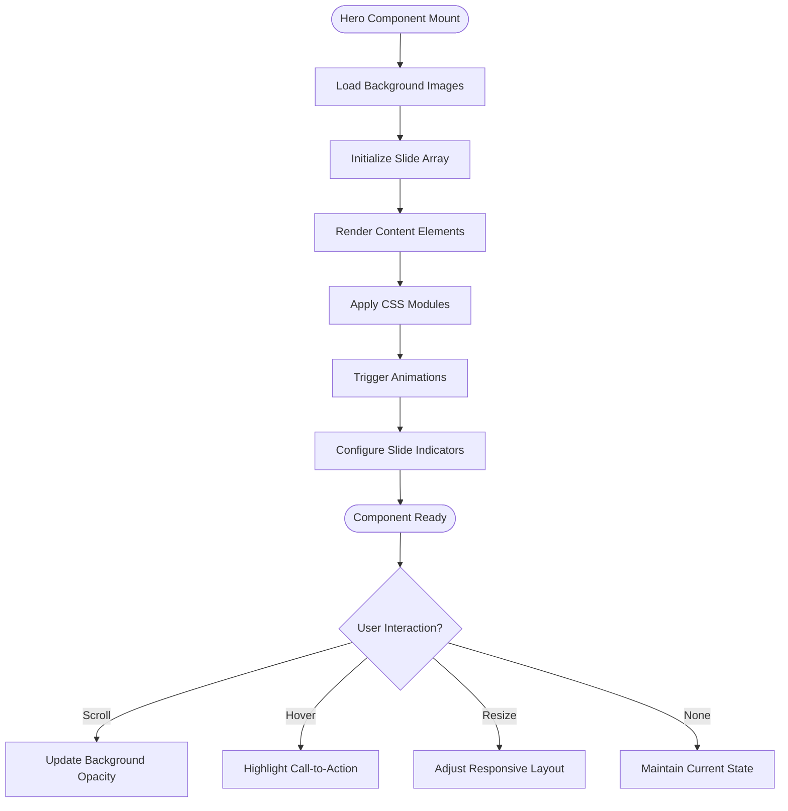
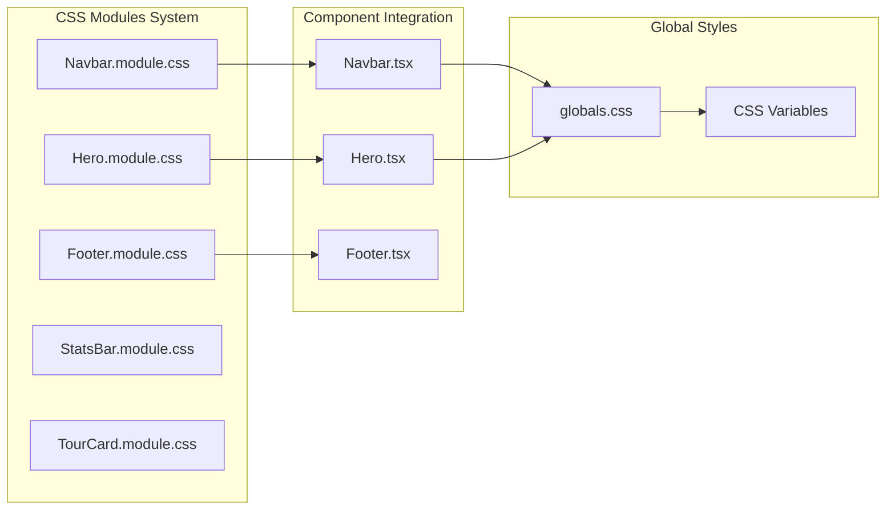
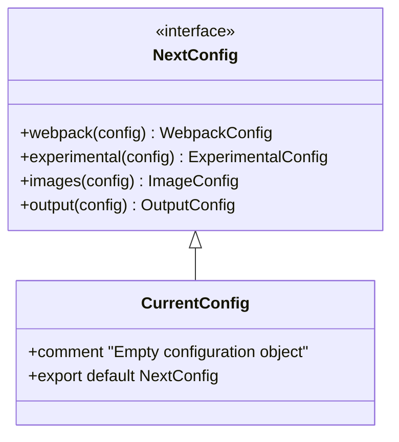
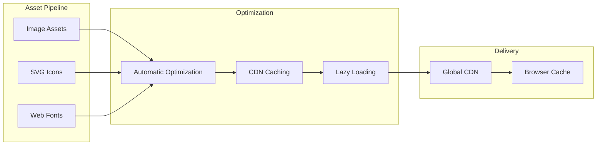

# Technology Stack & Dependencies

<cite>
**Referenced Files in This Document**
- [package.json](file://package.json)
- [next.config.ts](file://next.config.ts)
- [tsconfig.json](file://tsconfig.json)
- [README.md](file://README.md)
- [app/layout.tsx](file://app/layout.tsx)
- [app/page.tsx](file://app/page.tsx)
- [components/Navbar.tsx](file://components/Navbar.tsx)
- [components/Hero.tsx](file://components/Hero.tsx)
- [components/CTABanner.tsx](file://components/CTABanner.tsx)
- [lib/data.ts](file://lib/data.ts)
- [app/globals.css](file://app/globals.css)
- [components/Navbar.module.css](file://components/Navbar.module.css)
- [components/Hero.module.css](file://components/Hero.module.css)
- [app/page.module.css](file://app/page.module.css)
</cite>

## Table of Contents
1. [Introduction](#introduction)
2. [Project Structure](#project-structure)
3. [Core Technologies](#core-technologies)
4. [Framework Architecture](#framework-architecture)
5. [Component Implementation](#component-implementation)
6. [Styling System](#styling-system)
7. [Build Configuration](#build-configuration)
8. [Development Dependencies](#development-dependencies)
9. [Performance Features](#performance-features)
10. [Deployment Preparation](#deployment-preparation)
11. [Technology Stack Summary](#technology-stack-summary)

## Introduction

The NatIndia project is a modern React-based travel website built with Next.js 16.2.1, designed to showcase India's diverse tourism offerings. This documentation provides a comprehensive overview of the technology stack, highlighting the framework architecture, component implementation patterns, styling approaches, and build configuration that enables the creation of a responsive, performant travel experience.

The project follows contemporary web development practices with a focus on React 19.2.4 for component-based UI development, TypeScript 5.x for type safety, and Next.js App Router for full-stack capabilities. The implementation demonstrates sophisticated use of CSS Modules for component encapsulation and Lucide React for consistent iconography.

## Project Structure

The project follows Next.js App Router conventions with a well-organized file structure that separates concerns effectively:

**Diagram sources**
- [app/layout.tsx:1-28](file://app/layout.tsx#L1-L28)
- [app/page.tsx:1-22](file://app/page.tsx#L1-L22)
- [components/Navbar.tsx:1-113](file://components/Navbar.tsx#L1-L113)
- [lib/data.ts:1-252](file://lib/data.ts#L1-L252)

**Section sources**
- [app/layout.tsx:1-28](file://app/layout.tsx#L1-L28)
- [app/page.tsx:1-22](file://app/page.tsx#L1-L22)
- [components/Navbar.tsx:1-113](file://components/Navbar.tsx#L1-L113)

## Core Technologies

### Next.js 16.2.1 - Full-Stack React Framework

Next.js serves as the foundational framework providing comprehensive React-based full-stack capabilities. The project utilizes the latest version with App Router architecture, enabling modern routing patterns and enhanced developer experience.

Key Next.js features implemented:
- **App Router**: Organized file-based routing system with route groups and dynamic segments
- **Server Components**: Server-side rendering for improved performance and SEO
- **Edge Runtime**: Optimized for global edge computing environments
- **Built-in Image Optimization**: Automatic image optimization and responsive image loading
- **Font Optimization**: Automatic font optimization and loading strategies

The framework configuration allows for seamless integration of static generation, server-side rendering, and client-side interactivity based on component requirements.

**Section sources**
- [package.json:10-16](file://package.json#L10-L16)
- [README.md:1-37](file://README.md#L1-L37)

### React 19.2.4 - Component-Based UI Library

React 19.2.4 provides the foundation for component-based UI development with enhanced concurrent features and improved developer experience. The implementation demonstrates modern React patterns including:

- **Client Components**: Marked with `'use client'` directive for interactive functionality
- **Server Components**: Pure server-rendered components for optimal performance
- **Hooks Pattern**: Comprehensive use of React hooks for state management and lifecycle
- **TypeScript Integration**: Full type safety across component implementations

The dual nature of React components allows for optimal performance by rendering static content on the server while maintaining interactivity on the client side.

**Section sources**
- [package.json:14-15](file://package.json#L14-L15)
- [components/Navbar.tsx:1-2](file://components/Navbar.tsx#L1-L2)
- [components/Hero.tsx:1-2](file://components/Hero.tsx#L1-L2)

### TypeScript 5.x - Type Safety & Development Experience

TypeScript 5.x provides comprehensive type safety and enhanced development experience throughout the codebase. The configuration emphasizes strict type checking while maintaining flexibility for modern JavaScript features.

Key TypeScript configurations:
- **Strict Mode**: Enabled for comprehensive type checking
- **No Emit**: TypeScript compiles to JavaScript without emitting type files
- **Modern Module Resolution**: ESNext module resolution for optimal bundling
- **JSX Support**: React JSX transformation for type-safe component development
- **Path Mapping**: @/* alias for simplified imports

The type system ensures reliable component development with proper prop validation and enhanced IDE support.

**Section sources**
- [package.json:17-22](file://package.json#L17-L22)
- [tsconfig.json:1-35](file://tsconfig.json#L1-L35)

## Framework Architecture

The application follows Next.js App Router architecture with clear separation between server and client components:

**Diagram sources**
- [app/layout.tsx:17-27](file://app/layout.tsx#L17-L27)
- [app/page.tsx:9-21](file://app/page.tsx#L9-L21)
- [components/Navbar.tsx:18-112](file://components/Navbar.tsx#L18-L112)

The architecture enables efficient server-side rendering for initial page loads while maintaining client-side interactivity for dynamic user interactions.

**Section sources**
- [app/layout.tsx:1-28](file://app/layout.tsx#L1-L28)
- [app/page.tsx:1-22](file://app/page.tsx#L1-L22)

## Component Implementation

### Navigation Component Architecture

The navigation system demonstrates sophisticated React patterns with state management and responsive design:

**Diagram sources**
- [components/Navbar.tsx:18-112](file://components/Navbar.tsx#L18-L112)
- [components/Navbar.module.css:1-200](file://components/Navbar.module.css#L1-L200)

The component implements:
- **Scroll Detection**: Dynamic navbar styling based on scroll position
- **Mega Menu**: Complex dropdown navigation with grid layout
- **Mobile Responsiveness**: Adaptive mobile menu with toggle functionality
- **State Management**: Multiple state hooks for different UI states

**Section sources**
- [components/Navbar.tsx:1-113](file://components/Navbar.tsx#L1-L113)
- [components/Navbar.module.css:1-200](file://components/Navbar.module.css#L1-L200)

### Hero Section Implementation

The hero section showcases advanced CSS animations and responsive design patterns:

**Diagram sources**
- [components/Hero.tsx:20-99](file://components/Hero.tsx#L20-L99)
- [components/Hero.module.css:1-254](file://components/Hero.module.css#L1-L254)

**Section sources**
- [components/Hero.tsx:1-100](file://components/Hero.tsx#L1-L100)
- [components/Hero.module.css:1-254](file://components/Hero.module.css#L1-L254)

## Styling System

### CSS Modules Architecture

The project implements a comprehensive CSS Modules system for component-scoped styling:

**Diagram sources**
- [components/Navbar.module.css:1-200](file://components/Navbar.module.css#L1-L200)
- [components/Hero.module.css:1-254](file://components/Hero.module.css#L1-L254)
- [app/globals.css:1-190](file://app/globals.css#L1-L190)

The styling system provides:
- **Component Encapsulation**: Scoped styles prevent CSS conflicts
- **Dynamic Classes**: Conditional class application based on state
- **Responsive Design**: Media queries for different screen sizes
- **Animation Support**: CSS keyframes for smooth transitions

**Section sources**
- [components/Navbar.module.css:1-200](file://components/Navbar.module.css#L1-L200)
- [components/Hero.module.css:1-254](file://components/Hero.module.css#L1-L254)
- [app/globals.css:1-190](file://app/globals.css#L1-L190)

### Icon System Integration

Lucide React provides consistent SVG iconography throughout the application:

| Component | Icons Used | Purpose |
|-----------|------------|---------|
| Navbar | Menu, X, ChevronDown, MapPin | Navigation controls and indicators |
| Hero | ArrowRight, Search | Interactive elements and actions |
| CTABanner | ArrowRight, Phone | Call-to-action buttons |

The icon system ensures visual consistency and accessibility across all components.

**Section sources**
- [components/Navbar.tsx:4-4](file://components/Navbar.tsx#L4-L4)
- [components/Hero.tsx:3-3](file://components/Hero.tsx#L3-L3)
- [components/CTABanner.tsx:3-3](file://components/CTABanner.tsx#L3-L3)

## Build Configuration

### Next.js Configuration

The Next.js configuration provides a foundation for build customization:

**Diagram sources**
- [next.config.ts:1-8](file://next.config.ts#L1-L8)

The current configuration maintains Next.js defaults while providing extension points for future enhancements.

**Section sources**
- [next.config.ts:1-8](file://next.config.ts#L1-L8)

### TypeScript Compilation Settings

The TypeScript configuration emphasizes modern JavaScript features and strict type checking:

| Compiler Option | Value | Purpose |
|----------------|-------|---------|
| target | ES2017 | Modern JavaScript features |
| module | esnext | Optimal tree-shaking |
| moduleResolution | bundler | Next.js optimized resolution |
| strict | true | Comprehensive type checking |
| noEmit | true | Compile to JavaScript only |
| jsx | react-jsx | React JSX transformation |
| isolatedModules | true | Faster builds |

**Section sources**
- [tsconfig.json:1-35](file://tsconfig.json#L1-L35)

## Development Dependencies

The project includes essential development dependencies for modern React development:

### Production Dependencies

| Package | Version | Purpose |
|---------|---------|---------|
| next | 16.2.1 | Core framework |
| react | 19.2.4 | UI library |
| react-dom | 19.2.4 | DOM rendering |
| framer-motion | ^12.38.0 | Animation library |
| lucide-react | ^1.7.0 | Icon library |

### Development Dependencies

| Package | Version | Purpose |
|---------|---------|---------|
| typescript | ^5 | Type checking |
| @types/node | ^20 | Node.js types |
| @types/react | ^19 | React types |
| @types/react-dom | ^19 | React DOM types |

**Section sources**
- [package.json:10-22](file://package.json#L10-L22)

## Performance Features

### Static Generation & SSR

The application leverages Next.js server-side rendering and static generation for optimal performance:

- **Server Components**: Pure server-rendered components for faster initial loads
- **Static Site Generation**: Pre-rendered pages for improved SEO and performance
- **Image Optimization**: Automatic image optimization and responsive sizing
- **Code Splitting**: Automatic code splitting for optimal bundle sizes

### Client-Side Interactivity

Selective client-side hydration ensures optimal performance:

- **Hydration Control**: Only interactive components marked as client
- **State Management**: Efficient state updates with minimal re-renders
- **Event Handling**: Optimized event listeners for smooth interactions

### Asset Optimization

**Diagram sources**
- [README.md:21-21](file://README.md#L21-L21)

## Deployment Preparation

### Build Process

The project includes optimized build scripts for production deployment:

| Script | Command | Purpose |
|--------|---------|---------|
| dev | next dev | Development server |
| build | next build | Production build |
| start | next start | Production server |

### Deployment Options

The application is optimized for various deployment platforms:

- **Vercel**: Native Next.js optimization and edge computing
- **Static Hosting**: Static export for CDN deployment
- **Server Deployment**: Node.js server deployment
- **Edge Functions**: Serverless deployment with edge computing

**Section sources**
- [README.md:32-37](file://README.md#L32-L37)
- [package.json:5-9](file://package.json#L5-L9)

## Technology Stack Summary

The NatIndia project demonstrates a comprehensive modern web development stack focused on performance, scalability, and developer experience:

### Core Technology Matrix

| Category | Technology | Version | Purpose |
|----------|------------|---------|---------|
| Framework | Next.js | 16.2.1 | Full-stack React framework |
| UI Library | React | 19.2.4 | Component-based interface |
| Type System | TypeScript | 5.x | Type safety and development |
| Animation | Framer Motion | 12.38.0 | Smooth transitions and effects |
| Icons | Lucide React | 1.7.0 | Consistent SVG iconography |
| Styling | CSS Modules | Native | Component-scoped styling |

### Architectural Benefits

- **Performance**: Server-side rendering and static generation for optimal load times
- **Scalability**: Modular component architecture supports growth
- **Maintainability**: Strong typing and organized structure improve code quality
- **Accessibility**: Semantic HTML and proper ARIA attributes
- **SEO**: Built-in SEO optimization with metadata management

The technology stack provides a solid foundation for building responsive, performant travel websites while maintaining excellent developer experience and code quality standards.