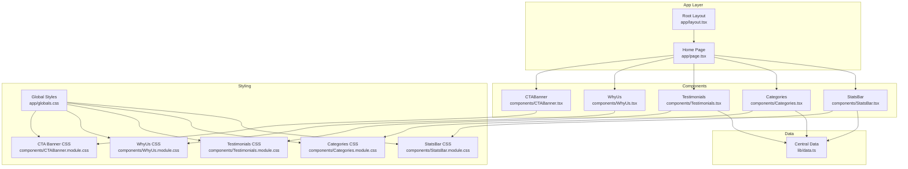
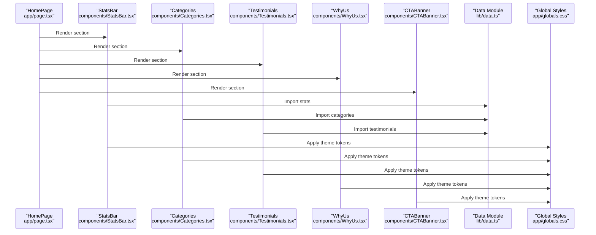
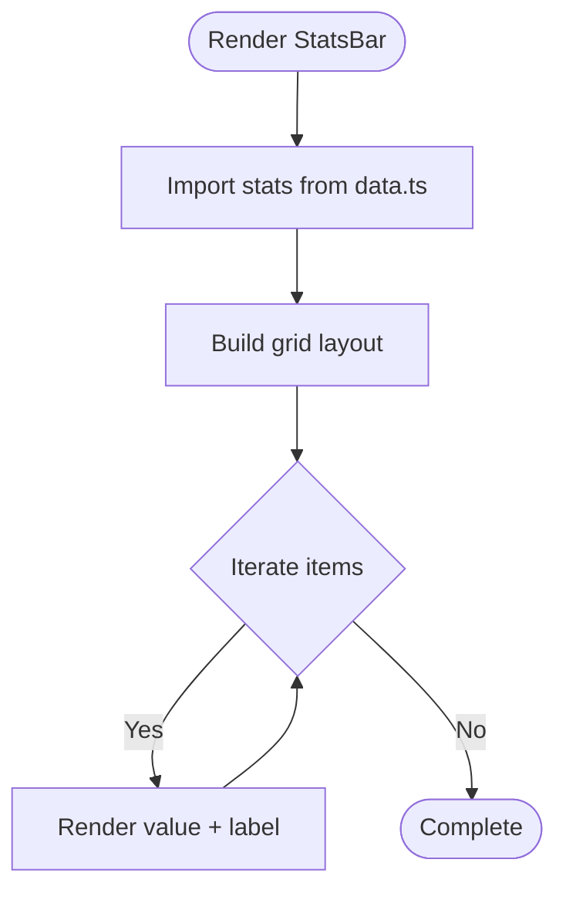
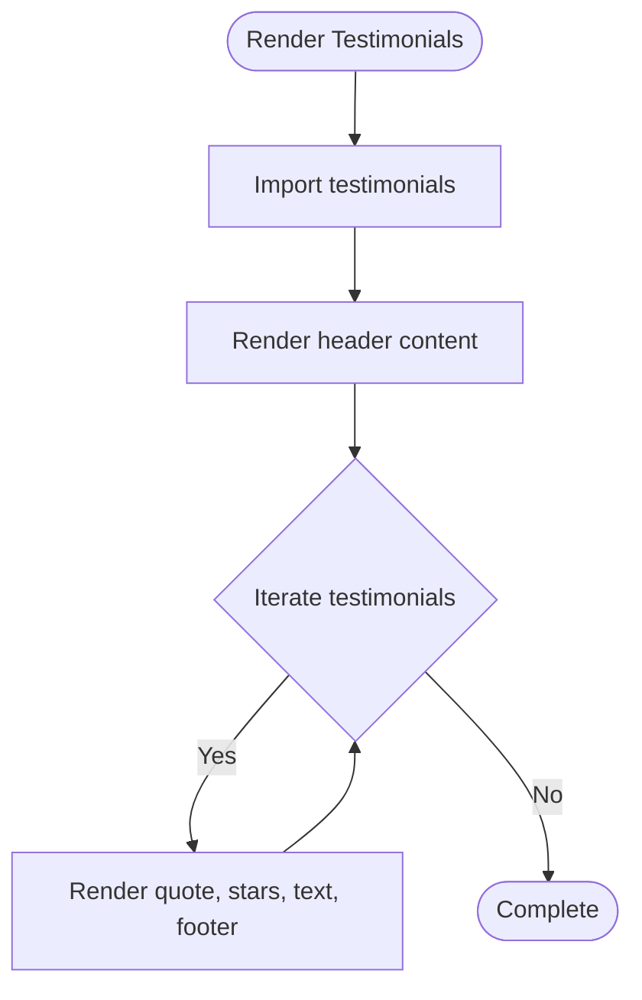
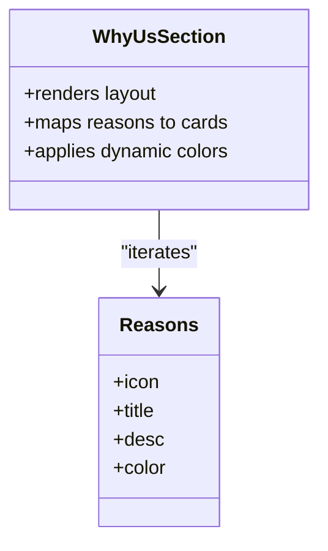
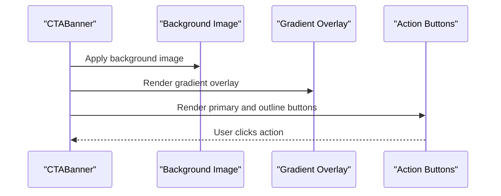
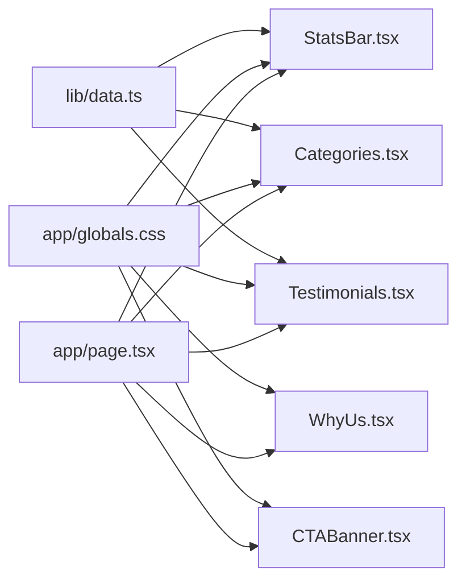

# Content Sections

<cite>
**Referenced Files in This Document**
- [StatsBar.tsx](file://components/StatsBar.tsx)
- [StatsBar.module.css](file://components/StatsBar.module.css)
- [Categories.tsx](file://components/Categories.tsx)
- [Categories.module.css](file://components/Categories.module.css)
- [Testimonials.tsx](file://components/Testimonials.tsx)
- [Testimonials.module.css](file://components/Testimonials.module.css)
- [WhyUs.tsx](file://components/WhyUs.tsx)
- [WhyUs.module.css](file://components/WhyUs.module.css)
- [CTABanner.tsx](file://components/CTABanner.tsx)
- [CTABanner.module.css](file://components/CTABanner.module.css)
- [data.ts](file://lib/data.ts)
- [page.tsx](file://app/page.tsx)
- [layout.tsx](file://app/layout.tsx)
- [globals.css](file://app/globals.css)
</cite>

## Table of Contents
1. [Introduction](#introduction)
2. [Project Structure](#project-structure)
3. [Core Components](#core-components)
4. [Architecture Overview](#architecture-overview)
5. [Detailed Component Analysis](#detailed-component-analysis)
6. [Dependency Analysis](#dependency-analysis)
7. [Performance Considerations](#performance-considerations)
8. [Troubleshooting Guide](#troubleshooting-guide)
9. [Conclusion](#conclusion)
10. [Appendices](#appendices)

## Introduction
This document provides comprehensive documentation for the content sections components that form the core of the homepage experience. It covers five key sections:
- StatsBar: Achievement display using centralized statistics data
- Categories: Destination exploration with visual icons and lazy-loaded imagery
- Testimonials: User reviews and star rating visualization
- WhyUs: Company value presentation with themed cards
- CTABanner: Conversion optimization with prominent actions

Each component’s data binding patterns, interactive elements, responsive design, and composition are explained, along with how they integrate into the central data management system and contribute to a cohesive user experience.

## Project Structure
The content sections are implemented as standalone Next.js client components with modular CSS. They are orchestrated by the homepage route and styled using a shared design system defined in global CSS.



**Diagram sources**
- [page.tsx:1-22](file://app/page.tsx#L1-L22)
- [layout.tsx:17-27](file://app/layout.tsx#L17-L27)
- [StatsBar.tsx:1-21](file://components/StatsBar.tsx#L1-L21)
- [Categories.tsx:1-47](file://components/Categories.tsx#L1-L47)
- [Testimonials.tsx:1-41](file://components/Testimonials.tsx#L1-L41)
- [WhyUs.tsx:1-101](file://components/WhyUs.tsx#L1-L101)
- [CTABanner.tsx:1-32](file://components/CTABanner.tsx#L1-L32)
- [data.ts:1-252](file://lib/data.ts#L1-L252)
- [globals.css:1-190](file://app/globals.css#L1-L190)

**Section sources**
- [page.tsx:1-22](file://app/page.tsx#L1-L22)
- [layout.tsx:17-27](file://app/layout.tsx#L17-L27)
- [globals.css:1-190](file://app/globals.css#L1-L190)

## Core Components
This section outlines the primary content sections and their roles in the user experience.

- StatsBar: Presents curated achievements and metrics using a responsive grid layout.
- Categories: Displays destination categories with rich visuals, hover effects, and navigation links.
- Testimonials: Showcases guest stories with star ratings and avatar imagery.
- WhyUs: Highlights company values through themed cards with dynamic accent colors.
- CTABanner: Encourages conversions with clear calls-to-action and background treatment.

**Section sources**
- [StatsBar.tsx:5-20](file://components/StatsBar.tsx#L5-L20)
- [Categories.tsx:7-46](file://components/Categories.tsx#L7-L46)
- [Testimonials.tsx:6-39](file://components/Testimonials.tsx#L6-L39)
- [WhyUs.tsx:44-99](file://components/WhyUs.tsx#L44-L99)
- [CTABanner.tsx:6-31](file://components/CTABanner.tsx#L6-L31)

## Architecture Overview
The content sections follow a unidirectional data flow:
- Centralized data is imported into components via the data module.
- Components render static content and handle user interactions locally.
- Global CSS defines theme tokens and responsive breakpoints used across components.



**Diagram sources**
- [page.tsx:9-21](file://app/page.tsx#L9-L21)
- [StatsBar.tsx:2](file://components/StatsBar.tsx#L2)
- [Categories.tsx:4](file://components/Categories.tsx#L4)
- [Testimonials.tsx:3](file://components/Testimonials.tsx#L3)
- [data.ts:246-251](file://lib/data.ts#L246-L251)
- [globals.css:3-42](file://app/globals.css#L3-L42)

## Detailed Component Analysis

### StatsBar Component
Purpose:
- Display achievement metrics in a visually prominent, responsive grid.

Data Binding:
- Imports a stats array from the central data module and renders each item’s value and label.

Interactive Elements:
- None; purely presentational.

Responsive Design:
- Grid layout adapts from four columns on large screens to two columns at tablet and single column on small screens.

Accessibility:
- Uses semantic section and container classes for screen readers and assistive technologies.

Customization:
- Add new stat items to the central data array to extend the bar.
- Adjust typography and spacing via CSS variables in the global stylesheet.



**Diagram sources**
- [StatsBar.tsx:10-15](file://components/StatsBar.tsx#L10-L15)
- [StatsBar.module.css:19-23](file://components/StatsBar.module.css#L19-L23)
- [data.ts:246-251](file://lib/data.ts#L246-L251)

**Section sources**
- [StatsBar.tsx:1-21](file://components/StatsBar.tsx#L1-L21)
- [StatsBar.module.css:1-71](file://components/StatsBar.module.css#L1-L71)
- [data.ts:246-251](file://lib/data.ts#L246-L251)

### Categories Component
Purpose:
- Enable destination exploration through visually rich category cards with icons, counts, and images.

Data Binding:
- Imports categories from the central data module, including id, title, description, image, count, and icon.

Interactive Elements:
- Cards are anchor links to destination pages, with hover animations on images and overlays.

Visual Design:
- First and fifth cards span two columns on larger screens.
- Hover reveals description and call-to-action with fade-in transitions.

Responsive Design:
- Grid adjusts from four columns to two columns and then to single column as viewport narrows.
- Card heights adapt to maintain visual balance.

Customization:
- Extend categories in the data module to add new destinations.
- Modify CSS variables for accent colors and hover effects.

```mermaid
sequenceDiagram
participant Comp as "CategoriesSection"
participant Data as "categories from data.ts"
participant DOM as "DOM Grid"
participant Link as "Next Link"
Comp->>Data : Map categories
Data-->>Comp : Category items
Comp->>DOM : Render grid with cards
DOM->>Link : Wrap each card in Link with href
Link-->>DOM : Navigation to destination page
```

**Diagram sources**
- [Categories.tsx:19-41](file://components/Categories.tsx#L19-L41)
- [Categories.module.css:24-29](file://components/Categories.module.css#L24-L29)
- [Categories.module.css:31-42](file://components/Categories.module.css#L31-L42)
- [data.ts:1-74](file://lib/data.ts#L1-L74)

**Section sources**
- [Categories.tsx:1-47](file://components/Categories.tsx#L1-L47)
- [Categories.module.css:1-135](file://components/Categories.module.css#L1-L135)
- [data.ts:1-74](file://lib/data.ts#L1-L74)

### Testimonials Component
Purpose:
- Showcase guest experiences with star ratings, quotes, and avatar imagery.

Data Binding:
- Imports testimonials from the central data module, including id, name, role, avatar, tour, rating, and text.

Interactive Elements:
- Cards lift on hover with subtle shadow transitions.

Rating Visualization:
- Renders filled stars based on numeric rating.

Responsive Design:
- Two-column grid on larger screens, single column on smaller screens.

Customization:
- Add testimonials to the data module to expand the gallery.
- Adjust card styling via CSS variables and media queries.



**Diagram sources**
- [Testimonials.tsx:16-35](file://components/Testimonials.tsx#L16-L35)
- [Testimonials.module.css:21-25](file://components/Testimonials.module.css#L21-L25)
- [data.ts:207-244](file://lib/data.ts#L207-L244)

**Section sources**
- [Testimonials.tsx:1-41](file://components/Testimonials.tsx#L1-L41)
- [Testimonials.module.css:1-101](file://components/Testimonials.module.css#L1-L101)
- [data.ts:207-244](file://lib/data.ts#L207-L244)

### WhyUs Component
Purpose:
- Communicate company values and trust signals through themed cards and supporting imagery.

Data Binding:
- Defines a reasons array locally with icon, title, description, and color.

Interactive Elements:
- Cards lift on hover with shadow transitions.

Dynamic Theming:
- Uses CSS custom properties to apply accent colors derived from the reasons array.

Layout:
- Two-panel layout with descriptive text on the left and a grid of cards on the right.

Responsive Design:
- Single-column layout on smaller screens; right grid switches to single column below a breakpoint.

Customization:
- Add or modify reasons entries to reflect evolving company messaging.
- Adjust card layout and typography via CSS variables.



**Diagram sources**
- [WhyUs.tsx:44-99](file://components/WhyUs.tsx#L44-L99)
- [WhyUs.module.css:6-11](file://components/WhyUs.module.css#L6-L11)
- [WhyUs.module.css:54-58](file://components/WhyUs.module.css#L54-L58)

**Section sources**
- [WhyUs.tsx:1-101](file://components/WhyUs.tsx#L1-L101)
- [WhyUs.module.css:1-103](file://components/WhyUs.module.css#L1-L103)

### CTABanner Component
Purpose:
- Drive conversions with a prominent banner featuring clear actions and background treatment.

Data Binding:
- No external data import; uses internal copy and links.

Interactive Elements:
- Primary and outline buttons with hover states and icon accents.

Background Treatment:
- Full-bleed background image with gradient overlay for readability.

Responsive Design:
- Flex layout stacks on smaller screens; action buttons wrap horizontally on medium screens.

Customization:
- Change eyebrow text, headline, and subtitle to reflect campaigns.
- Update links and button styles via CSS.



**Diagram sources**
- [CTABanner.tsx:6-31](file://components/CTABanner.tsx#L6-L31)
- [CTABanner.module.css:8-23](file://components/CTABanner.module.css#L8-L23)
- [CTABanner.module.css:60-70](file://components/CTABanner.module.css#L60-L70)

**Section sources**
- [CTABanner.tsx:1-32](file://components/CTABanner.tsx#L1-L32)
- [CTABanner.module.css:1-76](file://components/CTABanner.module.css#L1-L76)

## Dependency Analysis
The content sections depend on:
- Central data module for dynamic content (stats, categories, testimonials).
- Global CSS for theme tokens, typography, spacing, and responsive breakpoints.
- Next.js Link for navigation within the app.



**Diagram sources**
- [data.ts:1-252](file://lib/data.ts#L1-L252)
- [globals.css:3-42](file://app/globals.css#L3-L42)
- [page.tsx:9-21](file://app/page.tsx#L9-L21)

**Section sources**
- [data.ts:1-252](file://lib/data.ts#L1-L252)
- [globals.css:1-190](file://app/globals.css#L1-L190)
- [page.tsx:1-22](file://app/page.tsx#L1-L22)

## Performance Considerations
- Lazy loading: Images in categories and testimonials use lazy loading attributes to defer offscreen resources.
- Minimal interactivity: Components rely on CSS hover states and Next.js Link navigation to reduce JavaScript overhead.
- Responsive grids: CSS Grid layouts adapt to viewport sizes, minimizing reflows and repaints.
- Theme tokens: Shared CSS variables reduce duplication and improve maintainability.

[No sources needed since this section provides general guidance]

## Troubleshooting Guide
Common issues and resolutions:
- Missing images: Verify image URLs in the data module resolve correctly; consider fallback placeholders.
- Hover effects not triggering: Ensure CSS selectors match the component structure and that global CSS variables are defined.
- Links not navigating: Confirm Next.js Link usage and route existence for destination pages.
- Responsive layout glitches: Check media query breakpoints and grid template configurations in component CSS.

**Section sources**
- [Categories.tsx:28](file://components/Categories.tsx#L28)
- [Testimonials.tsx:27](file://components/Testimonials.tsx#L27)
- [globals.css:186-189](file://app/globals.css#L186-L189)

## Conclusion
The content sections collectively deliver a cohesive, data-driven, and visually engaging homepage experience. They leverage a centralized data model, a consistent design system, and responsive layouts to communicate achievements, showcase destinations, highlight testimonials, present company values, and optimize conversions. Their modular structure enables easy maintenance and extension.

[No sources needed since this section summarizes without analyzing specific files]

## Appendices

### Integration with Central Data Management
- StatsBar, Categories, and Testimonials import arrays from the central data module, enabling consistent updates without changing component logic.
- WhyUs maintains its own reasons array for internal messaging while still benefiting from global theming.
- CTABanner remains content-driven and does not require external data imports.

**Section sources**
- [StatsBar.tsx:2](file://components/StatsBar.tsx#L2)
- [Categories.tsx:4](file://components/Categories.tsx#L4)
- [Testimonials.tsx:3](file://components/Testimonials.tsx#L3)
- [data.ts:1-252](file://lib/data.ts#L1-L252)

### Customization Examples
- Adding a new statistic: Append an object to the stats array in the data module; the StatsBar grid will automatically adjust.
- Introducing a new destination category: Add a new category object to the categories array; the Categories grid will render accordingly.
- Expanding testimonials: Add a new testimonial object to the testimonials array; the Testimonials grid will include it.
- Updating WhyUs messaging: Modify the reasons array to reflect new value propositions or remove outdated ones.
- Campaign-specific CTAs: Update copy and links in the CTABanner component to align with marketing initiatives.

**Section sources**
- [data.ts:246-251](file://lib/data.ts#L246-L251)
- [data.ts:1-74](file://lib/data.ts#L1-L74)
- [data.ts:207-244](file://lib/data.ts#L207-L244)
- [WhyUs.tsx:5-42](file://components/WhyUs.tsx#L5-L42)
- [CTABanner.tsx:13-25](file://components/CTABanner.tsx#L13-L25)