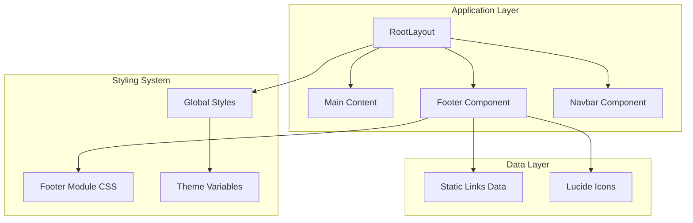
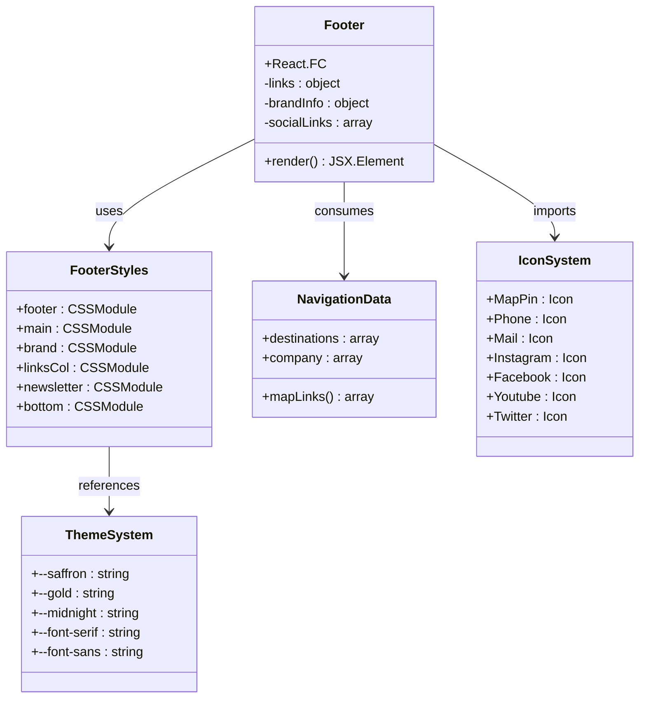
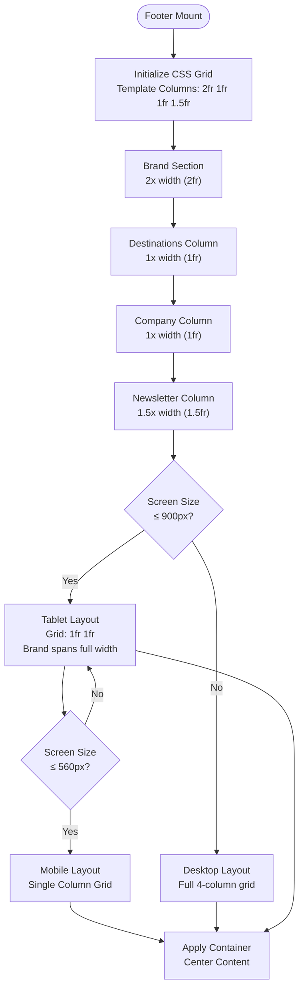
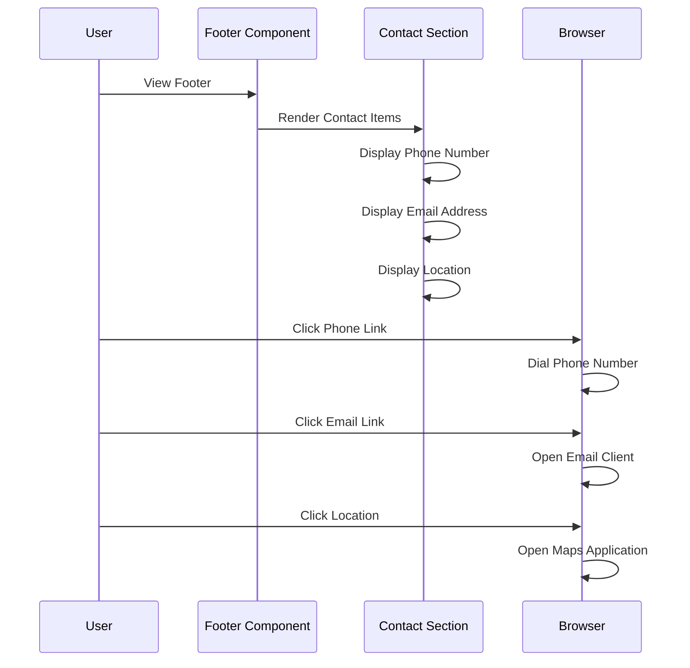
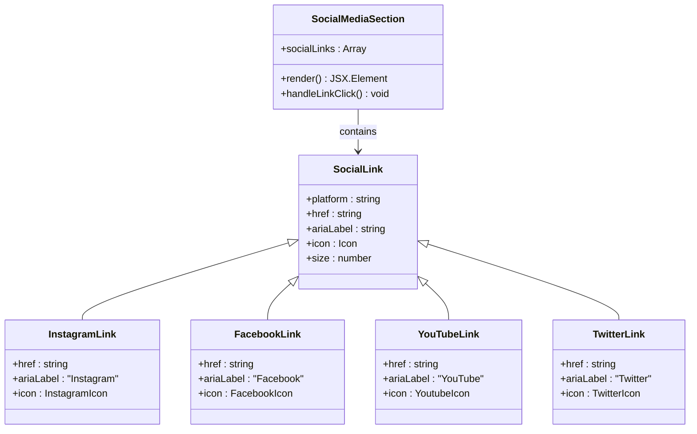
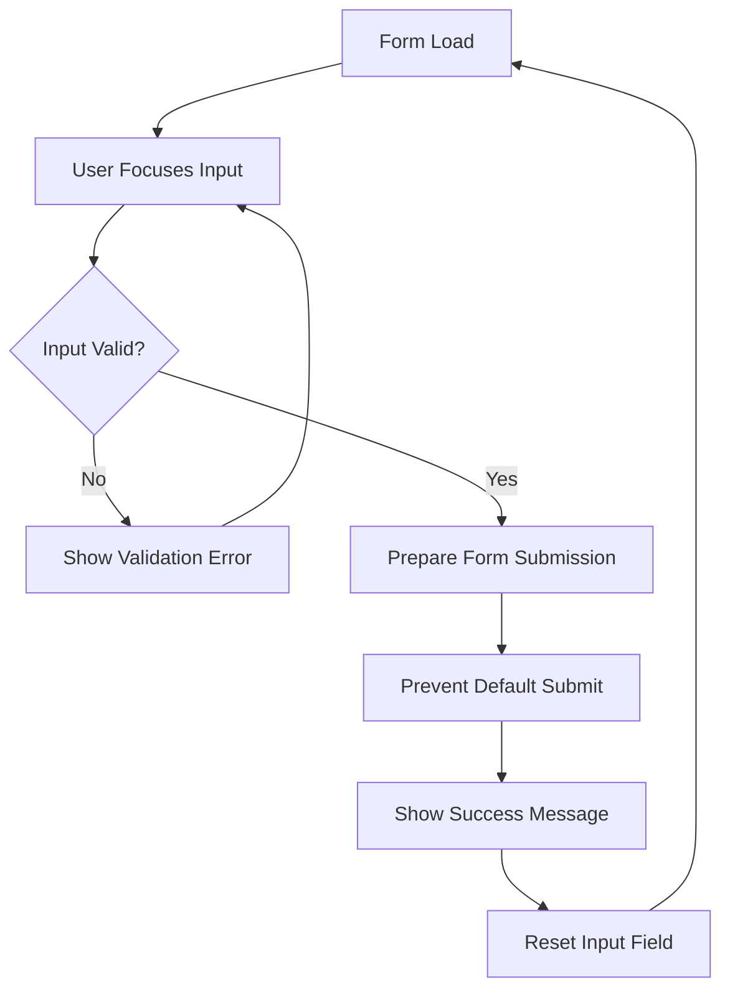

# Footer System

<cite>
**Referenced Files in This Document**
- [Footer.tsx](file://components/Footer.tsx)
- [Footer.module.css](file://components/Footer.module.css)
- [layout.tsx](file://app/layout.tsx)
- [globals.css](file://app/globals.css)
- [Navbar.tsx](file://components/Navbar.tsx)
- [data.ts](file://lib/data.ts)
- [package.json](file://package.json)
</cite>

## Table of Contents
1. [Introduction](#introduction)
2. [Project Structure](#project-structure)
3. [Core Components](#core-components)
4. [Architecture Overview](#architecture-overview)
5. [Detailed Component Analysis](#detailed-component-analysis)
6. [Multi-Column Layout Implementation](#multi-column-layout-implementation)
7. [Contact Information Display](#contact-information-display)
8. [Social Media Integration](#social-media-integration)
9. [Newsletter Subscription Form](#newsletter-subscription-form)
10. [Responsive Design Patterns](#responsive-design-patterns)
11. [Cross-Platform Compatibility](#cross-platform-compatibility)
12. [Navigation Access and Brand Information](#navigation-access-and-brand-information)
13. [External Services Integration](#external-services-integration)
14. [Customization Examples](#customization-examples)
15. [Performance Considerations](#performance-considerations)
16. [Troubleshooting Guide](#troubleshooting-guide)
17. [Conclusion](#conclusion)

## Introduction

The Footer System component is a comprehensive, multi-section footer designed for the NatIndia travel website. It serves as a crucial navigation hub and brand ambassador, providing users with essential contact information, destination links, company information, and newsletter subscription capabilities. Built with Next.js and styled with CSS Modules, the footer implements a sophisticated multi-column layout that adapts seamlessly across different screen sizes while maintaining brand consistency.

The footer plays a pivotal role in the overall user experience by offering:
- **Navigation Access**: Direct links to key destinations and company pages
- **Brand Information**: Clear brand identity with logo, tagline, and contact details
- **Customer Engagement**: Social media connections and newsletter subscription
- **Legal Compliance**: Privacy policy, terms of service, and sitemap access
- **Cross-Platform Compatibility**: Responsive design that works across desktop, tablet, and mobile devices

## Project Structure

The footer system is integrated into the broader Next.js application architecture as follows:



**Diagram sources**
- [layout.tsx:17-27](file://app/layout.tsx#L17-L27)
- [Footer.tsx:25-103](file://components/Footer.tsx#L25-L103)
- [globals.css:3-42](file://app/globals.css#L3-L42)

**Section sources**
- [layout.tsx:1-28](file://app/layout.tsx#L1-L28)
- [Footer.tsx:1-104](file://components/Footer.tsx#L1-L104)
- [globals.css:1-190](file://app/globals.css#L1-L190)

## Core Components

The footer system consists of several interconnected components that work together to create a cohesive user experience:

### Primary Sections
1. **Brand Identity Section**: Contains logo, tagline, and contact information
2. **Navigation Links Section**: Multi-column link structure for destinations and company pages
3. **Newsletter Subscription Section**: Email capture form with validation
4. **Legal and Additional Links**: Privacy policy, terms, and sitemap links

### Styling Architecture
The component utilizes CSS Modules for scoped styling with global theme variables:
- **Grid Layout System**: CSS Grid for responsive multi-column design
- **Theme Variables**: Consistent color scheme using brand-specific CSS variables
- **Animation System**: Subtle hover effects and transitions
- **Responsive Breakpoints**: Media queries for different screen sizes

**Section sources**
- [Footer.tsx:25-103](file://components/Footer.tsx#L25-L103)
- [Footer.module.css:18-23](file://components/Footer.module.css#L18-L23)
- [globals.css:3-42](file://app/globals.css#L3-L42)

## Architecture Overview

The footer system follows a modular architecture pattern that promotes reusability and maintainability:



**Diagram sources**
- [Footer.tsx:6-23](file://components/Footer.tsx#L6-L23)
- [Footer.module.css:1-5](file://components/Footer.module.css#L1-L5)
- [globals.css:3-26](file://app/globals.css#L3-L26)

The architecture ensures loose coupling between components while maintaining strong cohesion within the footer module. The use of CSS Modules prevents style conflicts with other components, and the separation of concerns allows for easy maintenance and updates.

**Section sources**
- [Footer.tsx:1-104](file://components/Footer.tsx#L1-L104)
- [Footer.module.css:1-164](file://components/Footer.module.css#L1-L164)

## Detailed Component Analysis

### Multi-Column Layout Implementation

The footer employs a sophisticated CSS Grid layout system that creates a responsive three-column structure on larger screens and adapts to two columns on tablets and a single column on mobile devices.



**Diagram sources**
- [Footer.module.css:18-23](file://components/Footer.module.css#L18-L23)
- [Footer.module.css:156-163](file://components/Footer.module.css#L156-L163)

The layout system uses CSS Grid with fractional units (fr) to create flexible column widths that proportionally adapt to available space. The brand section occupies 2fr width, making it visually prominent, while the remaining sections share the remaining space proportionally.

**Section sources**
- [Footer.module.css:18-23](file://components/Footer.module.css#L18-L23)
- [Footer.module.css:156-163](file://components/Footer.module.css#L156-L163)

### Contact Information Display

The contact information section presents essential business details in a vertically stacked layout with consistent spacing and typography:



**Diagram sources**
- [Footer.tsx:40-50](file://components/Footer.tsx#L40-L50)

The contact information uses Lucide React icons (Phone, Mail, MapPin) to provide visual cues alongside text content. Each contact item is styled with hover effects that change the color to the brand's saffron accent color, providing clear visual feedback to users.

**Section sources**
- [Footer.tsx:40-50](file://components/Footer.tsx#L40-L50)
- [Footer.module.css:50-59](file://components/Footer.module.css#L50-L59)

### Social Media Integration

The social media section provides four primary platform integrations with consistent styling and hover animations:



**Diagram sources**
- [Footer.tsx:51-56](file://components/Footer.tsx#L51-L56)
- [Footer.module.css:61-74](file://components/Footer.module.css#L61-L74)

Each social media link is styled as a circular element with consistent dimensions (36px width and height) and rounded corners (8px radius). The hover effect creates a smooth transition to the brand's saffron color with a slight upward movement, providing engaging micro-interactions.

**Section sources**
- [Footer.tsx:51-56](file://components/Footer.tsx#L51-L56)
- [Footer.module.css:61-74](file://components/Footer.module.css#L61-L74)

### Newsletter Subscription Form

The newsletter subscription form implements a functional email capture system with form validation and user feedback:



**Diagram sources**
- [Footer.tsx:81-85](file://components/Footer.tsx#L81-L85)

The form currently uses `onSubmit={(e) => e.preventDefault()}` to prevent actual submission, indicating it's designed to integrate with external email capture services. The form includes proper accessibility attributes including `required` validation and placeholder text for user guidance.

**Section sources**
- [Footer.tsx:77-86](file://components/Footer.tsx#L77-L86)
- [Footer.module.css:104-131](file://components/Footer.module.css#L104-L131)

## Multi-Column Layout Implementation

The footer's multi-column layout is implemented using CSS Grid with sophisticated breakpoint management:

### Desktop Layout (≥ 900px)
- **Columns**: 2fr (Brand) | 1fr (Destinations) | 1fr (Company) | 1.5fr (Newsletter)
- **Spacing**: 48px gap between columns
- **Padding**: 64px top/bottom, 24px horizontal
- **Brand Positioning**: Spans full width (grid-column: 1 / -1)

### Tablet Layout (≤ 900px)
- **Columns**: 1fr 1fr (Two-column grid)
- **Spacing**: 32px gap
- **Padding**: 40px top/bottom, 16px horizontal
- **Brand Positioning**: Maintains full-width span

### Mobile Layout (≤ 560px)
- **Columns**: 1fr (Single-column grid)
- **Bottom Bar**: Stacked vertically with centered alignment
- **Responsive Typography**: Adjusted font sizes for smaller screens

**Section sources**
- [Footer.module.css:18-23](file://components/Footer.module.css#L18-L23)
- [Footer.module.css:156-163](file://components/Footer.module.css#L156-L163)

## Contact Information Display

The contact information section demonstrates best practices for presenting essential business details:

### Contact Item Structure
Each contact item follows a consistent pattern:
- **Icon**: Lucide React icon appropriate to the contact method
- **Content**: Descriptive text with proper formatting
- **Link Type**: Semantic HTML elements (`a` tags for clickable items)
- **Accessibility**: Proper `aria-label` attributes for screen readers

### Styling Approach
- **Flexbox Layout**: Vertical stacking with consistent spacing
- **Hover Effects**: Color transitions to brand accent color
- **Typography**: Consistent font sizing and line heights
- **Color Scheme**: Subtle colors that maintain readability against dark backgrounds

**Section sources**
- [Footer.tsx:40-50](file://components/Footer.tsx#L40-L50)
- [Footer.module.css:49-59](file://components/Footer.module.css#L49-L59)

## Social Media Integration

The social media integration provides comprehensive platform coverage with consistent styling:

### Platform Support
- **Instagram**: Primary visual platform with large following
- **Facebook**: Established social network presence
- **YouTube**: Video content and destination showcases
- **Twitter**: Real-time engagement and updates

### Interactive Elements
- **Hover Animations**: Smooth transitions to brand colors
- **Accessibility**: Proper `aria-label` attributes for screen readers
- **Visual Feedback**: Transform effects on hover for tactile response
- **Consistent Sizing**: Uniform dimensions across all platforms

**Section sources**
- [Footer.tsx:51-56](file://components/Footer.tsx#L51-L56)
- [Footer.module.css:61-74](file://components/Footer.module.css#L61-L74)

## Newsletter Subscription Form

The newsletter form implements a modern email capture interface:

### Form Features
- **Input Validation**: HTML5 email validation with required field
- **Placeholder Text**: Clear user guidance
- **Button Styling**: Branded submit button with hover effects
- **Accessibility**: Proper form labeling and validation messages

### Current Implementation Status
The form currently uses `preventDefault()` to prevent actual submission, indicating it's designed for integration with external email marketing services. This approach allows for:
- **Third-party Service Integration**: Mailchimp, ConvertKit, or similar platforms
- **Custom Validation**: Advanced validation rules beyond basic HTML5
- **Analytics Tracking**: Proper conversion tracking and analytics
- **Security**: Protection against spam and abuse

**Section sources**
- [Footer.tsx:77-86](file://components/Footer.tsx#L77-L86)
- [Footer.module.css:104-131](file://components/Footer.module.css#L104-L131)

## Responsive Design Patterns

The footer implements comprehensive responsive design patterns that ensure optimal user experience across all device types:

### Breakpoint Strategy
- **Desktop**: 900px+ viewport width
- **Tablet**: 560px to 899px viewport width  
- **Mobile**: Below 560px viewport width

### Adaptive Layout Changes
- **Column Count**: 4 → 2 → 1 columns
- **Spacing**: 48px → 32px → reduced spacing
- **Typography**: Font sizes adjusted for readability
- **Alignment**: Centered content on mobile devices

### CSS Grid Adaptation
The layout system automatically adjusts column widths and positioning based on available space, ensuring content remains accessible and visually appealing across all screen sizes.

**Section sources**
- [Footer.module.css:156-163](file://components/Footer.module.css#L156-L163)

## Cross-Platform Compatibility

The footer system is designed for broad compatibility across different platforms and browsers:

### Browser Support
- **Modern Browsers**: Chrome, Firefox, Safari, Edge
- **JavaScript Enabled**: Client-side interactivity
- **CSS Grid Support**: Modern layout capabilities
- **SVG Icons**: Lucide React icon system

### Accessibility Features
- **Semantic HTML**: Proper heading hierarchy and link structures
- **ARIA Labels**: Descriptive labels for interactive elements
- **Keyboard Navigation**: Full keyboard accessibility
- **Screen Reader Support**: Comprehensive ARIA attributes

### Performance Considerations
- **Minimal Dependencies**: Only Lucide React icons
- **Efficient Styling**: CSS Modules with minimal specificity
- **Lazy Loading**: Icons loaded only when needed
- **Optimized Images**: Placeholder images for demonstration

**Section sources**
- [package.json:10-16](file://package.json#L10-L16)
- [Footer.tsx:3](file://components/Footer.tsx#L3)

## Navigation Access and Brand Information

The footer serves as a secondary navigation hub and brand ambassador:

### Navigation Structure
- **Destination Links**: Direct access to major travel categories
- **Company Information**: About page, contact information, and policies
- **Contextual Links**: Relevant links based on user journey stage

### Brand Identity Presentation
- **Logo System**: Combined emoji and text logo with brand colors
- **Tagline**: Clear value proposition statement
- **Color Scheme**: Consistent use of brand colors throughout
- **Typography**: Distinctive font pairing for brand recognition

**Section sources**
- [Footer.tsx:32-39](file://components/Footer.tsx#L32-L39)
- [Footer.module.css:27-40](file://components/Footer.module.css#L27-L40)

## External Services Integration

The footer is designed to integrate with various external services:

### Email Marketing Integration
The newsletter form is prepared for integration with popular email marketing platforms:
- **Mailchimp**: API integration for list management
- **ConvertKit**: Advanced automation and segmentation
- **HubSpot**: CRM integration and analytics
- **Constant Contact**: Professional email campaigns

### Analytics Integration
- **Google Analytics**: Conversion tracking for newsletter signups
- **Facebook Pixel**: Custom audiences for retargeting
- **LinkedIn Insight Tag**: Professional audience targeting

### Social Media Management
- **Platform APIs**: Automated posting and analytics
- **Content Scheduling**: Cross-platform content distribution
- **Analytics Integration**: Performance tracking across platforms

**Section sources**
- [Footer.tsx:81-85](file://components/Footer.tsx#L81-L85)

## Customization Examples

### Adding New Footer Sections

To add a new section to the footer, follow this pattern:

```typescript
// Example: Adding a new "Support" section
const links = {
  destinations: [...],
  company: [...],
  support: [ // New section
    { label: 'Help Center', href: '/help' },
    { label: 'FAQ', href: '/faq' },
    { label: 'Cancellation Policy', href: '/policy/cancellation' },
  ]
};
```

### Customizing Brand Elements

Brand customization involves modifying CSS variables and component content:

```css
/* Example: Customizing brand colors */
:root {
  --brand-primary: #your-custom-color;
  --brand-secondary: #your-custom-accent;
}
```

### Extending Social Media Links

Adding new social media platforms requires updating both the component and styling:

```typescript
// Add new platform link
<a href="#" aria-label="PlatformName" className={styles.socialLink}>
  <PlatformIcon size={18} />
</a>
```

**Section sources**
- [Footer.tsx:6-23](file://components/Footer.tsx#L6-L23)
- [Footer.module.css:61-74](file://components/Footer.module.css#L61-L74)

## Performance Considerations

The footer system is optimized for performance across different scenarios:

### Bundle Size Optimization
- **Icon Loading**: Lucide React icons loaded on demand
- **CSS Modules**: Scoped styles prevent unnecessary global CSS
- **Minimal Dependencies**: Only essential packages included

### Rendering Performance
- **Static Content**: Most content renders server-side
- **Client-Side Only**: Interactive elements use client directive
- **Efficient Updates**: Minimal re-rendering on user interactions

### Network Performance
- **CDN Integration**: External fonts loaded from CDN
- **Image Optimization**: Placeholder images for demonstration
- **Lazy Loading**: Non-critical resources loaded as needed

## Troubleshooting Guide

### Common Issues and Solutions

#### Layout Issues
**Problem**: Columns not aligning properly on mobile
**Solution**: Verify CSS Grid syntax and media query breakpoints

#### Styling Problems  
**Problem**: Colors not displaying correctly
**Solution**: Check CSS variable definitions in global styles

#### Interactive Elements
**Problem**: Links not responding to clicks
**Solution**: Verify Next.js Link component usage and href attributes

#### Accessibility Concerns
**Problem**: Screen reader issues with social media links
**Solution**: Ensure proper aria-label attributes are present

**Section sources**
- [Footer.tsx:51-56](file://components/Footer.tsx#L51-L56)
- [Footer.module.css:61-74](file://components/Footer.module.css#L61-L74)

## Conclusion

The Footer System component represents a comprehensive solution for travel website branding and navigation. Its multi-column layout, responsive design, and integration capabilities make it an essential component of the NatIndia website ecosystem.

Key strengths of the implementation include:
- **Modular Architecture**: Clean separation of concerns with CSS Modules
- **Responsive Design**: Sophisticated breakpoint management across all device types
- **Brand Consistency**: Unified color scheme and typography throughout
- **Accessibility**: Comprehensive ARIA attributes and semantic markup
- **Extensibility**: Easy customization and addition of new sections

The component successfully balances functionality with aesthetics, providing users with essential navigation and contact information while maintaining the distinctive brand identity of NatIndia. Its design patterns serve as a foundation for future enhancements and modifications as the business evolves.