# Hero Carousel

<cite>
**Referenced Files in This Document**
- [Hero.tsx](file://components/Hero.tsx)
- [Hero.module.css](file://components/Hero.module.css)
- [page.tsx](file://app/page.tsx)
- [layout.tsx](file://app/layout.tsx)
- [globals.css](file://app/globals.css)
- [data.ts](file://lib/data.ts)
</cite>

## Table of Contents
1. [Introduction](#introduction)
2. [Project Structure](#project-structure)
3. [Core Components](#core-components)
4. [Architecture Overview](#architecture-overview)
5. [Detailed Component Analysis](#detailed-component-analysis)
6. [Dependency Analysis](#dependency-analysis)
7. [Performance Considerations](#performance-considerations)
8. [Troubleshooting Guide](#troubleshooting-guide)
9. [Conclusion](#conclusion)
10. [Appendices](#appendices)

## Introduction
This document explains the hero carousel component that powers the full-screen background image presentation on the homepage. It covers the automatic rotation behavior, manual controls, gradient overlays, pattern effects, quick search functionality, scroll indicator, responsive design, and how to customize and extend the component. It also outlines accessibility considerations and keyboard navigation support.

## Project Structure
The hero carousel is implemented as a standalone component integrated into the homepage layout. The component renders multiple background images stacked behind the content, applies layered overlays, and provides interactive indicators and a quick search form.

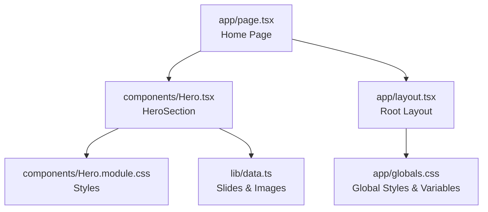

**Diagram sources**
- [page.tsx:1-22](file://app/page.tsx#L1-L22)
- [Hero.tsx:1-100](file://components/Hero.tsx#L1-L100)
- [Hero.module.css:1-254](file://components/Hero.module.css#L1-L254)
- [layout.tsx:17-27](file://app/layout.tsx#L17-L27)
- [globals.css:1-190](file://app/globals.css#L1-L190)
- [data.ts:1-252](file://lib/data.ts#L1-L252)

**Section sources**
- [page.tsx:1-22](file://app/page.tsx#L1-L22)
- [layout.tsx:17-27](file://app/layout.tsx#L17-L27)

## Core Components
- HeroSection: Renders the hero area with stacked background images, overlays, headline, actions, quick search, slide indicators, and scroll hint.
- Hero.module.css: Provides the visual styling for the hero area, including background stack transitions, gradient overlay, pattern overlay, content layout, quick search, slide indicators, and scroll hint.
- data.ts: Supplies the list of slides and background image URLs used by the hero carousel.

Key responsibilities:
- Automatic rotation: Implemented via CSS animations and transforms on background slides.
- Manual controls: Slide indicators allow switching between slides.
- Gradient overlay: Provides visual contrast for text and content.
- Pattern overlay: Adds a subtle texture for depth.
- Quick search: Inline search form for destinations.
- Scroll indicator: Animated line indicating scroll-to-explore action.
- Responsive behavior: Hides indicators and scroll hint on mobile.

**Section sources**
- [Hero.tsx:20-99](file://components/Hero.tsx#L20-L99)
- [Hero.module.css:11-48](file://components/Hero.module.css#L11-L48)
- [Hero.module.css:172-253](file://components/Hero.module.css#L172-L253)
- [data.ts:6-18](file://lib/data.ts#L6-L18)

## Architecture Overview
The hero carousel is a static presentation component without runtime state for slide transitions. It relies on CSS transitions and animations to achieve visual effects.

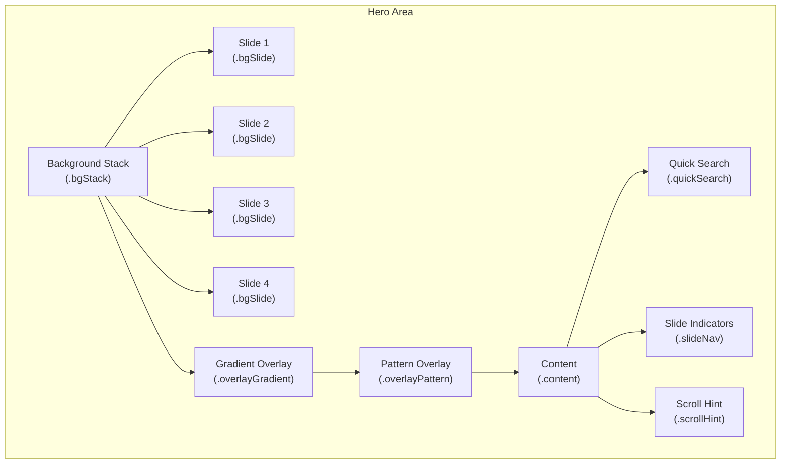

**Diagram sources**
- [Hero.tsx:24-32](file://components/Hero.tsx#L24-L32)
- [Hero.tsx:35-36](file://components/Hero.tsx#L35-L36)
- [Hero.tsx:39-80](file://components/Hero.tsx#L39-L80)
- [Hero.tsx:83-96](file://components/Hero.tsx#L83-L96)
- [Hero.module.css:11-28](file://components/Hero.module.css#L11-L28)
- [Hero.module.css:31-48](file://components/Hero.module.css#L31-L48)
- [Hero.module.css:51-56](file://components/Hero.module.css#L51-L56)
- [Hero.module.css:172-209](file://components/Hero.module.css#L172-L209)
- [Hero.module.css:211-246](file://components/Hero.module.css#L211-L246)

## Detailed Component Analysis

### Background Image Stack and Rotation
- The hero uses a stack of background slides rendered as absolutely positioned divs.
- Only the first slide is shown by default; subsequent slides are hidden.
- CSS transitions animate opacity and scale to create a fade-and-zoom effect when transitioning between slides.
- The transition timing is defined in the stylesheet to balance visual impact and performance.

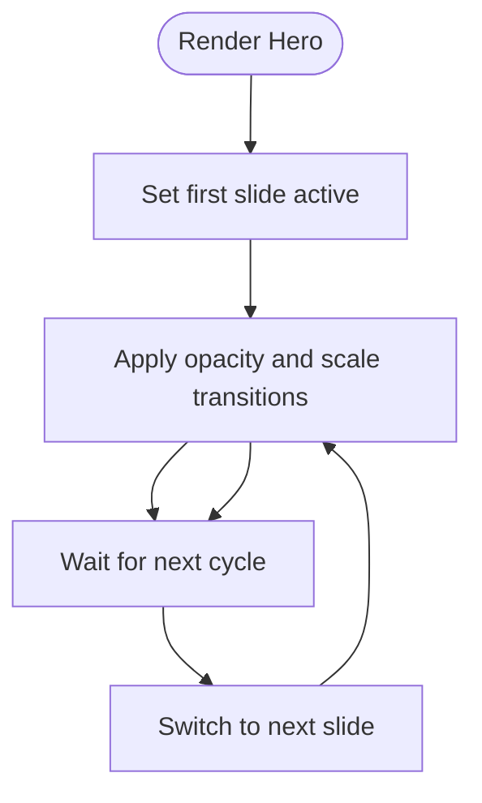

**Diagram sources**
- [Hero.tsx:24-32](file://components/Hero.tsx#L24-L32)
- [Hero.module.css:16-28](file://components/Hero.module.css#L16-L28)

**Section sources**
- [Hero.tsx:24-32](file://components/Hero.tsx#L24-L32)
- [Hero.module.css:16-28](file://components/Hero.module.css#L16-L28)

### Gradient Overlay System
- A linear gradient overlay is applied to ensure text readability against varying background images.
- The gradient blends from dark to lighter tones across the viewport to maintain contrast.

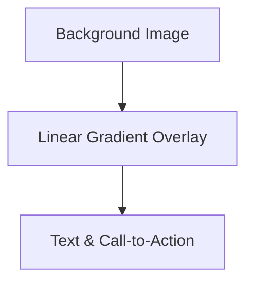

**Diagram sources**
- [Hero.tsx:35](file://components/Hero.tsx#L35)
- [Hero.module.css:31-41](file://components/Hero.module.css#L31-L41)

**Section sources**
- [Hero.tsx:35](file://components/Hero.tsx#L35)
- [Hero.module.css:31-41](file://components/Hero.module.css#L31-L41)

### Pattern Effects
- A subtle SVG pattern overlay adds depth without overwhelming the content.
- The pattern is applied via a data URI to avoid extra network requests.

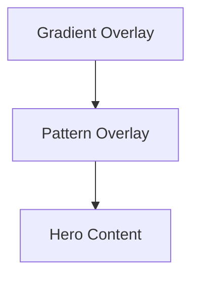

**Diagram sources**
- [Hero.tsx:36](file://components/Hero.tsx#L36)
- [Hero.module.css:42-48](file://components/Hero.module.css#L42-L48)

**Section sources**
- [Hero.tsx:36](file://components/Hero.tsx#L36)
- [Hero.module.css:42-48](file://components/Hero.module.css#L42-L48)

### Quick Search Functionality
- The quick search is a compact form with an icon, input field, and search button.
- Focus states adjust the container’s border and background for better UX.
- The input uses placeholder text and inherits global typography.

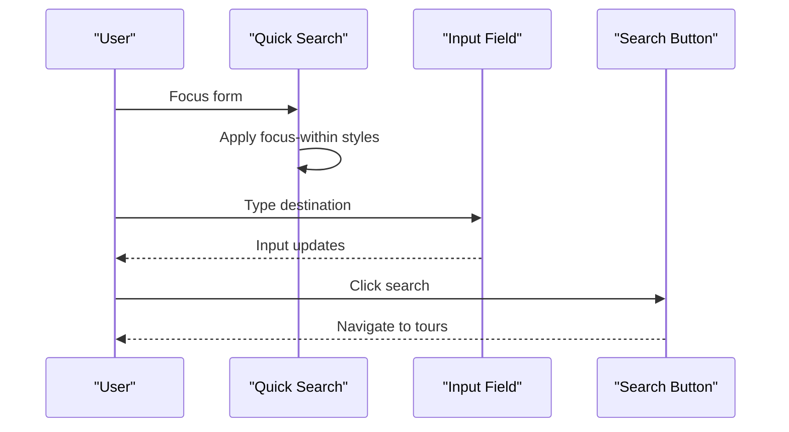

**Diagram sources**
- [Hero.tsx:69-79](file://components/Hero.tsx#L69-L79)
- [Hero.module.css:129-171](file://components/Hero.module.css#L129-L171)

**Section sources**
- [Hero.tsx:69-79](file://components/Hero.tsx#L69-L79)
- [Hero.module.css:129-171](file://components/Hero.module.css#L129-L171)

### Slide Indicators and Manual Controls
- Slide indicators are rendered as small cards showing the label and title of each slide.
- The active indicator is visually emphasized.
- On desktop, clicking an indicator currently does not change slides in the current implementation.

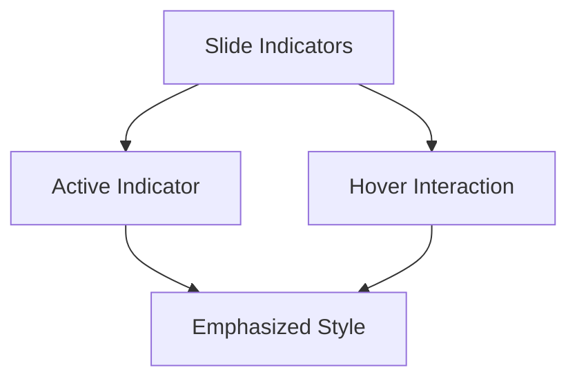

**Diagram sources**
- [Hero.tsx:83-90](file://components/Hero.tsx#L83-L90)
- [Hero.module.css:172-209](file://components/Hero.module.css#L172-L209)

**Section sources**
- [Hero.tsx:83-90](file://components/Hero.tsx#L83-L90)
- [Hero.module.css:172-209](file://components/Hero.module.css#L172-L209)

### Scroll Indicator
- The scroll hint displays a short animated line and text prompting users to scroll.
- The animation moves a highlight across the line to draw attention.

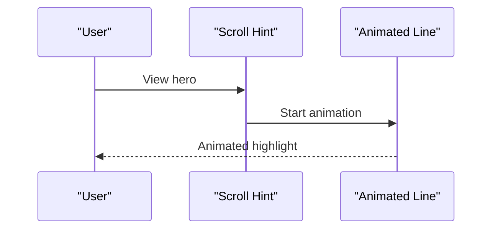

**Diagram sources**
- [Hero.tsx:93-96](file://components/Hero.tsx#L93-L96)
- [Hero.module.css:211-246](file://components/Hero.module.css#L211-L246)

**Section sources**
- [Hero.tsx:93-96](file://components/Hero.tsx#L93-L96)
- [Hero.module.css:211-246](file://components/Hero.module.css#L211-L246)

### Content Layout and Typography
- The content area is centered vertically and horizontally with generous padding.
- Headlines use fluid sizing and serif fonts for emphasis.
- Subtext and actions are arranged for clear visual hierarchy.

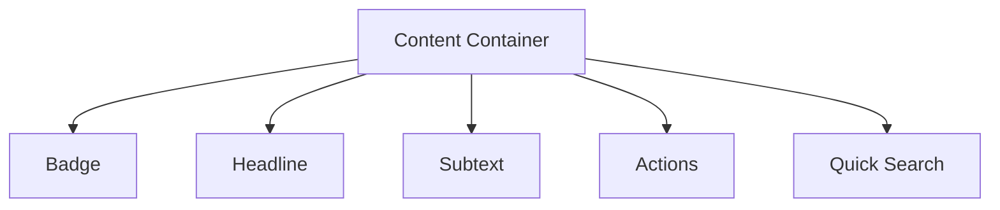

**Diagram sources**
- [Hero.tsx:39-80](file://components/Hero.tsx#L39-L80)
- [Hero.module.css:51-127](file://components/Hero.module.css#L51-L127)

**Section sources**
- [Hero.tsx:39-80](file://components/Hero.tsx#L39-L80)
- [Hero.module.css:51-127](file://components/Hero.module.css#L51-L127)

### Responsive Design Patterns
- On smaller screens, indicators and scroll hint are hidden to reduce clutter.
- Headline scales down appropriately for mobile.
- Content paddings adapt to ensure comfortable reading.

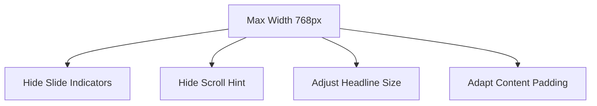

**Diagram sources**
- [Hero.module.css:248-253](file://components/Hero.module.css#L248-L253)

**Section sources**
- [Hero.module.css:248-253](file://components/Hero.module.css#L248-L253)

### Accessibility and Keyboard Navigation
- The component does not implement keyboard navigation for slide switching.
- No ARIA roles or keyboard handlers are present for the slide indicators.
- Recommendations:
  - Add tabindex and keyboard event handlers to indicators.
  - Include ARIA attributes (aria-selected, aria-controls) for screen reader support.
  - Ensure focus visibility and consistent focus order.

[No sources needed since this section provides general guidance]

## Dependency Analysis
The hero carousel depends on:
- Global CSS variables and typography for consistent theming.
- Static slide data and image URLs.
- Next.js routing for internal links.

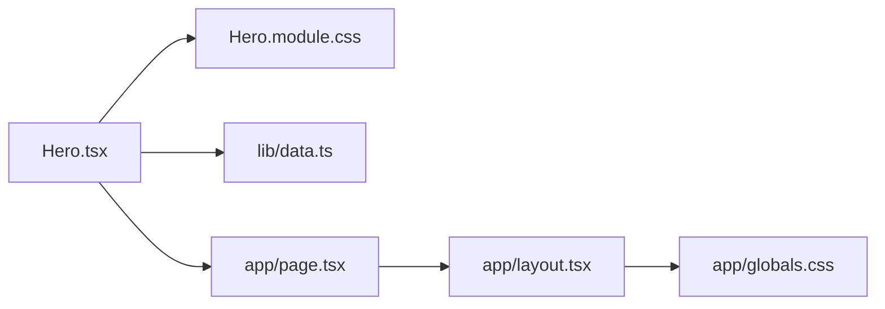

**Diagram sources**
- [Hero.tsx:1-4](file://components/Hero.tsx#L1-L4)
- [Hero.module.css:1-42](file://components/Hero.module.css#L1-L42)
- [data.ts:6-18](file://lib/data.ts#L6-L18)
- [page.tsx:1-22](file://app/page.tsx#L1-L22)
- [layout.tsx:17-27](file://app/layout.tsx#L17-L27)
- [globals.css:3-42](file://app/globals.css#L3-L42)

**Section sources**
- [Hero.tsx:1-4](file://components/Hero.tsx#L1-L4)
- [Hero.module.css:1-42](file://components/Hero.module.css#L1-L42)
- [data.ts:6-18](file://lib/data.ts#L6-L18)
- [page.tsx:1-22](file://app/page.tsx#L1-L22)
- [layout.tsx:17-27](file://app/layout.tsx#L17-L27)
- [globals.css:3-42](file://app/globals.css#L3-L42)

## Performance Considerations
- Background images are loaded via CSS background-image; ensure they are appropriately sized and compressed.
- CSS transitions leverage GPU acceleration for smooth animations.
- Lazy loading is not implemented for background images; consider preloading or deferring offscreen images if performance becomes a concern.
- The pattern overlay is embedded as a data URI to avoid an extra request.

[No sources needed since this section provides general guidance]

## Troubleshooting Guide
- Slides not rotating: Verify that the active class is applied to the first slide and that CSS transitions are not disabled.
- Text unreadable: Adjust the gradient overlay or increase contrast in the gradient definition.
- Quick search not focusing: Ensure focus-within styles are not overridden by parent styles.
- Indicators not visible: Confirm media queries are not hiding them unintentionally.
- Mobile layout issues: Check responsive breakpoints and padding adjustments.

[No sources needed since this section provides general guidance]

## Conclusion
The hero carousel delivers a polished, visually rich hero experience with layered overlays, smooth transitions, and integrated quick search. While the current implementation focuses on static presentation, it provides a strong foundation for future enhancements such as automatic rotation, keyboard navigation, and dynamic slide controls.

[No sources needed since this section summarizes without analyzing specific files]

## Appendices

### Customizing Carousel Behavior
- Adding new slides:
  - Extend the slides array with new entries and add corresponding background image URLs.
  - Ensure the number of background images matches the number of slides.
- Changing rotation behavior:
  - Introduce state and timers to cycle slides automatically.
  - Add keyboard and touch handlers for manual control.
- Integrating external image sources:
  - Replace hardcoded image URLs with dynamic data fetched from APIs.
  - Implement error handling and fallback images.

[No sources needed since this section provides general guidance]