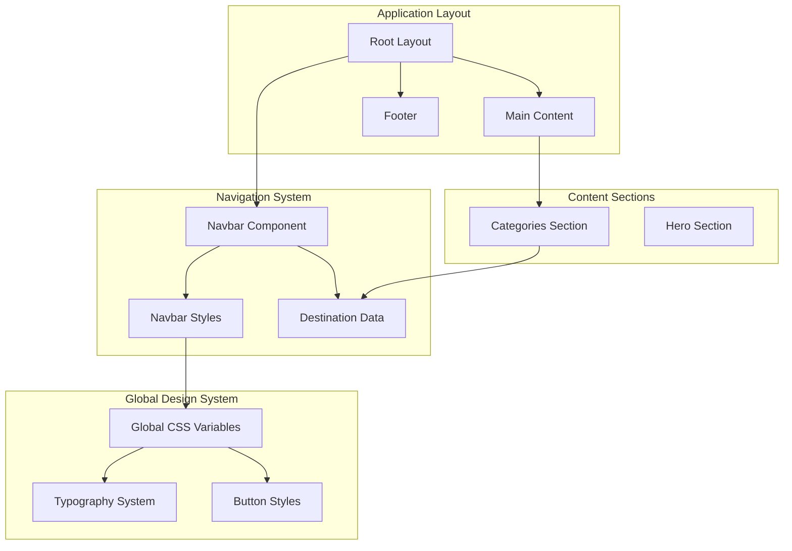
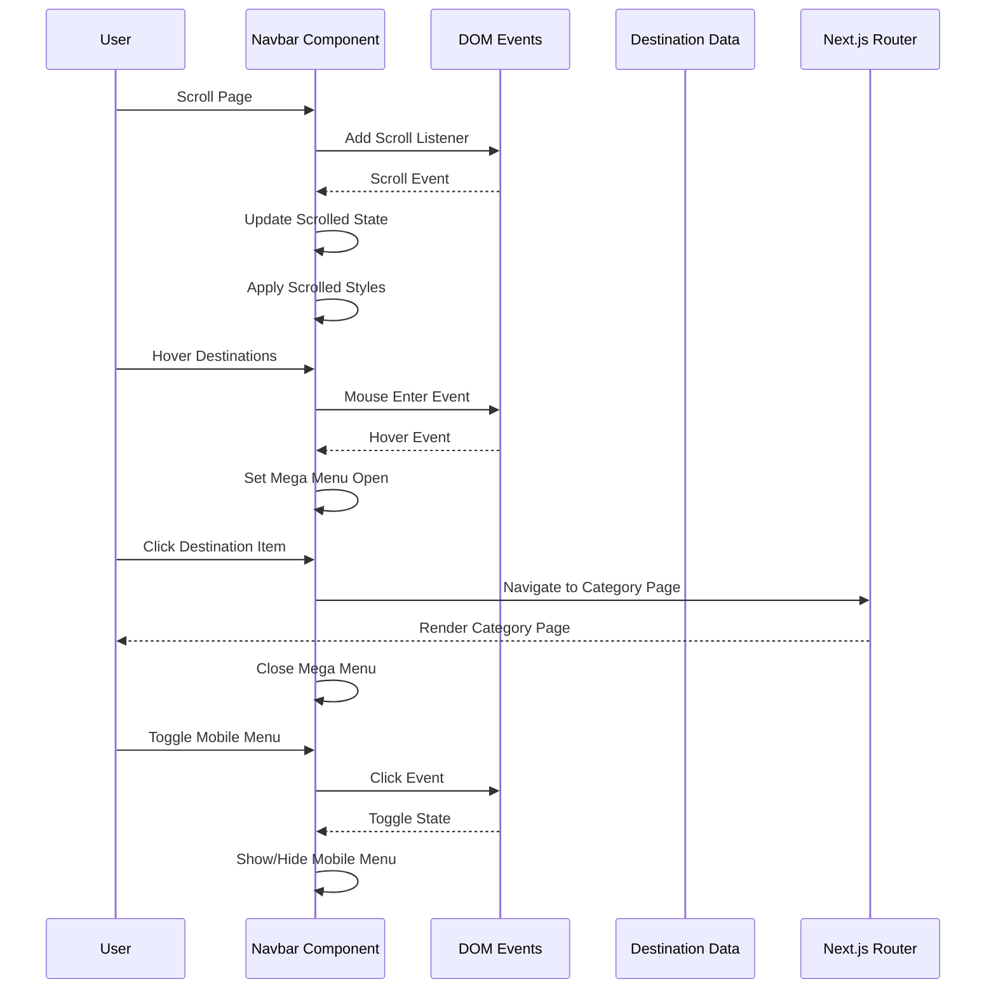
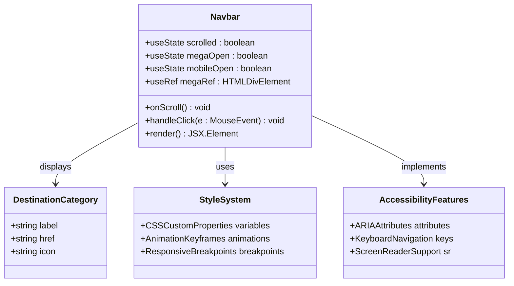
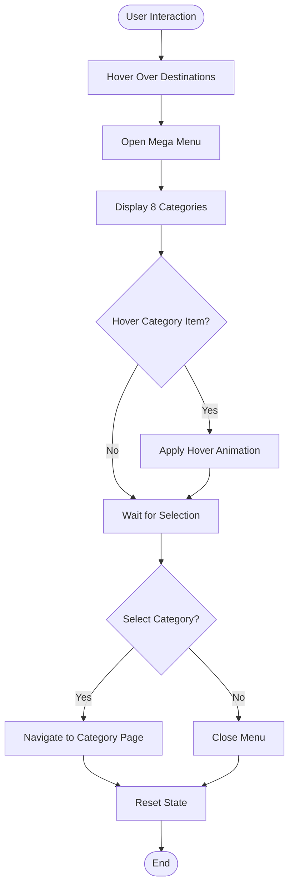
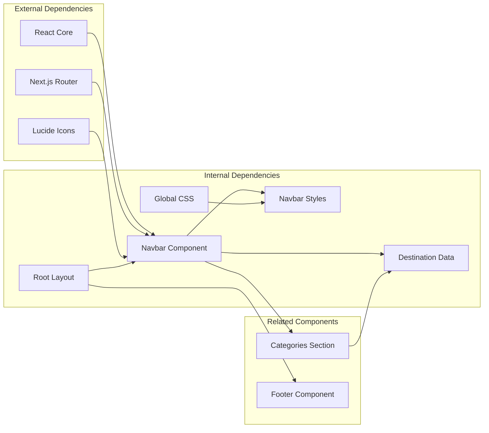

# Navigation System

<cite>
**Referenced Files in This Document**
- [Navbar.tsx](file://components/Navbar.tsx)
- [Navbar.module.css](file://components/Navbar.module.css)
- [layout.tsx](file://app/layout.tsx)
- [globals.css](file://app/globals.css)
- [data.ts](file://lib/data.ts)
- [Categories.tsx](file://components/Categories.tsx)
- [Categories.module.css](file://components/Categories.module.css)
- [page.tsx](file://app/page.tsx)
</cite>

## Table of Contents
1. [Introduction](#introduction)
2. [Project Structure](#project-structure)
3. [Core Components](#core-components)
4. [Architecture Overview](#architecture-overview)
5. [Detailed Component Analysis](#detailed-component-analysis)
6. [Dependency Analysis](#dependency-analysis)
7. [Performance Considerations](#performance-considerations)
8. [Troubleshooting Guide](#troubleshooting-guide)
9. [Conclusion](#conclusion)

## Introduction
This document provides comprehensive documentation for the navigation system component, focusing on the Navbar implementation. The navigation system features scroll-aware header styling, a desktop mega-menu with eight destination categories, a mobile-responsive hamburger menu, and robust state management patterns. It includes interactive elements such as hover effects, click handlers, and accessibility features with ARIA attributes. The documentation covers destination dropdown functionality, mobile menu behavior, keyboard navigation support, responsive design considerations, and cross-browser compatibility.

## Project Structure
The navigation system is implemented as a standalone component integrated into the application layout. The Navbar component manages its own state for scroll awareness, desktop mega-menu visibility, and mobile menu toggling. It imports destination data from the shared data library and integrates with the global design system through CSS variables and typography.

**Diagram sources**
- [layout.tsx:17-27](file://app/layout.tsx#L17-L27)
- [Navbar.tsx:18-112](file://components/Navbar.tsx#L18-L112)
- [globals.css:3-42](file://app/globals.css#L3-L42)

**Section sources**
- [layout.tsx:17-27](file://app/layout.tsx#L17-L27)
- [Navbar.tsx:18-112](file://components/Navbar.tsx#L18-L112)

## Core Components
The navigation system consists of several interconnected components that work together to provide a seamless user experience across devices.

### Navbar Component Architecture
The Navbar component serves as the primary navigation interface, featuring:
- Scroll-aware header styling with backdrop blur effect
- Desktop mega-menu with eight destination categories
- Mobile-responsive hamburger menu
- State management for scroll position, menu visibility, and mobile toggle
- Accessibility-compliant ARIA attributes and keyboard navigation support

### Destination Data Management
The system utilizes a centralized data library containing eight destination categories, each with:
- Unique identifiers and human-readable titles
- Descriptive content and associated imagery
- Color coding and icon representation
- Tour count metrics for each category

### Global Design System Integration
The navigation system integrates with the global design system through:
- CSS custom properties for brand colors and typography
- Consistent spacing and shadow systems
- Responsive breakpoint management
- Cross-browser compatibility through standardized CSS properties

**Section sources**
- [Navbar.tsx:7-16](file://components/Navbar.tsx#L7-L16)
- [data.ts:1-74](file://lib/data.ts#L1-L74)
- [globals.css:3-42](file://app/globals.css#L3-L42)

## Architecture Overview
The navigation system follows a modular architecture with clear separation of concerns between presentation, state management, and data integration.

**Diagram sources**
- [Navbar.tsx:24-38](file://components/Navbar.tsx#L24-L38)
- [Navbar.tsx:55-78](file://components/Navbar.tsx#L55-L78)
- [Navbar.tsx:89-91](file://components/Navbar.tsx#L89-L91)

## Detailed Component Analysis

### Navbar Implementation Details
The Navbar component implements sophisticated state management and responsive behavior patterns.

#### State Management Patterns
The component maintains three primary state variables:
- `scrolled`: Tracks scroll position to trigger header styling changes
- `megaOpen`: Controls desktop mega-menu visibility
- `mobileOpen`: Manages mobile menu toggle state

#### Scroll-Aware Header Styling
The scroll detection mechanism responds to page scrolling with optimized performance:
- Uses passive event listeners to prevent layout thrashing
- Applies backdrop blur effect with adjustable transparency
- Implements smooth transitions between transparent and opaque states
- Maintains consistent padding adjustments during state changes

#### Desktop Mega-Menu Functionality
The desktop navigation features an expandable mega-menu with:
- Eight destination categories arranged in a responsive grid layout
- Icon-based visual indicators for each category
- Hover effects with subtle animations and translations
- Automatic dismissal when clicking outside the menu area

#### Mobile Menu Behavior
The mobile navigation provides:
- Hamburger menu toggle with animated icon changes
- Full-screen overlay with category navigation
- Sticky positioning for easy access
- Responsive typography scaling for optimal readability

**Diagram sources**
- [Navbar.tsx:18-112](file://components/Navbar.tsx#L18-L112)
- [Navbar.module.css:12-199](file://components/Navbar.module.css#L12-L199)

**Section sources**
- [Navbar.tsx:18-112](file://components/Navbar.tsx#L18-L112)
- [Navbar.module.css:12-199](file://components/Navbar.module.css#L12-L199)

### Destination Dropdown Functionality
The destination dropdown provides comprehensive category navigation with eight distinct travel experiences.

#### Category Organization
Each destination category includes:
- **Wildlife Safaris**: Tracking Bengal tigers, rhinos, and elephants in national parks
- **Cultural Journeys**: Immersive experiences in ancient traditions and festivals
- **Himalayan Adventures**: Trekking through Ladakh, Sikkim, and Uttarakhand
- **Coastal Escapes**: Beach destinations in Andaman, Goa, and Lakshadweep
- **Spiritual Pilgrimages**: Sacred sites including Varanasi, Rishikesh, and Golden Temple
- **Heritage & History**: UNESCO World Heritage sites and ancient monuments
- **Northeast Wilderness**: Remote regions of Meghalaya, Assam, and Nagaland
- **Kerala & the South**: Backwater cruises and spice plantation tours

#### Visual Presentation
The dropdown menu features:
- Grid-based layout with two-column arrangement
- Icon-based visual cues for quick recognition
- Hover animations with subtle translations
- Consistent typography and spacing
- Responsive design adapting to different screen sizes

**Diagram sources**
- [Navbar.tsx:62-78](file://components/Navbar.tsx#L62-L78)
- [Navbar.module.css:115-138](file://components/Navbar.module.css#L115-L138)

**Section sources**
- [Navbar.tsx:7-16](file://components/Navbar.tsx#L7-L16)
- [Navbar.tsx:62-78](file://components/Navbar.tsx#L62-L78)
- [Navbar.module.css:115-138](file://components/Navbar.module.css#L115-L138)

### Mobile Menu Implementation
The mobile navigation provides a comprehensive touch-friendly interface designed for smaller screens.

#### Responsive Breakpoints
The mobile menu activates below 900px viewport width with:
- Hidden desktop navigation elements
- Displayed mobile toggle button
- Hidden primary call-to-action button
- Full-screen mobile menu overlay

#### Touch-Friendly Design
Mobile interactions include:
- Large touch targets for easy thumb access
- Clear visual feedback on interactions
- Smooth animations for menu transitions
- Consistent styling with desktop elements

#### Content Organization
The mobile menu presents:
- Category navigation with icons and labels
- Additional navigation links (All Tours, Our Story, Contact)
- Visual separators for content grouping
- Consistent typography sizing for readability

**Section sources**
- [Navbar.module.css:195-200](file://components/Navbar.module.css#L195-L200)
- [Navbar.tsx:96-109](file://components/Navbar.tsx#L96-L109)

### Accessibility Features
The navigation system implements comprehensive accessibility features following WCAG guidelines.

#### ARIA Attributes
- `aria-expanded` on the destinations button indicating menu state
- `aria-label` on the mobile toggle button for screen reader support
- Proper semantic markup using `<nav>` and `<button>` elements
- Focus management for keyboard navigation

#### Keyboard Navigation
- Tab navigation through interactive elements
- Enter/Space key activation for buttons and links
- Escape key to close open menus
- Focus trapping within mobile menu overlays

#### Screen Reader Support
- Descriptive labels for interactive elements
- Dynamic state announcements for menu changes
- Logical heading hierarchy for content organization
- Alternative text for visual icons and images

**Section sources**
- [Navbar.tsx:58-59](file://components/Navbar.tsx#L58-L59)
- [Navbar.tsx:89-91](file://components/Navbar.tsx#L89-L91)

## Dependency Analysis
The navigation system demonstrates clear dependency relationships and follows modular design principles.

**Diagram sources**
- [Navbar.tsx:2-5](file://components/Navbar.tsx#L2-L5)
- [layout.tsx:3](file://app/layout.tsx#L3)
- [Categories.tsx:4](file://components/Categories.tsx#L4)

### Component Coupling
The navigation system exhibits low coupling through:
- Clear separation between state management and presentation
- Centralized data access through the shared data library
- Modular CSS architecture with reusable style patterns
- Independent component lifecycle management

### External Dependencies
The system relies on:
- React hooks for state management and lifecycle events
- Next.js routing for client-side navigation
- Lucide React icons for visual elements
- Browser APIs for scroll detection and event handling

**Section sources**
- [Navbar.tsx:2-5](file://components/Navbar.tsx#L2-L5)
- [layout.tsx:3](file://app/layout.tsx#L3)

## Performance Considerations
The navigation system implements several performance optimization strategies.

### Scroll Performance
- Uses passive event listeners to prevent layout blocking
- Debounces scroll handler for optimal performance
- Minimizes reflows through CSS transforms
- Efficient state updates using React's batching

### Memory Management
- Cleanup event listeners on component unmount
- Proper cleanup of scroll and click event handlers
- Reference cleanup for DOM elements
- Prevents memory leaks in long-running sessions

### Rendering Optimization
- Conditional rendering for mobile menu
- Memoized destination data arrays
- CSS animations for smooth transitions
- Lazy loading for offscreen content

### Cross-Browser Compatibility
- Vendor prefixes for CSS animations and transforms
- Feature detection for modern browser capabilities
- Fallback styles for older browser support
- Polyfills for essential JavaScript APIs

## Troubleshooting Guide
Common issues and their solutions for the navigation system.

### Scroll Detection Issues
**Problem**: Header styling not activating on scroll
**Solution**: Verify scroll listener is attached to window element and passive option is supported

### Menu Not Closing
**Problem**: Mega menu remains open after selection
**Solution**: Ensure click handler properly closes the menu and event delegation works correctly

### Mobile Menu Not Responding
**Problem**: Hamburger menu toggle not working on mobile devices
**Solution**: Check media query breakpoints and ensure touch event handlers are properly bound

### Accessibility Issues
**Problem**: Screen reader not announcing menu state changes
**Solution**: Verify ARIA attributes are dynamically updated and semantic HTML is properly structured

### Styling Conflicts
**Problem**: Navigation styles conflicting with page content
**Solution**: Review z-index stacking context and ensure proper container positioning

**Section sources**
- [Navbar.tsx:24-38](file://components/Navbar.tsx#L24-L38)
- [Navbar.tsx:55-78](file://components/Navbar.tsx#L55-L78)

## Conclusion
The navigation system component provides a robust, accessible, and performant solution for website navigation. Its scroll-aware header styling, comprehensive desktop mega-menu, and mobile-responsive design create a seamless user experience across all device types. The implementation demonstrates excellent state management patterns, accessibility compliance, and integration with the broader design system. The modular architecture ensures maintainability and extensibility for future enhancements while maintaining optimal performance characteristics.