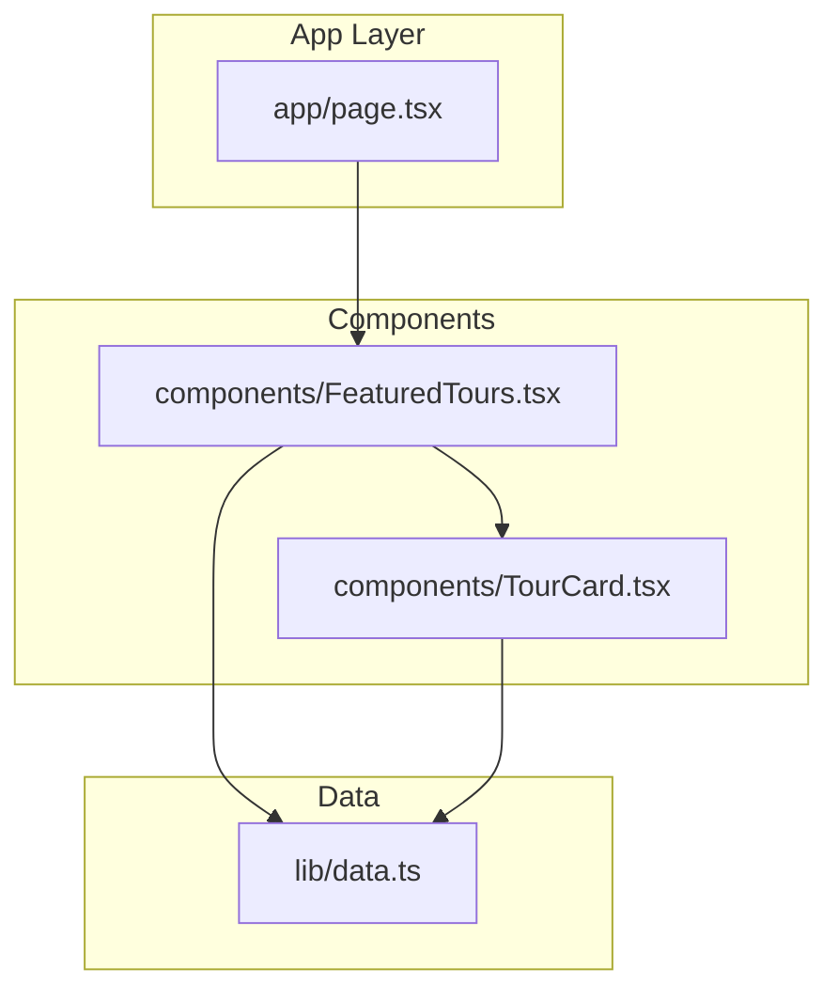
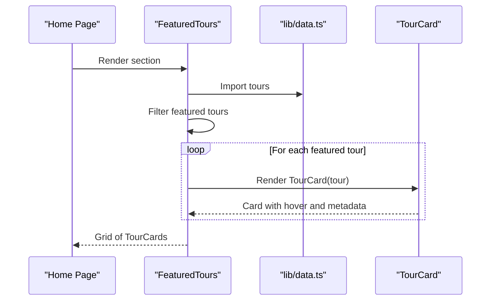
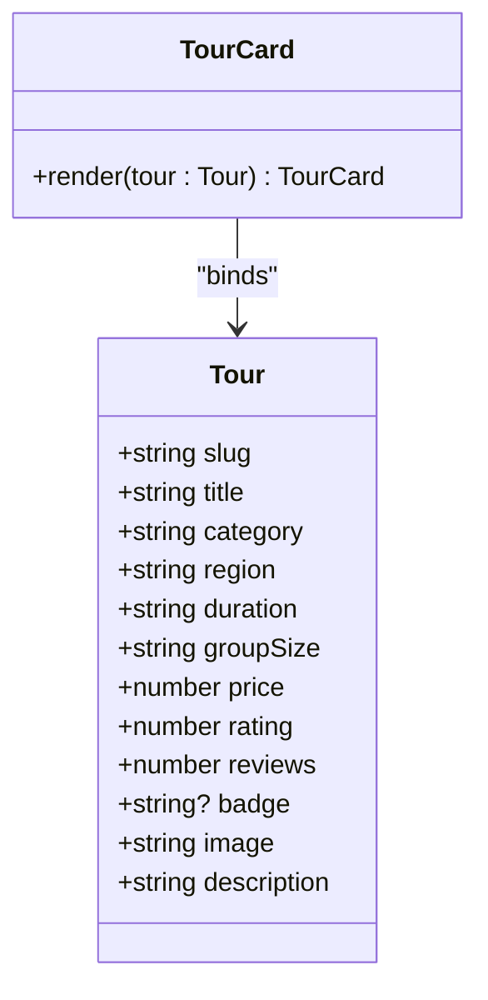
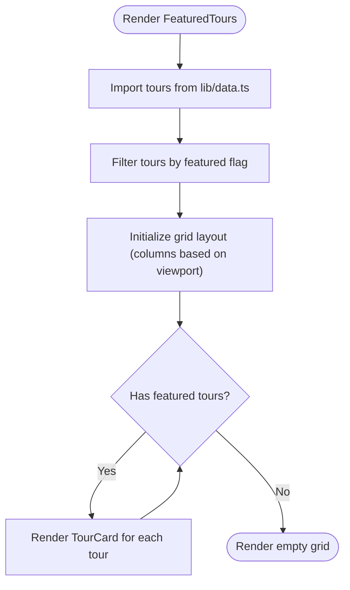
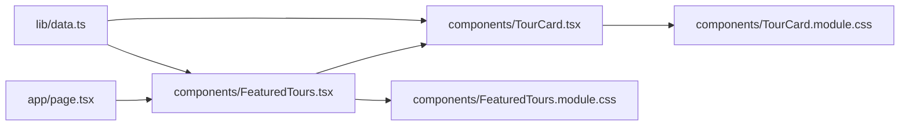

# Tour Management

<cite>
**Referenced Files in This Document**
- [TourCard.tsx](file://components/TourCard.tsx)
- [TourCard.module.css](file://components/TourCard.module.css)
- [FeaturedTours.tsx](file://components/FeaturedTours.tsx)
- [FeaturedTours.module.css](file://components/FeaturedTours.module.css)
- [data.ts](file://lib/data.ts)
- [page.tsx](file://app/page.tsx)
- [globals.css](file://app/globals.css)
</cite>

## Table of Contents
1. [Introduction](#introduction)
2. [Project Structure](#project-structure)
3. [Core Components](#core-components)
4. [Architecture Overview](#architecture-overview)
5. [Detailed Component Analysis](#detailed-component-analysis)
6. [Dependency Analysis](#dependency-analysis)
7. [Performance Considerations](#performance-considerations)
8. [Troubleshooting Guide](#troubleshooting-guide)
9. [Conclusion](#conclusion)

## Introduction
This document provides comprehensive documentation for the tour management system, focusing on the TourCard and FeaturedTours components. It explains interactive hover effects, pricing display, availability indicators, rating systems, grid layout and filtering, data binding patterns, tour data structure, component composition, modal display functionality, responsive grid behavior, customization examples, filter implementation, data model extensions, performance considerations for large tour catalogs, and lazy loading strategies.

## Project Structure
The tour management system is organized around reusable UI components and centralized data. The home page composes several sections, including FeaturedTours, which renders a grid of TourCard components bound to the shared tour catalog.

**Diagram sources**
- [page.tsx:9-21](file://app/page.tsx#L9-L21)
- [FeaturedTours.tsx:1-33](file://components/FeaturedTours.tsx#L1-L33)
- [TourCard.tsx:1-63](file://components/TourCard.tsx#L1-L63)
- [data.ts:76-205](file://lib/data.ts#L76-L205)

**Section sources**
- [page.tsx:9-21](file://app/page.tsx#L9-L21)
- [globals.css:1-190](file://app/globals.css#L1-L190)

## Core Components
- TourCard: Renders individual tour entries with hover effects, pricing, ratings, and metadata. It links to a tour detail route derived from the tour slug.
- FeaturedTours: Filters and displays featured tours in a responsive grid layout, linking to the full tour catalog.

Key responsibilities:
- TourCard: Data binding to a Tour interface, rendering image overlay and hover actions, displaying region, rating, duration, group size, and price.
- FeaturedTours: Filtering logic for featured tours, grid layout, and navigation to the full tour listing.

**Section sources**
- [TourCard.tsx:6-19](file://components/TourCard.tsx#L6-L19)
- [TourCard.tsx:21-62](file://components/TourCard.tsx#L21-L62)
- [FeaturedTours.tsx:8-33](file://components/FeaturedTours.tsx#L8-L33)

## Architecture Overview
The FeaturedTours component fetches the tour catalog from lib/data.ts and filters featured items. Each featured tour is rendered as a TourCard. TourCard handles hover interactions and displays tour metadata, including pricing and ratings.

**Diagram sources**
- [page.tsx:9-21](file://app/page.tsx#L9-L21)
- [FeaturedTours.tsx:8-33](file://components/FeaturedTours.tsx#L8-L33)
- [data.ts:76-205](file://lib/data.ts#L76-L205)
- [TourCard.tsx:21-62](file://components/TourCard.tsx#L21-L62)

## Detailed Component Analysis

### TourCard Component
Purpose:
- Display a single tour with interactive hover effects, pricing, ratings, region, duration, group size, and badge.
- Provide navigation to the tour detail page using the tour slug.

Interactive hover effects:
- Card lift and shadow increase on hover.
- Image scales slightly on hover.
- Overlay fades to reveal an Explore button centered in the card.

Pricing display:
- Shows “From” pricing, formatted currency value, and “per person”.

Rating system:
- Displays star icon, numeric rating, and review count.

Availability indicators:
- Uses a badge field from the Tour interface to show labels like “Best Seller”, “Top Rated”, etc.

Data binding:
- Accepts a Tour prop and renders fields such as slug, title, category, region, duration, groupSize, price, rating, reviews, badge, image, description.

Component composition:
- Uses Lucide icons for region pin, star, clock, users, arrow right.
- Integrates with CSS module styles for layout and hover animations.

**Diagram sources**
- [TourCard.tsx:6-19](file://components/TourCard.tsx#L6-L19)
- [TourCard.tsx:21-62](file://components/TourCard.tsx#L21-L62)

**Section sources**
- [TourCard.tsx:6-19](file://components/TourCard.tsx#L6-L19)
- [TourCard.tsx:21-62](file://components/TourCard.tsx#L21-L62)
- [TourCard.module.css:1-173](file://components/TourCard.module.css#L1-L173)

### FeaturedTours Component
Purpose:
- Display a curated header and a responsive grid of featured tours.
- Provide a call-to-action link to view all tours.

Grid layout system:
- Uses CSS Grid with four columns on wide screens.
- Two columns on medium screens.
- Single column on small screens.

Filtering capabilities:
- Filters tours by a featured flag to select only curated entries.

Component composition:
- Imports TourCard and the tour catalog from lib/data.ts.
- Iterates over filtered tours and renders TourCard for each.

Responsive behavior:
- Grid columns adjust based on viewport width using media queries.

**Diagram sources**
- [FeaturedTours.tsx:8-33](file://components/FeaturedTours.tsx#L8-L33)
- [FeaturedTours.module.css:27-37](file://components/FeaturedTours.module.css#L27-L37)
- [data.ts:76-205](file://lib/data.ts#L76-L205)

**Section sources**
- [FeaturedTours.tsx:8-33](file://components/FeaturedTours.tsx#L8-L33)
- [FeaturedTours.module.css:27-37](file://components/FeaturedTours.module.css#L27-L37)

### Data Binding Patterns and Tour Data Structure
Tour data structure:
- Fields include slug, title, category, region, duration, groupSize, price, rating, reviews, optional badge, image, and description.
- Additional fields present in the dataset include highlights and a featured flag.

Binding patterns:
- FeaturedTours imports tours and filters by featured.
- TourCard receives a single Tour object and renders its properties.

Extending the data model:
- Add new fields to the Tour interface and ensure they are populated in lib/data.ts.
- Update TourCard to render new fields as needed.

**Section sources**
- [data.ts:76-205](file://lib/data.ts#L76-L205)
- [TourCard.tsx:6-19](file://components/TourCard.tsx#L6-L19)

### Interactive Hover Effects and Pricing Display
Hover effects:
- Card lift and shadow increase on hover.
- Image scales slightly.
- Overlay reveals an Explore button centered in the card.

Pricing display:
- “From” pricing label, formatted price value, and “per person” indicator.

Rating system:
- Star icon with numeric rating and review count.

Availability indicators:
- Badge element shown when a badge is present.

**Section sources**
- [TourCard.module.css:13-16](file://components/TourCard.module.css#L13-L16)
- [TourCard.module.css:29](file://components/TourCard.module.css#L29)
- [TourCard.module.css:63-78](file://components/TourCard.module.css#L63-L78)
- [TourCard.module.css:159-162](file://components/TourCard.module.css#L159-L162)
- [TourCard.module.css:106-114](file://components/TourCard.module.css#L106-L114)
- [TourCard.module.css:31-44](file://components/TourCard.module.css#L31-L44)

### Modal Display Functionality
Current implementation:
- TourCard links to a tour detail route using the slug.
- No modal component is present in the current codebase.

Recommendations:
- Introduce a modal component that opens on click of the card or a dedicated “Details” action.
- Pass the selected tour to the modal and render expanded details, images, and booking controls.

**Section sources**
- [TourCard.tsx:23](file://components/TourCard.tsx#L23)
- [TourCard.tsx:57](file://components/TourCard.tsx#L57)

### Responsive Grid Behavior
Grid layout:
- Four columns on wide screens.
- Two columns on medium screens.
- Single column on small screens.

Container and spacing:
- Uses a container class with max width and horizontal padding.
- Gap between grid items is defined in CSS.

**Section sources**
- [FeaturedTours.module.css:27-37](file://components/FeaturedTours.module.css#L27-L37)
- [globals.css:91-96](file://app/globals.css#L91-L96)

### Customization Examples
Customizing tour cards:
- Modify TourCard.module.css to change hover animations, colors, typography, and layout.
- Extend TourCard.tsx to conditionally render additional badges or availability indicators.

Implementing filters:
- Add filter props to FeaturedTours to accept category or region filters.
- Update filtering logic to support multiple criteria.

Extending tour data models:
- Add new fields to the Tour interface and populate them in lib/data.ts.
- Update TourCard to render new fields consistently.

**Section sources**
- [TourCard.module.css:1-173](file://components/TourCard.module.css#L1-L173)
- [TourCard.tsx:6-19](file://components/TourCard.tsx#L6-L19)
- [data.ts:76-205](file://lib/data.ts#L76-L205)

## Dependency Analysis
The FeaturedTours component depends on:
- TourCard for rendering individual tour entries.
- lib/data.ts for the tour catalog and filtering logic.

TourCard depends on:
- lib/data.ts for the Tour interface and tour data.
- CSS module styles for layout and hover effects.

**Diagram sources**
- [data.ts:76-205](file://lib/data.ts#L76-L205)
- [FeaturedTours.tsx:4-6](file://components/FeaturedTours.tsx#L4-L6)
- [TourCard.tsx:1-4](file://components/TourCard.tsx#L1-L4)
- [TourCard.module.css:1-173](file://components/TourCard.module.css#L1-L173)
- [FeaturedTours.module.css:1-38](file://components/FeaturedTours.module.css#L1-L38)
- [page.tsx:5](file://app/page.tsx#L5)

**Section sources**
- [FeaturedTours.tsx:4-6](file://components/FeaturedTours.tsx#L4-L6)
- [TourCard.tsx:1-4](file://components/TourCard.tsx#L1-L4)
- [data.ts:76-205](file://lib/data.ts#L76-L205)

## Performance Considerations
Large tour catalogs:
- Virtualize the grid to render only visible items when the catalog grows significantly.
- Use pagination or infinite scrolling to limit DOM nodes.

Lazy loading:
- Ensure images use lazy loading attributes to defer offscreen images.
- Defer non-critical JavaScript until after initial render.

Optimizations:
- Memoize TourCard renders when props are stable.
- Debounce filter updates if adding search functionality.
- Split CSS into smaller modules to reduce initial load.

[No sources needed since this section provides general guidance]

## Troubleshooting Guide
Common issues:
- Missing tour images: Verify image URLs and fallbacks.
- Hover effects not triggering: Confirm CSS class names match and transitions are enabled.
- Navigation to detail pages: Ensure slugs are unique and routes exist.

Debugging tips:
- Inspect TourCard props to confirm data binding.
- Check FeaturedTours filtering logic for typos in the featured flag.
- Validate CSS variables and media queries for responsive behavior.

**Section sources**
- [TourCard.tsx:25](file://components/TourCard.tsx#L25)
- [TourCard.module.css:13-16](file://components/TourCard.module.css#L13-L16)
- [FeaturedTours.tsx:9](file://components/FeaturedTours.tsx#L9)

## Conclusion
The tour management system centers on TourCard and FeaturedTours components, with a clean data binding pattern and responsive grid layout. Interactive hover effects, pricing display, and rating systems are implemented through CSS and component composition. Extending the system involves updating the Tour interface, data population, and component rendering. For large catalogs, virtualization, pagination, and lazy loading strategies should be considered to maintain performance.