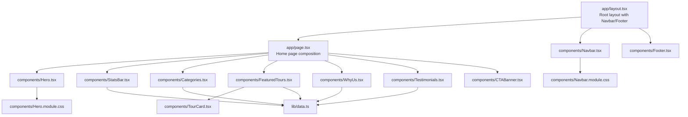
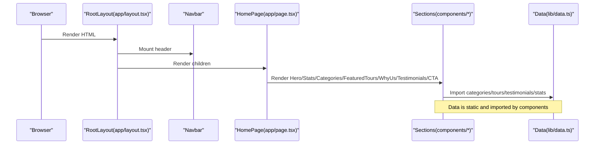
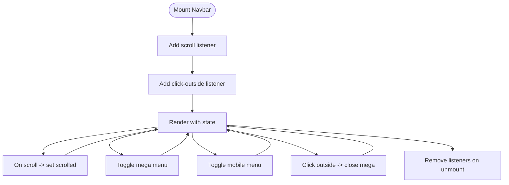
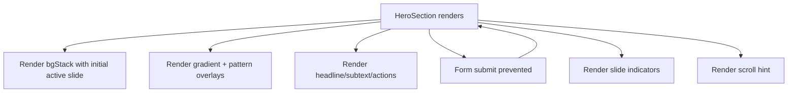
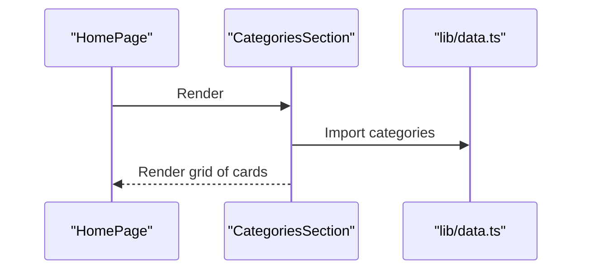
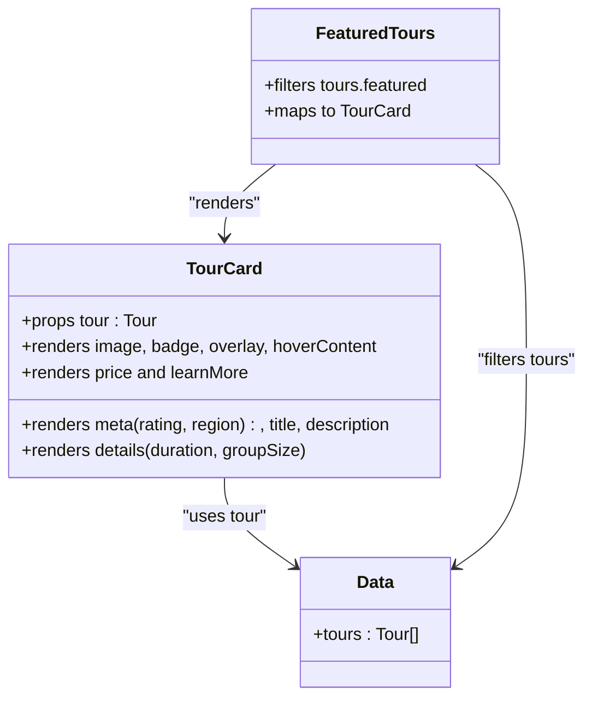
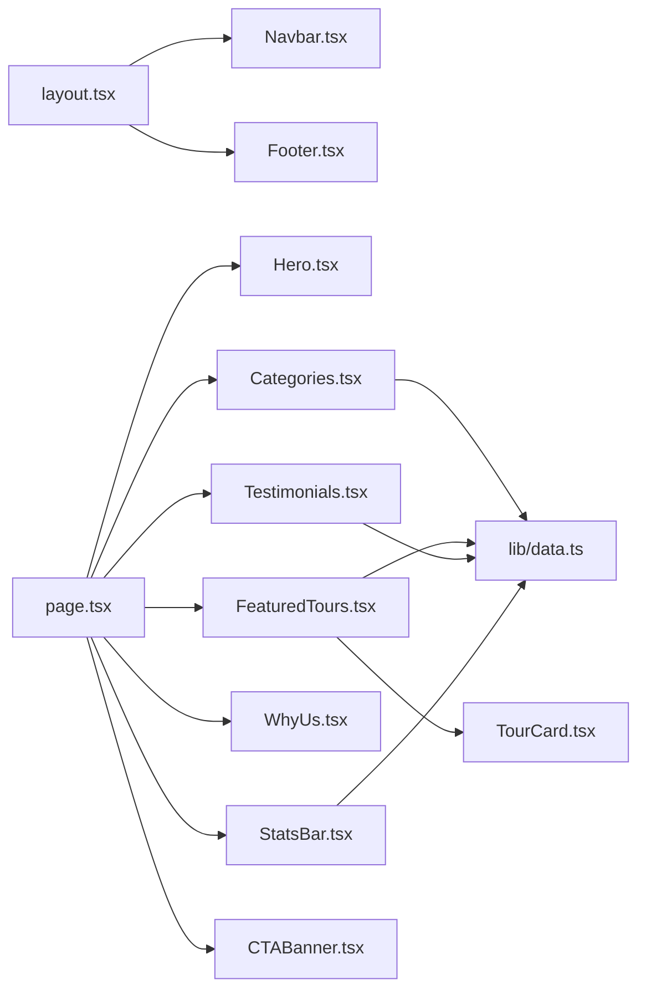

# UI Components

<cite>
**Referenced Files in This Document**
- [app/layout.tsx](file://app/layout.tsx)
- [app/page.tsx](file://app/page.tsx)
- [components/Navbar.tsx](file://components/Navbar.tsx)
- [components/Navbar.module.css](file://components/Navbar.module.css)
- [components/Hero.tsx](file://components/Hero.tsx)
- [components/Hero.module.css](file://components/Hero.module.css)
- [components/Categories.tsx](file://components/Categories.tsx)
- [components/FeaturedTours.tsx](file://components/FeaturedTours.tsx)
- [components/TourCard.tsx](file://components/TourCard.tsx)
- [components/StatsBar.tsx](file://components/StatsBar.tsx)
- [components/Testimonials.tsx](file://components/Testimonials.tsx)
- [components/WhyUs.tsx](file://components/WhyUs.tsx)
- [components/CTABanner.tsx](file://components/CTABanner.tsx)
- [components/Footer.tsx](file://components/Footer.tsx)
- [lib/data.ts](file://lib/data.ts)
</cite>

## Table of Contents
1. [Introduction](#introduction)
2. [Project Structure](#project-structure)
3. [Core Components](#core-components)
4. [Architecture Overview](#architecture-overview)
5. [Detailed Component Analysis](#detailed-component-analysis)
6. [Dependency Analysis](#dependency-analysis)
7. [Performance Considerations](#performance-considerations)
8. [Troubleshooting Guide](#troubleshooting-guide)
9. [Conclusion](#conclusion)
10. [Appendices](#appendices)

## Introduction
This document describes the UI component library for the NatIndia travel website. It covers the navigation system, hero carousel, tour management, content sections, and footer. For each component, we explain composition patterns, props, interactivity (hover effects, state, events), styling via CSS Modules, responsive design, lifecycle and accessibility, usage examples, reusability and customization, performance considerations, and data flow relationships.

## Project Structure
The site is a Next.js application with a global layout and a homepage that composes multiple UI sections. Components are organized by feature and styled with CSS Modules. Shared data is centralized in a single data module.

**Diagram sources**
- [app/layout.tsx:17-27](file://app/layout.tsx#L17-L27)
- [app/page.tsx:9-21](file://app/page.tsx#L9-L21)
- [components/Navbar.tsx:18-112](file://components/Navbar.tsx#L18-L112)
- [components/Hero.tsx:20-99](file://components/Hero.tsx#L20-L99)
- [components/FeaturedTours.tsx:8-33](file://components/FeaturedTours.tsx#L8-L33)
- [components/TourCard.tsx:21-62](file://components/TourCard.tsx#L21-L62)
- [components/Categories.tsx:7-46](file://components/Categories.tsx#L7-L46)
- [components/StatsBar.tsx:5-19](file://components/StatsBar.tsx#L5-L19)
- [components/Testimonials.tsx:6-39](file://components/Testimonials.tsx#L6-L39)
- [components/WhyUs.tsx:44-99](file://components/WhyUs.tsx#L44-L99)
- [components/CTABanner.tsx:6-31](file://components/CTABanner.tsx#L6-L31)
- [components/Footer.tsx:25-103](file://components/Footer.tsx#L25-L103)
- [lib/data.ts:1-252](file://lib/data.ts#L1-L252)

**Section sources**
- [app/layout.tsx:17-27](file://app/layout.tsx#L17-L27)
- [app/page.tsx:9-21](file://app/page.tsx#L9-L21)

## Core Components
- Navigation bar: Fixed header with logo, desktop mega-menu, and mobile menu. Implements scroll-aware appearance and click-outside dismissal.
- Hero carousel: Fullscreen hero with background slide stack, gradient/pattern overlays, headline, quick search, and slide indicators.
- Categories: Destination cards grouped by experience theme.
- Featured tours: Grid of tour cards filtered from shared data.
- Tour card: Individual tour tile with image overlay, hover action, metadata, pricing, and rating.
- Stats bar: Highlighted statistics section.
- Testimonials: Guest stories with star ratings and avatar.
- Why us: Value propositions with icons and color accents.
- Call-to-action banner: Prominent CTA with actions.
- Footer: Multi-column links, newsletter form, contact info, and legal links.

**Section sources**
- [components/Navbar.tsx:18-112](file://components/Navbar.tsx#L18-L112)
- [components/Hero.tsx:20-99](file://components/Hero.tsx#L20-L99)
- [components/Categories.tsx:7-46](file://components/Categories.tsx#L7-L46)
- [components/FeaturedTours.tsx:8-33](file://components/FeaturedTours.tsx#L8-L33)
- [components/TourCard.tsx:21-62](file://components/TourCard.tsx#L21-L62)
- [components/StatsBar.tsx:5-19](file://components/StatsBar.tsx#L5-L19)
- [components/Testimonials.tsx:6-39](file://components/Testimonials.tsx#L6-L39)
- [components/WhyUs.tsx:44-99](file://components/WhyUs.tsx#L44-L99)
- [components/CTABanner.tsx:6-31](file://components/CTABanner.tsx#L6-L31)
- [components/Footer.tsx:25-103](file://components/Footer.tsx#L25-L103)

## Architecture Overview
The layout composes the navigation and footer around page content. The homepage composes multiple content sections. Data is centralized and consumed by sections and cards.

**Diagram sources**
- [app/layout.tsx:17-27](file://app/layout.tsx#L17-L27)
- [app/page.tsx:9-21](file://app/page.tsx#L9-L21)
- [lib/data.ts:1-252](file://lib/data.ts#L1-L252)

## Detailed Component Analysis

### Navigation Bar
- Composition: Logo, desktop navigation with a mega-dropdown, CTA button, and mobile toggle.
- Props: None; internal state for scroll effect, dropdown visibility, and mobile menu.
- Interactivity:
  - Scroll listener toggles a “scrolled” class for styling.
  - Click-outside handler closes the mega menu when clicking outside.
  - Mobile menu opens/closes with a toggle button.
- Accessibility:
  - Button aria-expanded reflects dropdown state.
  - Mobile toggle uses aria-label.
- Styling:
  - CSS Modules define transitions, backdrop blur, and responsive breakpoints.
  - Hover/focus states for links and buttons.
- Lifecycle:
  - Adds/removes scroll listener on mount/unmount.
  - Adds/removes click-outside listener on mount/unmount.
- Reusability:
  - Easy to adapt destination list by editing the internal array.
- Performance:
  - Passive scroll listener minimizes layout thrashing.

**Diagram sources**
- [components/Navbar.tsx:18-38](file://components/Navbar.tsx#L18-L38)
- [components/Navbar.module.css:12-17](file://components/Navbar.module.css#L12-L17)
- [components/Navbar.module.css:195-200](file://components/Navbar.module.css#L195-L200)

**Section sources**
- [components/Navbar.tsx:18-112](file://components/Navbar.tsx#L18-L112)
- [components/Navbar.module.css:1-200](file://components/Navbar.module.css#L1-L200)

### Hero Carousel
- Composition: Background image stack, gradient and pattern overlays, headline, subtext, action buttons, quick search input, slide indicators, and scroll hint.
- Props: None; images and slides are defined locally.
- Interactivity:
  - Slide indicators are presentational; no auto-rotation is implemented in code.
  - Quick search input/form submission is prevented in the demo.
- Styling:
  - CSS Modules manage stacking order, transitions, and responsive adjustments.
  - Animations for pulsing badge and scrolling line.
- Accessibility:
  - No explicit ARIA roles for slides; consider adding landmark regions for screen readers.
- Performance:
  - Background images are preloaded via CSS; consider lazy-loading strategies if extending to many images.

**Diagram sources**
- [components/Hero.tsx:20-99](file://components/Hero.tsx#L20-L99)
- [components/Hero.module.css:1-254](file://components/Hero.module.css#L1-L254)

**Section sources**
- [components/Hero.tsx:20-99](file://components/Hero.tsx#L20-L99)
- [components/Hero.module.css:1-254](file://components/Hero.module.css#L1-L254)

### Categories Section
- Composition: Header + grid of destination cards.
- Props: None; reads categories from shared data.
- Interactivity:
  - Cards are links to destination pages.
  - Hover effects defined in CSS.
- Styling:
  - Uses CSS custom property for accent color per card.
  - Responsive grid layout.
- Data flow:
  - Imports categories from lib/data.ts.

**Diagram sources**
- [components/Categories.tsx:7-46](file://components/Categories.tsx#L7-L46)
- [lib/data.ts:1-74](file://lib/data.ts#L1-L74)

**Section sources**
- [components/Categories.tsx:7-46](file://components/Categories.tsx#L7-L46)
- [lib/data.ts:1-74](file://lib/data.ts#L1-L74)

### Featured Tours and Tour Card
- Composition:
  - FeaturedTours filters tours and renders TourCard instances.
  - TourCard displays image, badge, overlay, hover action, metadata, rating, duration/group size, pricing, and “Details” link.
- Props:
  - TourCard expects a tour object with shape defined in component type.
  - FeaturedTours receives no props; uses shared tours data.
- Interactivity:
  - Hover reveals “Explore Tour” action on the card.
  - Links navigate to tour detail pages.
- Styling:
  - CSS Modules encapsulate card layout, overlay, and hover states.
- Data flow:
  - Both components import tours from lib/data.ts.

**Diagram sources**
- [components/TourCard.tsx:21-62](file://components/TourCard.tsx#L21-L62)
- [components/FeaturedTours.tsx:8-33](file://components/FeaturedTours.tsx#L8-L33)
- [lib/data.ts:76-205](file://lib/data.ts#L76-L205)

**Section sources**
- [components/FeaturedTours.tsx:8-33](file://components/FeaturedTours.tsx#L8-L33)
- [components/TourCard.tsx:21-62](file://components/TourCard.tsx#L21-L62)
- [lib/data.ts:76-205](file://lib/data.ts#L76-L205)

### Stats Bar
- Composition: Container with grid of stat items.
- Props: None; reads stats from shared data.
- Styling: CSS Modules define grid and typography.
- Data flow: Imports stats from lib/data.ts.

**Section sources**
- [components/StatsBar.tsx:5-19](file://components/StatsBar.tsx#L5-L19)
- [lib/data.ts:246-252](file://lib/data.ts#L246-L252)

### Testimonials
- Composition: Header + grid of testimonial cards with quote, stars, guest info, and tour label.
- Props: None; reads testimonials from shared data.
- Styling: CSS Modules define card layout and star rendering.
- Data flow: Imports testimonials from lib/data.ts.

**Section sources**
- [components/Testimonials.tsx:6-39](file://components/Testimonials.tsx#L6-L39)
- [lib/data.ts:207-244](file://lib/data.ts#L207-L244)

### Why Us
- Composition: Split layout with descriptive text and a grid of value cards with colored icons.
- Props: None; reasons are defined locally.
- Styling: CSS Modules define layout, divider, trust badges, and icon color via CSS variable.
- Accessibility: Consider adding ARIA labels for icon containers if icons lack text alternatives.

**Section sources**
- [components/WhyUs.tsx:44-99](file://components/WhyUs.tsx#L44-L99)

### CTA Banner
- Composition: Full-width banner with text and two call-to-action buttons.
- Props: None.
- Styling: CSS Modules define background, layout, and button sizing.

**Section sources**
- [components/CTABanner.tsx:6-31](file://components/CTABanner.tsx#L6-L31)

### Footer
- Composition: Top band, main container with brand/contact/social, links columns, newsletter form, and bottom bar.
- Props: None.
- Interactivity:
  - Newsletter form submission is prevented in the demo.
- Accessibility:
  - Social links include aria-labels.
- Styling: CSS Modules define layout and spacing.

**Section sources**
- [components/Footer.tsx:25-103](file://components/Footer.tsx#L25-L103)

## Dependency Analysis
- Global layout depends on Navbar and Footer.
- Homepage composes Hero, StatsBar, Categories, FeaturedTours, WhyUs, Testimonials, and CTABanner.
- Data-driven components import lib/data.ts for categories, tours, testimonials, and stats.
- TourCard is reused inside FeaturedTours.

**Diagram sources**
- [app/layout.tsx:17-27](file://app/layout.tsx#L17-L27)
- [app/page.tsx:9-21](file://app/page.tsx#L9-L21)
- [components/FeaturedTours.tsx:8-33](file://components/FeaturedTours.tsx#L8-L33)
- [components/TourCard.tsx:21-62](file://components/TourCard.tsx#L21-L62)
- [components/Categories.tsx:7-46](file://components/Categories.tsx#L7-L46)
- [components/StatsBar.tsx:5-19](file://components/StatsBar.tsx#L5-L19)
- [components/Testimonials.tsx:6-39](file://components/Testimonials.tsx#L6-L39)
- [lib/data.ts:1-252](file://lib/data.ts#L1-L252)

**Section sources**
- [app/layout.tsx:17-27](file://app/layout.tsx#L17-L27)
- [app/page.tsx:9-21](file://app/page.tsx#L9-L21)
- [lib/data.ts:1-252](file://lib/data.ts#L1-L252)

## Performance Considerations
- CSS Modules keep styles scoped and avoid global conflicts; ensure unused selectors are removed during build.
- Hero background images are referenced in CSS; consider lazy-loading strategies if the carousel becomes dynamic.
- Navbar uses a passive scroll listener to reduce layout cost.
- TourCard uses native loading="lazy" on images to improve Core Web Vitals.
- FeaturedTours filters tours on render; for large datasets, consider server-side filtering or pagination.
- Newsletter form prevents default submission; integrate with a backend service for production.

[No sources needed since this section provides general guidance]

## Troubleshooting Guide
- Mega menu does not close:
  - Ensure click-outside handler targets the correct element and runs after DOM updates.
- Scroll effect not triggering:
  - Verify scroll listener is attached and the threshold is appropriate.
- Quick search button not styled:
  - Confirm CSS Module class names match the rendered element.
- Tour images not appearing:
  - Check image URLs and network connectivity; confirm lazy loading is supported.
- Newsletter form submits unexpectedly:
  - Ensure preventDefault is applied in the form handler.

**Section sources**
- [components/Navbar.tsx:24-38](file://components/Navbar.tsx#L24-L38)
- [components/Hero.module.css:129-171](file://components/Hero.module.css#L129-L171)
- [components/TourCard.tsx:25](file://components/TourCard.tsx#L25)
- [components/Footer.tsx:81](file://components/Footer.tsx#L81)

## Conclusion
The NatIndia UI library is structured around reusable, data-driven components with strong separation of concerns. CSS Modules provide encapsulated styling and responsive behavior. The layout composes sections that share a central data source, enabling maintainable customization and extension. Interactive elements are accessible and performant, with clear patterns for state and event handling.

[No sources needed since this section summarizes without analyzing specific files]

## Appendices

### Component Prop Interfaces
- Navbar
  - No props; manages internal state for scroll, mega menu, and mobile menu.
- HeroSection
  - No props; defines local arrays for images and slides.
- CategoriesSection
  - No props; consumes categories from lib/data.ts.
- FeaturedTours
  - No props; filters tours from lib/data.ts.
- TourCard
  - tour: Tour object with keys: slug, title, category, region, duration, groupSize, price, rating, reviews, badge?, image, description.
- StatsBar
  - No props; consumes stats from lib/data.ts.
- Testimonials
  - No props; consumes testimonials from lib/data.ts.
- WhyUsSection
  - No props; uses local reasons array.
- CTABanner
  - No props.
- Footer
  - No props.

**Section sources**
- [components/TourCard.tsx:6-19](file://components/TourCard.tsx#L6-L19)
- [lib/data.ts:1-252](file://lib/data.ts#L1-L252)

### Accessibility Checklist
- Navbar: aria-expanded on dropdown trigger; aria-label on mobile toggle.
- Footer: aria-labels on social links.
- Hero: Consider landmarks and headings for screen reader navigation.
- TourCard: Alt text provided for images; ensure focus styles for keyboard navigation.
- Form elements: Proper labels and input types; preventDefault in demo forms.

**Section sources**
- [components/Navbar.tsx:58](file://components/Navbar.tsx#L58)
- [components/Navbar.tsx:89](file://components/Navbar.tsx#L89)
- [components/Footer.tsx:51-56](file://components/Footer.tsx#L51-L56)
- [components/TourCard.tsx:25](file://components/TourCard.tsx#L25)